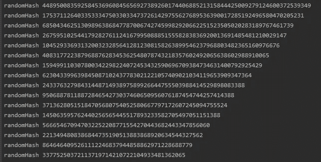
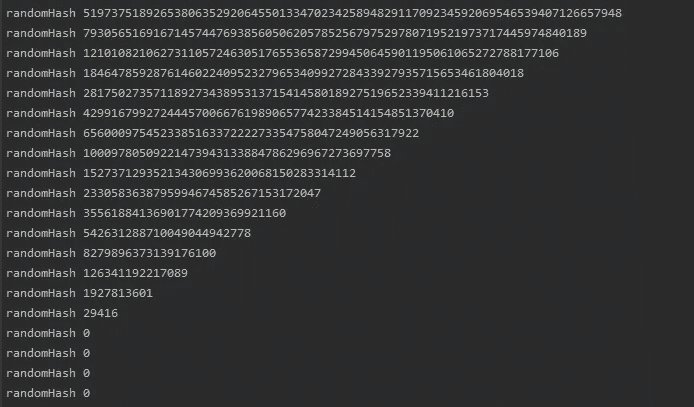

# 坚固性——随机数

> 原文：<https://medium.com/coinmonks/solidity-random-numbers-f54e1272c7dd?source=collection_archive---------1----------------------->


希望您知道，纯粹在链上生成随机数是不可能的。你需要使用像 chainlink 这样的服务，但是说实话，伪随机对于大多数需求来说已经足够了。

然而，有时你需要多个随机数，事情就开始变得昂贵了。

# 比特移位

位操作真的很有趣，或者说我已经深入研究了一些非常晦涩的文章。无论哪种方式，它都非常有用，可以用来节省你的汽油。

## 什么是移位？

比我更聪明、更有经验的人已经讨论过这个主题和其他字节操作技术:

[](/@imolfar/bitwise-operations-and-bit-manipulation-in-solidity-ethereum-1751f3d2e216) [## 以太坊中的位运算和位操作

### 是的，以太坊是世界上的计算机，虽然可能是最贵的一台。因为存储是最大的…

medium.com](/@imolfar/bitwise-operations-and-bit-manipulation-in-solidity-ethereum-1751f3d2e216) 

## 我们如何在 RNG 中使用移位？

好的，想象你需要为你的 RPG NFT 产生 10 个随机数。您可以创建这样的东西:

问题是你必须打十次电话。

有一个很好的解决方案:

就像这样，我们只需要创建一个 randomHash，然后使用位操作来创建 10 个所需的随机数。

值得注意的是，移位并不意味着你可以永远移位，你会用完所有的位。如果你有一个 uint256 变量，并且你正在移位> > 16，你只能移位 16 次，cos 16 x 16 = 256。

我个人认为如果有一些概念的视觉解释会更容易，并且认为其他人可能会发现位移动的视觉是有帮助的。



uint256 >> 8, notice the angle versus >> 16 below

这就是如果你超越了现有的数据会发生什么。uint256 >> 16，20 次:



# 带跟踪的随机数

有时你需要从现有列表中选择一个随机数，同时跟踪你已经选择的数字。

在 javascript 中，这种任务是微不足道的，但是在 solidity 中，您真的需要在方法上花些心思来节省汽油。

## 来自固定总体的随机令牌 Id

假设你有一个 NFT 项目，有 10k 个代币，你想随机地把它们铸造出来。大多数方法需要大量的循环和数据存储，这可能会变得昂贵，并有耗尽的风险。

## 神奇的阵列

我不知道这个方法的正确名称是什么，所以我就称它为神奇数组:)

**MAX_POPULATION:** 是我们正在创建的 NFT 的人口数。

**ids:** 是一个长度等于 MAX_POPULATION 的空数组。如果 MAX_POPULATION 为 5，那么我们的数组将如下所示:

```
[0,0,0,0,0]
```

当 pickId()被调用时，在 0 和数组长度之间生成一个**随机数索引**。这很重要，因为我们将减少数组的长度，从而减少可能的随机数索引的范围。

接下来的几行代码是神奇的事情开始发生的地方。我会尽我所能解释它。

## 一传

想象一下我们的数组[0，0，0，0，0]，它有 5 个元素，但是每个元素都是 0。感觉有点没用吧？酷的是，这非常有帮助。

想象我们的 **randomIndex** 值为 2。我们检查数组中的索引 2，我们可以看到值为 0，因此我们将返回的值 **id** 设置为我们刚刚检查的索引 **2。**

```
[0, 0, 0, 0, 0]
[2] = 0
id = 2
```

现在我们有了一个 id 值，我们需要编辑我们的数组来反映刚刚发生的事情，并确保我们不会丢失任何 id。听起来对数组有很多期望。

如果我们不编辑数组，值为 2 的 randomIndex 会产生完全相同的返回值，我们不希望两个 NFT 的 tokenId 都为 2。为了解决这个问题，我们检查数组中的最后一个元素是否等于 0

```
if(ids[ids.length-1] == 0)
```

如果是，我们用最后一个数组元素的索引值替换 ids[randomIndex]处的值。看起来像这样

```
randomIndex = 2
[0, 0, 4, 0, 0]
```

最后，我们需要通过弹出最后一个元素来缩小数组。这导致我们的数组看起来像这样。

```
[0, 0, 4, 0]
```

## 第二遍

当我们选择下一个 **id** 时， **randomIndex** 值再次显示为 2。感觉这可能是个问题，对吧——不，我们已经解决了。

首先，我们检查数组中索引 2 处的值是否等于 0。我们可以看到它等于 4

```
[0, 0, 4, 0]
```

在第一遍中，我们的索引值等于 0，因此我们返回了值为 2 的 **randomIndex** 。这次我们有一个值 4，所以我们返回 4。

就像第一遍一样，我们需要编辑数组来反映刚刚发生的事情。导致我们的阵列现在看起来像这样:

```
[0, 0, 3]
```

## 第三遍

难道你不知道， **randomIndex** 又掷出了 2。

这一次，索引 2 处的值是 3，因此我们将返回 3 并编辑数组以反映该事件。

这一次情况有所不同，数组中的最后一个值不等于 0，所以我们必须做一些不同的事情，最终得到的数组是

```
[0, 0]
```

## 魔法阵列

我知道这可能有点棘手，我第一次玩它的时候，我只是在纸上绘制数组，以确保我完全理解这个概念。

## 圣诞玩笑

上面的魔术数组代码示例可以优化，你能看到如何优化吗？

# 去哪里找我

我通常可以在酷猫不和谐频道
[找到 https://discord.gg/WhBAAHnSz4](https://t.co/PjlbnmaW3a?amp=1)

或者在推特上
[https://twitter.com/xtremetom](https://twitter.com/xtremetom)

[https://twitter.com/coolcatsnft](https://twitter.com/coolcatsnft)

# 最后一句话

我觉得这么说很傻，但我收到了太多的信息，我觉得这可能会为你我节省一些时间。

我在酷猫上全职工作，工作忙得不可开交，所以很遗憾我不得不拒绝每一份工作邀请。

但是我总是愿意尽我所能分享资源和建议。

> 交易新手？试试[加密交易机器人](/coinmonks/crypto-trading-bot-c2ffce8acb2a)或者[复制交易](/coinmonks/top-10-crypto-copy-trading-platforms-for-beginners-d0c37c7d698c)