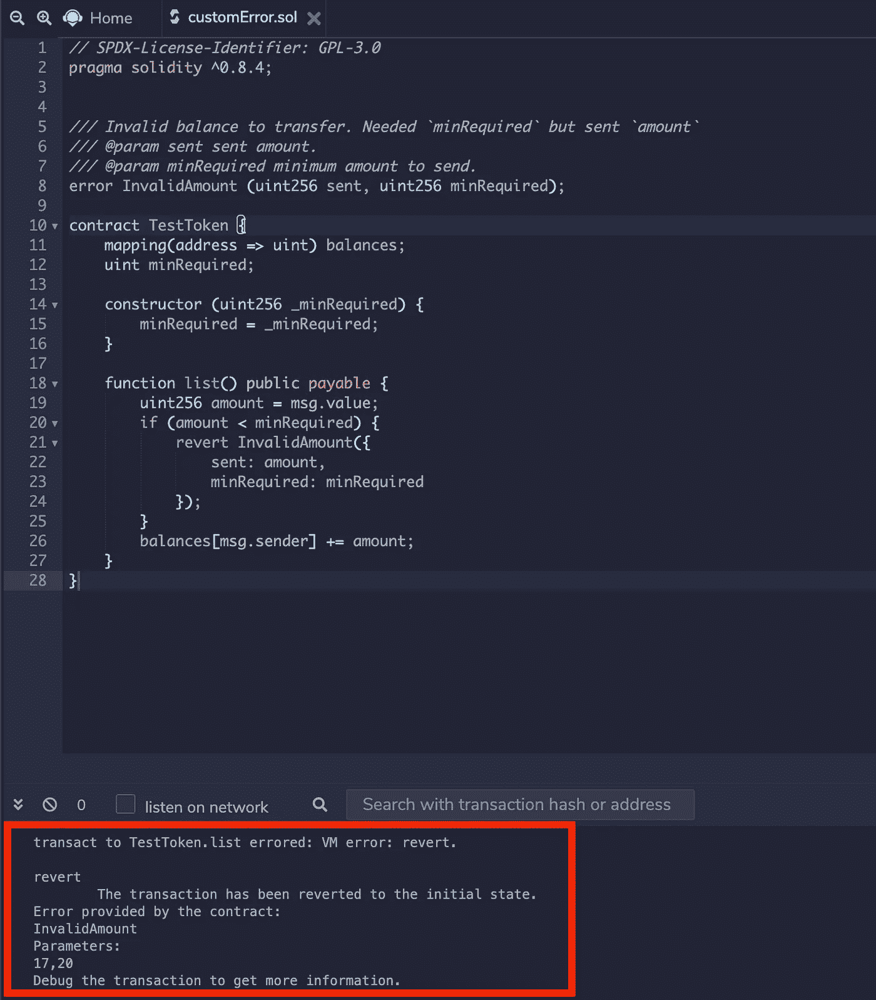

# 用实例解释自定义错误的可靠性恢复！！

> 原文：<https://medium.com/coinmonks/solidity-revert-with-custom-error-explained-with-example-d9dff8937ef4?source=collection_archive---------1----------------------->

从 v0.8.4 开始，Solidity 引入了一种额外的方式来恢复事务。新方法允许用户定义自定义错误，并在恢复事务时传递该错误。

## 自定义错误

自定义错误是使用类似于事件的语法中的`error`语句定义的。

```
error CustomErrorName(**arg1**, **arg2**);
```

可以在合同级别或文件级别定义自定义错误。还可以在方法中使用它来恢复事务，如下所示:

```
revert CustomError(**arg1, arg2**);
```

使用`revert`的旧方法，如 **revert()** 和 **revert("description")** 仍然有效，但带有自定义错误的 revert 有助于传递带有错误的动态数据，并且对于契约部署来说成本更低。

还可以添加 Natspec 文档来解释合同中的自定义错误。

**示例**

我们用一个简单的例子来理解一下。如果交易中发送的值小于预设的金额，此合同将回复自定义错误。

```
// SPDX-License-Identifier: GPL-3.0
pragma solidity ^0.8.4;/// Invalid balance to transfer. Needed `minRequired` but sent `amount`
/// [@param](http://twitter.com/param) sent sent amount.
/// [@param](http://twitter.com/param) minRequired minimum amount to send.
error InvalidAmount (uint256 sent, uint256 minRequired);contract TestToken {
    mapping(address => uint) balances;
    uint minRequired;

    constructor (uint256 _minRequired) {
        minRequired = _minRequired;
    }

    function list() public payable {
        uint256 amount = msg.value;
        if (amount < minRequired) {
            revert InvalidAmount({
                sent: amount,
                minRequired: minRequired
            });
        }
        balances[msg.sender] += amount;
    }
}
```

## 使用混音进行演示

[**点击此处**](https://remix.ethereum.org/#code=Ly8gU1BEWC1MaWNlbnNlLUlkZW50aWZpZXI6IEdQTC0zLjAKcHJhZ21hIHNvbGlkaXR5IF4wLjguNDsKLy8vIEludmFsaWQgYmFsYW5jZSB0byB0cmFuc2Zlci4gTmVlZGVkIGBtaW5SZXF1aXJlZGAgYnV0IHNlbnQgYGFtb3VudGAKLy8vIEBwYXJhbSBzZW50IHNlbnQgYW1vdW50LgovLy8gQHBhcmFtIG1pblJlcXVpcmVkIG1pbmltdW0gYW1vdW50IHRvIHNlbmQuCmVycm9yIEludmFsaWRBbW91bnQgKHVpbnQyNTYgc2VudCwgdWludDI1NiBtaW5SZXF1aXJlZCk7CmNvbnRyYWN0IFRlc3RUb2tlbiB7CiAgICBtYXBwaW5nKGFkZHJlc3MgPT4gdWludCkgYmFsYW5jZXM7CiAgICB1aW50IG1pblJlcXVpcmVkOwogICAgCiAgICBjb25zdHJ1Y3RvciAodWludDI1NiBfbWluUmVxdWlyZWQpIHsKICAgICAgICBtaW5SZXF1aXJlZCA9IF9taW5SZXF1aXJlZDsKICAgIH0KICAgIAogICAgZnVuY3Rpb24gbGlzdCgpIHB1YmxpYyBwYXlhYmxlIHsKICAgICAgICB1aW50MjU2IGFtb3VudCA9IG1zZy52YWx1ZTsKICAgICAgICBpZiAoYW1vdW50IDwgbWluUmVxdWlyZWQpIHsKICAgICAgICAgICAgcmV2ZXJ0IEludmFsaWRBbW91bnQoewogICAgICAgICAgICAgICAgc2VudDogYW1vdW50LAogICAgICAgICAgICAgICAgbWluUmVxdWlyZWQ6IG1pblJlcXVpcmVkCiAgICAgICAgICAgIH0pOwogICAgICAgIH0KICAgICAgICBiYWxhbmNlc1ttc2cuc2VuZGVyXSArPSBhbW91bnQ7CiAgICB9Cn0=) 将上述契约加载到 Remix IDE 中，以获得自定义错误的演示。

部署合同，运行值小于`minRequired`的`test`，Remix 终端会出现自定义错误信息。



## **使用安全帽进行演示**

将以上代码放在 hardhat 项目的`contracts`目录下，编译。在`scripts`目录中编写一个脚本，如下所示:

**deployAndRun.js**

```
const hre = require("hardhat");async function main() { // We get the contract to deploy const CError = await hre.ethers.getContractFactory("CustomError"); const cerr = await CError.deploy(20); await cerr.deployed(); console.log("CustomError deployed to:", cerr.address); await cerr.list({value: 16});}main().then(() => process.exit(0)).catch(error => {console.error(error);process.exit(1);});
```

运行 hardhat 节点并执行脚本，它显示自定义错误详细信息如下:

```
% npx hardhat run --network localhost scripts/deployAndRun.jsCustomError deployed to: 0x5FbDB2315678afecb367f032d93F642f64180aa3ProviderError: Error: VM Exception while processing transaction: reverted with custom error 'InvalidAmount(16, 20)'
```

**你知道:**你还可以使用 Remix IDE 编译和部署合同到 hardhat。阅读关于[**Remix IDE 安全帽集成**](/remix-ide/hardhat-integration-with-remix-eb8c30196ab1) 。

感谢阅读！！！

**参考文献:**

*   [https://docs.soliditylang.org/en/v0.8.5/](https://docs.soliditylang.org/en/v0.8.5/)
*   [https://blog.soliditylang.org/2021/04/21/custom-errors/](https://blog.soliditylang.org/2021/04/21/custom-errors/)