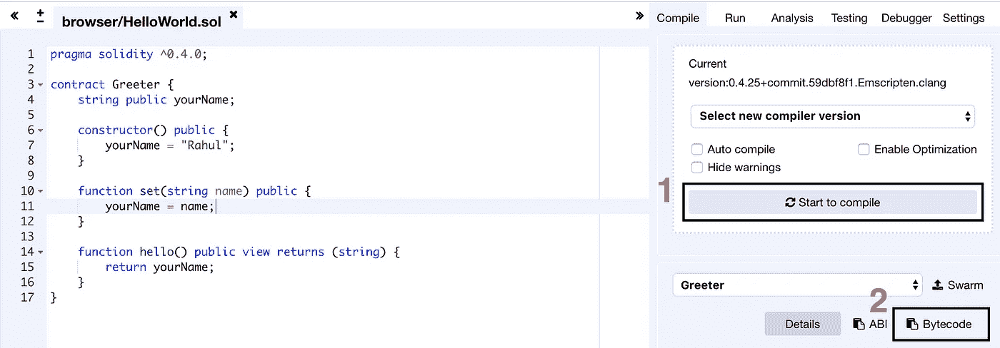
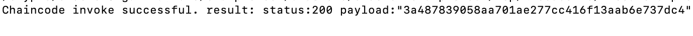
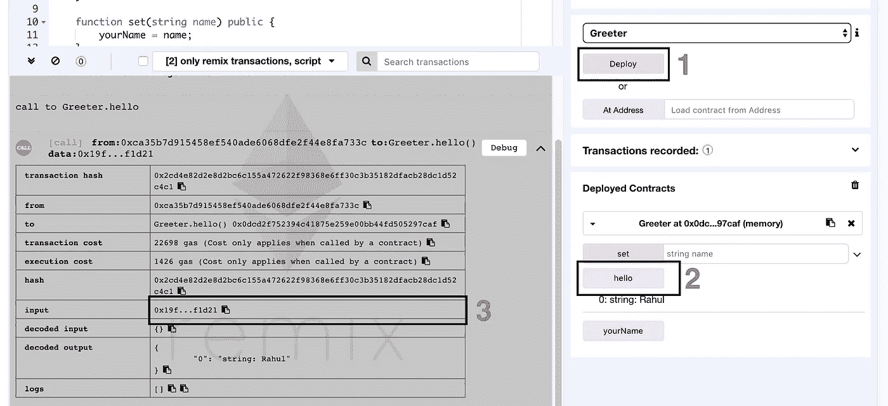
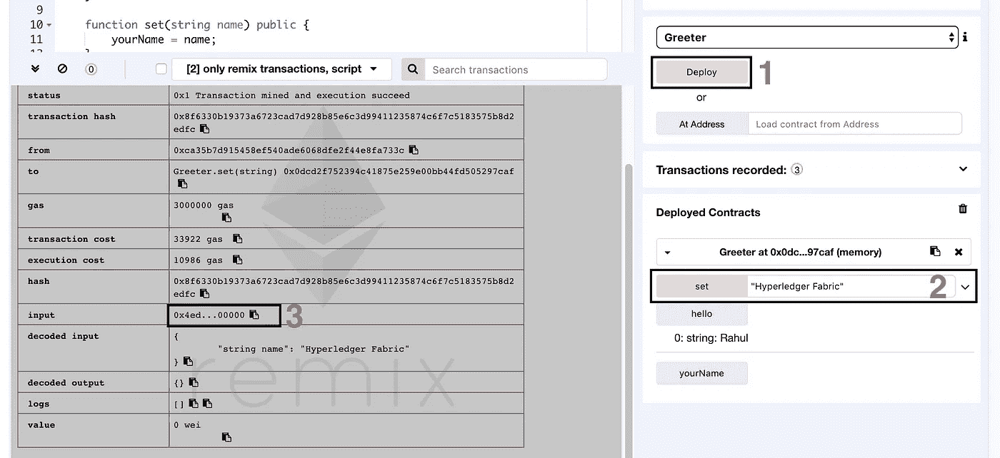

# Hyperledger 结构上的可靠性智能合同

> 原文：<https://medium.com/coinmonks/solidity-smart-contract-on-hyperledger-fabric-3d50f25e577b?source=collection_archive---------1----------------------->


对我来说，区块链技术蓬勃发展的速度真的令人印象深刻。在短短几年内，我们已经从比特币成为第一个也是唯一一个基于区块链的框架过渡到 1600 多种加密货币和近 100 个框架。其中，Hyperledger Fabric 和 Ethereum 是两个最流行的框架，我相信它们的结合是这项技术的意外收获。

我是一个技术人员，我这篇文章的目的是展示与 Hyperledger 结构相关的另一个技术方面。所以事不宜迟，我们开门见山吧。

如果我告诉你，你现在可以在 Hyperledger 结构上运行你的以太坊智能合约，会怎么样？是的，你没听错。Hyperledger 基金会最近推出了一个项目，可以让你做到这一点。它以 Hyperledger Fabric chaincode 的形式提供，因此您可以像与任何其他 chaincode 一样进行交互，但稍有变化。你很快就会看到。

那么，我们开始吧。我们将使用我们古老的“第一网络”。如果您的系统中没有准备好先决条件，您可以浏览入门指南([链接 1](https://hyperledger-fabric.readthedocs.io/en/release-1.3/prereqs.html) 和[链接 2](https://hyperledger-fabric.readthedocs.io/en/release-1.3/install.html) )来设置自己。此外，克隆这个 [git 仓库](https://github.com/hyperledger/fabric-chaincode-evm)，它只不过是一个基于 Hyperledger Burrow 的链码 EVM(以太坊虚拟机)。我们还需要 [Remix](https://remix.ethereum.org/#optimize=false&version=soljson-v0.4.25+commit.59dbf8f1.js) ，我们的可靠性测试环境；所以一定要在旁边打开。

首先，导航到“fabric-samples”里面的“first-network”文件夹，在“docker-compose-cli.yaml”里面稍微修改一下。我们将把从 git 存储库中克隆的" [fabric-chaincode-evm](https://github.com/hyperledger/fabric-chaincode-evm) "文件夹的位置映射到我们的" cli "容器中。因此，将下面一行添加到服务—CLI—volumes 中

```
services:
    ...
    cli:
        ....
        volumes:
            - ....
            - **<location fabric-chaincode-evm>**:/opt/gopath/src/github.com/hyperledger/fabric-chaincode-evm
```

现在用以下方式启动网络:

```
./byfn.sh up
```

一切准备就绪后，进入“cli”容器，输入:

```
docker exec -it cli bash
```

安装我们的 EVM 链码

```
peer chaincode install -n evmcc -l golang -v 0 -p github.com/hyperledger/fabric-chaincode-evm/evmcc
```

因为您重新登录了 cli 容器，所以环境变量被设置为指示 Peer 0 或 Org1。否则，您可以始终按如下方式设置它们:

```
export CORE_PEER_MSPCONFIGPATH=/opt/gopath/src/github.com/hyperledger/fabric/peer/crypto/peerOrganizations/org1.example.com/users/Admin@org1.example.com/msp
export CORE_PEER_ADDRESS=peer0.org1.example.com:7051
export CORE_PEER_LOCALMSPID="Org1MSP"
export CORE_PEER_TLS_ROOTCERT_FILE=/opt/gopath/src/github.com/hyperledger/fabric/peer/crypto/peerOrganizations/org1.example.com/peers/peer0.org1.example.com/tls/ca.crt
```

是时候实例化我们的 EVM 链代码了。我将只为一个同行做这件事，因为我在这里的主要目的是告诉你如何执行一个聪明的合同。可以使用以下命令完成实例化:

```
peer chaincode instantiate -n evmcc -v 0 -C mychannel -c '{"Args":[]}' -o orderer.example.com:7050 --tls --cafile /opt/gopath/src/github.com/hyperledger/fabric/peer/crypto/ordererOrganizations/example.com/orderers/orderer.example.com/msp/tlscacerts/tlsca.example.com-cert.pem
```

万岁！我们让我们的 EVM 运行在 Hyperledger 架构上。让我们先做一会儿扎实的工作。进入 Remix，写一份你选择的智能合同。本页上的[示例显示了](https://github.com/hyperledger/fabric-chaincode-evm/blob/master/examples/EVM_Smart_Contracts.md)[简单的存储](https://solidity.readthedocs.io/en/v0.4.24/introduction-to-smart-contracts.html)合同，但我将使用一个简单的“欢迎者”智能合同。代码如下:

```
pragma solidity ^0.4.0;contract Greeter {
    string public yourName;

    constructor() public {
        yourName = "Rahul";
    }

    function set(string name) public {
        yourName = name;
    }

    function hello() public view returns (string) {
        return yourName;
    }
}
```

编译 SmartContract (1)，并单击 Bytecode (2)复制字节码并将其粘贴到文本编辑器中。



1\. Compile Smart Contract; 2\. Copy Bytecode

复制的文本将是一个 JSON 文档。我们只对该文档的“对象”字段的值感兴趣，它看起来像这样:

```
608060405234801561001057600080fd5b506040805190810160405280600581526020017f526168756c0000000000000000000000000000000000000000000000000000008152506000908051906020019061005c929190610062565b50610107565b828054600181600116156101000203166002900490600052602060002090601f016020900481019282601f106100a357805160ff19168380011785556100d1565b828001600101855582156100d1579182015b828111156100d05782518255916020019190600101906100b5565b5b5090506100de91906100e2565b5090565b61010491905b808211156101005760008160009055506001016100e8565b5090565b90565b610410806101166000396000f300608060405260043610610057576000357c0100000000000000000000000000000000000000000000000000000000900463ffffffff16806319ff1d211461005c5780634ed3885e146100ec578063d97d663014610155575b600080fd5b34801561006857600080fd5b506100716101e5565b6040518080602001828103825283818151815260200191508051906020019080838360005b838110156100b1578082015181840152602081019050610096565b50505050905090810190601f1680156100de5780820380516001836020036101000a031916815260200191505b509250505060405180910390f35b3480156100f857600080fd5b50610153600480360381019080803590602001908201803590602001908080601f0160208091040260200160405190810160405280939291908181526020018383808284378201915050505050509192919290505050610287565b005b34801561016157600080fd5b5061016a6102a1565b6040518080602001828103825283818151815260200191508051906020019080838360005b838110156101aa57808201518184015260208101905061018f565b50505050905090810190601f1680156101d75780820380516001836020036101000a031916815260200191505b509250505060405180910390f35b606060008054600181600116156101000203166002900480601f01602080910402602001604051908101604052809291908181526020018280546001816001161561010002031660029004801561027d5780601f106102525761010080835404028352916020019161027d565b820191906000526020600020905b81548152906001019060200180831161026057829003601f168201915b5050505050905090565b806000908051906020019061029d92919061033f565b5050565b60008054600181600116156101000203166002900480601f0160208091040260200160405190810160405280929190818152602001828054600181600116156101000203166002900480156103375780601f1061030c57610100808354040283529160200191610337565b820191906000526020600020905b81548152906001019060200180831161031a57829003601f168201915b505050505081565b828054600181600116156101000203166002900490600052602060002090601f016020900481019282601f1061038057805160ff19168380011785556103ae565b828001600101855582156103ae579182015b828111156103ad578251825591602001919060010190610392565b5b5090506103bb91906103bf565b5090565b6103e191905b808211156103dd5760008160009055506001016103c5565b5090565b905600a165627a7a72305820e314ebe909c2bd2fced644d826eae78e2e999fe68e36a9c32ed18bdd40e019960029
```

这是我们的字节码，为了将它安装在我们的 Hyperledger Fabric EVM 中，我们将执行“对等链代码调用”

```
peer chaincode invoke -n evmcc -C mychannel  -c '{"Args":["**0000000000000000000000000000000000000000**","608060405234801561001057600080fd5b506040805190810160405280600581526020017f526168756c0000000000000000000000000000000000000000000000000000008152506000908051906020019061005c929190610062565b50610107565b828054600181600116156101000203166002900490600052602060002090601f016020900481019282601f106100a357805160ff19168380011785556100d1565b828001600101855582156100d1579182015b828111156100d05782518255916020019190600101906100b5565b5b5090506100de91906100e2565b5090565b61010491905b808211156101005760008160009055506001016100e8565b5090565b90565b610410806101166000396000f300608060405260043610610057576000357c0100000000000000000000000000000000000000000000000000000000900463ffffffff16806319ff1d211461005c5780634ed3885e146100ec578063d97d663014610155575b600080fd5b34801561006857600080fd5b506100716101e5565b6040518080602001828103825283818151815260200191508051906020019080838360005b838110156100b1578082015181840152602081019050610096565b50505050905090810190601f1680156100de5780820380516001836020036101000a031916815260200191505b509250505060405180910390f35b3480156100f857600080fd5b50610153600480360381019080803590602001908201803590602001908080601f0160208091040260200160405190810160405280939291908181526020018383808284378201915050505050509192919290505050610287565b005b34801561016157600080fd5b5061016a6102a1565b6040518080602001828103825283818151815260200191508051906020019080838360005b838110156101aa57808201518184015260208101905061018f565b50505050905090810190601f1680156101d75780820380516001836020036101000a031916815260200191505b509250505060405180910390f35b606060008054600181600116156101000203166002900480601f01602080910402602001604051908101604052809291908181526020018280546001816001161561010002031660029004801561027d5780601f106102525761010080835404028352916020019161027d565b820191906000526020600020905b81548152906001019060200180831161026057829003601f168201915b5050505050905090565b806000908051906020019061029d92919061033f565b5050565b60008054600181600116156101000203166002900480601f0160208091040260200160405190810160405280929190818152602001828054600181600116156101000203166002900480156103375780601f1061030c57610100808354040283529160200191610337565b820191906000526020600020905b81548152906001019060200180831161031a57829003601f168201915b505050505081565b828054600181600116156101000203166002900490600052602060002090601f016020900481019282601f1061038057805160ff19168380011785556103ae565b828001600101855582156103ae579182015b828111156103ad578251825591602001919060010190610392565b5b5090506103bb91906103bf565b5090565b6103e191905b808211156103dd5760008160009055506001016103c5565b5090565b905600a165627a7a72305820e314ebe909c2bd2fced644d826eae78e2e999fe68e36a9c32ed18bdd40e019960029"]}' -o orderer.example.com:7050 --tls --cafile /opt/gopath/src/github.com/hyperledger/fabric/peer/crypto/ordererOrganizations/example.com/orderers/orderer.example.com/msp/tlscacerts/tlsca.example.com-cert.pem
```

这次为调用提供了两个参数。第一个，传统上应该是链代码中的函数名，现在是“**000000000000000000000000000000000**”；第二个参数是我们的 Solidity 智能合约字节码。该执行的响应将生成一个有效负载，即智能合约地址。复制地址，因为我们需要它来执行我们的智能合约功能。



Copy the payload generated above

现在，为了执行函数，我们也将使用 invoke 和 query，但是使用不同的参数。我的契约包含“hello”和“set”两个函数。我们需要做的第一件事是获取函数执行的**散列。最简单的方法是在 Remix 中执行这些函数，然后从事务块中复制散列。**

因此，首先(1)部署契约，(2)单击“hello”按钮执行我们的函数，(3)从事务块中复制“input”字段的值，并从值中删除 0x 。



1\. Deploy; 2\. Click Hello; 3\. Copy the value of input field

要在 Hyperledger 结构 EVM 上执行相同的功能，我们将执行一个查询。这次，第一个参数是我们的智能合约地址(来自上面的有效载荷)，第二个是函数的 hash(从 Remix 的事务日志中复制)。

```
peer chaincode query -n evmcc -C mychannel -c '{"Args":["**3a487839058aa701ae277cc416f13aab6e737dc4**","**19ff1d21**"]}'
```

是时候使用“设置”功能更新我们的欢迎智能合同中的名称了。因此，再次在 Remix 中，在“set”按钮旁边的文本字段中输入一个名称，单击 set (2)，并从输入字段中复制函数 hash，同样没有 0x (3)。这一次，哈希值将对应于函数名及其参数。因此，如果您更改函数参数，部分散列将会改变。



1\. Deploy Smart Contract; 2\. Set value for yourName field; 3\. Copy Hash

哈希如下所示:

```
4ed3885e0000000000000000000000000000000000000000000000000000000000000020000000000000000000000000000000000000000000000000000000000000001248797065726c6564676572204661627269630000000000000000000000000000
```

将 set 的参数值更改为“以太坊”将给出:

```
4ed3885e0000000000000000000000000000000000000000000000000000000000000020000000000000000000000000000000000000000000000000000000000000001248797065726c6564676572204661627269630000000000000000000000000000
```

由于这是一个更新事务，我们这次将执行一个**调用**。该命令将是

```
peer chaincode invoke -n evmcc -C mychannel -c '{"Args":["**3a487839058aa701ae277cc416f13aab6e737dc4**","**4ed3885e0000000000000000000000000000000000000000000000000000000000000020000000000000000000000000000000000000000000000000000000000000001248797065726c6564676572204661627269630000000000000000000000000000**"]}' -o orderer.example.com:7050 --tls --cafile /opt/gopath/src/github.com/hyperledger/fabric/peer/crypto/ordererOrganizations/example.com/orderers/orderer.example.com/msp/tlscacerts/tlsca.example.com-cert.pem
```

您可以通过再次运行前面的命令来验证更新:

```
peer chaincode query -n evmcc -C mychannel -c '{"Args":["**3a487839058aa701ae277cc416f13aab6e737dc4**","**19ff1d21**"]}'
```

是的，我知道这不是用户友好的，但它超级酷。另一个有趣的方面是 Web3.js 也支持客户端应用程序。然而，该特征不涉及任何种类的挖掘。交易处理以 Hyperledger 结构的方式进行。

这是一项正在进行的工作，我真的很高兴看到 Hyperledger Fabric 带来的有趣功能。请分享您对这一新实现的看法，以及您计划用它做的很酷的事情。

> [在您的收件箱中直接获得最佳软件交易](https://coincodecap.com/?utm_source=coinmonks)

[](https://coincodecap.com/?utm_source=coinmonks)