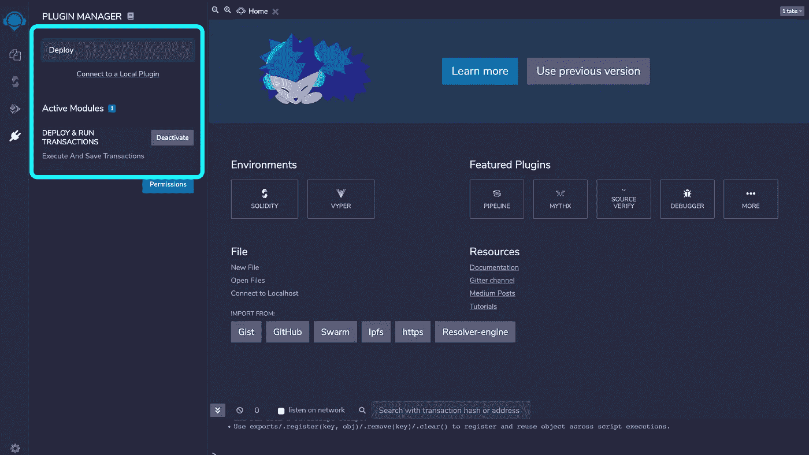
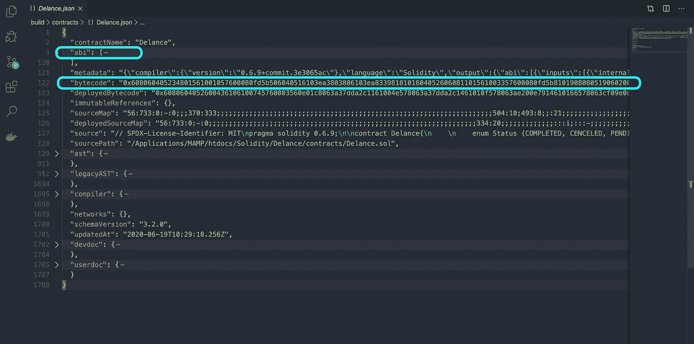
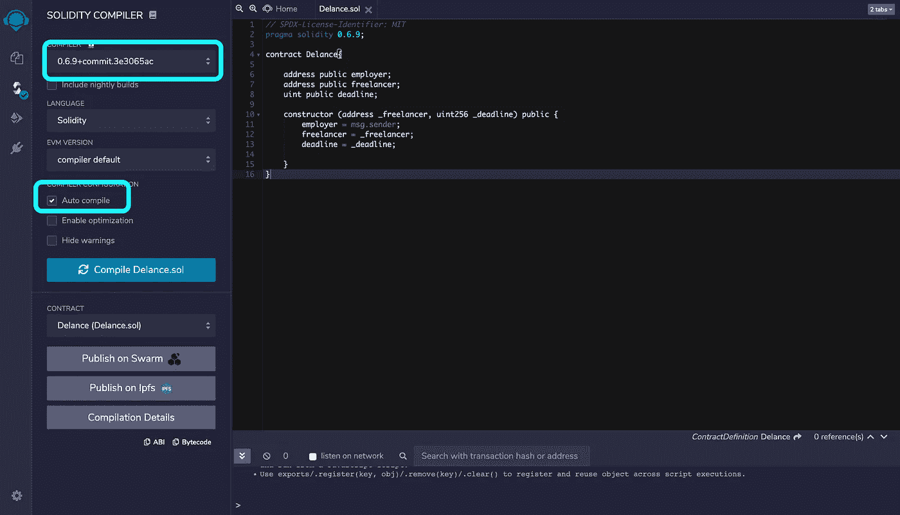
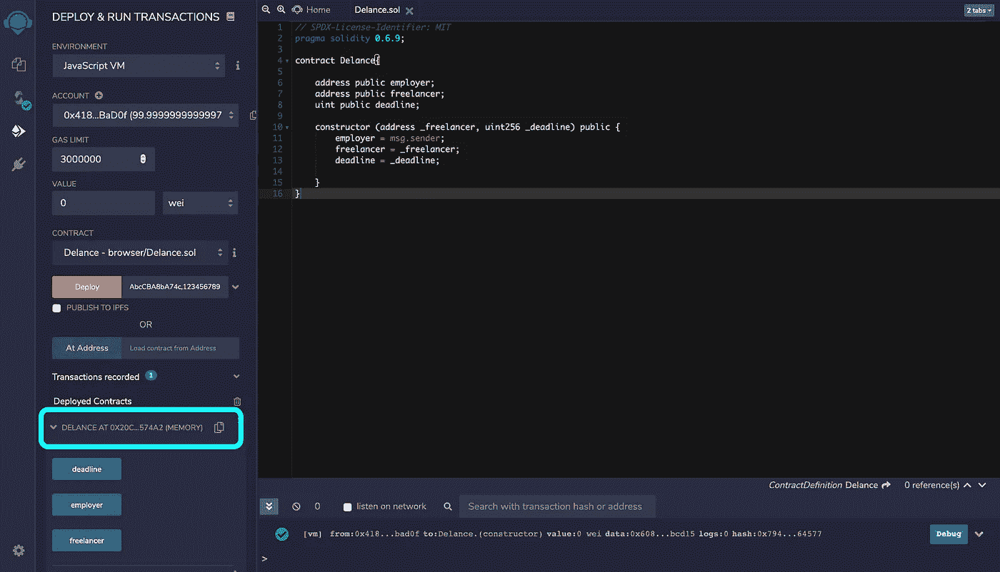
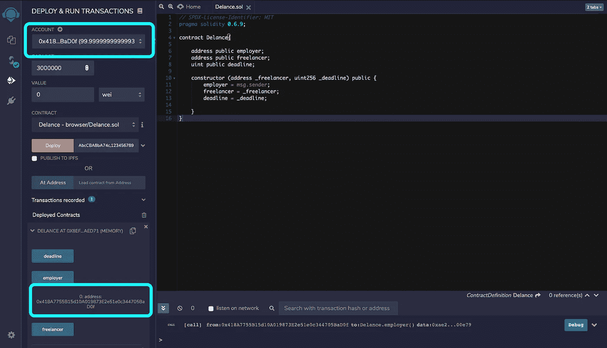

# 构建真实世界 DAPP 的 Solidity 智能合同教程—第 2 部分:创建您的第一个合同

> 原文：<https://medium.com/coinmonks/solidity-smart-contract-tutorial-with-building-real-world-dapp-part-2-create-your-first-contract-e7cd4fdf4e98?source=collection_archive---------0----------------------->


在我们系列的第一部分中，我们熟悉了我们将要构建的项目的结构。现在是时候用代码弄脏你的手，创建你的第一个契约了。

# 设置您的开发环境

如你所知，在开始一个项目之前，我们需要建立我们的开发环境。对吗？
我们将使用我们最喜欢的编辑器进行编码，在我们的系统中运行本地区块链来部署和测试合同，最后，将我们的前端连接到部署的合同。但是，现在，让我们从一个名为 Remix IDE 的在线 IDE 开始。
Remix IDE 是面向 Solidity DAPP 开发者的开源 IDE。你不需要在你的系统上安装任何东西。只需点击下面的链接，您将获得一个 IDE，其中包含一些以太坊帐户和一个内置的区块链，以便与您的合同一起部署。【https://remix.ethereum.org】T5


我自己通常在我的项目中使用这个在线 IDE。不只是为了教育目的，而是为了我所有的项目！因为它提高了您的开发速度，并帮助您轻松调试代码。大多数 Ethereum DAPP 开发人员开始在这个 IDE 中编写他们的契约，并手动测试代码。之后，将代码移动到 [VS Code](https://code.visualstudio.com) 或 [Atom](https://atom.io) 中编写测试，并在以太坊主网中部署契约。我们将在本教程中使用相同的方法。

## 混合 IDE

在新标签页中打开[IDE](https://remix.ethereum.org)。在左侧垂直菜单中，混音图标下方，您可以看到两个图标。其中一个是文件浏览器，显示项目的所有文件，另一个显示插件。我们将为我们的项目启用两个插件: **Solidity 编译器**和**部署&运行事务**插件。实际上在 Remix IDE 上加速开发的唯一原因就是这两个插件。
在插件管理器搜索框中搜索这两个名字并激活它们。



在开始编码之前，我想先谈谈**部署**和**编译**的过程。
嗯，solidity 本身是一种人类可读的语言，我们很容易看到代码，并找出代码逻辑。但是，这与以太坊网络将要使用的代码版本不同。我们需要编译我们的代码。编译后有一些输出，其中两个对我们非常重要。字节码**和 ABI**见下图。这是一个使用 [truffle](https://www.trufflesuite.com) 编译的契约的 JSON 输出。我们还没有解释块菌。在本教程的后面，我们将熟悉这些工具。****



**字节码**:这些代码与以太坊网络上将要部署的代码相同。ABI:这些代码帮助我们使用 Javascript 与合同进行交互。Javascript 本身无法连接以太坊网络并调用函数。相反，它使用一些工具来连接网络，并使用 ABI 来调用我们部署的契约的功能。

# 你的第一份合同

是时候写你的第一份合同了。回到混音 IDE。在文件管理器中，有一个加号图标。点击图标，创建一个新文件，并将其命名为 *Delance.sol* 或任何您喜欢的名称。这里唯一重要的是你创建的文件应该以*结尾。索尔*。

## 新合同

第一件事是定义可靠的版本。我们可以定义任何版本的 solidity，但使用最新的稳定版本总是好的。它为您提供了 solidity 的新特性和新功能。在撰写本文时，最新版本是 0.6.9:

```
pragma solidity 0.6.9;
```

基本上，定义契约几乎就像在面向对象编程语言中定义一个类。在 solidity 中，我们使用合同关键字来定义合同。在契约中，我们有一些公共的或私有的方法和属性。合同也可以相互继承。现在，让我们定义一个名为 *Delance* 的合同:

```
pragma solidity 0.6.9;contract Delance{

}
```

正如我们在本教程的[第一部分](/@bitnician/solidity-smart-contract-tutorial-with-building-full-stack-dapp-part-1-introduction-65988e83b4a3)中看到的，我们的合同需要*自由职业者地址*和*截止日期*。我们还应该在合同中加入一些定金。合同的剩余部分将是我们的项目费用。让我们在合同中创建一些状态变量:

```
pragma solidity 0.6.9;contract Delance{

    address public freelancer;
    uint public deadline;
}
```

如您所见，solidity 是一种强类型语言。这意味着你需要定义变量的类型。
您还可以定义如何访问变量:如果您想从智能合约外部访问变量，您需要添加 *public* 关键字，否则，它将被视为私有变量，只能在合约内部可见。

## 类型

在 solidity 中有一些重要的类型我喜欢在这里提到它们:
**string** ， **bool** ， **int** ， **uint，**和 **address**

还有一些其他类型，我们将在本教程的后面提到。如果你有任何其他编程语言的经验，你可能知道以上类型。但是，其中一个似乎是全新的:地址类型！
在以太坊的世界里，每个账户或合同都是由以太坊的地址来标识的。网络中的所有身份都可以使用以太坊地址找到彼此。以太坊地址只是一个 64 个字符的十六进制字符串:*0x e 349 FB peda 6642 BF 459 f 4957 b 6d 6 abccba 8 ba 74 c* 在本帖中，我们将看到如何在部署后获取我们的合同地址。

让我们回到我们的合同上来。如您所见，我们定义了一个名为 freelancer 的公共变量，它的类型是 address。这意味着它将存储类似于*0xe 349 FB peda 6642 BF 459 f 4957 b 6d 6 abccba 8 ba 74 c*的内容🙂

## 功能

现在，我们需要编写一些函数来设置自由职业者的值和截止日期:

```
pragma solidity 0.6.9;contract Delance{

    address public freelancer;
    uint public deadline;

    function setFreelancer(address _freelancer) public {
     freelancer = _freelancer;
    }

    function setDeadline(uint256 _deadline) public {
     deadline = _deadline;
    }
}
```

如您所见，我们必须为函数和变量定义可见性类型。定义函数可见性类型的可用类型有公共、私有、内部和外部。
**公有**:可以从契约内部和外部调用
**私有**:只能从智能契约内部调用。私有函数在派生契约中不可用。
**内部**:只能在合同本身以及任何派生的合同内部调用。
**外部**:可以从智能合约外部调用，但不能从内部调用。
**除了外部类型，以上所有类型都可以用于变量。**

## 构造器

如果你了解 OOP，你应该知道在构造函数中定义必要的变量是很好的实践。没有自由职业者和截止日期，我们的合同是没有用的！正如我告诉你的，契约就像面向对象编程语言中的一个类。其中一个相似之处是构造函数方法。在我们的契约中，我们可以删除最后两个函数，然后定义一个构造函数并期望两个属性:自由职业者地址和截止日期。因此，当我们想要部署契约时，我们应该定义这两个属性。地址类型和单位类型。否则，将会产生错误。

```
pragma solidity 0.6.9;contract Delance{

    address public freelancer;
    uint public deadline;

    constructor(address _freelancer,uint _deadline) public {
        freelancer = _freelancer;
        deadline = _deadline;
    }
}
```

注意**构造函数**的类型应该总是**公共**。我们也不需要使用' function '关键字来定义构造函数。

*** * *更新(2020 年 10 月):**在下一版本的 solidity (Solidity 7)中，构造函数的可见性被忽略，除非你想创建一个 [**抽象**](https://solidity.readthedocs.io/en/v0.7.4/contracts.html#abstract-contracts) 契约。抽象契约只是一个不可部署的契约。
我们的契约不是抽象的，所以如果我们把 solidity 的版本改成 7 就没必要用 public 关键字了！

## 全局变量

在 Solidity 中，有一些变量和函数已经在全球范围内存在，并且主要用于提供关于区块链的信息。
msg 全局变量是特殊的全局变量，包含允许访问区块链的属性。例如，msg.sender 可以返回发送事务的地址(假设发送事务就像调用一个函数，稍后我们将解释事务)。因此，在我们的契约中，我们可以用地址类型定义一个名为 employer 的状态变量。然后，在构造函数中，我们可以获取发送事务的地址(调用构造函数方法的地址)并将其存储在雇主变量中:

```
pragma solidity 0.6.9;contract Delance{

    address public employer;
    address public freelancer;
    uint public deadline;

    constructor (address _freelancer, uint _deadline) public {
        employer = msg.sender;
        freelancer = _freelancer;
        deadline = _deadline;

    }
}
```

我们已经在合同中存储了所有重要的初始信息。只剩下一件事了。项目费！我们将在教程的后面解释存款过程。现在，让我们部署我们的合同。

## 编制

现在是时候使用激活的插件了。首先，我们编译契约，然后部署它。
让我们点击 solidity 编译器图标。将编译器版本更改为 0.6.9。您也可以启用自动编译选项。所以，Remix IDE 会在你打字的时候自动编译合同。当你准备好时，点击编译按钮。



## 部署

编译完合同后，单击 deploy 插件。
-为环境选择 Javascript 虚拟机。
-有一些内置账户有 100 乙醚的余额。你可以选择其中之一。
——毒气上限已设为 3000000。这对我们的交易有好处(稍后我们会解释气价和气限)
——把值留为零，就像我说的，在下一篇文章中我们会在合同中写一个函数来接受乙醚。
选择您的合同，并填写必需的参数。这里我们需要一个地址类型和 uint 类型。
_ 自由职业者可以是:0xe 349 FB beda 6642 BF 459 f 4957 b 6d 6 abccba 8 ba 74 c
而 _deadline 可以是:123456789

恭喜，你刚刚完成了你的第一份合同。🥳



现在，您可以从区块链读取存储的数据。
每次你在契约中定义一个公共状态变量，solidity 都会为你创建一个 getter 函数。
例如，为了读取“Freelancer”变量的值，您不需要创建 getFreelancer()函数来返回 freelancer 值。您已经访问了一个名为 freelancer 的函数，该函数返回 freelancer 值。

在下图中，您可以看到雇主地址与我们用于发送交易的地址相同。



# 结论

我觉得这个帖子就够了。你现在知道了如何创建你的契约，并对 solidity 中的变量和函数类型有了很好的了解。你也已经了解了一些关于 solidity 和 Ethereum 如何在幕后工作的一般信息。在本教程的后面，我们将深入解释一些作为区块链开发者你需要知道的理论知识。

# 项目源代码

可以在我的 GitHub repo 中找到该项目的源代码:
[**https://github.com/bitnician/Delance-truffle**](https://github.com/bitnician/Delance-truffle)

每一课都会有自己的分支。

我叫贝扎德。我是一名区块链开发人员，拥有为企业区块链平台开发以太坊和 Hyperledger fabric 的经验。你可以通过我的用户名在 twitter 上找到我: [Bitnician](https://twitter.com/bitnician) 。
欢迎在这里或 twitter 上提出任何问题。

> [直接在您的收件箱中获得最佳软件交易](https://coincodecap.com/?utm_source=coinmonks)

[](https://coincodecap.com/?utm_source=coinmonks)