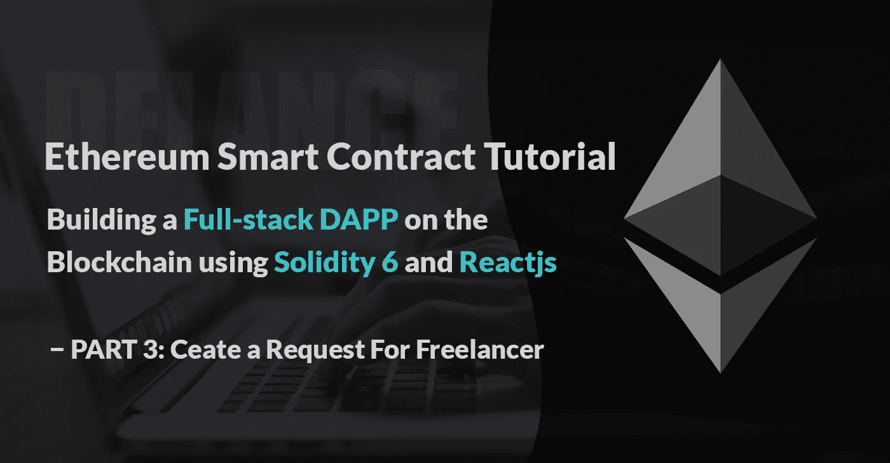
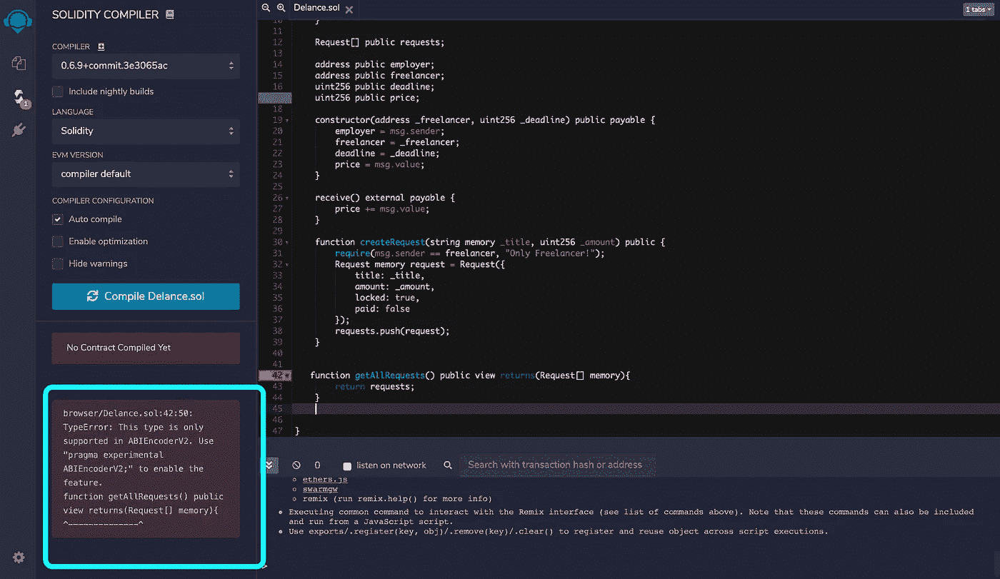
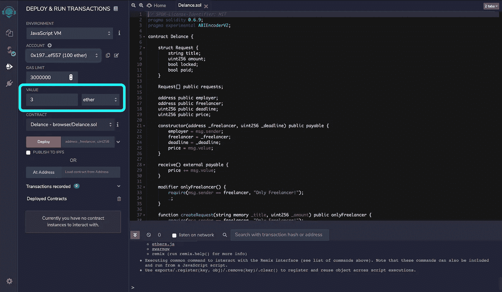
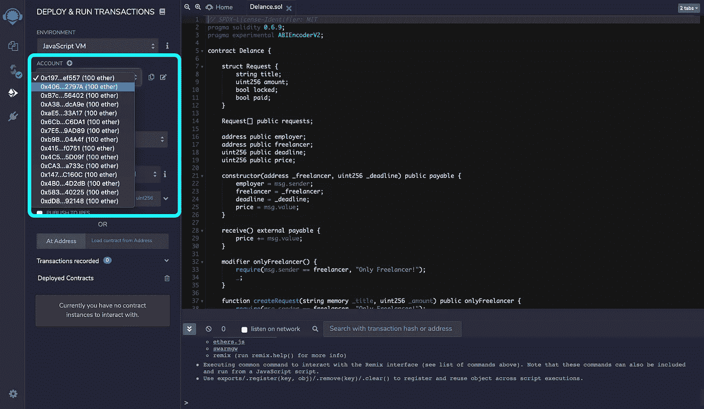
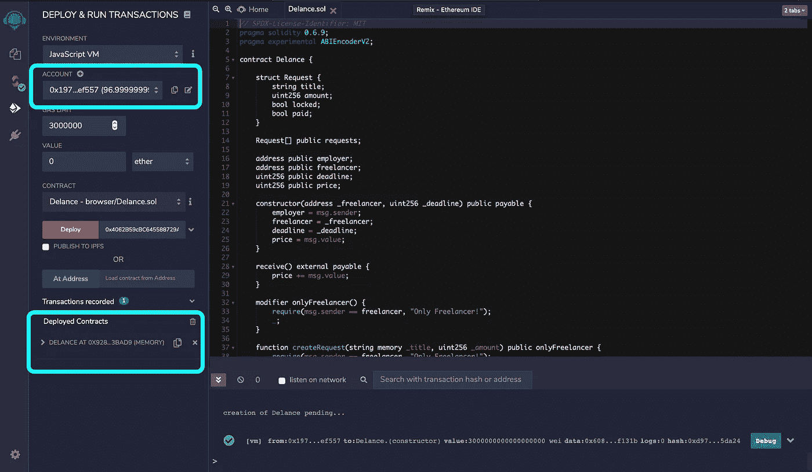
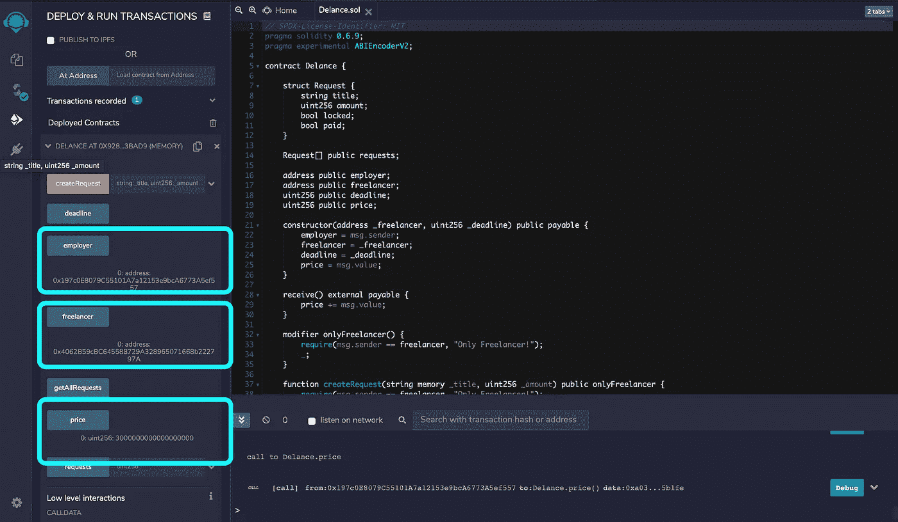
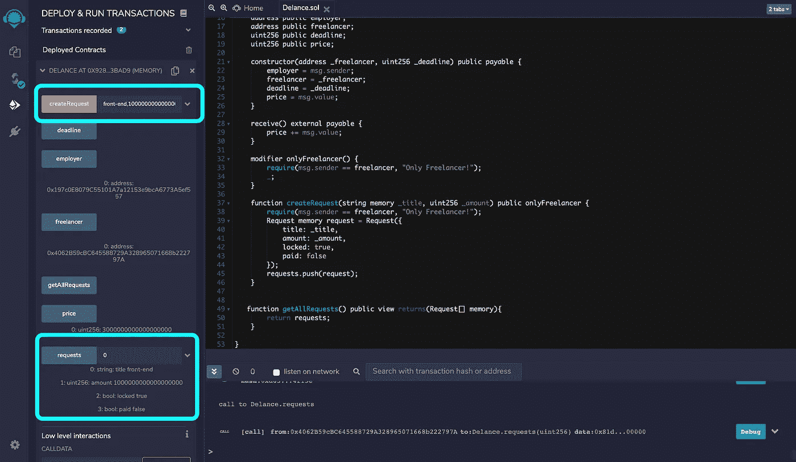
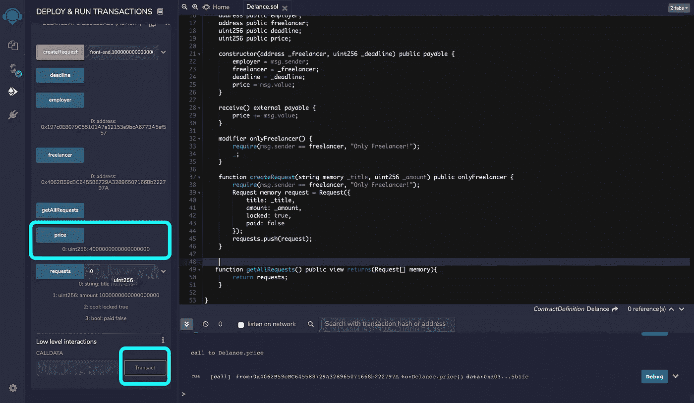

# 构建真实世界 DAPP 的 Solidity 智能合同教程—第 3 部分:为自由职业者创建请求

> 原文：<https://medium.com/coinmonks/solidity-smart-contract-tutorial-with-building-real-world-dapp-part-3-create-a-request-for-ead40e83384f?source=collection_archive---------0----------------------->



在上一篇文章的[中，我们创建了我们的第一个智能契约，并为它定义了一个构造函数。在构造函数中，我们使用 msg.sender 获得了契约创建者的地址。
我们还学习了 solidity 中的变量类型以及可以为变量和函数定义的各种可见性。](/coinmonks/solidity-smart-contract-tutorial-with-building-real-world-dapp-part-2-create-your-first-contract-e7cd4fdf4e98)

在本文中，我们开始学习 solidity 中的支付。然后，我们将使用`struct`在 solidity 中创建我们自己的自定义类型。我们还将学习如何在修饰词的帮助下处理实度中的错误！

## 开始吧！

正如我所说的，我们可以使用 msg.sender 访问事务的发送者。
任何时候，当我们想要与区块链交互时，我们都需要创建一个事务。我们可能会向朋友发送一些加密货币，部署一个智能合约，或者调用一个函数来更改区块链中的一些数据。

那么，我们怎样才能得到事务中发送的醚的数量呢？(本例为合同部署交易)

## 智能合同支付

我们可以使用`msg`全局变量的另一个属性来获取事务中已经发送的以太网的数量。是`msg.value`。关于付款，我们还应该考虑另一件事。我们必须在我们的功能上做一些改变，才能得到醚。

在 solidity smart 合同中，您将面临两种情况来接收乙醚。
1。有时你的契约中有一个函数可以接收以太。在这种情况下，您需要创建函数并将其标记为应付款。
因此，该功能将能够接收醚。
比如你有一个`buyAsset()`函数。顾名思义，它需要接收一些醚。

```
function buyAsset() public payable { uint256 value = msg.value; // Do some validation to make sure value is greater than 0
   // .
   // .
   // .
   // Buy asset}
```

**如果在调用非付费函数时发送以太网，交易将被拒绝。**

2.您可能希望为社区提供您的智能合同地址。因此，每个人都可以将乙醚从他们的钱包转移到您的智能合约中，而无需调用任何函数。要将这个特性添加到您的合同中，您需要用`fallback`关键字或`receive`关键字定义一个函数。
这两个函数都不能有参数，不能返回任何东西，必须有外部可见性！

**回退函数** 如果其他函数都不匹配给定的函数签名，或者根本没有提供数据，并且没有`receive`函数，则在调用合同时执行该函数。`fallback`函数总是接收数据，但是为了也接收以太网，它必须被标记为 payable。

```
 fallback() external payable {
    uint256 value = msg.value; 
 } 
```

**接收函数** 在普通以太网传输中执行。如果不存在这样的函数，但存在一个可支付的`fallback`函数，则在普通以太网传输中将调用回退函数。如果既不存在一个`receive`以太，也不存在一个可支付的`fallback`函数，那么契约就不能通过常规事务接收以太，并抛出一个异常。

```
 receive() external payable {
    uint256 value = msg.value; 
 }
```

就像我说的，如果我们在我们的契约中加入`receive`或`fallback`函数，人们就不需要调用一个函数来传递 Ethers。他们只需要我们的合同地址，就可以用他们的以太坊钱包发送以太。例如，我们决定为一个慈善机构筹集资金。给想支持我们的人提供我们的个人账号地址不靠谱。相反，我们可以创建一个带有一些逻辑的智能合同，向人们展示这些钱将如何使用。然后，为人们提供合同地址。他们可以检查合同，如果合同逻辑足够公平，他们可以向合同地址发送一些以太网。

所以，如你所见，有很多方法可以解决问题。对吗？
我希望雇主能够在创建合同时发送一些以太网，因此，我需要将我的构造函数标记为一个可支付函数。
雇主可能还想在部署后发送更多乙醚。所以，我们可以简单地添加一个`receive`函数，这样每个人(包括雇主)都可以发送 Ethers 来签约。

```
 address public employer;       
       address public freelancer;
       uint public deadline;
       uint public price;constructor(address _freelancer, uint256 _deadline) public payable {
        employer = msg.sender;
        freelancer = _freelancer;
        deadline = _deadline;
        price = msg.value;
    } receive() external payable {
        price += msg.value; 
    }
```

您还可以创建一个自定义函数，例如 addMoreEther()函数，并将其标记为应付款。所以雇主可以调用这个函数，以防更多的醚转移到合同中！这取决于你的商业逻辑！有很多方法可以解决编程中的问题。😎

现在，我们有一份合同，上面有我们的关键信息:
自由职业者地址
雇主地址
截止日期
项目费用

如果你不知道我们的项目目标，最好看一下[第一部分](/@bitnician/solidity-smart-contract-tutorial-with-building-full-stack-dapp-part-1-introduction-65988e83b4a3)。在这个阶段，自由职业者可以开始做项目，因为他/她已经能够检查智能合同余额和截止日期。
假设项目是全栈 DAPP 项目。自由职业者可能会在完成用户界面后要求一些费用。
在`freelancer`创建请求后，`employer`可以解锁请求，然后，`freelancer`可以提取他/她请求的费用。让我们把这个特点加到我们的合同里。

该请求有 4 个属性。
`title`和`amount`。我们还需要知道请求的状态。可能是一个`lock/unlock`，也可能是`paid/unpaid`。

## **结构**

如果有经验丰富的开发者，应该对`struct`比较熟悉。
A `struct`只是 solidity 中的另一种数据类型。这是一个自定义类型，您可以在其中定义名称和相关属性。它几乎就像 javascript 中的一个对象。
让我们为自由职业者请求创建一个结构:

```
struct Request {
 string title;
 uint256 amount;
 bool locked;
 bool paid;
 }
```

自由职业者可以在合同中创建多个请求。例如，当后端完成时，他/她可能会创建另一个请求。所以我们可以将请求存储在一个包装器中！

## 排列

An `array`是每一种编程语言的关键概念之一。在坚固性方面，我们有`fixed array`和`dynamic array`。我们还需要定义什么样的数据将被存储在`array`中。
例如，我们有一个`fixed array`，最多可存储 3 个`string`:

```
string[3] myArray
```

或者我们可以有一个`dynamic array`来保存`addresses`:

```
address[] myArray
```

在我们的项目中，我们需要一个`dynamic array`来保存我们的自定义`Request`类型。

```
Request[] public requests;
```

因此，我们创建了一个名为`Request`的自定义类型，并将它们放入名为`requests`的数组中。我们还为`array`定义了一个可见性类型。公开是可以的，但是你也可以把它定义为私有或者内部的。
现在，让我们定义一个函数来创建一个请求，并在请求`array`中推送它们。

```
function createRequest(string memory _title, uint256 _amount) public
{
   Request memory request = Request({
      title: _title,
      amount: _amount,
      locked: true,
      paid: false
    }); requests.push(request);
}
```

在上面的函数中，有一个名为`request`的类型为`Request`的*内存*变量，它已经被我们的请求属性填充。
然后，就一直推到阵中。

现在，这是一个很好的时间来学习关于可靠性的**验证**。如您所见，每个人都可以调用该函数。我们需要检查自由职业者是否调用这个函数。我们知道在我们的合同中有一个名为`freelancer`的变量保存着自由职业者的地址。我们还知道`msg.sender`，它帮助我们获得函数调用者的地址。因此，我们可以编写一个简单的`if/else`函数来检查`freelancer`是否等于`msg.sender`，但是，在 solidity 中还有一些其他的错误处理方法。

## 错误处理

首先，我们来回答这个问题:当出现错误时会发生什么？

```
function foo() public{
    // Do stuff!

    value = 10; // BOOOOM! error
}
```

当错误发生时，所有的东西都将被取消，例如，在上面的函数中，`value`的值不再是 10。

**用`require`要求** ，我们可以**处理在一个糟糕的智能合约的生命周期中正常发生的**错误。例如，我们期望自由职业者调用一个函数。其他任何人都可能调用该函数，因此，我们将使用 require 来检查条件。
`require(msg.sender == freelancer, ‘The error message…!’);`

**用`assert`断言**
，我们正在测试不应该发生的**错误。如果发生了那种错误，那就意味着你的合同有问题。
例如，`value`不应该等于 10，如果最终等于 10，则表示有 bug:
`assert(a !=10 );`**

另一个例子，如果你在一个太大的或者负的索引上访问一个`array`。(即 x[i]其中 i > = x.length 或 i < 0)这种情况下，你的契约中有 bug，可以用 assert 检查这类 bug！

**Revert**
在其他编程语言中，通常使用`throw`关键字抛出错误。在坚固性上我们用`revert`！
例如:

```
if(a != 1){
  revert(‘The value should be equal to 1’)
}
```

你可以简单的用`require`代替上面写的函数:
`require(a == 1, ‘The value should be equal to 1’ )`

这里有一点我想提一下:**不要在区块链上存储不必要的数据！** 当`freelancer`创建一个`request`的时候，我们真的不需要存储`request`的`title`。标题其实并不是一件很重要的事情。出于教育目的，我添加了`request`的`title`。我们可以将这种数据存储在中央数据库中。

在某些情况下，您可能会面临在区块链上存储多个字符串的情况。例如，您可能想要存储一个人的全名和他/她的身份号码。在这种情况下，您可以[串联](https://developer.mozilla.org/en-US/docs/Web/JavaScript/Reference/Global_Objects/String/concat)字符串，并从串联结果中创建一个散列。然后，将散列存储在区块链上。通过这样做，你可以最小化需要存储的数据。此外，您不应该在区块链上存储任何个人信息。没有人希望他/她的个人信息被公开存储在一个终生保存数据的系统上！🤨

我们还应该尝试编写简短的错误消息。不要写*‘只有管理员可以调用这个函数’*，而直接写*‘只有管理员’*🤓

好了，让我们回到我们的`createRequest`函数。我们可以添加一个`if/else`块，并用`revert()`或简单地使用`require()`来处理错误。

我通常在合同中使用`require()`:

```
function createRequest(string memory _title, uint256 _amount) public
{ require(msg.sender == freelancer, "Only Freelancer!"); Request memory request = Request({
      title: _title,
      amount: _amount,
      locked: true,
      paid: false
    }); requests.push(request);
}
```

稍后，我们将定义一些其他功能，这些功能也仅限于`freelancer`。在所有这些函数中添加带有相同错误消息的相同`require()`并不是最佳做法。
在 solidity 中，我们可以定义一个`modifier`函数来帮助我们不再重复`require()`函数。

## 修饰语

它在功能上创建附加特征或对功能施加一些限制。我们简单地定义我们的逻辑，然后在修饰符的末尾添加一个`_`。`_`是原始功能将被执行的地方(在这种情况下，原始功能是`createRequest()`

```
**modifier** onlyFreelancer() {
        require(msg.sender == freelancer, "Only Freelancer!");
        _;
    }
```

现在，我们在限制于`freelancer`的每个函数上使用这个`modifier`:

```
function ***createRequest***(string memory _title, uint256 _amount) 
public ***onlyFreelancer*** {Request memory request = Request({
      title: _title,
      amount: _amount,
      locked: true,
      paid: false
    });requests.push(request);
}
```

我们已经学会了如何创建我们自己的修改器。还有像`view`、`pure`这样的坚固性内置`modifiers`。我们将在本文中了解它们。

正如我在上一篇文章中提到的，当我们创建一个状态变量时，solidity 会自动为我们创建一个 getter 函数。在本文中，我们创建了一个名为`requests`的公共状态变量，它包含所有请求的数组。
这意味着我们访问一个名为 requests 的 getter 函数。但是，它不会返回整个数组。您应该传递索引，它将返回结果。我们将在部署契约时看到它是如何工作的，但是现在，让我们创建一个函数来为我们返回整个数组。

```
function getAllRequests() public **view** returns (Request[] memory) {
        return requests;
 }
```

## 观点和纯粹

*   在可靠性方面，我们对只读函数使用`view`修饰符。这种功能不会改变区块链上的任何东西。
*   另一个修改器是`pure`。我们将这个修饰符用于只使用函数的参数返回值而没有任何副作用(引入外部变量并改变它)的函数。我们将在本教程的下一部分使用它。

## 返回

如果函数要返回任何东西，我们只需要定义将返回哪种类型。在我们的函数中，我们将返回一个`Request`类型的数组。(`Request`类型是我们借助`struct`关键字构建的定制类型)。

我知道混音 IDE 显示了一个错误。这个错误告诉我们，solidity 不能返回自定义类型的数组(就像我们的`Request`类型)。

正如您看到的错误消息，您需要在代码的顶部添加一行:



你应该在`pragma solidity 0.6.9`下面加上`pragma experimental ABIEncoderV2`。它允许将结构、嵌套和动态变量传递到函数中，从函数中返回，以及由事件发出。(稍后我们将了解事件)

现在，是时候部署我们的合同了。正如您所记得的，我们将构造函数标记为一个可支付函数。因此，我们可以在部署合同时发送一些乙醚。
我将向合同发送 3 份乙醚。



正如你已经知道的，你需要通过自由职业者的地址和项目截止日期。这里你不应该再为自由职业者添加一个随机地址了。
你需要复制一个已经存在于你的 Remix IDE 中的地址。这个地址将是我们的`freelancer`地址，我们必须使用这个`address`来创建一个`request`。
我将使用第一个地址来部署我的合同。那将是我的`employer`，在部署契约的同时复制第二个地址并作为参数传递。它将被存储在`freelancer`变量中。



对于`deadline`，它只需要一个 uint 值。为了获得更好的体验，我们可以传递一个 Unix 时间戳: *1593774875*

让我们点击部署按钮，测试我们的合同🔥



项目已经部署，正如你所看到的，从部署者账户中扣除了将近 3 ether。你在以太坊区块链进行的每一项操作都需要一些费用。这就是部署者帐户有 96.9 个以太网而不是 97 个以太网的原因。
这个 [GitHub repo](https://github.com/crytic/evm-opcodes) 有以太坊区块链交易手续费如何计算的好信息。您还将在接下来的文章中学习如何降低交易费用。

现在，让我们从区块链中读取存储的数据。



如您所见，我们将 3 个以太网传递给智能合约。这些醚会转化为 wai，然后储存在区块链中。在[这个](https://www.etherchain.org/tools/unitConverter)网站上，你可以看到以太的所有单位。

现在，我将使用我的智能合约功能来存储和读取一个`request`。请记住将 Remix 帐户更改为自由职业者帐户，否则，您无法创建请求，因为我们的`createRequest()`被限制为`freelancer.`
我的请求的标题是*‘前端’*并且金额是 *10000000000000000 魏* (1 乙醚)



大家还记得，最初，我们在部署到合同时，为转移 3 个以太网而将值输入填充为 3。现在，您可以用另一个数字填充输入值，然后点击 transact 按钮。这是我们使用`receive`功能在合同中添加的功能。如您所见，我已向合同发送了 1 份乙醚，余额更新为 4 份乙醚(400000000000000000 魏)🙂



# 结论

现在你已经知道如何使用`struct`在 solidity 中创建你的自定义类型，并且可以使用`arrays`了。你熟悉了`payable`的功能，并在你的合同中增加了接收乙醚的功能。
你对 solidity 中的错误处理有很好的了解。你已经定义了你自己的`modifier`，并且使用了诸如`view`和`pure`这样的坚固性内置修改器。
作为区块链开发者，还有一些你需要知道的关键信息，我会在我的文章中一点一点地提到它们🙂

# 项目源代码

可以在我的 GitHub repo 中找到该项目的源代码:
[**https://github.com/bitnician/Delance-truffle**](https://github.com/bitnician/Delance-truffle)

每一课都会有自己的分支。

我叫贝扎德。我是一名区块链开发人员，拥有为企业区块链平台开发以太坊和 Hyperledger fabric 的经验。你可以通过我的用户名在 twitter 上找到我: [Bitnician](https://twitter.com/bitnician) 。
欢迎在这里或 twitter 上提出任何问题。

## 另外，阅读

*   [最佳加密交易机器人](/coinmonks/whats-the-best-crypto-trading-bot-in-2020-top-8-bitcoin-trading-bot-c16adeb13317)
*   最好的比特币[硬件钱包](/coinmonks/the-best-cryptocurrency-hardware-wallets-of-2020-e28b1c124069?source=friends_link&sk=324dd9ff8556ab578d71e7ad7658ad7c)
*   [密码本交易平台](/coinmonks/top-10-crypto-copy-trading-platforms-for-beginners-d0c37c7d698c)
*   最好的[加密税务软件](/coinmonks/best-crypto-tax-tool-for-my-money-72d4b430816b)
*   [最佳加密交易平台](/coinmonks/the-best-crypto-trading-platforms-in-2020-the-definitive-guide-updated-c72f8b874555)
*   [unis WAP 最佳钱包](/coinmonks/best-wallets-to-use-uniswap-e91a6385d9e8)
*   最佳[加密贷款平台](/coinmonks/top-5-crypto-lending-platforms-in-2020-that-you-need-to-know-a1b675cec3fa)
*   [block fi vs Celsius](/coinmonks/blockfi-vs-celsius-vs-hodlnaut-8a1cc8c26630)vs Hodlnaut
*   [莱杰 vs 特雷佐](/coinmonks/ledger-vs-trezor-best-hardware-wallet-to-secure-cryptocurrency-22c7a3fd391e)
*   [顶级 DeFi 项目](/coinmonks/defi-future-10-promising-projects-in-the-defi-world-ff2b697ab006)
*   Bitsgap 评论——一个轻松赚钱的加密交易机器人
*   [Quadency Review](/coinmonks/quadency-review-a-crypto-trading-automation-platform-3068eaa374e1) -为专业人士打造的加密交易机器人
*   [3 商业评论](https://blog.coincodecap.com/3commas-review-an-excellent-crypto-trading-bot) |一款优秀的密码交易机器人
*   [3Commas vs Cryptohopper](/coinmonks/cryptohopper-vs-3commas-vs-shrimpy-a2c16095b8fe)
*   Bitmex 上的[保证金交易指南](/coinmonks/the-idiots-guide-to-margin-trading-on-bitmex-dbbd7742c6fc?source=friends_link&sk=7bfa99d2a181142510c8442c8ddb0786)
*   [加密摇摆交易权威指南](/coinmonks/the-definitive-guide-to-crypto-swing-trading-7e4af6496d4d?source=friends_link&sk=70448050bd9323b42f63bfc0bb1e60d1)
*   [Bitmex 高级保证金交易指南](/coinmonks/bitmex-advanced-margin-trading-guide-2270c195ce25?source=friends_link&sk=1d986cca731f5084b9a2db4a4bc4a7ad)
*   [开发人员的最佳加密 API](/coinmonks/best-crypto-apis-for-developers-5efe3a597a9f)
*   [加密套利](/coinmonks/crypto-arbitrage-guide-how-to-make-money-as-a-beginner-62bfe5c868f6)指南:新手如何赚钱
*   顶级[比特币节点](https://blog.coincodecap.com/bitcoin-node-solutions)提供商
*   最佳加密制图工具
*   了解比特币的[最佳书籍有哪些？](/coinmonks/what-are-the-best-books-to-learn-bitcoin-409aeb9aff4b)

> [直接在您的收件箱中获得最佳软件交易](https://coincodecap.com?utm_source=coinmonks)

[](https://coincodecap.com?utm_source=coinmonks)