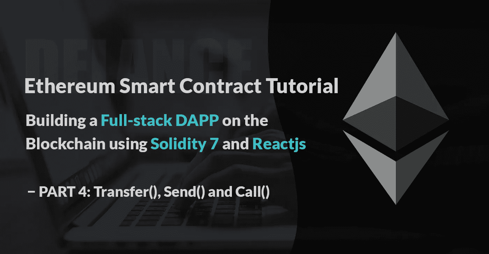
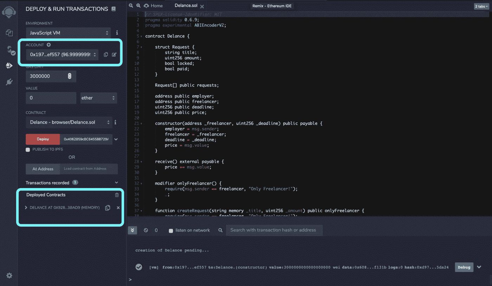

# 构建真实世界 DAPP 的 Solidity 智能合约教程—第 4 部分:传输、发送和调用

> 原文：<https://medium.com/coinmonks/solidity-smart-contract-tutorial-with-building-real-world-dapp-part-4-transfer-send-and-call-ea9d7386114c?source=collection_archive---------0----------------------->



在[的最后一篇文章](https://bitnician.medium.com/solidity-smart-contract-tutorial-with-building-real-world-dapp-part-3-create-a-request-for-ead40e83384f)中，我们在合同中存储了自由职业者和雇主的地址，并使雇主能够在创建合同时存放一些乙醚。我们还增加了一个功能，让自由职业者一旦完成项目的一部分，创建一个付款请求。

BTW，如果你不了解项目目标，建议你快速看一下[第一部](https://bitnician.medium.com/solidity-smart-contract-tutorial-with-building-full-stack-dapp-part-1-introduction-65988e83b4a3)。我已经解释了使用区块链和智能合约将解决什么问题，以及您将从这些文章中学到什么！🙂

在继续之前，让我说，在一些延迟之后，我已经开始继续这些文章。我一直忙于一些个人项目，比如我的网站。
顺便说一句，我们开始使用 solidity 6 对合同进行编码。在我写新文章的这个时候，solidity 7 已经发布了，所以，我们打算把 solidity 的版本改为 0.7.4，这是最新的版本！

在将实度从 6 改为 7 后，我唯一修改的是构造函数的可见性。
在 solidity 7 中，构造函数的可见性被忽略，除非你想创建一个 [**抽象**](https://solidity.readthedocs.io/en/v0.7.4/contracts.html#abstract-contracts) 契约。抽象契约只是一个不可部署的契约。我们正在编码的契约不是抽象的，所以把 solidity 的版本改成 7 以后就没必要用`public`关键字了！

在这篇文章中，我们将创建一些解锁自由职业者请求以及支付自由职业者的功能。我们也将熟悉**事件**的可靠性。我们已经知道如何在合同中加入一些以太网，现在是时候了解一下安全中的**撤回方法**以及一些安全问题，比如**重入攻击**。
好了，该开始编码了！🔥🤓

正如我所说，自由职业者可以创建一个付款请求，对不对？该请求默认为`lock`。
因此，我们需要添加一个仅限于雇主的功能(使用我们的自定义`modifiers`，并且可以将特定请求的状态从`*lock*`更改为`*unlock*`。就这么办吧！😊

首先，我将创建一个名为`unlockRequest`的函数。它获取`request`的索引并将`locked`属性从`true`更改为`false`！

```
function *unlockRequest*(uint256 _index) public { Request storage request = requests[_index];
        require(request.locked, "Already unlocked");
        request.locked = false;}
```

看看上面的函数，看看我如何从`requests`数组中获取一个条目，并将其存储在一个名为`request`的变量中，变量的类型为`Request`。注意，我使用了关键字`**storage**`来存储这个条目。`storage`关键字本质上允许`request`变量充当指向存储数组`requests[]`的指针。
在该功能中，我们首先检查给定的`request`是否已经解锁。如果`require`函数返回`true`，意味着`request`被锁定，我们可以将它的`locked`值改为`false`！

我们在上一篇文章中学习了`modifiers`。我们需要创建另一个`modifier`，将`unlockRequest` 功能限制到`employer`！

我们的修饰符应该是这样的:

```
modifier onlyEmployer() { require(msg.sender == employer, "Only Employer!");
        _;}
```

然后，我们在`unlockRequest`函数中使用它:

```
function *unlockRequest*(uint256 _index) public onlyEmployer { Request storage request = requests[_index];
        require(request.locked, "Already unlocked");
        request.locked = false;}
```

好了，这个功能快完成了！✅
在这一点上，我认为这是一个学习如何在 solidity 中定义和发出事件的好机会。

## 事件

为了在契约中定义一个事件，您可以通过在它前面加上关键字`event`来标记它(在用法上类似于关键字`function`)。然后，你将事件放在你想让其产生事件的函数体中。在最基本的形式中，一个事件就是打印一个日志。因此它有点像 Javascript 的`console.log`。就这样，不多不少。实际上，除了将事件记录到区块链之外，它没有其他用途。然而，当我们开始编写 UI 时，我们可以将这些事件作为一种推送通知来监听。

让我们创建一个事件，并在请求被解锁时发出它。首先，我将定义事件。(我把它写在我的契约顶部的某个地方，可能在构造函数上面)

```
event RequestUnlocked(bool locked);
```

我的事件名是 RequestUnlocked，它接受一个类型为`boolean`的参数，并在发出时记录给定参数的值(是`true`或`false`)。

让我们在`unlockRequest`函数中使用它:

```
function *unlockRequest*(uint256 _index) public onlyEmployer { Request storage request = requests[_index];
        require(request.locked, "Already unlocked");
        request.locked = false; emit RequestUnlocked(request.locked);}
```

搞定了。✅

**重构我们之前的函数** 在上一篇文章中，我们有一个名为`createRequest`的函数。我只是想为这个函数创建另一个事件。我的活动:

```
event RequestCreated(string title, uint256 amount, bool locked, bool paid);
```

该功能将是这样的:

```
function createRequest(string memory _title, uint256 _amount)
        public
        onlyFreelancer
    { require(msg.sender == freelancer, "Only Freelancer!"); Request memory request = Request({
             title: _title,
             amount: _amount,
             locked: true,
             paid: false
        }); requests.push(request);

        emit RequestCreated(_title, _amount, request.locked,  
        request.paid);
    }
```

## 实付地址

嗯，雇主可以解锁一个请求，这意味着自由职业者现在可以撤回所要求的付款。我们将创建一个函数，将这一取款功能添加到我们的合同中！💰但是，在此之前，我们需要学习更多关于稳健支付的知识！🤓

**应付款** 我们已经学习了 solidity 中的类型。我们知道`address`类型用于存储 160 位以太坊地址。
还有一种叫`address payable`。`address`和`address payable`类型都存储 160 位以太坊地址。
在 Solidity 版本 0.5.0 中引入了 an `address`和`address payable`之间的区别。这个想法是为了区分可以收到钱的地址和不能收到钱的地址(用于其他目的)。简单来说，一个`address payable`能接收以太，一个普通的`address`不能。

**重构我们之前的代码** 好了，我们有了雇主和自由职业者的地址，在某些情况下，我们需要向这些地址转移一定量的醚。例如，当自由职业者决定从合同中提取一些乙醚时，我们需要将乙醚转移到他/她的地址。或者，如果项目没有在截止日期前完成，业主可以决定取消项目，并从合同中收回剩余的醚。因此，我们需要将这两个地址的类型从`address`更改为`address payable`:

```
address **payable** public employer;
address **payable** public freelancer;
```

我们还需要在构造函数中修改自由职业者地址的输入类型:

```
constructor(**address** **payable** _freelancer, uint256 _deadline) 
public payable { employer = msg.sender;
        freelancer = _freelancer;
        deadline = _deadline;
        price = msg.value;}
```

在上面的函数中，我们将`msg.sender`存储在了`employer`变量中。`msg.sender`总是返回一个`address payable`类型！

在 solidity 中，我们也可以使用`payable()`函数将`address`转换为`address payable`:

```
address payable myPayableAddress = payable(myPlainAddress);
```

## 如何在固体中转移以太？

有几种方法可以将乙醚转移到一个可支付的地址:

`someAddress.transfer()
someAddress.send()
someAddress.call{value: someValue}('')`

但是，也有一些关于固体转移醚的问题！

## 智能合约如何在转移以太的同时被黑？

在编写智能合同时，您应该注意并防范一些已知的攻击。其中之一就是**重入攻击。** 这个 bug 的第一个版本是关于在函数第一次调用完成之前，可能被重复调用的函数。
这可能导致不同的函数调用以破坏性的方式相互作用。看下面例子的生命周期:

```
**contract Vulnerable** **{**function withdraw() public { *       // send ether to Attacker contract. Imagine, In our project,
        // the freelancer send us a malicious contract address
        // instead of an account address!*
    }**}****contract Attacker {**fallback() external payable { *//calling the withdraw function of the* ***Vulnerable contract***
    } **}**
```

从上面可以看到，`Vulnerable`合同的`withdraw()`函数将以太网发送到该地址。地址是一份合同。
每当一些醚存放到`Attacker`契约中，就会执行`fallback()`函数，如你所见，`fallback()`函数可以一次又一次地调用`Vulnerable`契约的`withdraw()`函数……！

## 重入攻击的第一种解决方案是什么？

在继续之前，让我们从气体开始！

**什么是气？**
参与以太坊的每一项操作，无论是交易还是智能合约执行，都需要一定量的 gas。
例如，在上一篇文章中，雇主在部署合同时发送了 3 个乙醚，但他/她的钱包余额减少了 3 个乙醚多一点。



An image from last article

这是因为合同部署事务已经消耗了一些汽油。例如，假设部署交易可能花费 1000 汽油。我们将天然气价格定为 0.000002 eth。所以我们的交易费会是 1000 * 0.000002 = 0.002 eth。在接下来的文章中，我们将看到如何改变汽油价格

[*在这里你可以看到每一个动作所需要的气体量。*](https://github.com/bitnician/evm-opcodes)

**天然气如何能帮助我们！**
坚固性引入了`transfer()`和`send()`，引入这两个功能的全部原因是为了防止触点重入攻击。
`transfer()`和`send()`将转发 2300 气体津贴，该气体量对于这些功能是不可调节的。这个想法是 2300 gas 足以发出一个日志条目，但不足以进行一个可重入的调用来修改存储。

```
**contract SenderContract** **{** function withdraw() public { ***//transfer() will  forwards 2300*** someAddress.**transfer**(someAmount) }
**}****contract ReceiverContract {** **event** Received(address, uint); fallback() external payable { **// 2300 gas is only enough to emit a log, calling an external
       // function consumes a large amount of gas** **emit** Received(msg.sender, msg.value);
    } 

**}**
```

**send()和 transfer()有什么区别？** 如果传输完成，`send()`函数返回`true`，否则返回`false`。
但是如果交易被拒绝，`transfer()`函数会抛出一个错误。
`someAddress.transfer(someValue)`相当于`require(someAddress.send(someValue))`，如果发送失败会自动回复。

## 为什么我们不再使用传送和发送？

当您想要使用`transfer()`和`send()`转移乙醚时，需要记住几件事:
这些函数有助于我们转移乙醚，但在 2020 年 12 月之后，使用这些函数会有一些问题。🤔
我简单解释一下为什么要避开`send()`和`transfer()`！我们在以前的文章中学习了`fallback`和`receive`函数。他们帮助我们接受合同。
`fallback`和`receive`功能以前消耗不到 2300 点汽油，现在会消耗更多。🙃
举例来说，如果我们真的需要在我们的`receive()`或`callback()`函数内部写入存储，那么消耗的气体会比 2300 多！
所以，如果收件人是合同的话，2300 气可能不够！
`transfer()`和`send()`将转发 2300 气体津贴，该气体量对于这些功能是不可调节的。
任何使用`transfer()`或`send()`的智能合同都是通过转发固定数量的天然气(2300 英镑)来严格依赖天然气成本！
应避免任何特定于天然气的代码，因为天然气成本会发生变化。

## 现在应该使用 call()来传输以太网

`call`功能没有气体限制！因此，`fallback()`或`receive()`函数中的任何代码都将被执行，只要还有剩余的气体用于此目的:

```
function withdraw() external { ***// Using call instead of transfer or send*** (bool success, bytes memory transactionBytes) =    
        someAddress.call{value:someValue}('');

        require(success, "Transfer failed.");}
```

**可重入性呢？这可能是你看到上面代码的第一个想法。如果我们不再使用`transfer()`和`send()`，我们将不得不以更健壮的方式来防止重入。幸运的是，这个问题有很好的解决方案。**

**使用重入防护** 我们用来防止重入的方法是显式地检查并拒绝这样的调用。这里有一个简单版本的可重入保护，这样你就可以明白这个想法了:

```
**bool locked = false;**function withdraw() external { **require(!locked, "Reentrant call detected!");**

        **locked = true;**

       (bool success, bytes memory transactionBytes) =    
        someAddress.call{value:someValue}('');

        require(success, "Transfer failed.");

        **locked = false;**
    }
```

使用上面的代码，如果一个重入调用被尝试，`require`将拒绝它，因为`lock`仍然被设置为`true`😊
[更多信息请点击这里！](https://consensys.net/diligence/blog/2019/09/stop-using-soliditys-transfer-now/)

**既然我们已经了解了很多关于在合同中转让乙醚的事情，那我们就来增加一个帮助自由职业者提取一些乙醚的功能吧！🤘**

首先，我声明一个名为`locked`的新变量。既然我们要使用`call()`，我们应该保护我们的契约免受可重入攻击。
您可以将此代码添加到合同顶行的`freelancer`和`employer`变量下面。

```
bool locked = false;
```

其次，定义另一个`event`并在我们的新函数中使用它也不错。我会把它写在我合同顶部的某个地方，可能在`constructor`函数上面

```
event RequestPaid(address receiver, uint256 amount);
```

最后，我将编写函数并将其命名为 payRequest:

```
function payRequest(uint256 _index) public onlyFreelancer {

        require(!locked,'Reentrant detected!');

        Request storage request = requests[_index];
        require(!request.locked, "Request is locked");
        require(!request.paid, "Already paid");

        locked = true;

        (bool success, bytes memory transactionBytes) = 
        freelancer.call{value:request.amount}('');

        require(success, "Transfer failed.");

        request.paid = true;

        locked = false;

        emit RequestPaid(msg.sender, request.amount);
    }
```

这里我们首先检查一下契约是否没有被锁定。然后，直接从请求数组中获取项目。我们检查了该请求是否已经从雇主处解锁并且尚未支付。之后，我们把要求数量的乙醚转移给自由职业者。
最后，我们更新要支付的请求，锁定合同并发出一个事件。

# 结论

现在，您已经掌握了关于 solidity 智能合约中的支付和转账的非常好的信息，以及编写自己的合约时的一些安全问题。🔥

# 项目源代码

你可以在我的 GitHub repo 中找到该项目的源代码:
[【https://github.com/bitnician/Delance-truffle】T2](https://github.com/bitnician/Delance-truffle)

每一课都会有自己的分支。

我叫贝扎德。我是一名区块链开发人员，拥有为企业区块链平台开发以太坊和 Hyperledger fabric 的经验。你可以通过我的用户名在 twitter 上找到我:[***Bitnician***](https://twitter.com/bitnician)。👈
欢迎在这里或 twitter 上提出任何问题。

## 另外，阅读

*   最好的[密码交易机器人](/coinmonks/crypto-trading-bot-c2ffce8acb2a)
*   [密码本交易平台](/coinmonks/top-10-crypto-copy-trading-platforms-for-beginners-d0c37c7d698c)
*   最好的[加密税务软件](/coinmonks/best-crypto-tax-tool-for-my-money-72d4b430816b)
*   [最佳加密交易平台](/coinmonks/the-best-crypto-trading-platforms-in-2020-the-definitive-guide-updated-c72f8b874555)
*   最佳加密贷款平台
*   [最佳区块链分析工具](https://bitquery.io/blog/best-blockchain-analysis-tools-and-software)
*   [加密套利](/coinmonks/crypto-arbitrage-guide-how-to-make-money-as-a-beginner-62bfe5c868f6)指南:新手如何赚钱
*   最佳[加密制图工具](/coinmonks/what-are-the-best-charting-platforms-for-cryptocurrency-trading-85aade584d80)
*   [莱杰 vs 特雷佐](/coinmonks/ledger-vs-trezor-best-hardware-wallet-to-secure-cryptocurrency-22c7a3fd391e)
*   了解比特币最好的[书籍有哪些？](/coinmonks/what-are-the-best-books-to-learn-bitcoin-409aeb9aff4b)
*   [3 商业评论](/coinmonks/3commas-review-an-excellent-crypto-trading-bot-2020-1313a58bec92)
*   [AAX 交易所评论](/coinmonks/aax-exchange-review-2021-67c5ea09330c) |推荐代码、交易费用、利弊
*   [Deribit 审查](/coinmonks/deribit-review-options-fees-apis-and-testnet-2ca16c4bbdb2) |选项、费用、API 和 Testnet
*   [FTX 密码交易所评论](/coinmonks/ftx-crypto-exchange-review-53664ac1198f)
*   [n 零审核](/coinmonks/ngrave-zero-review-c465cf8307fc)
*   [逐位交换审查](/coinmonks/bybit-exchange-review-dbd570019b71)
*   [3Commas vs Cryptohopper](/coinmonks/cryptohopper-vs-3commas-vs-shrimpy-a2c16095b8fe)
*   最好的比特币[硬件钱包](/coinmonks/the-best-cryptocurrency-hardware-wallets-of-2020-e28b1c124069?source=friends_link&sk=324dd9ff8556ab578d71e7ad7658ad7c)
*   最佳 [monero 钱包](https://blog.coincodecap.com/best-monero-wallets)
*   [莱杰 nano s vs x](https://blog.coincodecap.com/ledger-nano-s-vs-x)
*   [bits gap vs 3 commas vs quad ency](https://blog.coincodecap.com/bitsgap-3commas-quadency)
*   [莱杰纳米 S vs 特雷佐 one vs 特雷佐 T vs 莱杰纳米 X](https://blog.coincodecap.com/ledger-nano-s-vs-trezor-one-ledger-nano-x-trezor-t)
*   [block fi vs Celsius](/coinmonks/blockfi-vs-celsius-vs-hodlnaut-8a1cc8c26630)vs Hodlnaut
*   [bits gap review](/coinmonks/bitsgap-review-a-crypto-trading-bot-that-makes-easy-money-a5d88a336df2)——一个轻松赚钱的加密交易机器人
*   为专业人士设计的加密交易机器人
*   [PrimeXBT 审查](/coinmonks/primexbt-review-88e0815be858) |杠杆交易、费用和交易
*   [埃利帕尔泰坦评论](/coinmonks/ellipal-titan-review-85e9071dd029)
*   [赛克斯石评论](https://blog.coincodecap.com/secux-stone-hardware-wallet-review)
*   [BlockFi 评论](/coinmonks/blockfi-review-53096053c097) |赚取高达 8.6%的加密利息