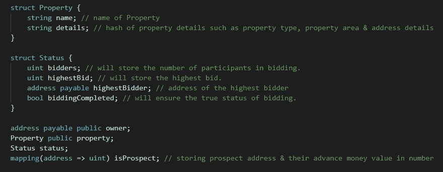
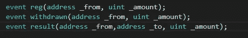
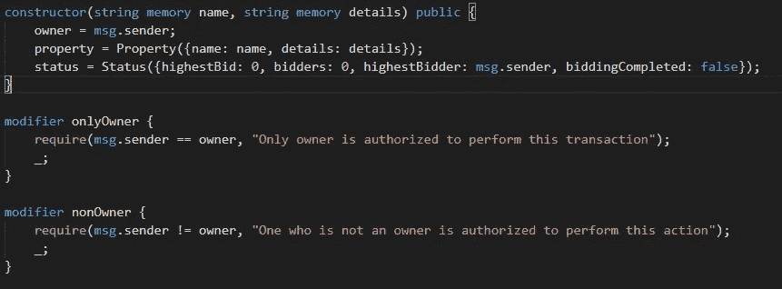
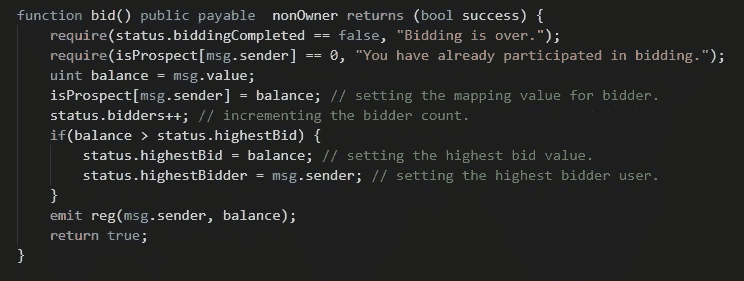
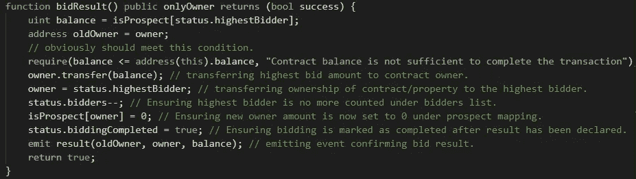
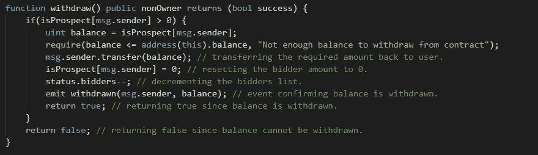
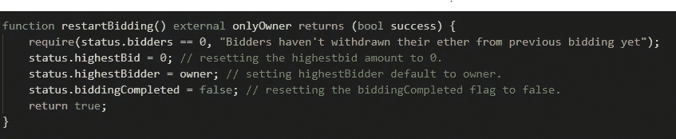
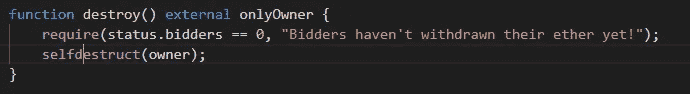

# Solidity 智能合约演练系列第 1 部分

> 原文：<https://medium.com/coinmonks/solidity-smart-contracts-walk-through-series-part-1-90075f4e9da6?source=collection_archive---------2----------------------->

Photo by [Mari Helin](https://unsplash.com/@mari?utm_source=unsplash&utm_medium=referral&utm_content=creditCopyText) on [Unsplash](https://unsplash.com/s/photos/contracts?utm_source=unsplash&utm_medium=referral&utm_content=creditCopyText)

本系列的基本思想是理解 Solidity 编写的智能合同的技术流程和基于用例的概念。在这个系列中，我们将经历三个不同的用例:**“财产拍卖”、“出租财产”&“商业伙伴关系”**。对于每个用例，我们将首先讨论我们应该覆盖哪些功能，然后理解技术实现细节。代码库可以在 [**这里找到**](https://github.com/Harry-027/Solidity-Smart-Contracts-Walkthrough) 。请记住，这不是一个功能齐全的产品。这些智能合约已经在本地使用 Ganache &进行了测试，不属于任何生产/测试网络。它们仅仅是为了教育目的而开发的。

这是智能合同演练系列的**第 1 部分**。在接下来的文章中，我将向你深入介绍财产拍卖智能合同的技术实现细节。

**房产拍卖用例::**

让我们假设一个用户想要拍卖他的财产。保持简单将使我们的场景类似于拍卖(**不是一个完全成熟的拍卖**)。基本场景是任何用户(除了资产所有者)都可以参与拍卖。每位参与者都将获得一次投标机会&转让他们的投标金额。合同将存储参与者的投标金额。业主希望的任何时间；他可以通过将财产所有权转让给最高出价者&最高出价金额到他自己的钱包地址来停止拍卖。其他参与者可以随时从合同中撤回各自的投标金额。新的所有者将无法再次开始拍卖给定的财产，除非所有其他用户从合同中撤回他们以前的出价金额。

**我们开始吧……**

以下是我们要使用的不同数据类型:

Data Types to be used

我们正在定义一个**属性**结构，它将存储属性名&和其他细节。因为可能有大量的细节，所以用户可以存储细节的散列(在契约之外准备细节散列)。我们有**状态**结构，它将跟踪以下内容:

*   **竞拍者**:这将存储参与竞拍的人数。
*   **最高出价**:最高出价金额。
*   **最高出价者**:最高出价者的地址。
*   **竞价完成**:检查竞价是否完成。

**所有者**将存储资产所有者钱包地址& **isProspect** 是存储每个参与者的投标金额值的映射。

为确认各种交易而定义的下列事件:

属性详细信息、合同状态字段和所有者钱包地址将在合同部署时初始化(当构造器被调用时**)。在所有者&非所有者之间隔离各种功能的修饰符也定义如下:**

****

**进入我们的投标功能:**

****

**使用 **nonOwner** 修饰符这个方法已经被限制为 Owner。如果交易成功，则返回 true。指定为**应付款**，因为各个参与者将发送其投标金额(需要存储在合同中)。如果用户之前没有参与，我们将允许用户参与(否则我们将恢复交易，这里使用的 require operator 将帮助我们)。我们将为用户设置 **isProspect** 映射，增加参与者计数(**投标人** ++) &，同时设置**最高投标人** & **投标金额**，以防用户金额多于其他参与者。一旦交易成功，将发出 **reg** 事件，返回值为 **true** 。**

> **注意——任何具有可支付选项的函数将允许契约在其自己的地址存储乙醚量(在函数调用期间从用户处接收)。**

****

**Only owner can invoke this method & declare the result**

**仅允许所有者调用**投标结果**。这种方法会将房产所有权转让给**最高出价者**。它还会将最高出价金额转移到当前所有者地址&标记拍卖已完成。它会将**最高出价人**的 **isProspect** 映射重置为 0 &减少参与者的数量(这将有助于我们跟踪剩余参与者的正确数量以提取他们的金额)。一旦交易成功，它将发出**结果**事件&也返回真布尔值。**

****

**Method that helps users to withdraw their respective bidding amount**

**上述方法允许参与者提取他们各自存储投标金额。任何时候，任何用户希望退出拍卖或希望在拍卖完成后取回自己的金额，都可以调用此方法。该方法将检查 **isProspect** 映射，以获得用户的相应金额。然后，它会将所需金额转移到用户的钱包地址。**参与者计数**也会减少，以反映实际的参与者计数。请注意，当拍卖结果被宣布时，我们减少了这个计数&还重置了最高出价者的**预期**映射，因为我们不希望拍卖获胜者认领他的钱。**

****

**一旦拍卖完成，新的财产所有人可能会再次开始拍卖。在这种情况下，我们将确保如果前一轮拍卖的所有参与者都提取了他们各自的金额&然后只允许所有者再次开始拍卖。施加此条件是因为我们在这里重置了关键参数，例如**highest bid**&**highest bider**。**

****

**一旦没有参与者离开，所有者可以销毁拍卖合同，并将储存的乙醚转移到他自己的地址(如果有的话)。**

**我希望你喜欢。让它尽可能简单的主要原因是为了理解整体的实现思想。请务必查看下一部分，我们将在这里了解物业租赁智能合同。**

***其他部分:*[*Part-1*](/@harish0y2j/solidity-smart-contracts-walk-through-series-part-1-90075f4e9da6)*，*[*Part-2*](/@harish0y2j/solidity-smart-contracts-walk-through-series-part-2-d526c5d5782e)*，* [*Part-3*](/@harish0y2j/solidity-smart-contracts-walk-through-series-part-3-480ba8019ab9)**

**代码库可以在这里找到[。](https://github.com/Harry-027/Solidity-Smart-Contracts-Walkthrough)**

> **[直接在您的收件箱中获得最佳软件交易](https://coincodecap.com/?utm_source=coinmonks)**

****