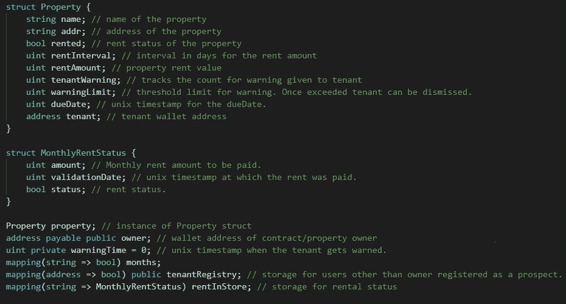
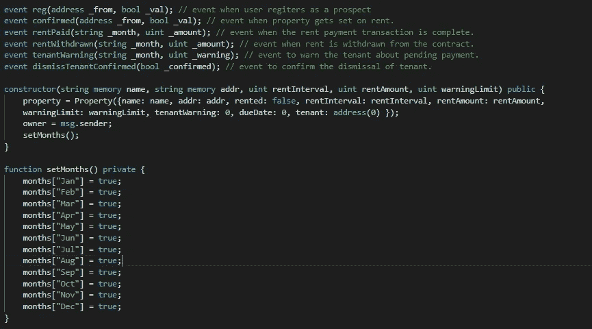
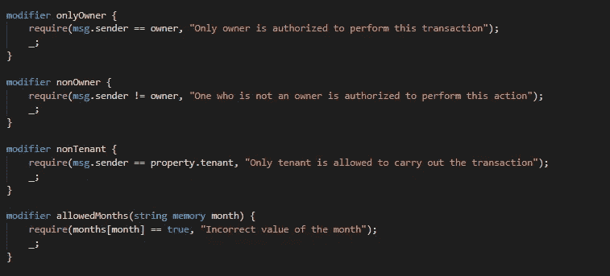
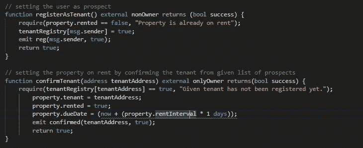
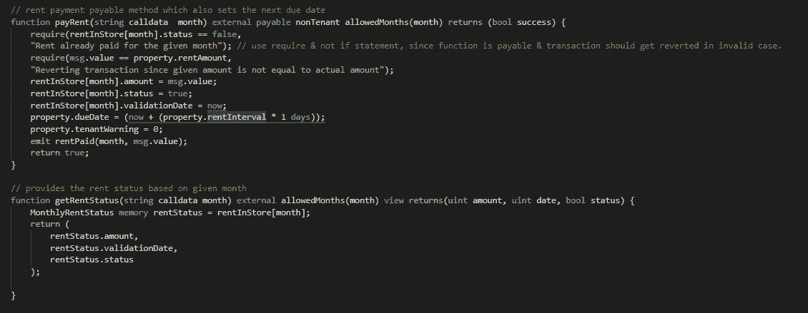
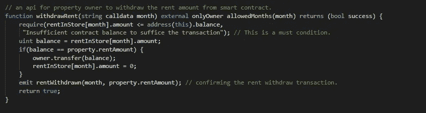
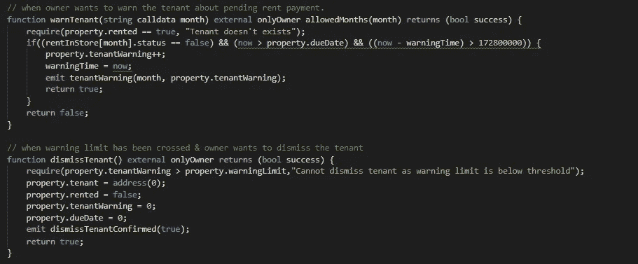

# Solidity 智能合约演练系列第 2 部分

> 原文：<https://medium.com/coinmonks/solidity-smart-contracts-walk-through-series-part-2-d526c5d5782e?source=collection_archive---------3----------------------->

Photo by [Tierra Mallorca](https://unsplash.com/@tierramallorca?utm_source=unsplash&utm_medium=referral&utm_content=creditCopyText) on [Unsplash](https://unsplash.com/s/photos/property?utm_source=unsplash&utm_medium=referral&utm_content=creditCopyText)

这是智能合同演练系列的第 2 部分**。在接下来的帖子中，我将向您深入介绍我们的物业租赁智能合同的技术实现细节。代码库可以在这里找到****。******

****出租物业用例::****

**整体用例非常简单。用户将根据给定的属性将自己注册为潜在客户。业主将决定哪个用户将成为租户。承租人将按照约定的到期日支付租金。要存储在合同中的租金金额。业主可以从合同中收回相同的租金。如果租户没有在到期日支付租金，业主可以对租户提出警告。允许所有者在至少 2 天的时间间隔内提出警告。如果房客超过了警告界限，房主可以将房客逐出房屋。**

****我们开始吧……****

**下面是我们定义的数据结构:**

****

**comment against each property field defines their respective role**

**这里我们定义了 **Property** struct，它将记录物业的详细信息，如名称、地址、是否出租的物业、租金金额、租金间隔、租金到期日、警告次数、警告限制&租户钱包地址。我们有**monthly rent status**struct，它将帮助我们存储每个月的租金状态。我们还有各种映射— **月**、**租户注册** & **租金支付状态。****

****

**我们已经定义了事件，这将帮助我们记录成功的事务。我们正在设置属性所有者，属性细节和构造函数本身的月份映射。构造函数只被调用一次(当契约被部署时)。**

****

**上面显示的是隔离和区分我们的合同的各种功能的各种修饰符。**

****

**任何用户都可以通过调用**registra tenant**方法来表达他/她对出租物业的兴趣。如果该物业未出租，它将为给定用户设置 **tenantRegistry** 映射。业主将通过调用 **confirmTenant** 方法，输入为**各自的用户钱包地址**，来确认哪个用户应该成为租户。这将最终确定租户，将物业**已租**状态标记为真&将根据**租金间隔**设置**租金到期日**。**

> **注意—这里所有基于日期的计算都基于 unix 时间戳。 ***现在*** 是给我们包含我们事务的块的时间戳的关键字。然而，这不是准确的时间戳，但它会给出允许范围内的时间。**

****

**方法 **payRent** 将允许租户支付给定月份的租金。请注意，只有当发送的金额等于要支付的租金金额时，才会接受租金。它还将设置**下一个到期日** &如果有的话，将**租户警告**重置为 0。**

> **注意——如果函数参数(也包括返回参数)是 struct、array、mapping 或 string 类型，那么应该清楚地指出它们的数据位置——或者是**内存，或者是存储**。如果函数是**外部**，应该将数据位置设为**调用数据**。关于内存&存储模型如何工作的更多信息，请点击这里**[**。**](/coinmonks/what-the-hack-is-memory-and-storage-in-solidity-6b9e62577305)****

**方法 **getRentStatus** 将允许任何人检查任何给定月份的租金状态。**

> **注意——任何 struct 类型的函数作用域变量都应该清楚地指出它的数据位置— **内存或存储**,因为这有助于编译器做出基于事务的决定。注意，在 **getRentStatus** 方法中，我们返回每个字段，因为返回完整的结构是不可能的。Solidity 只将 struct 作为变量的松散包来实现。**

****

****提取租金**将允许业主从合同地址提取月租金。它还会将相应月份的 **rentInStore** 映射重置为 0，因为不允许所有者在同一个月提取两次租金。**

****

**只有在以下情况下，业主才可以警告承租人未交租金-**

*   **承租人尚未支付租金，到期日已到。**
*   **在**(现在—警告时间> 172800000)** 之前至少 2 天提出的最后警告(如果有的话)。**

**将会触发一个**警告事件**，该事件可以通过使用 **web3 api** 的用户界面来监听，以便警告租户关于未决租金。另外**警告计数**将增加。**

**业主也可以在达到警告限制的情况下解雇租户。调用 **dismissTenant** 方法也会将属性**租用**状态重置为 false。**

**我希望你喜欢！请务必查看下一部分，我们将在其中讨论业务合作智能合同。**

***其他部分:* [*Part-1*](/@harish0y2j/solidity-smart-contracts-walk-through-series-part-1-90075f4e9da6) *，*[*Part-2*](/@harish0y2j/solidity-smart-contracts-walk-through-series-part-2-d526c5d5782e)*，* [*Part-3*](/@harish0y2j/solidity-smart-contracts-walk-through-series-part-3-480ba8019ab9)**

**代码库可以在这里找到[。](https://github.com/Harry-027/Solidity-Smart-Contracts-Walkthrough)**

> **[直接在您的收件箱中获得最佳软件交易](https://coincodecap.com/?utm_source=coinmonks)**

****