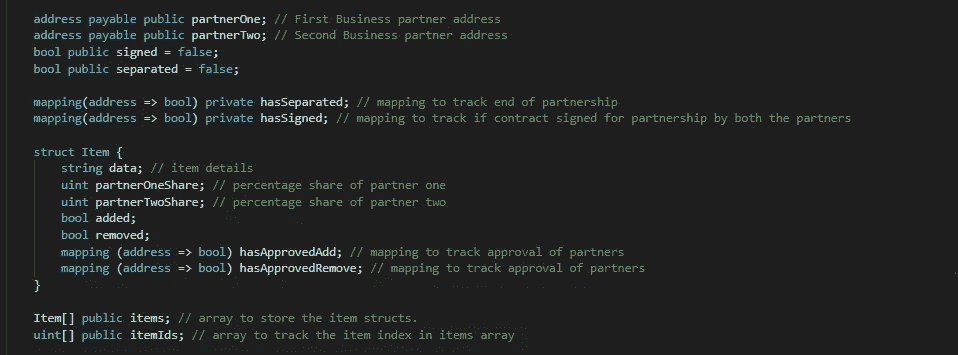
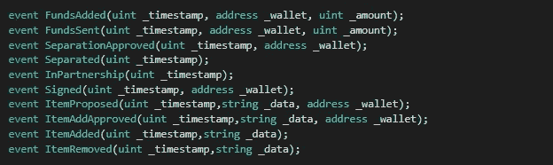
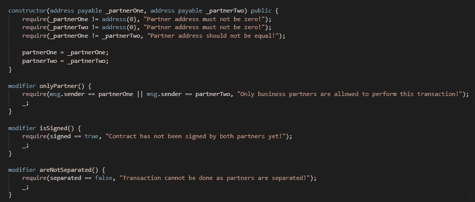
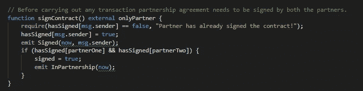
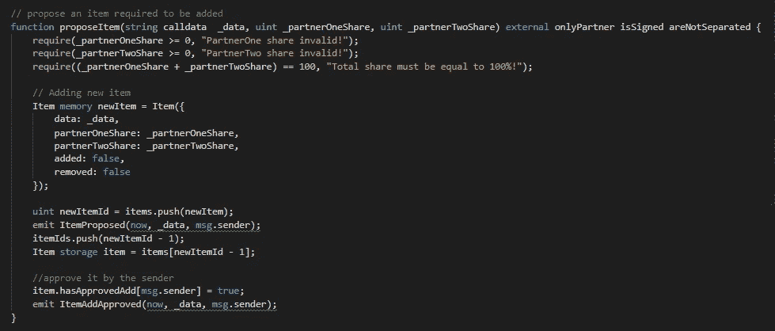
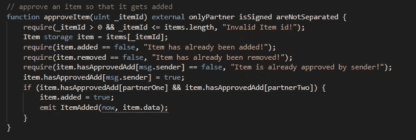
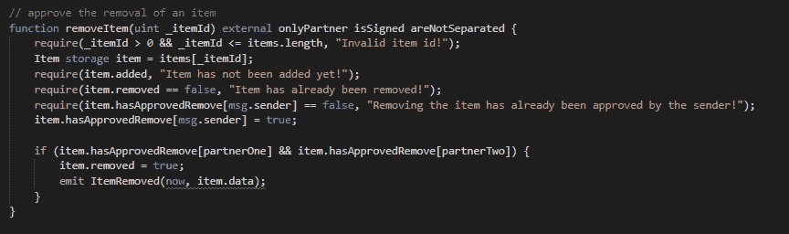
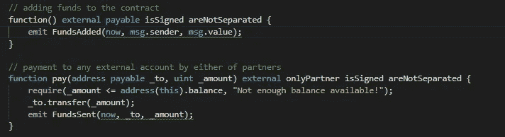
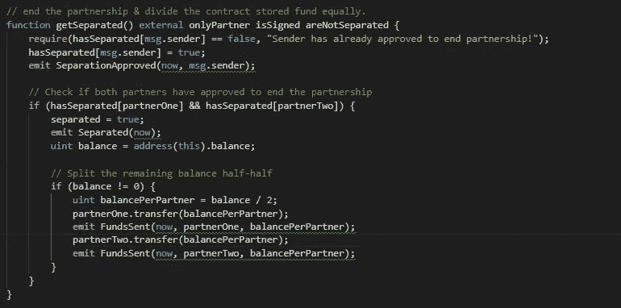

# Solidity 智能合约演练系列第 3 部分

> 原文：<https://medium.com/coinmonks/solidity-smart-contracts-walk-through-series-part-3-480ba8019ab9?source=collection_archive---------4----------------------->

Photo by [Chris Liverani](https://unsplash.com/@chrisliverani?utm_source=unsplash&utm_medium=referral&utm_content=creditCopyText) on [Unsplash](https://unsplash.com/s/photos/handshake?utm_source=unsplash&utm_medium=referral&utm_content=creditCopyText)

这是智能合同演练系列的第 3 部分**。在下面的帖子中，我将向您深入介绍我们的业务合作智能合同的技术实现细节。代码库可以在这里找到****。******

****业务伙伴关系用例::****

**两个用户(或商业伙伴)可以通过签署合同来建立伙伴关系。一旦签订合同，合作双方将获得以下特权:**

*   **在合同中增加资金的权利。**
*   **将资金从合同转移给第三方的权利。**
*   **提出一个项目，按比例分配给他们。(双方分配的总和应为 100%)**
*   **批准提议的项目。一旦一个项目得到双方的批准，它将被提交给区块链与分配细节。**
*   **移除项目。一旦双方同意删除某个项目，它将在区块链上被标记为已删除。**
*   **解除合作关系的权利。一旦双方同意分居，上述权利将不再适用于任何一方。此外，储存在合同中的资金将在他们之间平均分配。**

****我们开始吧……****

**下面是我们定义的数据结构:**

****

**我们将存储双方的地址(**partner one&partner two**)。两个布尔标志(**符号&分隔**)将跟踪合作关系的状态。两个映射(**has separated&has signed**)都将存储来自合作伙伴的关于其合作或分离的批准。**项目结构**将帮助我们存储要在合作伙伴之间共享的项目及其各自的份额百分比。**物品**数组将存储物品列表。 **ItemIds** 数组将存储项目的索引。**

****

****Events to be fired while confirming various transactions on blockchain****

****

**我们将在合约部署本身期间初始化两个用户(一旦他们签署合约，他们将成为未来的合作伙伴)的钱包地址(在构造器中**)。我们还将使用修饰符，如 **onlyPartner，is signed&not separated 来**限制各种合同功能。****

****

**方法将允许双方用户签署合同。一旦双方都签署了合同，合同的状态将变为合伙(通过将**已签署**标志标记为**真**)。**

> **注意-指定为**外部**的方法可以从契约外部调用。要在契约内部调用它，请使用 **this** 关键字(this.externalMethodName())。指定为 **public** 的方法可以在契约外部或内部调用。**内部**方法只能在内部调用。**私有**方法在派生契约中不可用。**

****

****proposeItem** 将让双方提出任何要在他们之间分享的物品。只有在以下情况下，交易才会成功-**

*   **两个用户都是伙伴关系( **signed = true** )。**
*   **每个合伙人的份额应该为**非负** &总份额总和应该等于 **100%** 。**

****proposeItem** 方法还会将项目标记为由提出项目**的用户批准(item . hasapprovedadd[msg . sender]= true)。**然后将该项目存储在**项目**列表中&也将维护其在 **itemIds** 数组中的索引。**

****

****approveItem** 将接受一个 itemId，从列表中确定要批准的项目。在发件人批准之前，它将验证该项目是否已被添加、删除或之前已被批准。合作伙伴双方批准后，项目将被标记为已添加。**

****

****RemoveItem** 将接受一个 itemId，以确定要删除的项目。一旦双方同意，项目将被标记为删除。**

> ****注意-**address . send()&address . transfer()方法是安全的，因为它们将 23000 gas 转发给仅足以记录某些内容的外部调用。而 address.value.call(msg.value)()是不安全的，因为它将完整的 gas 转发给外部调用，从而使契约容易受到黑客攻击。**

****

**匿名**应付**方法将允许合作伙伴在合同中存储资金。**支付**方法将允许他们向第三方转移任何资金。**

> **注意—匿名回退函数可能在任何其他函数之后被调用。如果它只能用于交易(普通以太网传输)，那么您应该验证 **msg.data.length == 0** (最佳实践)。**

****

****getSeparated** 允许双方申请结束合作关系。如果双方都同意分居，合同将终止合作关系。它不允许他们在区块链进行任何其他交易。此外，合同中存储的所有资金将在他们之间平均分配。**

***其他部分:* [*Part-1*](/@harish0y2j/solidity-smart-contracts-walk-through-series-part-1-90075f4e9da6) *，*[*Part-2*](/@harish0y2j/solidity-smart-contracts-walk-through-series-part-2-d526c5d5782e)*，* [*Part-3*](/@harish0y2j/solidity-smart-contracts-walk-through-series-part-3-480ba8019ab9)**

**代码库可以在这里找到[。](https://github.com/Harry-027/Solidity-Smart-Contracts-Walkthrough)**

> **[直接在您的收件箱中获得最佳软件交易](https://coincodecap.com/?utm_source=coinmonks)**

****