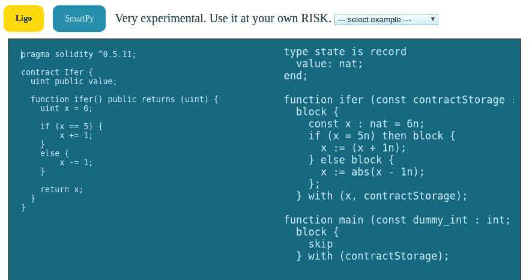

# Ligo transpiler 的可靠性

> 原文：<https://medium.com/coinmonks/solidity-to-ligo-transpiler-981ac35a7297?source=collection_archive---------5----------------------->

你好！我们是 Madfish Solutions 的团队，我们获得了 Tezos 基金会的拨款，用于创建[Solidity](https://github.com/ethereum/solidity)to[LIGO](https://ligolang.org/)trans piler。

我们的项目旨在帮助开发者将智能合约从以太坊生态系统过渡到 Tezos。我们对此感到非常兴奋，所以我们想介绍一下自己，并告诉你更多关于我们的项目和目标！

## 这一切都始于黑客马拉松

2019 年， [Tezos Ukraine](https://tezos.org.ua/) 在基辅组织了一次黑客马拉松，为 Tezos 生态系统开发项目。我们有很多想法，但经过短暂的评估后，我们决定做一个从 Solidity 到 Tezos 的 transpiler。Transpiler 是一个从一种编程语言翻译成另一种具有相似抽象层次的语言的程序。Tezos 生态系统当时还处于青春期，所以考虑到黑客马拉松的时间紧迫，我们的选择有限。在 48 小时内完成至少基本的语言转换似乎是可行的，如果成功，价值将是巨大的。我们成功了！由于我们团队的工程师以前有过编译爱好的经验，我们很快实现了一个小的 transpiler，并将一个自定义令牌的最小示例从 Solidity 转换到 Ligo，并能够在舞台上展示所取得的结果。

评委们很喜欢我们的想法，所以我们拿了第一名！他们非常喜欢我们的想法，所以 Tezos 慷慨地给了我们一笔资金来进一步发展这个想法。

## 关于我们的项目

现在我们有黑客马拉松版和在线版。我们对它进行了清理和重构，以便于扩展和维护。它能够将简单的表达式和语句从 Solidity 转换为 PascalLIGO。我们的目标是让它编译从以太坊、创区块链到 Ligo 的最流行、最广泛使用的智能合约。这并不容易，因为 Solidity 是一种面向对象的语言，而 LIGO 是严格的函数式语言。这两种范式是相当不同的，有些建筑在 LIGO 是不存在的，但我们希望通过其他强大的 LIGO 特色来弥补这一点，所以大部分的坚固性可以被转换或模仿。我们的目标是获得愉快的开发体验，尽可能保持整体逻辑的合理性和正确性。

## 我们的目标

*   一个有效的 CLI 实用程序，能够将 Solidity 代码从版本 0.4 升级到最新版本。
*   可以编译并部署到 Tezos 网络的 LIGO 输出
*   结果代码是可读的和可维护的(或者至少应该有一个标志，可读性比正确性更重要)
*   建筑的工作方式与它们过去在 Solidity 中的工作方式相同
*   一套确保翻译正确性的测试
*   一个网络版本，就像我们的黑客马拉松项目一样

## 未来计划

*   识别有问题和不安全的部分，并警告用户
*   检测并兼容现有的 Tezos 和 Ligo 令牌标准(FN1.2，NFT)
*   考虑支持其他方言，比如 ReasonLIGO

## 工具

我们使用 CoffeeScript 作为我们的首选语言。我们的团队成员 Sergey 已经编写了其他 transpilers，所以我们使用他名为`ast4gen`的库作为我们应用程序的基础。为了测试，我们使用来自 Solidity devkit 的`truffle`和`ganache`，以及用于 LIGO 和 Tezos 测试目的的`taquito`和`granary`。

## 仔细讨论

这些地方将继续发展

[sol2ligo](https://github.com/madfish-solutions/sol2ligo) —包含所有代码的主回购

我们的 Wiki——目前大部分是内部的，但是可能包含关于翻译过程和它的怪癖的信息

eth2tez_online —一个旧游乐场，有黑客马拉松版本的 transpiler

Web version of our transpiler Hackathon Edition

## 团队

我们区块链的开发者在不同的领域有不同的经验:全栈网络，游戏开发，硬件，等等。

谢尔盖·格鲁什科夫斯基

ksta si——Anastasia Kondaurova

朱利安·孔丘纳斯(你真诚的)

> [直接在您的收件箱中获得最佳软件交易](https://coincodecap.com/?utm_source=coinmonks)

