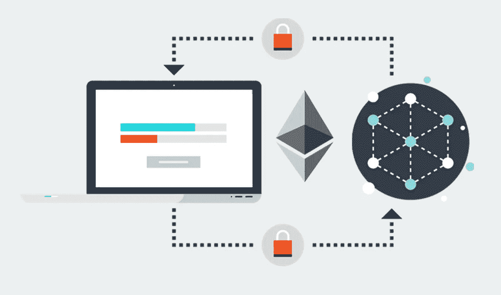

# 可靠性:事务排序攻击

> 原文：<https://medium.com/coinmonks/solidity-transaction-ordering-attacks-1193a014884e?source=collection_archive---------0----------------------->



本文将解释**以太坊智能合约**中的一种攻击载体，称为**交易订购/前置运行攻击**。

**为什么？**

*   创建安全智能合同的最佳实践
*   识别常见的攻击
*   确保资金不会因编程错误而损失


**交易订购攻击**

*   事务排序攻击是一种竞争条件攻击
*   简而言之，如果你以广告价格购买一件商品，你会支付这个价格
*   交易订购攻击会在交易过程中改变价格，因为在交易完成之前，其他人(合同所有者、矿工或其他用户)已经发送了修改价格的交易
*   两个事务可以发送到 mempool/tx-pool，它们到达的顺序无关紧要
*   在这种情况下，与交易一起发送的气体是至关重要的，因为它决定了先开采哪个交易
*   攻击者也可以是挖掘者，因为挖掘者可以选择挖掘事务的顺序
*   这在智能合约中产生了一个问题，智能合约依赖于存储变量的状态根据交易的顺序保持在某个值


**合同**

*   下面的合同将作为中介，以一定的价格提供数字资产
*   价格记录在存储变量`uint256 price`中
*   合同的所有者可以通过调用`setPrice(uint256 _price)`函数来更改价格

```
pragma solidity ^0.4.18;

contract TransactionOrdering {
    uint256 price;
    address owner;

    event Purchase(address _buyer, uint256 _price);
    event PriceChange(address _owner, uint256 _price);

    modifier ownerOnly() {
        require(msg.sender == owner);
        _;
    }

    function TransactionOrdering() {
        // constructor
        owner = msg.sender;
        price = 100;
    }

    function buy() returns (uint256) {
        Purchase(msg.sender, price);
        return price;
    }

    function setPrice(uint256 _price) ownerOnly() {
        price = _price;
        PriceChange(owner, price);
    }
}
```

合同部署在:0 xfd 3673 a4 FD 729 ee 501 cbac D4 AAC 97741 e 287d 318

> [直接在您的收件箱中获得最佳软件交易](https://coincodecap.com/?utm_source=coinmonks)

[](https://coincodecap.com/?utm_source=coinmonks)

**攻击场景:**

1.  数字资产的**购买者**将调用 **buy()** 函数，以存储变量中指定的价格设置购买，起始**价格=100** 。

2.**合同所有者**将调用 **setPrice()** 并将价格存储变量更新为 **price=150** 。

3.**合同所有者**将发送带有**更高天然气费用**的交易。

4.**合同所有者的**交易将首先被挖掘，由于较高的气费而更新合同的状态。

4.**买家**交易很快就会被挖掘，但是现在 **buy()** 函数将使用新更新的 **price=150** 。

**解决方案**

*   一种解决方案是使用交易计数器来“锁定”商定的价格

```
pragma solidity ^0.4.18;

contract SolutionTransactionOrdering {
  uint256 price;
  uint256 txCounter;
  address owner;

  event Purchase(address _buyer, uint256 _price);
  event PriceChange(address _owner, uint256 _price);

  modifier ownerOnly() {
    require(msg.sender == owner);
    _;
  }
  function getPrice() constant returns (uint256) {
    return price;
  }

  function getTxCounter() constant returns (uint256) {
    return txCounter;
  }

  function SolutionTransactionOrdering() {
    // constructor
    owner = msg.sender;
    price = 100;
    txCounter = 0;
  }

  function buy(uint256 _txCounter) returns (uint256) {
    require(_txCounter == txCounter);
    Purchase(msg.sender, price);
    return price;
  }

  function setPrice(uint256 _price) ownerOnly() {
    price = _price;
    txCounter += 1;
    PriceChange(owner, price);
  }
}
```

1.  买方现在请求以发送交易时显示的价格购买。
2.  这是通过买方发送一个反映 txCounter ( `function buy(uint256 _txCounter)`)当前状态的整数来实现的

3.当**合同所有者更新价格**时，txCounter 递增(`function setPrice(uint256 _price) ownerOnly() {... txCounter += 1}`

4.现在，在交易排序攻击的场景中，如果买方的 txCounter 整数与合同中的当前状态不同，则买方的交易将被恢复

5.这意味着价格在买方交易过程中已经改变，因此不会被接受

合同部署在:0x 1 abfe 2 f 12447 e 877 CB 1 bfe 91 a4 e 7 eed 0251 B4 d 56

**结论**

*   事务排序攻击是一种常见的攻击媒介
*   智能合约本质上是异步的，因为我们在发送事务和挖掘时间之间存在时间差
*   所有交易都是不平等的，与交易相关的不同天然气水平将激励矿商优先考虑订单
*   如果一个契约提供了一个时间敏感的服务，状态应该根据事务的顺序被锁定

