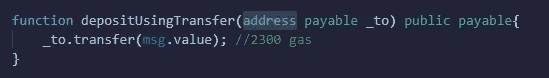
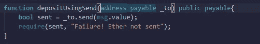
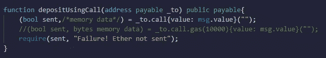

# 坚固性——传输、发送和呼叫功能

> 原文：<https://medium.com/coinmonks/solidity-transfer-vs-send-vs-call-function-64c92cfc878a?source=collection_archive---------0----------------------->


*中，一个人发以太有三种方式。即**传送()**，**发送()**和**调用()**。在本文中，让我们讨论每个函数调用是如何工作的，以及哪一个是最好的。*

## *转接 vs 发送 vs 通话*

1.  ****转移*** - >接收智能合约应该定义一个 ***回退*** 函数，否则转移调用会抛出**错误**。有 **2300 气**的气限，足够完成转移操作。它被硬编码以防止**重入攻击**。*

**

*transfer() function*

*2. ***发送*** - >它的工作方式与转移呼叫类似，也具有 **2300 气体**的气体限制。它将状态作为一个**布尔值**返回。*

**

*send() function*

*3. ***调用*** - >这是向智能合约发送 ETH 的推荐方式。空参数触发接收地址的 ***回退*** 功能。*

```
***(bool sent,memory data) = _to.call{value: msg.value}("");***
```

*使用 ***调用*** ，也可以触发合同中定义的其他 ***功能*** 并发送固定量的气体来执行该功能。交易状态作为一个**布尔值**发送，返回值在数据变量中发送。*

```
***(bool sent, bytes memory data) = _to.call{gas :10000, value: msg.value}("func_signature(uint256 args)");***
```

**

*call() function*

*希望这篇文章有助于理解**传递、发送**和**调用**的功能。*

*感谢阅读！*

> *加入 Coinmonks [电报频道](https://t.me/coincodecap)和 [Youtube 频道](https://www.youtube.com/c/coinmonks/videos)获取每日[加密新闻](http://coincodecap.com/)*

## *另外，阅读*

*   *[复制交易](/coinmonks/top-10-crypto-copy-trading-platforms-for-beginners-d0c37c7d698c) | [加密税务软件](/coinmonks/crypto-tax-software-ed4b4810e338)*
*   *[网格交易](https://coincodecap.com/grid-trading) | [加密硬件钱包](/coinmonks/the-best-cryptocurrency-hardware-wallets-of-2020-e28b1c124069)*
*   *[密码电报信号](http://Top 4 Telegram Channels for Crypto Traders) | [密码交易机器人](/coinmonks/crypto-trading-bot-c2ffce8acb2a)*
*   *[BlockFi vs 摄氏](/coinmonks/blockfi-vs-celsius-vs-hodlnaut-8a1cc8c26630) | [Hodlnaut 点评](/coinmonks/hodlnaut-review-best-way-to-hodl-is-to-earn-interest-on-your-bitcoin-6658a8c19edf) | [KuCoin 点评](https://coincodecap.com/kucoin-review)*
*   *[Bitsgap 审查](/coinmonks/bitsgap-review-a-crypto-trading-bot-that-makes-easy-money-a5d88a336df2) | [Quadency 审查](/coinmonks/quadency-review-a-crypto-trading-automation-platform-3068eaa374e1) | [Bitbns 审查](/coinmonks/bitbns-review-38256a07e161)*
*   *[密码本交易平台](/coinmonks/top-10-crypto-copy-trading-platforms-for-beginners-d0c37c7d698c) | [Coinmama 审核](/coinmonks/coinmama-review-ace5641bde6e)*
*   *[最佳加密交易所](/coinmonks/crypto-exchange-dd2f9d6f3769) | [最佳加密交易所](/coinmonks/bitcoin-exchange-in-india-7f1fe79715c9)*
*   *开发人员的最佳加密 API*
*   *最佳[密码借贷平台](/coinmonks/top-5-crypto-lending-platforms-in-2020-that-you-need-to-know-a1b675cec3fa)*
*   *杠杆代币的终极指南*