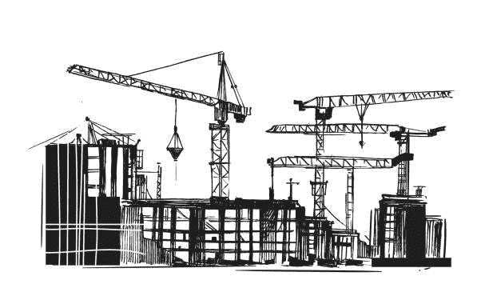

# 坚固性教程:关于构造函数的所有内容

> 原文：<https://medium.com/coinmonks/solidity-tutorial-all-about-constructors-46a10610336?source=collection_archive---------2----------------------->

本文涵盖了**构造函数，Solidity 中的一个函数，当契约被部署到以太网上时，**只运行一次。

# 目录

## **简介**

## **如何定义一个构造函数**

## **公共 vs 内部构造函数**