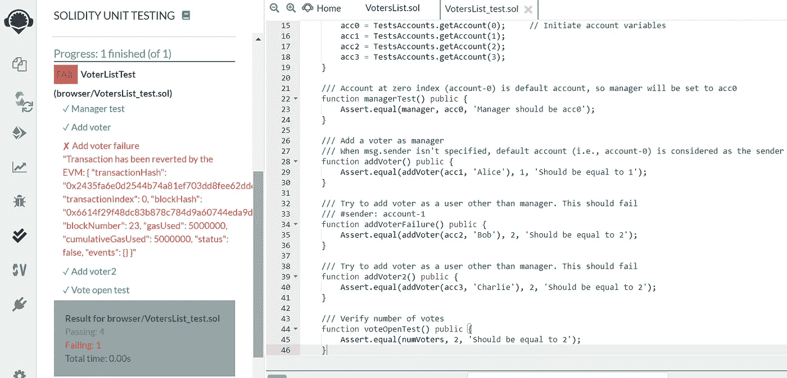

# 用 Remix IDE 进行可靠性单元测试——一些缺失的部分

> 原文：<https://medium.com/coinmonks/solidity-unit-testing-with-remix-ide-a-few-missing-pieces-6677786735d4?source=collection_archive---------1----------------------->

昨天，我嘲笑了自己，试图为我准备的实验室作业对 Solidity smart control 进行单元测试。经过几个小时的努力，我终于找到了。我的问题是由多种原因造成的，例如智能合同的编写方式，没有阅读 Remix 指南上的次要细节，以及缺乏关于如何将示例应用于更一般情况的解释。虽然我已经用几种语言编写并测试了适当大小的程序，但我还没有广泛使用测试套件。以下是我经验的反映，希望它能给你使用 [Remix IDE](https://remix.ethereum.org/) 的单元测试项目一点启示。

我测试了一个投票智能契约，它具有以下属性:

*   没有 getter 函数——我依赖编译器为公共变量生成 getter 函数。这些在单元测试代码中是不可访问的，因为“remix-test”拒绝运行，说没有这样的功能
*   自定义事务上下文——依靠`msg.sender`和`modifier`来确定谁可以做什么。没有马上意识到`msg.sender`只能在继承契约中设定
*   在我的契约中，并不是每个 in 函数都返回值，所以很难知道某个函数是否工作
*   我用相应的变量如`acc1`曲解了账户标签如`account-1`
*   `try-catch`在继承的测试契约中不起作用，如果你的调用函数依赖于`msg.sender`
*   没有办法知道在失败的情况下返回了什么。与其他一些测试套件相比，没有显示接收到的值

以下是我的[智能合约](https://blog.coincodecap.com/tag/smart-contact/)的摘录，用来跟踪可以对某件事投票的账户列表:

```
pragma solidity ^0.6.0;contract VotersList{

    struct Voter {
        string name;
        bool voted;
    }
    mapping(address => Voter) public voters;  //List of voters
    uint public numVoters = 0;
    address public manager; //Manager of voting contract constructor () public {
        manager = msg.sender;  //Set contract creator as manager
    } //Add new voter
    function addVoter(address voterAddress, string memory name) public restricted returns (uint){
        Voter memory v;
        v.name = name;
        v.voted = false;
        voters[voterAddress] = v;
        numVoters++;
        return numVoters;
    }

    modifier restricted() { //Only manager can do
        require (msg.sender == manager);
        _;
    }
}
```

因为我想测试只有经理可以调用`addVoter`函数，所以我必须使用定制的事务上下文。然而，过了一段时间才意识到`msg.sender`只能在继承契约中设置。或者，我不得不使用继承，因为没有明确定义的 getter 函数来测试行为。然而，这也意味着`try-catch`不能用来获得关于失败的一点细节。以下是相应的测试合同:

```
pragma solidity >=0.4.22 <0.7.0;
import "remix_tests.sol"; // this import is automatically injected by Remix.
import "./VotersList.sol";
import "remix_accounts.sol"; //Use accounts defined here for testing// File name has to end with '_test.sol', this file can contain more than one testSuite contracts
contract VoterListTest is VotersList {
    address acc0;   //Variables used to emulate different accounts  
    address acc1;
    address acc2;
    address acc3;/// 'beforeAll' runs before all other tests
    function beforeAll() public {
        acc0 = TestsAccounts.getAccount(0); //Initiate acc variables
        acc1 = TestsAccounts.getAccount(1);
        acc2 = TestsAccounts.getAccount(2);
        acc3 = TestsAccounts.getAccount(3);
    }

    /// Account at index zero (account-0) is default account, so manager will be set to acc0
    function managerTest() public {
        Assert.equal(manager, acc0, 'Manager should be acc0');
    }

    /// Add a voter as manager
    /// When msg.sender isn't specified, default account (i.e., account-0) is considered as the sender
    function addVoter() public {
        Assert.equal(addVoter(acc1, 'Alice'), 1, 'Should be equal to 1');
    }

    /// Try to add voter as a user other than manager. This should fail
    /// #sender: account-1
    function addVoterFailure() public {
        Assert.equal(addVoter(acc2, 'Bob'), 2, 'Should be equal to 2');    
    }

    /// Try to add voter as manager again
    function addVoter2() public {
        Assert.equal(addVoter(acc3, 'Charlie'), 2, 'Should be equal to 2');    
    }

    /// Verify number of votes
    function voteOpenTest() public {
        Assert.equal(numVoters, 2, 'Should be equal to 2');
    }
}
```

上述代码中需要注意的一些附加内容是:

*   `account-1`是用于设置`msg.sender`的账户标签，`acc0`是变量。`TestsAccounts.getAccount(0)`也可以直接使用
*   指数为零的账户(即`account-0`)为默认账户。如果没有设置`#sender:`，则采用默认账户
*   `addVoterFailure`测试用例将失败，因为我们不能使用`try-catch`。然而，一点细节仍然会出现在 Remix 上。问题是我应该调用`try this.addVoter(acc2, ‘Bob')`，因为`try-catch`只对外部函数起作用。但是，这会将上下文更改为`this`合同，而忽略`#sender: account-1`。这种情况可以用非继承单元测试来测试

以下是单元测试的结果，代码可以从我的 [GitHub](https://github.com/dilumb/smart_contracts) 中找到:

[](https://coincodecap.com)

> [直接在您的收件箱中获得最佳软件交易](https://coincodecap.com/?utm_source=coinmonks)

[](https://coincodecap.com/?utm_source=coinmonks)