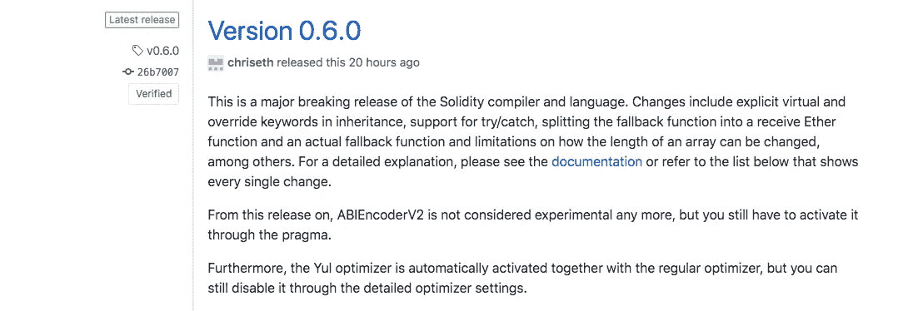

# Solidity v0.6.0 来了！你应该知道的事情

> 原文：<https://medium.com/coinmonks/solidity-v0-6-0-is-here-things-you-should-know-7d4ab5bca5f1?source=collection_archive---------1----------------------->

Solidity 已经发布了 Solidity 编译器和语言的主要突破性版本，即 v0.6.0。



作为智能合约开发者和区块链爱好者，人们应该了解它们，因为它将改变我们开发智能合约的方式。这些变化基本上是受现有语言的启发而引入的，目的是让事情变得更清晰，对开发人员更友好。我在这里列举了一些例子:

# 遗产

**虚拟&覆盖关键字**

可以通过将基本函数标记为“虚拟”来覆盖它们。覆盖函数必须在函数头中使用“override”关键字。对于多重继承，您必须指定定义相同功能且尚未被另一个基础协定覆盖的所有基础协定。

```
**pragma solidity** >=0.5.0 <0.7.0;

**contract** Base1
{
    **function** foo() virtual **public** {}
}

**contract** Base2
{
    **function** foo() virtual **public** {}
}

**contract** Inherited **is** Base1, Base2
{
    *// Derives from multiple bases defining foo(), so we must explicitly*
    *// override it*
    **function** foo() **public** override(Base1, Base2) {}
}
```

**抽象合同**

当合同中至少有一项功能没有实现时，需要将合同标记为"抽象的"。如果协定从抽象协定继承，并且没有通过重写实现所有未实现的功能，则也需要将其标记为抽象。即使实现了所有的功能，契约也可能被标记为抽象的。

```
**pragma solidity** ^0.6.0;**abstract** **contract** Feline {**function** utterance() **public** virtual **returns** (bytes32);}**contract** Cat **is** Feline {**function** utterance() **public** override **returns** (bytes32) { 
   **return** "miaow"; 
}}
```

# 排列

**。长度构件**

对阵列长度的成员访问现在始终是只读的，即使对于存储阵列也是如此。不再可能通过为存储阵列的长度指定新值来调整其大小。

```
Array.length = 5 // Incorrect
Array.length++ // Incorrectarray.push() // Correct
array.push(value) // Correct
```

**数组切片**

阵列切片是阵列连续部分的视图。它们被写成“x[start:end]”,其中 start 和 end 是产生 uint256 类型(或可隐式转换为 uint 256 类型)的表达式。切片的第一个元素是 x[start]，最后一个元素是 x[end - 1]。

如果 start 大于 end，或者 end 大于数组的长度，则会引发异常。

start 和 end 都是可选的:start 默认为 0，end 默认为数组的长度。

*到目前为止，数组切片只针对 calldata 数组实现。*

```
*/// Forward call to "setOwner(address)" that is implemented by client*
    */// after doing basic validation on the address argument.*
    **function** forward(bytes calldata _payload) **external** {
        bytes4 sig = abi.decode(_payload[:4], (bytes4));
        **if** (sig == bytes4(keccak256("setOwner(address)"))) {
            address owner = abi.decode(_payload[4:], (address));
            require(owner != address(0), "Address of owner cannot be zero.");
        }
        (bool status,) = client.delegatecall(_payload);
        require(status, "Forwarded call failed.");
    }
```

# 撤退

传统分为使用 fallback 关键字定义的新 fallback 函数和使用 receive 关键字定义的 receive ether 函数。这两个函数不能有参数，不能返回任何内容，并且必须具有外部可见性

**接收乙醚功能**

它在普通以太网传输上执行(例如通过。发送()或。transfer())。如果不存在这样的函数，但是存在应付回退函数，则回退函数将在普通以太网传输中被调用。如果 receive Ether 和 payable fallback 函数都不存在，则协定无法通过常规事务接收 Ether 并引发异常。

**回退功能**

如果没有其他函数与给定的函数签名匹配，或者如果根本没有提供数据，并且没有 receive Ether 函数，则在调用协定时执行该函数。回退函数总是接收数据，但是为了也接收数据，它必须被标记为 payable。

```
**pragma solidity** ^0.6.0;

**contract** Test {
    *// This function is called for all messages sent to*
    *// this contract (there is no other function).*
    *// Sending Ether to this contract will cause an exception,*
    *// because the fallback function does not have the `payable`*
    *// modifier.*
    fallback() **external** { x = 1; }
    uint x;
}

**contract** TestPayable {
    *// This function is called for all messages sent to*
    *// this contract, except plain Ether transfers*
    *// (there is no other function except the receive function).*
    *// Any call with non-empty calldata to this contract will execute*
    *// the fallback function (even if Ether is sent along with the call).*
    fallback() **external** **payable** { x = 1; y = msg.value; }

    *// This function is called for plain Ether transfers, i.e.*
    *// for every call with empty calldata.*
    receive() **external** **payable** { x = 2; y = msg.value; }
    uint x;
    uint y;
}
```

# 异常处理

**试/抓**

Solidity 现在支持 try/catch-statement 形式的异常处理，但只支持外部函数调用和契约创建调用。表达式内部的错误不会被捕获，只会在外部调用本身内部发生恢复。目前对该特性的支持非常有限且有条件。更多详情，见[本文档](https://solidity.readthedocs.io/en/latest/control-structures.html#try-catch)。

```
**pragma solidity** ^0.6.0;

**interface** DataFeed { **function** getData(address token) **external** **returns** (uint value); }

**contract** FeedConsumer {
    DataFeed feed;
    uint errorCount;
    **function** rate(address token) **public** **returns** (uint value, bool success) {
        *// Permanently disable the mechanism if there are*
        *// more than 10 errors.*
        require(errorCount < 10);
        try feed.getData(token) **returns** (uint v) {
            **return** (v, **true**);
        } catch Error(string **memory** */*reason*/*) {
            *// This is executed in case*
            *// revert was called inside getData*
            *// and a reason string was provided.*
            errorCount++;
            **return** (0, **false**);
        } catch (bytes **memory** */*lowLevelData*/*) {
            *// This is executed in case revert() was used*
            *// or there was a failing assertion, division*
            *// by zero, etc. inside getData.*
            errorCount++;
            **return** (0, **false**);
        }
    }
}
```

# 文件级声明

“struct”和“enum”类型现在可以在文件级声明。

```
pragma solidity ^0.6.0;enum Status {Added, Removed}struct Employee {
    uint256 id;
    string name;
    Status s;
}contract NameRegister {
    mapping(uint256 => Employee) public nameReg;

    function add(uint256 id, string memory name) public {
        nameReg[id] = Employee(id, name, Status.Added);
    }
}contract SalaryRegister {
    mapping(uint256 => Employee) public salaryReg;

    function add(uint256 id, string memory name) public {
        salaryReg[id] = Employee(id, name, Status.Added);
    }
}
```

**参考文献:**

完整的变更日志:[https://github.com/ethereum/solidity/releases/tag/v0.6.0](https://github.com/ethereum/solidity/releases/tag/v0.6.0)

对于所有重大变更的文档:[https://solidity . readthedocs . io/en/latest/060-breaking-changes . html](https://solidity.readthedocs.io/en/latest/060-breaking-changes.html)

> [直接在您的收件箱中获得最佳软件交易](https://coincodecap.com/?utm_source=coinmonks)

[](https://coincodecap.com/?utm_source=coinmonks)[](https://coincodecap.com)