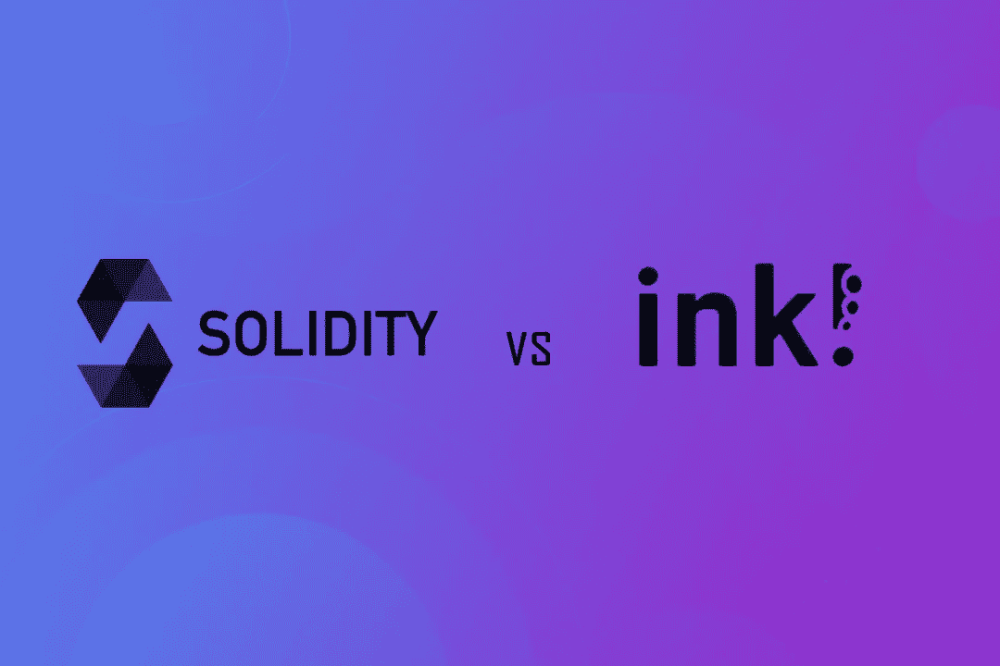

# 扎实 vs 墨迹！撰写智能合同

> 原文：<https://medium.com/coinmonks/solidity-vs-ink-for-writing-smart-contracts-8cd31093dd10?source=collection_archive---------2----------------------->

涵盖撰写智能合同时两者的差异和优势，以及对 ink 的深入解释！以及如何脱颖而出。

**这是一份** [**Edgeware 出版物**](https://edgeware.ghost.io/ghost/#/site) **:更多 Edgeware 相关新闻和信息，请在 Twitter 上关注我们，并查看我们的** [**网站**](https://edgewa.re/) **。卷入** [**电报**](https://t.me/heyedgeware)**[**不和**](https://discord.gg/tJpnAkSv) **！****

## **什么是智能合同？**