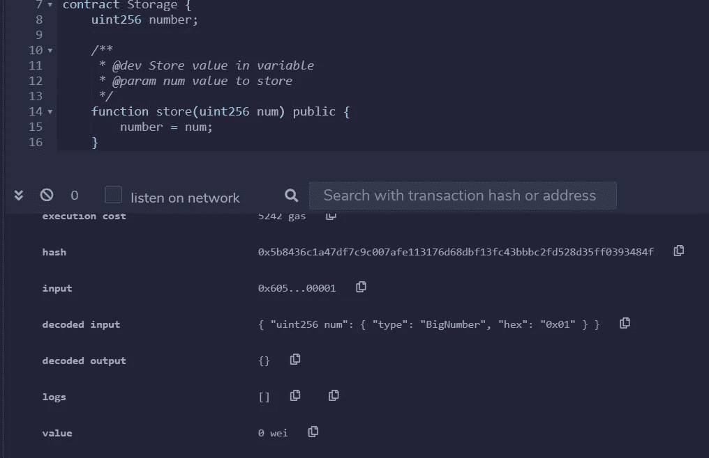
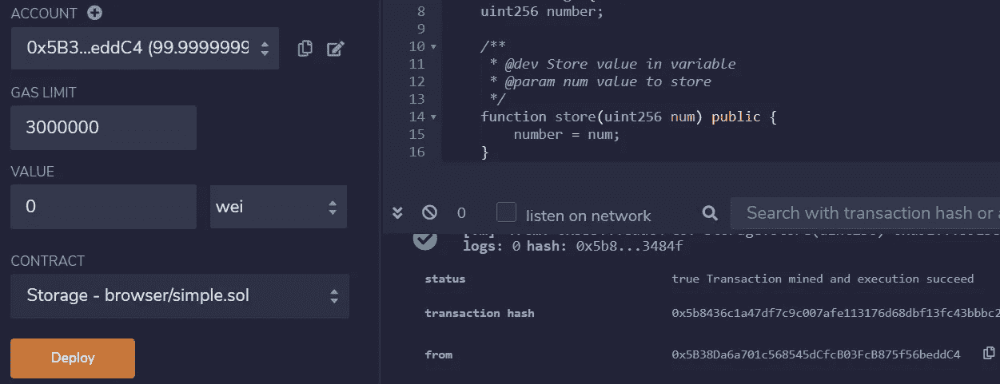
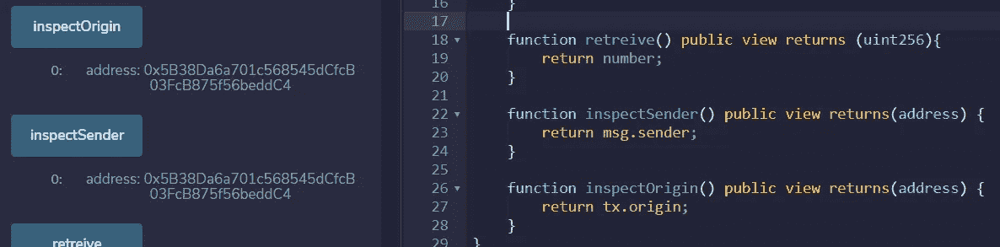
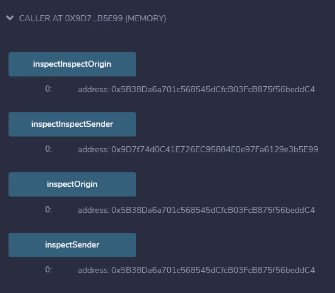

# 谁是 msg.sender？

> 原文：<https://medium.com/coinmonks/solidity-who-the-heck-is-msg-sender-de68d3e98454?source=collection_archive---------0----------------------->

这里我们将简要讨论`msg.sender`机制是如何工作的。像往常一样，我们将试验一些你可以在浏览器中运行的小块 Solidity

区块链的核心是向块链添加事务块的机制:这是由矿工执行的保持以太坊虚拟机(EVM)状态一致的工作；矿工们竞相向区块追加交易。

EVM 的状态是块中收集的所有交易的执行效果:在某种程度上，以太坊(以及一般的区块链)是一个*分布式日志文件*，它收集智能合约执行的操作的结果。另一种方法是将区块链视为一个全球共享的事务数据库。

智能契约上的操作是由一个简单的机制触发的，该机制将 gas 发送到一个地址，如果该地址是一个智能契约，它将产生一个方法调用，该方法的名称在事务有效负载中被散列。下面是如何使用参数 1 调用智能契约上的方法`store(uint256)`的示例:

The method store(uint256) and its invocation with parameter 1, notice the input and decoded input

在包含方法调用的事务中，真正发生的是方法签名，`store(uint256)`用 [keccak256](https://en.wikipedia.org/wiki/SHA-3) 散列，前 4 个字节与参数打包在一起；这个字节序列是上面事务中输入字段的内容。更复杂的参数(如字符串、数组等..)以一种合理的方式打包，方法是将它们序列化并与函数 hash 连接在一起。

深入的分析可以在[这里](/linum-labs/a-technical-primer-on-using-encoded-function-calls-50e2b9939223)找到，但是，为了本文的清晰起见，这种打包的意义是有一个函数名和所有参数的紧凑表示，这是你在 [Remix](https://remix.ethereum.org/) 中的事务的输入字段中找到的，你也可以在检查器中找到它的解码。

# 交易的发送方

在每个交易的字段中，在 Remix 中，您可能会注意到交易的原始帐户来自哪个字段。在 Remix 中，很容易注意到这个字段的内容与左边的字段 Account 完全匹配(见下图)

As you may expect the account on the left matches the field from in the transaction receipt

这种机制非常简单，但是在以太坊规范中，有两种不同的功能可供交易发送者访问:`msg.sender`和`tx.origin`。几个简单的函数允许您检查两个函数是否返回完全相同的值。

inspectOrigin and inspectSender return the same value: the account used to call them

他们是多余的吗？完全不是，有区别，可以在小节中强调。

# 一个简单的智能合同来显示差异

两者的区别在于，`msg.sender`包含发起呼叫的地址，而`tx.origin`包含交易的发起者。为了阐明这两个变量的工作方式，你可以使用下面这段代码，准备好在 Remix 中进行测试。

该源代码包含两个不同的契约，一个名为`Storage`，另一个名为`Caller`，包含字段`StorageObject`中的`Storage`实例。

`Storage`的实例是在`Caller`的构造函数中创建的(第 28 行)。

两个契约包含相同的函数，这些函数将返回`msg.sender`的内容和`tx.origin`的内容。但是真正能说明区别的是两个方法(第 34 和 42 行):它们将从`Storage`实例的角度返回`msg.sender`和`tx.origin`的内容。

像往常一样，这个测试比描述它的文字更能说明问题:

你在这里可以看到:`tx.origin`在两个契约中包含相同的值，带有函数`inspectOrigin`的存储和带有函数`inspectInspectOrigin`的`Caller`，因为对于两者来说，调用的发起者都是账户`0x5B38...C4`。您可能会注意到`inspectSender`和`inspectInspectSender`结果的不同，它们都返回`msg.sender`，但是分别对于`Caller`和`Storage`来说，结果是不同的，正如所料。对于`Caller`,`msg.sender`(功能`inspectSender`)同样是账户`0x5B38...C4`，而对于智能合约`Storage`是地址`0x9d7f...99`，其中*是智能合约* `Caller`的地址。

文档(你可以在这里找到它)很简单，但是检查在引擎盖下到底发生了什么总是很有趣。

> 加入 T21 电报集团，学习加密交易和投资

## 另外，阅读

*   最好的[密码交易机器人](/coinmonks/crypto-trading-bot-c2ffce8acb2a)
*   [印度比特币交易所](/coinmonks/bitcoin-exchange-in-india-7f1fe79715c9)
*   [比特币储蓄账户](/coinmonks/bitcoin-savings-account-e65b13f92451)
*   最好的[加密税务软件](/coinmonks/best-crypto-tax-tool-for-my-money-72d4b430816b)
*   [电网交易](https://blog.coincodecap.com/grid-trading) | [区块链审核](/coinmonks/blockfi-review-53096053c097)
*   [最佳加密交易所](/coinmonks/crypto-exchange-dd2f9d6f3769)