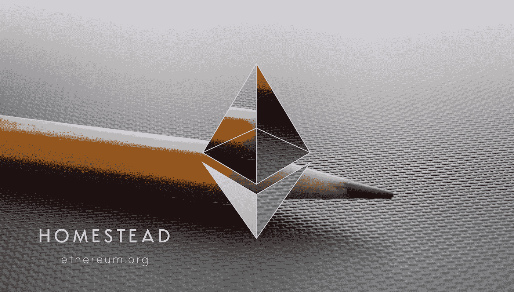

# 从以太坊提取数据的解决方案

> 原文：<https://medium.com/coinmonks/solution-to-extract-data-from-ethereum-52d0b8007d1b?source=collection_archive---------3----------------------->

Source: Ethereum.org

**以太坊**简单好玩，但也比较新。今天的开发人员解决方案正处于初期阶段——因此，它是新的、酷的，但也有点痛苦。以以太坊区块链的数据提取为例。我一直在关注以分散方式访问智能合同数据的解决方案。在本文中，我还包括集中式数据查询公司和集中式分析仪表板。

以太坊始于 2013 年，成为开发和运行智能合约的事实标准。数据要么是以太、ERC-20(想想所有的[ico](https://icodrops.com))中的价值转移，要么是不可替代的加密收藏品代币(NFT，例如[中的数字小猫 **CryptoKitties**](https://www.cryptokitties.co/) ，在[中的虚拟土地财产**分散土地**](https://decentraland.org/) )或定制智能合约调用。[**DApps 的状态**](https://www.stateofthedapps.com/rankings) 正在以太坊上统计 1822 个 DApps。另一个很好的资源是 [**DAppRadar**](https://dappradar.com/dapps) 。

如果你想从已经部署的智能合同中提取数据——或者在部署之后——你可以**购买类似于 Google Analytics 或 MixPanel 的监控和分析工具**。然而，还没有确定的玩家。监控和分析只是两个使用案例，数据的更多使用案例在列表之后。既然**去中心化和开源齐头并进**，我就从它开始:

## 开源:

*   [**EthQL**](https://github.com/ConsenSys/ethql):ConsenSys 项目，GraphQL 端点到公共以太坊总账。
*   [**QuickBlocks**](https://github.com/Great-Hill-Corporation/quickBlocks) :检索以太坊数据的工具集合。
*   [**EthSlurp**](http://ethslurp.com/) :将特定地址或智能合约的 TXs 提取为 CSV 或文本文件。
*   [**e events**](https://github.com/brainbot-com/ethevents):索引交易，事件成 ElasticSearch， [talk](https://www.youtube.com/watch?v=zoNlF4MfHVg) 。
*   [**昆德拉**](https://github.com/Impetus/Kundera) : JPA 从节点提取数据，并摄取到各种汇点。
*   [**Presto-以太坊**](https://github.com/xiaoyao1991/presto-ethereum) :以太坊客户端的 Presto 连接器。
*   [**图**](https://www.thegraph.com/) :区块链数据的分散可扩展查询(ICO 阶段)。
*   [**智能合约手表**](https://github.com/Neufund/smart-contract-watch) :智能合约监控工具。
*   [**Eventeum**](https://github.com/ConsenSys/eventeum) :事件——以太坊与微服务之间的桥梁。
*   [**Seth**](https://github.com/dapphub/dapptools/tree/master/src/seth) :命令行的元掩码。

## 数据查询公司:

*   [**Alethio**](https://aleth.io):ConsenSys backed，致力于数据的语义提升， [talk](https://www.youtube.com/watch?v=KzfEDNuNFi8&t=21s) 。
*   [**链分析**](https://www.chainalysis.com/) :交易所和政府的 KYC 和反洗钱服务。
*   [**扎皮尔**](https://zapier.com/apps/dagger-for-ethereum/integrations) :以太坊融入扎皮尔。

## 分析仪表板:

*   [**Bloxy**](https://bloxy.info/analytics) :以太坊的分析仪表盘。
*   [**以太扫描**](https://etherscan.io/) :以太坊事实上的标准块浏览器。
*   [**Amberdata**](https://amberdata.io/):ERC-20 代币分析，[通话](https://www.youtube.com/watch?v=IhugJ__ickM)。
*   [**token analyst**](https://www.tokenanalyst.io/):ERC-20 token 和 ico 的分析， [talk](https://www.youtube.com/watch?v=JopYHeEetC8) 。
*   CryptoKitties 的创造者 Axiom Zen 为智能合约设计的 Mixpanel。
*   [**Supermax**](https://supermax.cool/) :又一个智能合约仪表盘。
*   [**Blockspur**](https://blockspur.com/) :又一个智能合约仪表盘。
*   [**琐碎的**](https://trivial.co/) :又一个智能合约仪表盘。

## 使用案例:

以下是获取数据的五个用例:

1.  **提供透明性**和问责制，以管理例如道组织或公司，例如**。**
2.  ****智能合同的自动纳税申报****
3.  ****智能合同监控**例如，在发生异常时获得通知**
4.  ****智能合同报告**，例如网站报告、销售报告**
5.  ****审计支持**，例如[**ico**](https://www.investopedia.com/terms/i/initial-coin-offering-ico.asp)(令牌持有者的分配)。**

## **错过了吗？**

**本文应作为智能合同分析和监控领域解决方案的资源列表。请让我知道，如果我错过了一个，或重要的参考资料。如果有你知道的工具。**

> **[直接在您的收件箱中获得最佳软件交易](https://coincodecap.com/?utm_source=coinmonks)**

****