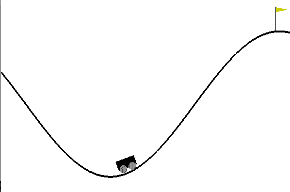
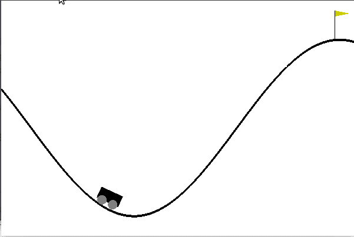

# 用 Python 中的 OpenAI Gym，Keras，TensorFlow 解决登山车奖励问题的奇案

> 原文：<https://medium.com/coinmonks/solving-curious-case-of-mountaincar-reward-problem-using-openai-gym-keras-tensorflow-in-python-d031c471b346?source=collection_archive---------3----------------------->



这篇文章将帮助你使用 OpenAI Gym 和 TensorFlow 为 MountainCar 等回报较少的游戏编写游戏机器人。

一旦我建立了一个玩钢管舞游戏的模型，我觉得很有信心，并认为让我们为另一个游戏编写代码，并发现登山车游戏很有趣，然后我想为什么不为它编写代码。

一旦我开始写作，我就意识到这不是一件容易的事情。最大的问题是它总是给出一个负的奖励，无论我采取什么随机行动都无关紧要，我最终得到了总分 **-200** ，并最终输掉了比赛。我检查了不同的文章，尝试了不同的方法，但没有找到正确的答案。

在看了这么多地方之后，我意识到与其依赖游戏给出的奖励，为什么不根据具体情况自己创造一个呢？这解决了我的问题。我想和每个人分享，这样就没有人会经历我所经历的痛苦。

不要浪费太多时间，让我们开始编码吧。如果你是第一次尝试 OpenAI 健身房，请在这里阅读我的[以前的文章](/@ashok.tankala/build-your-first-ai-game-bot-using-openai-gym-keras-tensorflow-in-python-50a4d4296687)。

首先，让我们导入实现它所需的包

```
import gym
import random
import numpy as np
from keras.models     import Sequential
from keras.layers     import Dense
from keras.optimizers import Adam
```

让我们创建环境并初始化变量

```
env = gym.make('MountainCar-v0')
env.reset()
goal_steps = 200
score_requirement = -198
intial_games = 10000
```

在我们开始写代码之前，让我们先了解一下我们将要进入的内容

```
def play_a_random_game_first():
    for step_index in range(goal_steps):
        env.render()
        action = env.action_space.sample()
        observation, reward, done, info = env.step(action)
        print("Step {}:".format(step_index))
        print("action: {}".format(action))
        print("observation: {}".format(observation))
        print("reward: {}".format(reward))
        print("done: {}".format(done))
        print("info: {}".format(info))
        if done:
            break
    env.reset()
```

如果执行这段代码，您将得到如下输出

```
Step 0:
action: 0
observation: [-0.55321127 -0.00078406]
reward: -1.0
done: False
info: {}
Step 1:
action: 1
observation: [-0.55377353 -0.00056225]
reward: -1.0
done: False
info: {}
...
Step 198:
action: 0
observation: [-0.40182971  0.01383677]
reward: -1.0
done: False
info: {}
Step 199:
action: 1
observation: [-0.38888603  0.01294368]
reward: -1.0
done: True
info: {}
```

根据文档"-1，每个时间步长，直到达到 0.5 的目标位置。和 MountainCarContinuous v0 一样，爬左边的山是没有惩罚的，到达左边的山就像一堵墙。”

当您到达 0.5(顶部)位置时，或者达到 200 次迭代时，剧集结束。我玩了 10000 次几次，但从来没有达到最高位置。所以在数据填充的时候，我改了一个小逻辑终于给了我解决方案。

数据填充的代码是

关键部分在于上面的代码，让我们逐行理解，我将解释帮助我解决这个问题的调整。

1.  我们初始化了 training_data 和 accepted_scores 数组。
2.  我们需要玩多次，这样我们可以收集数据，我们可以进一步使用。因此，我们将播放 10000 次，以便获得大量数据。这一行表示“游戏索引在范围内(初始游戏):”
3.  我们初始化了 score、game_memory、previous_observation 变量，这些变量将存储当前游戏的总得分和前一步观察(指汽车的位置和速度)以及我们为此采取的行动。
4.  对于范围内的 step _ index(goal _ steps):—此代码将游戏进行 200 步，因为当您到达 0.5(顶部)位置时，或者如果达到 200 次迭代，则一集结束。
5.  我们需要采取随机行动，这样我们就可以玩游戏，这可能会导致成功完成该步骤或输掉游戏。这里只允许 3 个动作:向左推(0)，不推(1)和向右推(2)。所以这段代码(random.randrange(0，3))用于采取随机操作之一。
6.  我们将采取那个行动/步骤。然后，我们将检查它是否是第一个行动/步骤，然后我们将存储之前的观察和我们为此采取的行动。
7.  然后，我们将检查观察值为[0]的汽车的位置是否大于-0.2，如果是，那么我不接受我们的游戏环境给出的奖励，而是接受 1，因为-0.2 的位置是山顶，这意味着我们的随机行动产生了一些丰硕的成果。
8.  将奖励加到分数上，检查游戏是否完成，如果是，则停止游戏。
9.  我们将检查这个游戏是否满足我们的最低要求，这意味着我们是否能够得到大于或等于-198 的分数。
10.  如果我们能够得到大于或等于-198 的分数，那么我们将把这个分数添加到 accept_scores 中，我们进一步打印这个分数，以了解我们将多少游戏数据及其分数输入到我们的模型中。
11.  然后我们将对动作进行热编码，因为它的值 0(向左推)、1(不推)、2(向右推)代表分类数据。
12.  然后我们会将它添加到我们的训练数据中。
13.  我们将重置环境，以确保一切都清楚，开始玩下一个游戏。
14.  print(accepted_scores) —该代码用于了解我们向模型中输入了多少游戏数据及其分数。然后我们会返回训练数据。

我们将得到一些合理的游戏分数如下

```
[-158.0, -172.0, -188.0, -196.0, -168.0, -182.0, -180.0, -184.0, -184.0, -184.0, -168.0, -184.0, -176.0, -182.0, -182.0, -196.0, -184.0, -194.0, -178.0, -176.0, -170.0, -190.0, -182.0, -184.0, -184.0, -188.0, -184.0, -192.0, -172.0, -186.0, -174.0, -166.0, -188.0, -186.0, -174.0, -190.0, -178.0, -170.0, -164.0, -180.0, -184.0, -172.0, -168.0, -174.0, -172.0, -174.0, -186.0]
```

所以我们的数据准备好了。是时候建立我们的神经网络了。

```
def build_model(input_size, output_size):
    model = Sequential()
    model.add(Dense(128, input_dim=input_size, activation='relu'))
    model.add(Dense(52, activation='relu'))
    model.add(Dense(output_size, activation='linear'))
    model.compile(loss='mse', optimizer=Adam())return model
```

这里我们将使用序列模型。

```
def train_model(training_data):
    X = np.array([i[0] for i in training_data]).reshape(-1, len(training_data[0][0]))
    y = np.array([i[1] for i in training_data]).reshape(-1, len(training_data[0][1]))
    model = build_model(input_size=len(X[0]), output_size=len(y[0]))

    model.fit(X, y, epochs=5)
    return model
```

我们有训练数据，因此，我们将创建功能和标签。

然后我们将开始训练

```
trained_model = train_model(training_data)
```

我们将得到这样的输出

```
Epoch 1/5
9353/9353 [==============================] - 1s 90us/step - loss: 0.2262
Epoch 2/5
9353/9353 [==============================] - 1s 66us/step - loss: 0.2217
Epoch 3/5
9353/9353 [==============================] - 1s 65us/step - loss: 0.2209
Epoch 4/5
9353/9353 [==============================] - 1s 64us/step - loss: 0.2201
Epoch 5/5
9353/9353 [==============================] - 1s 61us/step - loss: 0.2199
```

是时候让我们的游戏机器人为我们玩游戏了。

```
scores = []
choices = []
for each_game in range(100):
    score = 0
    game_memory = []
    prev_obs = []
    for step_index in range(goal_steps):
        env.render()
        if len(prev_obs)==0:
            action = random.randrange(0,2)
        else:
            action = np.argmax(trained_model.predict(prev_obs.reshape(-1, len(prev_obs)))[0])

        choices.append(action)
        new_observation, reward, done, info = env.step(action)
        prev_obs = new_observation
        game_memory.append([new_observation, action])
        score += reward
        if done:
            breakenv.reset()
    scores.append(score)print(scores)
print('Average Score:',sum(scores)/len(scores))
print('choice 1:{}  choice 0:{} choice 2:{}'.format(choices.count(1)/len(choices),choices.count(0)/len(choices),choices.count(2)/len(choices)))
```

这里你可以看到我根本没碰奖励部分。但是我们的模型知道如果它做了什么动作，它将到达山顶，所以它自动执行良好。执行这段代码后，你会得到这样的分数

```
[-164.0, -92.0, -162.0, -107.0, -105.0, -93.0, -97.0, -90.0, -96.0, -170.0, -99.0, -200.0, -164.0, -91.0, -200.0, -92.0, -195.0, -166.0, -104.0, -93.0, -164.0, -200.0, -200.0, -164.0, -179.0, -176.0, -122.0, -101.0, -91.0, -162.0, -99.0, -164.0, -190.0, -199.0, -101.0, -200.0, -186.0, -185.0, -170.0, -128.0, -164.0, -164.0, -166.0, -101.0, -167.0, -89.0, -105.0, -168.0, -166.0, -100.0, -100.0, -91.0, -90.0, -163.0, -165.0, -167.0, -165.0, -105.0, -88.0, -134.0, -95.0, -90.0, -166.0, -166.0, -89.0, -167.0, -162.0, -165.0, -164.0, -171.0, -163.0, -127.0, -95.0, -159.0, -89.0, -89.0, -96.0, -168.0, -96.0, -163.0, -89.0, -90.0, -183.0, -166.0, -164.0, -163.0, -171.0, -167.0, -163.0, -97.0, -171.0, -166.0, -89.0, -200.0, -162.0, -175.0, -198.0, -93.0, -200.0, -106.0]
Average Score: -141.12
choice 1:0.007936507936507936  choice 0:0.5136054421768708 choice 2:0.47845804988662133
```

干得好，你的机器人做得非常好。



恭喜你。！！你很好地理解了奖励机制，也理解了如果你的游戏对奖励不友好，该如何设计解决方案。

你可以在这里找到 Jupyter 笔记本。

如果你喜欢这篇文章，请给它一些掌声来表达你的爱👏。
和平。快乐编码。
[这里看我的原创文章。](https://blog.tanka.la/2018/10/19/solving-curious-case-of-mountaincar-reward-problem-using-openai-gym-keras-tensorflow-in-python/)

> [在您的收件箱中直接获得最佳软件交易](https://coincodecap.com/?utm_source=coinmonks)

[](https://coincodecap.com/?utm_source=coinmonks)