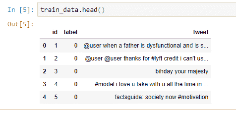
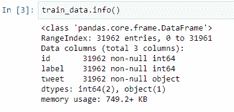
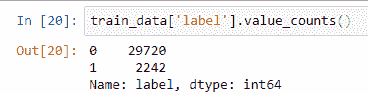
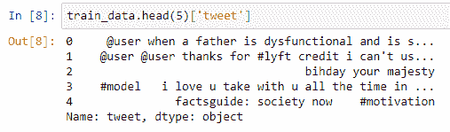
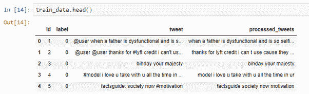
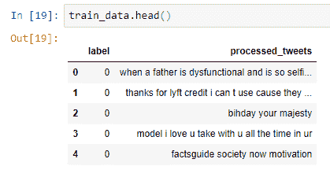
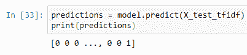

# 在 Analytics Vidhya 上解决 Twitter 情感分析问题

> 原文：<https://medium.com/coinmonks/solving-twitter-sentiment-analysis-problem-on-analytics-vidhya-ea3e51eea521?source=collection_archive---------7----------------------->

在过去的 6 个月里，我一直在学习一些数据科学技能，我想我应该记录并分享我的进步…

1.  让我更负责任。
2.  潜在地帮助任何人，他们正试图学习和我一样的东西！

所以在这里，我将解释我是如何在 Analytics Vidhya 上解决 [Twitter 情绪分析问题的。](https://datahack.analyticsvidhya.com/contest/practice-problem-twitter-sentiment-analysis/)

你可以参考我的 [**Github 仓库**](https://github.com/RaviTejaKomma/Twitter-Sentiment-Analysis) 来找到这篇文章的源代码和数据集。请给回购一颗星，如果它确实帮助你✌️

## ***问题陈述:***

这个问题的目标是检测推文中的仇恨言论。为了简单起见，如果一条推文带有种族主义或性别歧视的情绪，我们就说这条推文包含仇恨言论。所以，任务是将种族主义或性别歧视的推文从其他推文中分类。

形式上，给定一个推文和标签的训练样本，其中标签**‘1’表示该推文是种族主义/性别歧视的**，标签**‘0’表示该推文不是种族主义/性别歧视的，**你的目标是预测测试数据集上的标签。


## ***解题:***

首先让我们导入几个需要的库:[熊猫](https://pandas.pydata.org/)、 [Numpy](http://www.numpy.org/) 、 [Scikit-Learn](http://scikit-learn.org/stable/index.html) 。如果这是您第一次接触数据分析和机器学习，可以从命令提示符或在您的 IDE 中使用 **pip install** 命令安装这些库。像下面这样:

```
pip install pandas
pip install numpy
pip install sklearn
```

顺便说一下，我正在使用 Python 3.6 和 Jupyter 笔记本作为我的开发工具。

确保您安装了所有三个！现在我们可以走了。让我们像下面这样进口熊猫和 numpy，这样我们就可以使用它们。

```
import numpy as np
import pandas as pd
```

## ***获取数据:***

解决这个问题的第一步是加载我们的数据。从 [Analytics Vidhya](https://datahack.analyticsvidhya.com/contest/practice-problem-twitter-sentiment-analysis/) 或从我的 [GitHub repo](https://github.com/RaviTejaKomma/Twitter-Sentiment-Analysis) 下载数据集，并记下它的保存位置和名称。

然后，使用 pandas 和 **read_csv** 命令加载数据。既然这样，我们就用。head()查看前 5 行，确保一切正常。

```
train_data = pd.read_csv("C:\\your\\drive\\here\\train_tweets.csv")
train_data.head()
```

输出如下所示:



让我们对已经获得的训练数据做一些探索性的分析。

```
train_data.info()
```



这为我们提供了数据的简要概述，如**列数、行数、每列值的数据类型**，如果我们仔细观察，我们还可以知道哪些列缺少值。在我们的数据中有 **3 列** (id，label，tweet)**31962 行**，数据中没有缺失值。



上面的代码给了我们一个分类，有多少 tweet 是**0 的**，有多少 tweet 是**1 的**。

现在让我们看看我们的推文

```
train_data.head(5)['tweet']
```



如果你仔细看推文，我们有很多垃圾数据，对我们预测推文是正面还是负面没有用。所以我写了一个实用函数，通过**删除链接、特殊字符等来清理 tweet 文本。**使用简单的正则表达式语句。

```
## importing regular expression library ##
import re
def process_tweet(tweet):
    return " ".join(re.sub("(@[A-Za-z0-9]+)|([^0-9A-Za-z \t])", "",tweet.lower()).split())
```

现在在我们的火车数据上应用这个函数之后。我们的训练数据看起来像这样:



我增加了一个新的栏目 ***【已处理推文】*** ，其中包含清理后的推文，即删除特殊字符、超链接等。

现在，为了进行预测，我们不需要列**“id”和“tweet”**。删除这些列后，我们的最终数据帧只包含 2 列(“label”，“processed_tweets”)，如下所示:



事情变得有点复杂了！为了减少过度拟合问题，我们将数据集分为测试集和训练集。我们将使用训练集“训练”一个模型，然后使用测试集“测试”该模型。为此我们使用了 **sklearn** ，所以继续添加下面的代码。

```
x_train, x_test, y_train, y_test = train_test_split(train_data["processed_tweets"],train_data["label"], test_size = 0.2, random_state = 3)
```

我们不仅将数据分成训练和测试数据集，还将数据分成 X & Y 数据集。这将使训练和测试我们的模型变得更加简单！此外，为了确保我们每次回到这段代码时都使用相同的数据“分割”，我们使用了一个特定的随机状态， **3** 。这个数字与数据的分割方式有关。

我们还打印出新数据集的形状，以证明它们都是相同的！在这种情况下，训练数据集具有形状 **(25569，)**和测试 **(6393，)。**

为了进行进一步的分析，我们需要将我们的数据转换成我们的机器学习模型可以处理的格式。

```
count_vect = CountVectorizer(stop_words='english')
transformer = TfidfTransformer(norm='l2',sublinear_tf=True)## for transforming the 80% of the train data ##X_train_counts = count_vect.fit_transform(X_train)
X_train_tfidf = transformer.fit_transform(X_train_counts)## for transforming the 20% of the train data which is being used for testing ##x_test_counts = count_vect.transform(x_test)
x_test_tfidf = transformer.transform(x_test_counts)
```

## ***我对我们在这里做的事情的理解是这样的:***

*   ***计数向量器*** 进行文本预处理、标记和过滤停用词，并建立特征字典，将文档转换为特征向量。
*   ***TfidfTransformer***通过将文档中每个单词的出现次数除以文档中的总字数，对上述向量进行变换。这些新特性被称为 **tf** 用于**词频。**

在 **tf** 之上的另一个改进是降低出现在语料库的许多文档中的单词的权重，因此比只出现在语料库的一小部分中的单词信息量少。

对于**“词频乘以逆文档频率”**，这种降维被称为 **tf-idf** 。

## ***最有趣的一步:***

现在我们可以训练我们的模型了。我将使用 RandomForestClassifier。用 **sklearn 使用 RandomForestClassifier 很简单。我们需要做的就是导入模型，并用我们的数据进行拟合。**

```
from sklearn.ensemble import RandomForestClassifier
model = RandomForestClassifier(n_estimators=200)
model.fit(x_train_tfidf,y_train)
```

我们用训练集训练了我们的模型。现在是时候测试我们的模型了。模型所做的预测将具有值 0 和 1。



现在我们得到了我们的预测。让我们通过使用 sklearn 中的 **accuracy_score** 函数来测试我们的模型的准确性。

```
from sklearn.metrics import accuracy_score
print(accuracy_score(y_test,predictions))
```

代码结果:

> **0.957766306898**

哇 ***95.7%*** 很棒的分数。出了 ***6393*** 正文我们得到了 ***270*** 错误的预测。

到目前为止，我们已经在 20%的训练数据上测试了我们的模型。现在让我们加载[分析 Vidhya 竞赛](https://datahack.analyticsvidhya.com/contest/practice-problem-twitter-sentiment-analysis/)中给出的真实测试数据，并进行预测。

```
test_data = pd.read_csv("C:\\your\\drive\\here\\test_tweets.csv")
```

将上述所有数据预处理步骤也应用于该测试数据，并用整个训练数据拟合我们的模型，并预测测试数据的结果。

```
## for transforming the whole train data ##
train_counts = count_vect.fit_transform(train_data['processed_tweets'])
train_tfidf = transformer.fit_transform(train_counts)## for transforming the test data ##
test_counts = count_vect.transform(test_data['processed_tweet'])
test_tfidf = transformer.transform(test_counts)## fitting the model on the transformed train data ##
model.fit(train_tfidf,train_data['label'])## predicting the results ##
predictions = model.predict(test_tfidf)
```

将这些预测以 **sample_submission.csv** 文件中指定的格式写入 CSV 文件。

```
final_result = pd.DataFrame({'id':test_data['id'],'label':predictions})
final_result.to_csv('output.csv',index=False)
```

现在将您的 **output.csv** 文件提交到[Analytics vid hya competition](https://datahack.analyticsvidhya.com/contest/practice-problem-twitter-sentiment-analysis/)并获得分数。在[排行榜](https://datahack.analyticsvidhya.com/contest/practice-problem-twitter-sentiment-analysis/lb)上见。

接下来，您可以通过使用 **GridSearchCV 调整模型的超级参数来提高模型的准确性。**

## ***进一步学习:***

*   [处理文本数据](http://scikit-learn.org/stable/tutorial/text_analytics/working_with_text_data.html)
*   [RandomForestClassifier](http://scikit-learn.org/stable/modules/generated/sklearn.ensemble.RandomForestClassifier.html)
*   [GridSearchCV](http://scikit-learn.org/stable/modules/generated/sklearn.model_selection.GridSearchCV.html)

如果您有任何疑问，请在此评论，或者您可以通过 kommaraviteja@gmail.com 联系我

***快乐编码:)***