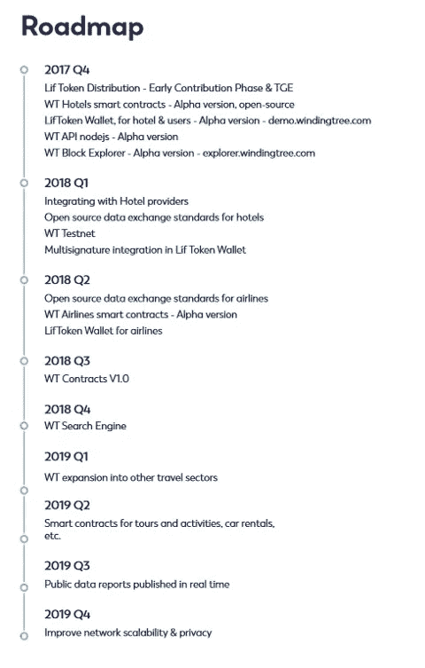

# 区块链是如何扰乱旅游业的？

> 原文：<https://medium.com/coinmonks/some-airlines-are-already-in-collaboration-with-blockchain-based-projects-but-which-is-their-2bf4e753180d?source=collection_archive---------1----------------------->

## 当前的环境

几乎所有航空公司、酒店、服务提供商和旅行社之间的交易都是通过封闭系统进行的，这使得旅行社更容易购买公司自己提供的机票。

目前有几家公司为旅游业提供 GDS ( [全球分销系统](https://en.wikipedia.org/wiki/Global_distribution_system))，尽管大部分交易只掌握在三家公司手中，它们垄断了市场。如果你今天想有竞争力，使用这个网络是必不可少的，它允许你实时预订机票、房间、服务，甚至在一次预订中生成提供几种服务的包。就像是航空公司和酒店直接发布的优惠清单。

这里的问题是[一个寡头政治已经形成](https://skift.com/2017/11/03/one-in-five-amadeus-bookings-subject-to-new-fees-as-air-france-adds-surcharge/)，从而阻止了小企业、旅行社、企业家等。从进入这个网络，对那些销量小的征收高额税收。这不仅阻碍了新报价的产生，而且使价格控制权掌握在极少数中间商手中，从而控制了市场。

## 这项技术

如今提供 GDS 的最大公司(如 AMADEUS、SABRE 和 TRAVELPORT)成立于 20 世纪 80 年代，简化了当时旅行社的运营方式，带来了旅游业的一场革命。

随着时间的推移，这些平台[已经过时](https://www.forbes.com/sites/leemathews/2017/07/06/travel-giant-sabre-confirms-its-reservation-system-was-hacked/#ca52b604b20f)，但是它们在市场上的绝对主导地位以及对航空公司运营的依赖阻止了系统的发展。

**区块链技术可以给这个过时的管理系统带来很大的改进**:效率、速度、安全性以及便于未来应用的实现**。这正是** [**Winding Tree 的全部意义所在，它与汉莎航空集团**](https://newsroom.lufthansagroup.com/english/press-releases/lufthansa-group-partners-up-with-winding-tree-to-bring-blockchain-technology-to-the-travel-industry/s/16fc8ce5-4656-41ee-a6b2-026441ba19b6) (6 家航空公司)合作，将区块链技术引入旅游业。

汉莎集团并不是唯一决定与缠绕树项目合作的公司，瑞士国际航空公司、新西兰航空公司和奥地利航空公司等大型集团也加入了该项目。

## 为什么他们选择缠绕树而不是其他人？

当其他项目关注消费者时，Winding Tree 正在从根本上解决问题。这是未来扩展和被业界接受的根本基础。

虽然其他项目专注于通过为最终客户提供解决方案来吸引用户和资金，但这并不比任何基于区块链的项目更有优势，Winding Tree 正试图解决航空公司和酒店面临的最大问题之一，即中间商。虽然这可能对消费者来说不是很有吸引力，但如果你想在这个巨大的领域有所作为，这确实是成功的途径。

一旦该系统被整合到旅游行业，最终消费者将自然受益，因为 Winding Tree 在开发其技术时已经考虑到这一点，并在 Lufthansa 等大公司的帮助和经验下进行优化。

在今年 2 月 15 日完成了他们最成功的 ICO 后，这支梦幻而雄心勃勃的团队并没有停止工作。尽管日程很忙，他们也不离开自己的社区。 [*总是平易近人，有求必应，在这里你可以看到他最近的*](https://www.youtube.com/watch?v=bcRbpFjn07A) *。*

到明年年中，他们计划推出其航空公司智能合同的 Alpha 版本，这标志着他们职业生涯中的一个重要里程碑。

## 简单地

> Winding Tree 为旅行社提供了一个去中心化的平台，可以直接与提供这些服务的公司进行交易，而不必支付今天的封闭网络所有者收取的巨额费用，如上所述。

它的第一个目标将是向旅行社提供酒店和航空公司的库存，以便他们可以直接预订房间和机票，由公司自己提供，除了 Winding Tree(非营利)平台之外，没有其他中介。

费率的降低和寡头政治的消失将导致每个人更多的经济旅行，以及一个价格仅由公司之间的竞争控制、没有中间商的市场。

*技术描述* : Winding Tree 是一套用于数据交换的开源协议，是一个运行在区块链上的软件，允许访问这些数据的中央数据库。

## 这可能是一项卓有成效的投资吗？

这是一个在网络上持续争论的话题。我们必须考虑到这个项目有多年轻，还有它的潜力。

作为一家主要致力于 B2B 的公司，还没有针对投资投机者的营销活动，这在其他项目中很常见，自项目开始以来，这些项目更侧重于吸引资本和其产品的新用户。

**Winding Tree 团队目前专注于以满足专业旅游行业需求的方式运营其平台。一旦发生这种情况，资本将自行到来，鉴于对投资感兴趣的人是大公司而不是小投资者，增长可能会在很长一段时间内呈指数增长**，直到该行业的所有大公司都获得足够的资本，将所有库存放到平台上。让我们记住，这些公司每天的交易量非常大，因此它们的上市将是引人注目的。

> [在您的收件箱中直接获得最佳软件交易](https://coincodecap.com/?utm_source=coinmonks)

## 结论

这无疑是一个渴望成为旅游行业游戏规则改变者的项目。毫无疑问，他们知道自己在做什么，他们的合作伙伴的素质表明他们对其提案的成功充满信心。

对我来说，这是迄今为止我发现的最有价值的宝石，尽管他们现在完全专注于他们项目的 B2B 部分，但我们很快就会看到最终消费者的结果，这将使这项投资成为未来两年最有利可图的投资之一。

[网站](https://windingtree.com/) : [推特](https://twitter.com/windingtree) : [电报](https://t.me/windingtree):[Idex](https://idex.market/eth/lif):[YoBit](https://yobit.net/en/trade/LIF/BTC):[OtcBtc](https://bb.otcbtc.com/exchange/markets/lifeth)