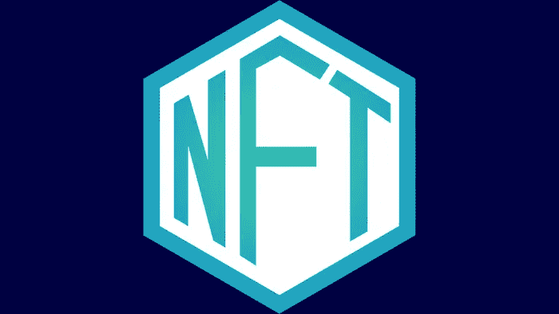

# 围绕 NFT 的一些背景(WTF 是一个 NFT？)

> 原文：<https://medium.com/coinmonks/some-context-around-nfts-wtf-is-an-nft-73ddba32a959?source=collection_archive---------9----------------------->

一个人刚刚花了价值 130 万美元的以太坊买了一张石头的照片。我知道你在想什么… WTF？！

好了，NFT，我相信你最近听说过的字母组合，它已经成为一个热门话题，如果“数字收藏品”这个短语让你困惑，你不是唯一一个。

一个主要问题是“你怎么能‘拥有’一张照片或一件数码物品？”为了解释这一点，我们首先需要问“拥有任何东西意味着什么？”

这可能是一个听起来很奇怪的问题，因为自从我们还是孩子的时候，我们就一直直觉地知道拥有或不拥有什么意味着什么。

然而，我敢肯定，在你童年的时候，你对自己拥有的东西的假设并不完全正确，也许你与另一个孩子就谁的玩具消防车，或者谁的蛋糕，或者谁是第一个排队的人发生了争执，你把这个问题交给了一个权威，无论是老师还是家长，他在听到争执后，决定谁是合法的所有者，无论是消防车还是队列中的位置。

随着年龄的增长，你开始了解所有权的这些不成文的社会规则，这变得很直观，但当然，争议仍然会发生。

因此，作为一个社会，我们需要一个我们共同认可的制度，这样我们就能以公平、公正的方式解决这些争端。

# **引进最新的所有权技术；财产法。**

现在，这个超级令人兴奋的术语通常可以归结为合同，书面文件，比如说，“52 街 3 号房屋，完全合法地属于约翰·多伊”。

但我们有一个问题，约翰·多伊可能自己写的，事实上它可能完全是别人的房子，或者约翰可能从来没有听说过这个房子或文件，并希望与它无关。

我们需要某种系统，每个社会成员的唯一标识符来仔细检查无名氏是如何拥有那栋房子的，这或多或少是两个问题；是他造的吗？他买了吗？如果他真的买了，他从谁那里买的，更进一步，他从谁那里买的？

我们需要一种所有权“链”,可以一直追溯到房屋建造之时，政府可以在纠纷期间进行检查，以验证约翰确实拥有那栋房子。

# **引进最新的所有权技术；签名。**

如果我们让每一个建造房子的人都在上面签上只有他们才能出示的独特签名，那么无论谁从他们那里买房子，都可以要求一份书面文件，上面写着‘我，建造者鲍勃，合法地将我的财产所有权转让给约翰·多伊，签名；鲍勃的

这很好，因为现在如果有人随机进入房子，主人给他一个快速的左-右-晚安，他不会有麻烦，因为他合法拥有房子，入侵者在监狱里会感受到法律的全部力量。

现在这种所有权给了约翰很多选择，他可以住在房子里，毁掉房子，卖掉房子，他永远不需要任何人的一句赞同，因为大家都同意，那是约翰的地方。

这种情况下，每个人都集体同意所有权的真理，被称为共识。这个系统扩展到房子之外，我们可以就谁拥有一部电话、一辆汽车、一架私人飞机或一幅画达成共识…

但是数字艺术呢？或者照片？如果我们想拥有一些非物质的东西，我们不想依赖政府和讨厌的合同和签名(可以伪造)来跟踪和执行谁拥有什么，会怎么样？

# 引入最新的所有权技术；区块链。

记得一分钟前我说:

……我们需要一种所有权‘链’，可以一直追溯到房子建造之时，政府可以在纠纷期间进行检查，以核实约翰确实拥有那栋房子。”

我故意说“链条”,听起来熟悉吗？区块链对吧？这基本上是区块链的核心，一个完整的书面历史(分类账)，随着时间的推移，谁拥有什么。

但是如果我们已经有了一个共识体系，为什么我们还需要区块链呢？

好吧，请记住，我们最好不要依赖政府和讨厌的法律合同，这些合同可能要花一大笔钱让律师来写，而且可能有漏洞，以后可能会被试图窃取你的东西的人利用。

还记得我们的朋友约翰·多伊在买房子后的所有选择吗？嗯，当你想到这一点，'买房子'实际上只是购买这些选项的权利，居住或出售它等…而不受社会，又名法律的惩罚。

但是约翰仍然可以拆除房子，或者假装拥有它并卖掉它，或者只是住在里面直到有人把他赶出去…唯一的不同是，他之后会进监狱。

这就是区块链的用武之地，因为区块链是一个不依赖任何中央权威的系统，比如政府(来决定谁拥有什么),我们能够在彼此之间交易代币，如果你试图交易一个你不拥有的代币，而不是事后受到惩罚，你根本不可能在第一时间交易

这是因为区块链的建立方式，对它的花哨术语是“分布式共识机制”，这只是意味着网络中的每个人都集体决定谁拥有什么，而这种责任是通过网络分配给所有参与者，而不是政府这样的单一实体。

现在，这对于由矿工创建的令牌来说很好(我将在另一篇文章中解释)，但以太坊和比特币等令牌有一个称为“可替代性”的属性，这意味着它们可以被切成碎片，并相互交换，你不必有 1 个以太，你可以将其分成两半，有 0.5 个以太。

但是对于艺术品，你不能把它一分为二，所以如果你想把你的数码照片的*权利*转让给*选择权*，你就需要一个系统来证明你对该物品的所有权。

这就是不可替代令牌的用武之地(NFT 的)

以太坊网络为此建立了一个系统，任何人都可以上传照片到他们的以太坊账户，作为 NFT 的，并立即给自己照片的所有权，换句话说，就是把照片卖给其他人的权利。

所以现在，我们不再有实体的口袋妖怪卡片，(顺便说一句，它可能是伪造的)我们有一种方法来创建数字收藏品，并在彼此之间进行交易，在一个完全透明的项目移动账本上记录每一笔交易。

任何人，任何地方，都可以查看以太坊区块链，找到 NFT 的数字签名，并追溯到它的起源，从最初的 NFT 创造者以太坊帐户，并验证它确实是 dopeNFTartist69 的限量版 charizard number 5。

还有一些公司，比如我在马特勒姆([www.mattereum.com](https://mattereum.com/))的好朋友维奈·古普塔，正在将 NFT 的功能与现实世界的财产法、合同和现实世界物品的所有权结合起来。

事实上，几年前，当世界上第一笔具有法律约束力的 NFT 交易在 Mattereum Hackathon 上发生时，我就在现场。

无论如何，我希望这有助于你了解 NFT 的背景，以及为什么人们会在可收藏的 Jpegs 图片上花费数百万美元。

如果您觉得有用，请关注我的社交网站:)；

YouTube:[www.youtube.com/c/Angelopermissionless/](http://www.youtube.com/c/Angelopermissionless/)

insta gram:@ angelo . ramana @ permissions less ltd

推特:@Angelo_Somers

> 加入 [Coinmonks 电报频道](https://t.me/coincodecap)，了解加密交易和投资

## 另外，阅读

*   [加密货币储蓄账户](/coinmonks/cryptocurrency-savings-accounts-be3bc0feffbf) | [赌注加密](https://blog.coincodecap.com/staking-crypto) | [加密交易机器人](https://blog.coincodecap.com/best-crypto-trading-bots)
*   [BigONE 交易所评论](/coinmonks/bigone-exchange-review-64705d85a1d4) | [CEX。IO 审查](https://blog.coincodecap.com/cex-io-review) | [Swapzone 审查](/coinmonks/swapzone-review-crypto-exchange-data-aggregator-e0ad78e55ed7)
*   [最佳比特币保证金交易](/coinmonks/bitcoin-margin-trading-exchange-bcbfcbf7b8e3) | [比特币保证金交易](https://blog.coincodecap.com/bityard-margin-trading)
*   [加密保证金交易交易所](/coinmonks/crypto-margin-trading-exchanges-428b1f7ad108) | [赚取比特币](/coinmonks/earn-bitcoin-6e8bd3c592d9) | [Mudrex 投资](https://blog.coincodecap.com/mudrex-invest-review-the-best-way-to-invest-in-crypto)
*   [WazirX vs coin dcx vs bit bns](/coinmonks/wazirx-vs-coindcx-vs-bitbns-149f4f19a2f1)|[block fi vs coin loan vs Nexo](/coinmonks/blockfi-vs-coinloan-vs-nexo-cb624635230d)
*   [CoinLoan 审核](https://blog.coincodecap.com/coinloan-review)|[Crypto.com 审核](/coinmonks/crypto-com-review-f143dca1f74c) | [火币保证金交易](/coinmonks/huobi-margin-trading-b3b06cdc1519)
*   [Bybit vs 币安](https://blog.coincodecap.com/bybit-binance-moonxbt)|[stealth x 回顾](/coinmonks/stealthex-review-396c67309988) | [Probit 回顾](https://blog.coincodecap.com/probit-review)
*   [顶级付费加密货币和区块链课程](https://blog.coincodecap.com/blockchain-courses)
*   [在美国如何使用 BitMEX？](https://blog.coincodecap.com/use-bitmex-in-usa) | [BitMEX 评论](https://blog.coincodecap.com/bitmex-review)
*   [最佳免费加密信号](https://blog.coincodecap.com/free-crypto-signals) | [YoBit 评论](/coinmonks/yobit-review-175464162c62) | [Bitbns 评论](/coinmonks/bitbns-review-38256a07e161)
*   [OKEx 评论](/coinmonks/okex-review-6b369304110f) | [Kucoin 交易机器人](/coinmonks/kucoin-trading-bot-automate-your-trades-8cf0ca2138e0) | [期货交易机器人](/coinmonks/futures-trading-bots-5a282ccee3f5)
*   [AscendEx Staking](https://blog.coincodecap.com/ascendex-staking)|[Bot Ocean Review](https://blog.coincodecap.com/bot-ocean-review)|[最佳比特币钱包](https://blog.coincodecap.com/bitcoin-wallets-india)
*   [霍比审核](https://blog.coincodecap.com/huobi-review) | [OKEx 保证金交易](https://blog.coincodecap.com/okex-margin-trading) | [期货交易](https://blog.coincodecap.com/futures-trading)
*   [比特币基地赌注](https://blog.coincodecap.com/coinbase-staking) | [热点评论](/coinmonks/hotbit-review-cd5bec41dafb) | [库币评论](https://blog.coincodecap.com/kucoin-review)
*   [Stormgain 回顾](https://blog.coincodecap.com/stormgain-review) | [Bexplus 回顾](https://blog.coincodecap.com/bexplus-review) | [币安 vs Bittrex](https://blog.coincodecap.com/binance-vs-bittrex)
*   [Bookmap 评论](https://blog.coincodecap.com/bookmap-review-2021-best-trading-software) | [美国 5 大最佳加密交易所](https://blog.coincodecap.com/crypto-exchange-usa)
*   [如何在 FTX 交易所交易期货](https://blog.coincodecap.com/ftx-futures-trading) | [OKEx vs 币安](https://blog.coincodecap.com/okex-vs-binance)
*   [如何在势不可挡的域名上购买域名？](https://blog.coincodecap.com/buy-domain-on-unstoppable-domains)
*   [印度的加密税](https://blog.coincodecap.com/crypto-tax-india) | [altFINS 审核](https://blog.coincodecap.com/altfins-review) | [Prokey 审核](/coinmonks/prokey-review-26611173c13c)
*   [区块链 vs 比特币基地](https://blog.coincodecap.com/blockfi-vs-coinbase) | [比特坎评论](https://blog.coincodecap.com/bitkan-review) | [币安评论](/coinmonks/binance-review-ee10d3bf3b6e)