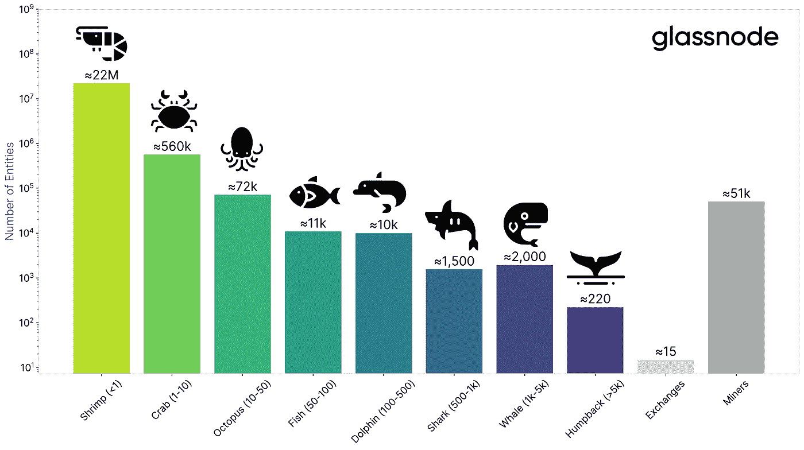

# 一些关于比特币鲸鱼及其货币影响的研究

> 原文：<https://medium.com/coinmonks/some-research-on-bitcoin-whales-and-their-monetary-impact-fe2f3372b6d9?source=collection_archive---------4----------------------->

Photo by [Hulki Okan Tabak](https://unsplash.com/@hulkiokantabak?utm_source=medium&utm_medium=referral) on [Unsplash](https://unsplash.com?utm_source=medium&utm_medium=referral)

在加密空间，有不同种类的霍德勒。最神秘的是所谓的比特币鲸鱼。这篇文章详细阐述了这种极具影响力的比特币创造者，并揭示了他们是谁以及他们可能有多富有的一些细节。

## 霍德勒的海洋动物

根据他们积累的财富，将比特币投资者细分为不同的海洋动物物种(不要问我为什么)是很常见的。下图基于 glassnode 分析，说明了这一点。

好吧，我们大多数人可能属于虾米一族，拥有不到一个完整的比特币。在成为鲸鱼之前，还有更多的动物种类要经历，从 1 BTC 的财富到 999 BTC。

Chart by Rafael Schultze-Kraft from glassnode on [Twitter](https://twitter.com/n3ocortex/status/1356673243734822912)

根据上面 glassnode 的数据，我们可以估算出鲸鱼的数量在 2000 头左右。然而,《商业内幕》称，在这个隐秘的海洋中，只有 1000 头鲸鱼(来源:[商业内幕](https://www.businessinsider.com/bitcoin-whales-the-key-facts-figures-you-need-to-know-2021-1?r=DE&IR=T))。这种偏差源于一条鲸鱼在比特币区块链上拥有不止一个鲸鱼地址的可能性。

## 关于鲸鱼不同亚种的发现

在收集这些富裕的比特币投资者的信息时，我们可以找到各种属性，引导我们对他们进行聚类。于是，我们可以识别出三种不同的鲸群:

*   **非凡的早期用户(早在比特币诞生之前)**
*   **加密交易所的创始人(自 2010 年)**
*   **机构先知(自 2020 年起)**

当然，所有这些组之间可能会有重叠。属于第一组的大多数成员是开发人员和程序员。他们加入这个领域，主要是因为比特币历史最初几年的技术创新，并在此期间积累了大量比特币。他们中的大多数人作为一个人拥有数千枚硬币，他们现在仍然拥有。作为第一个著名的例子，我们可以命名为罗杰。当一个比特币的价格达到 1 美元时，他开始投资(来源:[美国消费者新闻与商业频道](https://www.cnbc.com/2013/12/02/meet-bitcoin-jesus-a-virtual-currency-millionaire.html))。不幸的是，他卖掉了很多他的比特币，用于推广他的硬叉子比特币现金。

作为第二类人，我们可以指出加密交易所和基金的创始人或共有人。根据历史，建立这样一个交易所或基金几乎是保证你未来的财富。因为众所周知的 Mt.Gox 事件，我们不得不写“差不多”。除此之外，我们发现交易所的领导者，即比特币基地、北海巨妖、币安、FTX、双子座、Bitfinex，以及其他许多最富有的鲸鱼。

> **“我在热爱比特币之前就讨厌它。”** —微策略公司首席执行官迈克尔·塞勒在推特上说

这句话代表了大多数机构预言家的观点，他们最近进入了加密领域，但却拥有看不见的购买力。最重要的是，截至 2021 年 3 月，迈克尔·塞勒凭借超过 90，000 BTC 的财富登上了 Microstrategy 的宝座。此外，特斯拉在 2021 年初购买了估计超过 30，000 辆 BTC。除此之外，灰度基金正在管理更多的机构比特币投资，目前总额超过 65 万 BTC(来源:[灰度](https://grayscale.co/bitcoin-trust/))。总而言之，这些机构可以获得超过 4%的比特币总供应量。

## 谁是神话中的早期采用者鲸鱼？

大多数上述机构都是众所周知的，所涉人员公开了他们的投资，至少是出于监管义务。相比之下，有第一类鲸鱼，它们大部分时间行动不引人注意。遗憾的是，我们无法确切知道他们一段时间以来积累了多少硬币。

这些沉默的鲸鱼从比特币诞生的第一天起就为其做出了贡献，它们是:

*   **亚当回来了**
*   尼克·萨博
*   **加文·安德森**
*   哈尔·芬尼
*   戴夫·克雷曼

最后，提到的哈尔·芬尼和戴夫·克雷曼最有可能是中本聪，发明者本人，他拥有至少 100 万 BTC。然而，由于这些硬币多年没有被移动，我们可以认为他的财富已经丢失，直到证明是错误的。令人遗憾的是，他们两人都已不在人世，因此证实了这个谜。

## 我们应该关注鲸鱼的影响吗？

考虑到拥有数千枚比特币的人的巨大力量，我们似乎至少应该意识到随之而来的可能的抛售压力。然而，机构买家必须克服巨大的监管障碍，这需要付出巨大努力才能进入比特币市场。

所以，我敢肯定机构做这一切工作并不是为了来回交易比特币。他们这样做是为了节省他们的购买力，同时考虑到超过几年的时间范围。

此外，一个加密交易所，如北海巨妖，在现货市场上处理 700，000，000 美元或 11，500 BTC 的 24 小时比特币交易量(2021 年 4 月)。不管鲸鱼属于哪一类，鲸鱼都不希望比特币价格下跌，同时将他们的一袋硬币投入市场。他们不想给自己带来损失。

> ***万一鲸鱼在卖，它们在静静地卖，仿佛在海洋中缓缓漂流。***

我们可以说，早期接触新技术或通过拥有一家企业来为新技术做出贡献，可能是持续致富的最佳途径。

> 加入 Coinmonks [电报集团](https://t.me/joinchat/PmKOYQ9NNKZlZGNl)，了解加密交易和投资

## 另外，阅读

*   最好的[加密交易机器人](/coinmonks/crypto-trading-bot-c2ffce8acb2a) | [网格交易机器人](https://blog.coincodecap.com/grid-trading)
*   [加密复制交易平台](/coinmonks/top-10-crypto-copy-trading-platforms-for-beginners-d0c37c7d698c) | [如何在 WazirX 上购买比特币](/coinmonks/buy-bitcoin-on-wazirx-2d12b7989af1)
*   [CoinLoan 审核](/coinmonks/coinloan-review-18128b9badc4)|[Crypto.com 审核](/coinmonks/crypto-com-review-f143dca1f74c) | [火币保证金交易](/coinmonks/huobi-margin-trading-b3b06cdc1519)
*   [尤霍德勒 vs 考尼洛 vs 霍德诺特](/coinmonks/youhodler-vs-coinloan-vs-hodlnaut-b1050acde55a) | [Cryptohopper vs 哈斯博特](https://blog.coincodecap.com/cryptohopper-vs-haasbot)
*   [杠杆代币](/coinmonks/leveraged-token-3f5257808b22) | [最佳密码交易所](/coinmonks/crypto-exchange-dd2f9d6f3769) | [Paxful 点评](/coinmonks/paxful-review-4daf2354ab70)
*   [加密套利](/coinmonks/crypto-arbitrage-guide-how-to-make-money-as-a-beginner-62bfe5c868f6)指南| [如何做空比特币](/coinmonks/how-to-short-bitcoin-568a2d0b4ae5) | [1xBit 回顾](https://blog.coincodecap.com/1xbit-review)
*   [如何在印度购买比特币？](/coinmonks/buy-bitcoin-in-india-feb50ddfef94) | [WazirX 评论](/coinmonks/wazirx-review-5c811b074f5b) | [BitMEX 评论](https://blog.coincodecap.com/bitmex-review)
*   [印度比特币交易所](/coinmonks/bitcoin-exchange-in-india-7f1fe79715c9) | [比特币储蓄账户](/coinmonks/bitcoin-savings-account-e65b13f92451)
*   [币安费用](/coinmonks/binance-fees-8588ec17965) | [Botcrypto 审核](/coinmonks/botcrypto-review-2021-build-your-own-trading-bot-coincodecap-6b8332d736c7) | [Hotbit 审核](/coinmonks/hotbit-review-cd5bec41dafb) | [KuCoin 审核](https://blog.coincodecap.com/kucoin-review)
*   [我的加密副本交易经验](/coinmonks/my-experience-with-crypto-copy-trading-d6feb2ce3ac5) | [购买硬币评论](https://blog.coincodecap.com/buycoins-review)
*   [Bybit 融资融券交易](/coinmonks/bybit-margin-trading-e5071676244e) | [币安融资融券交易](/coinmonks/binance-margin-trading-c9eb5e9d2116) | [Overbit 审核](/coinmonks/overbit-review-9446ed4f2188)
*   [加密货币储蓄账户](/coinmonks/cryptocurrency-savings-accounts-be3bc0feffbf) | [YoBit 审查](/coinmonks/yobit-review-175464162c62) | [Bitbns 审查](/coinmonks/bitbns-review-38256a07e161)
*   [Botsfolio vs nap bots vs Mudrex](/coinmonks/botsfolio-vs-napbots-vs-mudrex-c81344970c02)|[gate . io 交流回顾](/coinmonks/gate-io-exchange-review-61bf87b7078f)
*   [最佳比特币保证金交易](/coinmonks/bitcoin-margin-trading-exchange-bcbfcbf7b8e3) | [萝莉点评](/coinmonks/lolli-review-e6ddc7895ad8) | [比特币保证金交易](https://blog.coincodecap.com/bityard-margin-trading)
*   [创造并出售你的第一个 NFT](https://blog.coincodecap.com/create-nft) | [本地比特币评论](/coinmonks/localbitcoins-review-6cc001c6ed56)
*   [加密保证金交易交易所](/coinmonks/crypto-margin-trading-exchanges-428b1f7ad108) | [赚取比特币](/coinmonks/earn-bitcoin-6e8bd3c592d9) | [Mudrex 投资](https://blog.coincodecap.com/mudrex-invest-review-the-best-way-to-invest-in-crypto)
*   [如何在印度购买以太坊？](https://blog.coincodecap.com/buy-ethereum-in-india) | [如何在币安购买比特币](https://blog.coincodecap.com/buy-bitcoin-binance)
*   [顶级付费加密货币和区块链课程](https://blog.coincodecap.com/blockchain-courses) | [币安评论](/coinmonks/binance-review-ee10d3bf3b6e)
*   [MXC 交易所评论](/coinmonks/mxc-exchange-review-3af0ec1cba8c) | [Pionex vs 币安](https://blog.coincodecap.com/pionex-vs-binance) | [Pionex 套利机器人](https://blog.coincodecap.com/pionex-arbitrage-bot)
*   [在美国如何使用 BitMEX？](https://blog.coincodecap.com/use-bitmex-in-usa) | [BitMEX 审查](https://blog.coincodecap.com/bitmex-review)