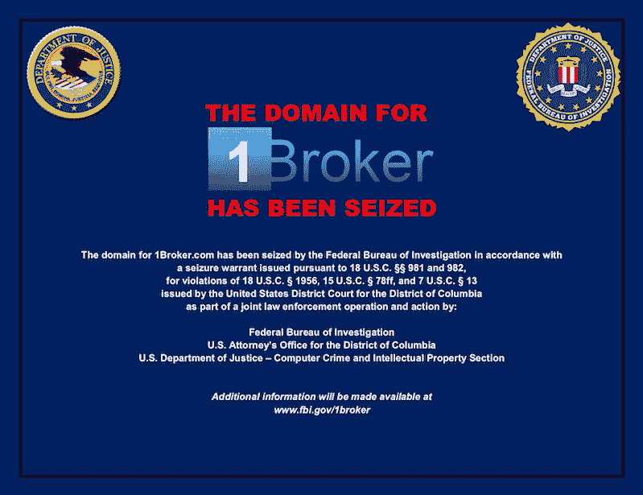
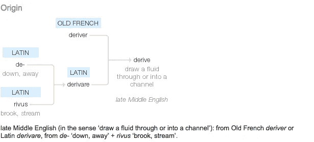

# 欧洲、英国和直布罗陀加密资产和金融服务监管审查

> 原文：<https://medium.com/coinmonks/some-thoughts-on-derivative-cryptocurrency-contracts-and-securities-laws-f6758e54d17a?source=collection_archive---------5----------------------->

**第二部分:关于“衍生”加密货币合同和欧洲金融服务法的一些想法**

**1。** **不必要的关注？**

本周，联邦调查局因涉嫌非法证券掉期活动和受监管的零售商品交易而查封了 1broker 域名。

这些案例为那些在更复杂的“衍生”结构中包装加密货币和其他数字资产的人探索了许多有趣的点。*

*注意:此处衍生产品一词的使用是广义的，而不是严格的法律意义上的，因为某样东西是否是受管制的“衍生”合同是一个技术问题，取决于产品的结构和每个案例中的管辖定义。例如，美国和欧盟对受监管的“衍生品”和“商品”的定义并不完全相同。

对于外行人来说，值得强调的是这些监管问题的核心的重要区别。简单形式的数字资产可能完全不受监管，例如许多司法管辖区的比特币。参见[此处](https://www.lexology.com/library/detail.aspx?g=20736649-246a-4526-8ad0-3b4f309fc88d)例如:出于英国法律和税收目的，比特币的一些关键特征概述。

但是，当一个人允许针对不受监管的基础资产建立衍生产品合同时，与不受监管的基础资产的变动相关的双边资产和负债的打包或创建可以是受监管的活动。

因此，此类产品或交易是否属于受监管的“衍生”合同或交易是关键问题。

**2。** **执行摘要**

1)许多加密相关交易和打包的数字资产产品涉及衍生合同的创建；

2)关键问题是那些产品是否是受监管的衍生产品；

3)仅仅将数字资产捆绑在一起并不能使它们成为受监管的衍生合约

a)这意味着授权持有人拥有许多其他数字资产(如一篮子指数证券)的智能合约本身不是受监管的商品合约。

b)但根据结构，这种产品可以是受监管的集体投资计划或另类投资基金(在欧洲)。

4)同样，能够在相对较短的时间内实际占有基础资产的加密货币对合约也可能受益于涉及实际交付的某些衍生产品的特定豁免。

**3。** **针对 1 号经纪人的案件**

证券交易委员会( **SEC** ) [诉状](https://www.cftc.gov/sites/default/files/2018-09/enf1poolpatrickajeltakecomplaint092718.pdf)指控 1pool ( **1Broker** )在提供差价合约时违反了多项证券法要求:

*“在 1broker.com 网站上，被告将基于证券的掉期交易称为“差价合约”，这是“差价合约”的首字母缩写。“通过这些差价合约，1 经纪商账户持有人可以参与证券和其他资产的价格变动，而无需实际拥有相关资产。例如，账户持有人可以购买跟踪美国上市公司股票价格的 CFD 多头或空头头寸。然后，根据股票价格上涨或下跌，CFD 的值也会上涨或下跌。1 经纪人是每笔差价合约的交易对手，这意味着在每笔差价合约中，经纪人的立场与账户持有人相反。例如，如果账户持有人持有多头头寸，1Broker 持有相应的空头头寸。因为差价合约的价值与基础证券、市场指数或其他金融资产或基准的价值相关，所以根据联邦证券法，它们是基于证券的互换。除了某些例外(不适用于此处)，联邦证券法要求基于证券的掉期交易必须在美国证券交易委员会注册，并且交易必须在注册的全国性交易所进行。同样，在差价合约中充当交易商的 1Broker 也被要求在 SEC 注册。因为 CFDs 和 1Broker 都没有注册，而且因为交易不是在国家交易所进行的，所以被告违反了联邦证券法。控制 1Broker 并指挥其活动的 Brunner 是 1Broker 违规行为的罪魁祸首。*

SEC 还提出了许多其他投诉，包括 1broker 未能"*确定账户持有人是否达到了特定的全权交易门槛。当销售仅限于“合格的合约参与者”——即高净值个人和某些类型的复杂和/或受监管的实体——时，基于证券的掉期交易的未注册销售是合法的。1Broker 差价合约的销售并不如此有限。*

美国商品期货交易委员会( **CFTC** )也提出了一项[投诉](https://www.cftc.gov/sites/default/files/2018-09/enf1poolpatrickajeltakecomplaint092718.pdf)——主要针对在没有适当许可的情况下非法提供零售商品的指控:

*“至少从 2016 年 2 月至今(“相关期间”)，被告 1 pool ltd .(“1 pool”)通过其管理人员、员工或代理人，包括但不限于被告 Patrick Brunner(“Brunner”)(统称为“被告”)的行为，以违反《商品交易法》和《委员会条例》的方式在美国开展业务:即，为了在杠杆或融资基础上从无资格的合同参与者(“非 ECP”)处招揽或接受购买或销售商品的订单，而不导致商品的实际交付*

我无意损害 1 经纪商的辩护，但他们似乎已将其打包的掉期产品作为受监管的衍生合约进行营销，这对他们肯定没有帮助，因为 CFD 是受监管的衍生合约，这是众所周知和公认的(在欧洲法律中也有法律规定)。

**4。** **欧洲法律地位**

在欧洲经济区内，处理打包产品是否为受监管衍生产品合同的主要法律是金融工具市场指令(MiFID)和相关立法，包括指令( [MiFID 2](https://ec.europa.eu/info/law/markets-financial-instruments-mifid-ii-directive-2014-65-eu_en) )和法规( [MiFIR](https://ec.europa.eu/info/law/markets-financial-instruments-mifir-regulation-eu-no-600-2014_en) )。还有附属法规，如[委员会授权法规 2017](https://eur-lex.europa.eu/legal-content/EN/TXT/PDF/?uri=CELEX:32017R0565&from=EN) ，为范围内和范围外衍生合同提供了进一步的指导。

衍生工具在 MiFID 2 中定义如下:

“(49)‘衍生产品’是指第 600/2014 号法规(EU)第 2(1)(29)条中定义的衍生产品；

(50)‘商品衍生品’是指第 600/2014 号法规(EU)第 2(1)(30)条中定义的商品衍生品；"

从那里跟随面包屑会将您带到以下位置:

“(29)“衍生工具”是指指令 2014/65/EU 第 4(1)条第(44)点中定义的金融工具；并在附件一第 C (4)至(10)节中提及；

(30)“商品衍生工具”是指指令 2014/65/EU 第 4(1)条第(44)c)点中定义的金融工具；与指令 2014/65/EU 附件 I 第 C(10)节中提及的商品或基础相关的；或附件一 C 节第(5)、(6)、(7)和(10)点；"

在一个美丽的圆形中，你必须再跳几下才能发现它们到底是什么！(详细定义见下文第 8 节)即使如此，术语“导数”本身也没有定义。

在我看来，它可以涵盖加密货币的 CFD、期权和期货以及许多其他数字资产，例如，一个定义涵盖:

*“期权、期货、掉期、远期利率协议以及与证券、货币、利率或收益、排放配额或其他衍生工具、金融指数或金融措施相关的任何其他衍生合同，可以实物或现金结算*

这是非常广泛的起草，以便能够涵盖几乎任何基础资产，监管机构认为适合涵盖。然而，ESMA 有必要最终公布关于哪些加密货币衍生合约在范围内及其法律基础的指导意见，因为加密货币和其他数字资产是否属于以下任何类别尚不清楚:“*证券、货币、利率或收益率、排放配额或其他衍生工具、金融指数或金融措施”*

还需要注意的是，使参与者能够交易受监管金融工具(包括受监管衍生工具)的平台(交易场所)的任何运营商通常都必须按照 MiFID 进行监管:

1.  受监管的市场( **RM** )-即证券交易所
2.  多边交易工具(在许多方面，它们在功能上等同于 RM，但它们适用不同的规则，并且像 RM 一样，它们提供非全权委托的订单匹配)。或者
3.  有组织的交易设施(可以在订单匹配中行使自由裁量权)。

每种交易场所的要求各不相同，但都需要大量的监管资本，并对其活动进行监管。与不受监管的交易场所不同，它们必须为公平有序的交易建立透明的规则和程序，并为订单的有效执行建立客观标准。

**a.** **英国金融行为监管局**

英国监管机构还发布了关于从事与不受监管的加密货币相关的受监管衍生合约的相关风险的指导和警告:

*“我们注意到越来越多的英国公司提供所谓的加密货币和加密货币相关资产。正如我们在 DLT 的反馈声明中指出的，加密货币目前不受 FCA 监管，前提是它们不是其他受监管产品或服务的一部分。*

*然而，加密货币衍生产品能够成为金融工具指令 II (MIFID II)市场下的金融工具，尽管我们不认为加密货币是 MIFID II 监管下的货币或商品。因此，从事加密货币衍生品监管活动的公司必须遵守 FCA 手册中的所有适用规则以及直接适用的欧盟法规中的任何相关规定。*

*与涉及加密货币或通过首次发行硬币(ICO)发行的代币的衍生产品相关的相当于受监管活动的交易、安排交易、咨询或提供其他服务，可能需要 FCA 的授权。这包括:*

*   ***加密货币期货****——一种衍生合约，其中各方同意在未来某个日期以双方同意的价格交换加密货币*

*   *****加密货币期权*** *—授予受益人获得或处置加密货币权利的合同***

***如果您不确定您的公司是否需要授权，FCA 在*[*PERG*](https://www.handbook.fca.org.uk/handbook/PERG/)*中关于监管边界的一般指南可能会有所帮助。如果您还有任何疑问，我们也鼓励您寻求专家的建议。***

***…如果您的公司没有获得 FCA 的授权，并且提供需要授权的产品或服务，这是一种刑事犯罪。未经适当许可提供这些产品的授权公司可能会受到执法行动的制裁。”***

****5。** **哪些类型的打包数字资产产品不是受监管的衍生产品？****

**美国和欧盟对此问题的回答可能有所不同，但是我们注意到，CFTC 在对 1broker 产品的描述中提到了缺乏实物交割:**

***美国头寸****

***作者不是美国证券律师，因此本文仅旨在总结该领域的最新事件。为了更好地了解加密货币领域的美国证券法，我们建议您关注[杰克·切尔文斯基](https://twitter.com/jchervinsky/)和[康纳·奥汉隆。](https://twitter.com/Conor0Hanlon)这个有着[盛况](http://@APompliano)(很值得关注)的播客也特别有信息量:[https://twitter.com/coinsources/status/1045317487691149313](https://twitter.com/coinsources/status/1045317487691149313)**

**CFTC 表示，虚拟货币是《商品交易法》第 1a(9)条所指的商品，法院似乎支持这一观点。因此，在杠杆、保证金或融资基础上向零售投资者提供加密货币的平台(“加密货币零售商品交易”)属于 CEA 的管辖范围，并需要在 CFTC 注册为持牌的国内期货交易所或外国期货交易所，除非它有资格获得注册豁免，如实际交割豁免。数字资产的销售合同需要在交易执行后的 28 天内将购买的加密货币“实际交付”给客户。抛开是否所有加密货币都应被视为商品的有趣讨论，本文的重点是对杠杆化或打包数字资产产品的影响以及依赖豁免的能力。**

**CFTC 最近就该实物交付豁免的解释征求了[反馈意见](https://www.cftc.gov/LawRegulation/FederalRegister/proposedrules/2017-27421.html):**

**“多德-弗兰克法案增加了 CEA 第 2(c)(2)(D)条，以解决涉及委员会监管监督能力的某些司法不确定性。委员会长期以来一直认为，某些涉及杠杆或保证金的投机性商品交易可能具有期货合约的迹象，使它们受到委员会的监督。然而，出现了一些司法裁决，质疑该委员会对某些货币和其他商品的杠杆零售交易的监督。2008 年，国会通过在 CEA 第 2(c)(2)条中赋予委员会对零售外汇交易更明确的权力，解决了这一司法不确定性。这些新的法定条款为此类交易规定了两天实际交货的例外情况。两年后，国会在《消费品安全法案》第 2(c)(2)(D)条中明确授权委员会对所有其他“零售商品交易”进行监督。如上所述，这些新的法定条款为商品的实际交付发生在 28 天之内的情况确立了一个例外……与其零售商品交易监督相关，委员会之前发布了一份在 CEA 第 2(c)(2)(D)节中对术语“实际交付”的解释提案，并附有一份意见征询书。在这种解释中，委员会提供了几个例子，说明什么可能满足，什么可能不满足实际交付例外。在审查公众意见后，委员会于 2013 年发布了最终解释(“2013 年指南”)。**

***2013 年指南解释说，委员会将考虑“超出合同文件的四个方面”的证据，以评估商品的实际交付是否发生。委员会进一步指出，它将“采用功能性方法，审查协议、合同或交易是如何营销、管理和履行的，而不是仅仅依赖于协议、合同或交易各方使用的语言。“2013 年指南还列出了欧盟委员会在确定实际交付时将考虑的相关因素，并再次提供了可能构成实际交付的示例。***

***根据 2013 年指南，实际交付的唯一令人满意的例子涉及将商品的所有权和占有权转让给买方或代表买方的存管机构。除其他事项外，单纯的帐面记录和某项采购“滚入、抵消或以其他方式与另一项交易净额结算”的某些情况并不构成实际交付。***

***…这一决定中的相关因素包括:在执行协议、合同或交易(包括所有相关文件)之前和之后，所购或所售商品的所有权、占有权、产权和实际位置；买卖商品的买方、卖方和所有者之间关系的性质；以及记录和完成购买或销售的方式。***

***……欧盟委员会对虚拟货币一词的解释很宽泛。在这种解释的背景下，虚拟或数字货币:包括任何作为交换媒介的价值的数字表示(“数字资产”)，以及任何作为一种货币形式使用的其他数字记账单位(即作为交换媒介从一方转移到另一方)；可以通过单位、代币或硬币等来体现；并且可以通过数字“智能合同”以及其他结构来分发。然而，委员会指出，鉴于该商品不断演变的性质，以及在某些情况下，其基础公共分布式分类账技术(“DLT”或“区块链”)，它不打算在此时创建一个明确的定义。***

***……根据上述解释，委员会提供了以下非排他性实例，以进一步澄清虚拟货币背景下实际交付的含义[另见下文第 7 段]。”***

**显然，在加密货币交易的背景下，需要更多地考虑实际交付是否需要提取到私人管理的钱包(或第三方钱包)，或者是否可以通过某种形式的明确分配给相关客户来满足(即，并不总是需要在您拥有私钥的钱包中实际拥有加密货币)。**

**我们注意到，CFTC 也在考虑将加密货币的实物交付豁免时间缩短至 2 天。**

*****B .欧法解析*****

****

**从以下 MiFID 定义中可以看出，原则上，受监管衍生产品合约的定义中只有一个非常宽泛:**

***“期权、期货、掉期、远期利率协议以及任何其他与证券、货币、利率或收益、排放配额或其他衍生工具、金融指数或金融措施相关的衍生合同，可以实物或现金结算***

**具有法律和语言讽刺意味的是,“衍生”一词的定义本身必须是派生的，而且没有明确规定。**

**由于欧洲法律中没有“衍生产品”的技术定义，因此该定义更像是一个市场术语，即市场通常认为是衍生产品的东西可能是衍生产品，而不是衍生产品的东西在缺乏明确的监管指导的情况下不可能是衍生产品。**

**显然，使一个人能够与另一个人达成双边安排以便交易、套期保值或投机基础数字资产变化的合同很容易属于这一广泛范围，并可能被市场经营者视为衍生合同。**

**然而，允许一个人访问基础数字资产的合同(当然包括智能合同)在金融市场上通常不被视为该术语意义上的衍生合同。此类合同作为受监管的衍生产品合同需要更多的条件，并且它涉及交易双方之间的次级活动(我们不允许说押注),以对抗基础价格随时间的变化。**

**关于“衍生产品合同”的定义，我们注意到 ESMA([欧洲证券和市场管理局](https://www.esma.europa.eu/))主要负责在欧洲层面提供这些定义事项的澄清，例如参见:**

***根据埃米尔令，清算义务适用于场外衍生品合约。决定受清算义务约束的衍生产品类别的权力已授予 ESMA，以确保，除其他事项外，该义务在整个欧盟范围内的单一统一和一致的应用。如果主管当局对构成场外衍生品合约的内容采用不同的分类，清算义务将不会以统一的方式适用于整个联盟，这违背了 EMIR* 的目标。”**

**然而，我在 ESMA 找不到任何与本文相关的边界问题。**

**然而，ESMA [发布了指导意见，并改变了与向欧洲零售客户提供二元合约和差价合约相关的限制](https://www.esma.europa.eu/press-news/esma-news/esma-agrees-prohibit-binary-options-and-restrict-cfds-protect-retail-investors) —这包括大幅降低监管平台允许向零售客户提供的加密货币差价合约的杠杆比率(新的最大值为 2:1，如果符合这一要求，bitmex 将会有很大不同):**

***“商定的措施包括:***

***1。* ***二元期权*** *—禁止向散户营销、分销或出售二元期权；和***

***2。* ***差价合约*** *—对向零售投资者营销、分销或销售差价合约的限制。这种限制包括:对开仓头寸的杠杆限制；基于每个账户的保证金结清规则；基于每个账户的负余额保护；防止 CFD 提供商使用激励手段；以及以标准化方式发布的公司特定风险警告。”***

**[授权条例(2016 年 12 月 1 日委员会授权条例(EU)2017/591)](https://eur-lex.europa.eu/legal-content/EN/TXT/PDF/?uri=CELEX:32017R0591&from=PL)也有助于确定商品衍生合约的含义。**

**有关 MiFID 对加密货币衍生品和商品的潜在适用性的详细研究，请参见 AMF 金融机构管理局最近撰写的论文[，其中他们得出结论](https://www.amf-france.org/sites/default/files/resource/Analysis%20of%20the%20legal%20qualification%20of%20cryptocurrency%20derivatives.pdf):**

***“总之，以加密货币为基础的现金结算衍生产品可以被认为是金融合同。因此，适用于法国金融工具营销的法规也适用于加密货币衍生品。***

**与 CFTC 一样，AMF 似乎认为加密货币符合商品的定义，因此如果没有特定的豁免，它们就属于 MiFID 的范围。然而，它们确实留下了实际结算(而非现金结算)的衍生合约超出范围的可能性。**

****6。** **范围外数字资产合同示例****

**出于 MiFID 目的，不应属于受监管衍生产品合约定义的产品类型示例:**

*   **操作员 A 创建智能合约令牌(**索引令牌**)**
*   **Index Token 将在规定和定期的基础上以参数形式购买、出售(从而重新平衡)其他数字资产(如 BTC 和 ETH)**
*   **人 B 购买 X 索引令牌(带有加密货币)**
*   **购买 X 索引令牌的价值用于根据索引令牌智能合约的规则购买基础数字资产**
*   **人 B 将索引令牌出售给人 C**

**在上面的例子中，索引令牌充当许多其他令牌的主密钥(如果您愿意，可以在保险库中添加迷你保险库)。许多未受监管的数字资产被捆绑在一起的事实不会因此将产品转变为受监管的衍生合同，因为 B 人拥有/控制实际的基础资产，这由他们对索引令牌的私钥的控制以及他们按照自己的意愿将所有权/控制权转移给 C 人的能力来表示。从功能上来说，在这种情况下，从法律上来说，A 或 B 在单独的交易中购买相同比例的基础数字资产没有什么不同。索引令牌只是简化了过程，并使持有者能够根据预定义的规则来管理他们对底层的分配。**

**如上所述，根据构建指数令牌的方式，运营商(运营商 A)可能被视为集合投资计划运营商，但这将取决于与购买者资产的集中程度和/或运营商 A 对这些资产的持续控制程度(以及任何购买者对基础资产的相应缺乏控制)相关的事实。]**

***即期外汇免税***

**与美国的立场相似，如 AMF 在上文所述，即使产品被视为衍生产品合同，在实际交付发生时也有免责条款。**

**即期外汇合约是最基本的外汇交易，在这种交易中，一种货币按照当前的市场汇率(即期汇率)兑换成另一种货币。合同结算在规定的天数内完成。交易日期和结算日期之间的差异表示安排资金转移所需的时间，以及所涉及的货币兑换之间的时间差。要达成现货交易，客户必须指定金额、涉及的两种货币，以及将买入或卖出哪种货币。外汇现货交易不属于金融工具，如果根据 MiFID II 的条款，计划在特定的交易日内进行交割，则该交易将被排除在 MiFID II 之外。交易日的数量取决于如下所述的合同类型:**

*   **“主要货币”之间交易的 2 个交易日:用于这些目的的主要货币是欧元、美元、日元、英镑、澳大利亚元、瑞士法郎、加拿大元、港币、新西兰元、新加坡元、挪威克朗、墨西哥比索、克罗地亚库纳、保加利亚列弗、捷克克朗、丹麦克朗、匈牙利福林、波兰兹罗提和罗马尼亚列伊。**
*   **对于其他货币，两个交易日或市场公认的相关货币对的标准交割期限中较长的一个。**
*   **如果合同的主要目的是出售或购买可转让证券或集体投资企业中的单位，市场上普遍接受的结算该证券或单位的标准交割期或 5 个交易日，以较短者为准。**

**但是，如果无论合同条款如何，双方都认为交割将被推迟，且不会在上述期限内执行，则该合同不属于外汇现货交易。此外，外汇掉期不包括在内，即使它们涉及实物交割，因此，如果它们被视为商品衍生品，则可能属于 MiFID 的监管工具:**

***"(13)一种货币兑换另一种货币的合同应理解为与这些货币的直接和无条件兑换有关。在有多个交易所的合同的情况下，每个交易所应该单独考虑。然而，一种货币的期权或掉期不应被视为一种货币的销售或交换合同，因此，无论掉期或期权的期限有多长，也无论是否在交易场所交易，都不能构成现货合同或支付手段*。”([委托监管 2017](https://eur-lex.europa.eu/legal-content/EN/TXT/PDF/?uri=CELEX:32017R0565&from=EN) )**

**[" *外汇掉期是指在两个不同的起息日同时买入和卖出相同数量的一种货币换成另一种货币(通常是即期到远期)"，*维基百科]。**

**如果某些法定货币合约可以受益于豁免，那么很明显，为什么同样的逻辑应该适用于类似的加密货币合约(包括那些提供实物交割的合约)。对于加密货币合约的豁免范围，以及允许基础资产杠杆头寸但涉及在相对较短的时间框架内进行实物交割的数字资产互换合约要考虑的边界问题，需要 ESMA 提供更多指导(根据 CFTC 磋商)。没有这样的指导，不受监管的运营商很难理解什么是可以接受的，如果没有 MiFID 许可证，监管这个行业将变得更加困难。**

**此外，必须指出，根据欧盟法律，尚不清楚哪种类型的数字资产被确定为商品。**

****清楚的是，如果加密包装产品涉及与基础加密货币相关的现金结算，那么这很可能是将合同归类为 MiFID 下受监管金融工具的充分标准。但是，如果一份合同提供了实物交割标的的可能性，则只有在欧盟的监管交易场所进行交易时，它才必然是受监管的金融工具。在这两者之间，隐藏着大量的灰色…****

*******

****7。** **CFTC 举例:****

**例 1:如果在达成协议、合同或交易的 28 天内，在相关的公共分布式分类账网络或区块链上有虚拟货币转移的记录，从而将购买的虚拟货币的全部数量，包括使用杠杆、保证金或其他融资进行的购买的任何部分，从交易对手卖方的区块链钱包转移到买方的区块链钱包，则虚拟货币的实际交付已经发生。 对方卖方对转让的商品不保留任何利益或控制权，且对方卖方已将商品的所有权转让给买方。 当匹配平台或其他第三方报价人充当中介时，虚拟货币的公共分布式分类账必须反映所购买的虚拟货币从交易对手卖方的区块链钱包转移到第三方报价人的区块链钱包，并单独从第三方报价人的区块链钱包转移到买方的区块链钱包，前提是买方的钱包不以任何方式附属于交易对手卖方或第三方报价人或受其控制。**

**…**

**例 2:如果在达成交易的 28 天内:(1)交易对手卖方已经将购买的虚拟货币的全部数量，包括使用杠杆、保证金或融资进行的购买的任何部分，交付给除了由交易对手卖方(包括任何母公司、合作伙伴、代理、附属公司、 以及与交易对手卖方一致行动的其他人)，其已经与买方达成协议，以作为买方的代理持有虚拟货币，而不考虑要约人、交易对手卖方或在类似基础上与要约人或交易对手卖方一致行动的人的任何声称的利益； (2)对方卖方已将商品的所有权转让给买方；(3)购买者已经获得对虚拟货币的完全控制(即，能够立即从存管机构中取出所购买商品的全部金额)；以及(4)因使用保证金、杠杆或融资获得所购买商品的全部数量而产生的任何留置权(或要约人、交易对手卖方或在类似基础上与要约人或交易对手卖方一致行动的人的其他利益)将不会在交易之日起 28 天期满时继续向前。**

**..**

**例 3:如果在达成交易的 28 天内，要约人或交易对手卖方作出一个帐面记录，表明虚拟货币已经交付给买方，但是交易对手卖方或要约人没有按照例 1 或例 2 中描述的方法实际交付所购买的虚拟货币的全部数量， 包括使用杠杆、保证金或融资进行的购买的任何部分，并且将该数量的虚拟货币的所有权转移给购买者，不管购买者和要约人或交易对手卖方之间的协议、合同或交易是否旨在产生将商品交付给购买者的可强制执行的义务。**

**…**

**例 4:如果在达成交易的 28 天内，购买者与要约人或交易对手卖方(或与要约人或交易对手卖方一致行动的人)之间以现金或虚拟货币(除购买的虚拟货币之外)对虚拟货币的购买或销售的协议、合同或交易进行滚动、抵消、净额结算或结算，则实际交付将不会发生。**

****8。** **MiFID 定义:****

**衍生品:**

**©**

**给予购买或出售任何此类可转让证券的权利或产生现金结算的任何其他证券，该现金结算通过参考可转让证券、货币、利率或收益率、商品或其他指数或措施来确定；**

**完整说明见附件:**

**(4)**

**期权、期货、掉期、远期利率协议和任何其他与证券、货币、利率或收益、排放配额或其他衍生工具、金融指数或金融措施相关的衍生合同，可以实物或现金结算；**

**(5)**

**期权、期货、掉期、远期和任何其他与商品相关的衍生合约，必须以现金结算，或者可以由一方选择以现金结算，违约或其他终止事件除外；**

**(6)**

**期权、期货、掉期和任何其他与商品相关的衍生合约，只要它们在受监管的市场、MTF 或 OTF 上交易，就可以进行实物结算，但在 OTF 上交易的批发能源产品除外，必须进行实物结算；**

**(7)**

**期权、期货、掉期、远期和任何其他与商品相关的衍生合约，可以进行实物结算，本节第 6 点未提及，且不用于商业目的，具有其他衍生金融工具的特征；**

**(8)**

**转移信用风险的衍生工具；**

**(9)**

**差额金融合同；**

**(10)**

**与气候变量、运费率或通货膨胀率或其他官方经济统计数据相关的期权、期货、掉期、远期利率协议和任何其他衍生合同，必须以现金结算或可由一方选择以现金结算，违约或其他终止事件除外，以及与本节未提及的资产、权利、义务、指数和措施相关的任何其他衍生合同。 其具有其他衍生金融工具的特征，特别是考虑到它们是否在监管市场、OTF 或 MTF 上交易；**