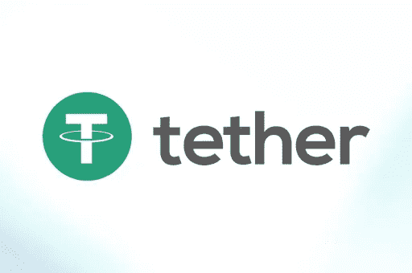

# 关于系绳的一些未知事实

> 原文：<https://medium.com/coinmonks/some-unknown-facts-about-tether-83fd71b0f211?source=collection_archive---------3----------------------->

你一定遇到过很多加密货币，包括最受欢迎的比特币。除了它，还有几个 altcoins，是在比特币成功之后出现的。在本文中，我们将讨论系绳。

# 介绍系绳

它是一种总部位于区块链的加密货币，其加密硬币由相同数量的传统法定货币支持，包括保存在选定银行账户中的日元、美元或欧元。

系绳代币在 USDT 下交易。如果你不了解 [**区块链加密新闻**](https://www.cryptoknowmics.com/news/blockchain) ，那么让我们告诉你，Tether 是一种稳定的货币，一种新的加密货币。

与价格可能大幅波动的[以太坊](https://blog.coincodecap.com/tag/ethereum/)和[比特币](https://blog.coincodecap.com/tag/bitcoin/)相反，Tether 的主要目标是稳定加密货币市场。这使得系绳作为交换媒介很有用。

系绳硬币是一种法定抵押的稳定硬币。它不同于其他[稳定债券](https://blog.coincodecap.com/tag/stable-coins/)，后者包括加密抵押[稳定债券](https://blog.coincodecap.com/tag/stable-coins/)。设计系绳硬币的主要目的是在加密货币和法定货币之间建立一个重要的联系。除此之外，它还旨在为用户提供稳定性。它与美元挂钩，与美国法定货币保持 1 比 1 的比率。

然而，2015 年 2 月在交易中首次亮相的 Tether Ltd .并没有用真金白银为交易所提供任何担保。所以它表明与美元交换系绳是不可能的。但它确实有责任确保法定货币的储备数量。如果你今天没有关注 [**比特币新闻**](https://www.cryptoknowmics.com/) ，那么你可能不知道[比特币](https://blog.coincodecap.com/tag/bitcoin/)80%的交易是在系绳中完成的这个事实。

这种稳定的货币被认为是加密货币市场流动性的主要来源。关于 Tether coin，你必须知道的另一个有趣的事实是，在 2014 年 7 月推出时，它最初被称为 RealCoin。但在 11 月，系绳有限公司给它起了一个新名字“系绳”。

# 面临争议

追溯到 2017 年 11 月，有一份关于系绳硬币的报告，由于黑客攻击，价值 3100 万美元的硬币被盗。然后在 2018 年 1 月，它面临另一个问题，当时作为一项强制性审计，它应该维持真实世界的储备，但这从未发生，而是犯了一个错误，宣布离开审计事务所。这使得监管机构对其发出传票。

> [在您的收件箱中直接获得最佳软件交易](https://coincodecap.com/?utm_source=coinmonks)

