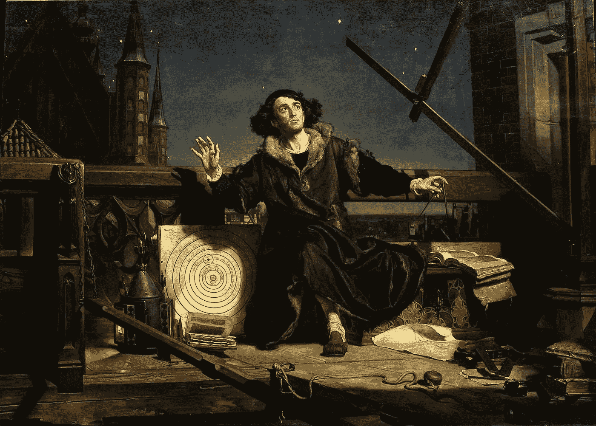
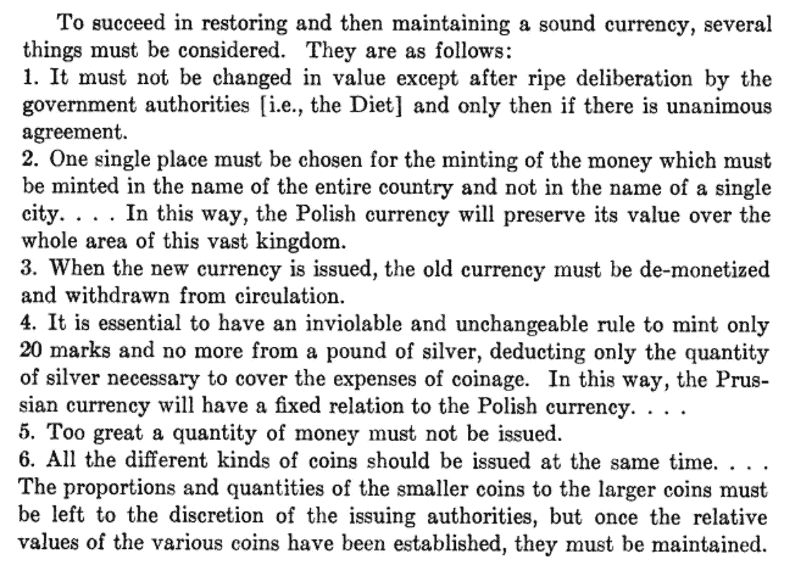

# 比特币和“健全货币”

> 原文：<https://medium.com/coinmonks/sound-money-for-people-in-a-hurry-e8481b912f07?source=collection_archive---------1----------------------->

大量关于比特币和区块链技术的书籍和文章已经问世——通常涵盖了大量人类历史和思想——都是关于“可靠货币”的简单概念。

如果你正在建立一个关于这个主题的图书馆，这是一件令人兴奋的事情。

但是，对于我们这些处理得比阅读得少的人来说，这些智力财富也正因为过于细微的不和谐而变得混乱。

例如，在比特币社区的密室里，人们小声讨论着*声音货币*的话题，而且是在跪了很久之后。比特币压倒一切的价值主张是，它拥有独一无二的承诺，能够成为人类有史以来最健康的货币形式。

那些不相信比特币是典型货币的人倾向于认为，这种对可靠货币的痴迷要么完全被误导了，要么按照他们的定义，比特币远没有可靠国家发行的法定货币那么可靠。

似乎没有既定的启发，我们都可以同意，帮助我们冷静地思考这个“健全的货币”到底是怎么一回事，相反，为什么我们都肆意生活在一个不健全的货币矩阵。

向任何一方要求简化版本都没有意义。

事实上，情感是如此的原始，观点是如此的固定，以至于在这件事上，你甚至没有资格发表你自己*的观点。如果你敢于寻求真知灼见，人们会开始当着你的面引用书籍。在你知道是什么击中了你之前，你将回到起点，比你开始时更加失落，对你的头盖骨的相对大小感到不舒服。(还是只有我这样？)*

但是，不要害怕。我有解决办法。

以下是合理货币真正含义的简化版本。而且，从所有的意图和目的来看，它似乎提供了其他人用 1%的努力所能提供的 99%的洞察力。额外的好处是，你不需要忍受阅读任何关于这个主题的错综复杂的书籍，或者忍受难以忍受的万事通对你微不足道的大脑的虐待。(发生这种情况，我可以作证。)

***Astronomer Copernicus, conversation with God***. Jan Matejko. 1872 (AKA, Whoa! Where’s my other leg?)

因此，在不允许我自己的想法过多地介入这场辩论的情况下，我希望给你指出一个简单的方法，让你自己来决定什么是健全的货币。

这种方法是由哥白尼在 16 世纪早期创立的。我们已经知道他是一位杰出的，更重要的是，真正的科学家，他通过他的书**发明了现代天文学的基础。当然，你可以不读，但这显然让他与牛顿和达尔文相提并论。所以，当你说出“哥白尼”的名字时……嘣！你已经在高地了！)**

*通过考虑哥白尼关于健全货币的观点作为你自己的基础，你可以放心地知道，在这场辩论中，你比任何人都有更多的灰色物质站在你这一边。此外，另一个好处是，你还可以避免判断自己的观点是否与某个偏爱经济学、人类学、社会学或政治学传统的人在这个问题上的最新言论一致。*

*你可以对整个事情采取一种更超然的(眨眼)“宇宙”的观点。*

*还有另外两个原因。*

*首先，我认为哥白尼在这场辩论中没有发言权是非常不公平的，尤其是当他似乎早在其他人受到影响之前就预言了人们似乎坚持认为真正“重要”的事情。第二，他的观点来自于在采煤工作面的实际经历，而不是来自于坐在扶手椅上的天马行空的思考；在与条顿骑士团持续不断的战争期间，盖伊在波兰王国的一个公国中担任行政长官，负责经济事务和货币体系。(哦，他在‘声音货币’上的所有工作都是作为一种兼职，而他白天在天文学上做真正的科学！)*

*在 1955 年发表在《思想史杂志》上的一篇出色的文章中，J .泰勒先生提供了哥白尼关于健全货币的观点的译文，该译文来自原文的拉丁文。(那篇文章值得一读，但是，如果你真的很急，甚至*那个*都没有必要。)*

*它表明哥白尼从观察大量货币的第一原则开始考虑健全的货币，所有这些货币都是基于它们的货币中一定比例的金或银。在艰难时期(主要是战争)，他看到了每一种货币在可替代性上的不对称退化。他悲叹对发行这些硬币的政府的信任度下降。(我真的*顺便做*意思是哀叹。想想珠儿:“啊，可怜的普鲁士王国，它正以你的毁灭为代价，唉，为一个坏政府的错误买单！”)他看到了经济活动的收缩，可信铸币税的崩溃，以及普遍的通货膨胀的有害影响。*

*有趣的是，哥白尼关于健全货币的思想也表明，在格雷欣提出格雷欣定律几乎一个世纪之前，他就预言了格雷欣定律。他是这样描述这个问题的:*

> *“事实上，你在哪里能找到愿意用他的商品换铜钱的外国商人呢？……然而，当局却无动于衷地看着这场可怕的灾难发生在普鲁士。……当普鲁士货币以及整个国家都深受其害时，只有珠宝商和金条商从我们的痛苦中获利。他们拿出旧的(好的)硬币，将它们熔化，以出售白银，这样，他们从街上无知的人那里获得的白银价值就比硬币的交换价值要高。当最好的旧硬币完全消失后，他们会挑出仍在流通的最不差的硬币，只留下最差的硬币作为货币流通。”*

# *哥白尼健全货币的六个方面*

*不管怎样，废话不多说，下面是哥白尼认为在定义健全货币时很重要的六个方面。*

**

*Copernican Theory for Sound Money. (Taylor, 1955)*

*你可能会认为，在我们当前通过复杂的外汇市场互动的加密货币和主权法定货币的背景下，这六条规则似乎没有多大用处。*

*相反，我认为这些来自 500 年前的哥白尼式的见解仍然是全部的瑰宝。而且，一旦我们仔细考虑他们的意图，他们可以很容易地嫁接到我们自己对当前环境的理解上。毕竟，纯粹的洞察力是永恒的。*

*本着这种精神，下面是我对哥白尼健全货币的六个原则的评论:*

1.  *他提出的第一点是关于改变影响货币价值的规则的共识的重要性。哥白尼的论文包含了尖锐的段落，他哀叹多种货币竞争的不利后果；*
2.  *用*世界*替换“国家”,用*国家*替换“城市”,因为他说的是不同的统治君主国，它们都发行自己的货币。哥白尼倾向于一种方法，在这种方法中，健全的货币是普遍的，并形成了驱逐几种不健全货币的动力；*
3.  *与此相关的是，他关心的主要是尽量减少“……新的(健全的)货币和旧的(贬值的)货币同时流通引起的混乱……”。哥白尼是一个健全的货币至上主义者；他设想健全的货币将被完全采用，所有旧货币将退出流通。*
4.  *不管你对比特币的态度如何，有一个“… **不可侵犯且不可改变的规则**”作为发行健全货币的基础，这一点应该会让你觉得，Satoshi 和哥白尼会有一段狂欢的时间来谈论健全货币的基础。黄金和白银作为哥白尼健全货币的基础在 16 世纪初是有意义的，但他没有其他选择。毫无疑问，他认为他们是一种妥协，因为他观察到各种货币发行的君主国是如何被他们肆无忌惮的破坏硬币中贵金属的纯度。*
5.  *稳健的货币应该有一个可预测的供给率(T2)。对哥白尼来说，这应该由硬币的金属价值加上它的铸造成本来决定，这增加了一个单独的价值来源:它所携带的……保证使硬币的价值超过了金属本身的价值。*
6.  ***可分性是可取的**，它应该以可预测的方式提供给公众，而不是作为降低货币整体稳健性的潜在来源。*

*那么，就这样了。*

*同时考虑其他 20 个方面，把自己扭曲成一个椒盐卷饼并不会带来额外的好处。它们似乎是从这些更简单的哥白尼原始理论中自然产生的。例如，健全的货币应该作为价值储存手段、交易媒介、长期规划的基础和无数其他东西，这些想法都与更全面的考试非常相关，但不要进入 TL；我的博士版本。哥白尼的六个方面涵盖了你真正需要的一切，让你对健全的货币有一个工作直觉。*

*当然，这是另外一个问题，他们*也*碰巧提供了一些关于比特币作为健全货币的非常有用的思想食粮，无论是在原则上还是在实践中。*

> *[直接在您的收件箱中获得最佳软件交易](https://coincodecap.com/?utm_source=coinmonks)*

**

# *❤️喜欢，分享，留下你的评论*

*如果你喜欢这篇文章，不要忘记喜欢，与你的朋友和同事分享，并在下面留下你对这篇文章的评论。跟我来……*