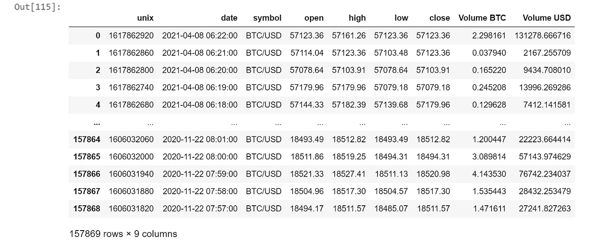
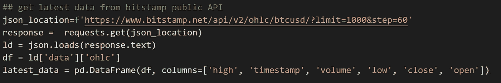

# 获取当天加密数据

> 原文：<https://medium.com/coinmonks/sourcing-intra-day-crypto-data-c804ea199baf?source=collection_archive---------2----------------------->

Photo by [André François McKenzie](https://unsplash.com/@silverhousehd?utm_source=unsplash&utm_medium=referral&utm_content=creditCopyText) on [Unsplash](https://unsplash.com/s/photos/cryptocurrency?utm_source=unsplash&utm_medium=referral&utm_content=creditCopyText)

# **简介**

我最近一直在做一个项目，为比特币定价建立一个日内预测模型( [bitcoinpredict10](https://aws.amazon.com/marketplace/pp/prodview-4upbyugt7qm62?qid=1617890746600&sr=0-1&ref_=srh_res_product_title) )。该模型建立在一个大型的一分钟历史价格数据集(来源于 [Kaggle](https://www.kaggle.com/datasets?search=crypto) )上，这给了我们很大的灵活性，因此，这意味着最终的模型需要大约两周的一分钟价格点来进行预测。

我们认为在生产模型中获取数据会很容易，因为有许多供应商和交易所提供加密数据点。然而，我们在发布后发现，我们需要的生产数据集很难找到，或者对用户来说成本很高，因此，我们认为其他人可能会遇到相同的问题，找到稍长的最新免费数据集。

# 解决方案

本文将讨论我们如何使用来自 [Bitstamps 公共 API](https://www.bitstamp.net/api/) (大多数加密货币交易所都提供类似的 API)和网站 C[ryptodadadownload](https://www.cryptodatadownload.com/data/)的免费交换数据来解决我们的问题。示例代码将用 Python 编写，可以在以下存储库中找到。为了连接到两个站点并操作/存储数据，我们将使用以下库:-

*   pandas——使用 panda DataFrame 存储和操作数据。
*   json — Bitstamp 在 json 文件中发送其数据。
*   csv-来源于 CryptoDataDownload 的较大数据集将在 CSV 文件中返回。
*   ssl — CryptoDataDownload 使用安全套接字，因此我们需要它来连接到站点。
*   请求—向两个网站的 API 发送查询。

对于这个例子，我们将把货币对称为 BTCUSD(比特币和美元)。在 CryptoDataDownload 网站上，我们将从 BTCUSD 对的 Bitstamp exchange 获取数据。

第一部分指定数据位置。在第二步中，我们创建一个用于连接的安全套接字。在最后一步中，我们跳过第一行获取数据，因为这有网站地址。让我们来看看数据帧 hist_data。

数据集包含 Unix 时间戳、日期、符号、该分钟的开盘价、最高价、最低价和收盘价，以及 BTC 交易量和美元交易量。这个数据集叫做开盘-盘高-盘低-收盘(OHLC)。

接下来，我们通过调用链接到 OHLC 的 API 来获取位戳数据，获取 1 分钟的分笔成交点数据(步长参数)，并将数据集限制为 1000 个数据点(限制参数)，调用 BTCUSD。

该代码指定网站位置和参数；我们使用 request.get 调用它，并使用 json.loads 加载 JSON 文件。然后将它加载到具有指定列的 DataFrame 中。我们可以看看最新数据是什么样的吗:

我们可以看到两个数据帧之间的一些数据差异，因此我们需要创建新列，重命名列名并移动列位置以匹配数据集。下面的代码执行这些步骤。

代码步骤:-

*   在第一部分中，我们在 latest_data 中创建新列；
*   然后我们重命名这个数据帧中的列；
*   接下来，我们在 hist_data 中选择最新的 20160 (2 周)的数据点，并删除符号列；
*   然后我们重命名列以匹配 latest _ data(Bitstamp)；
*   然后，我们在 latest_data 中获得最早的数据点，并从 hist_data (CryptoDataDownload)中移除在此之后的所有数据点，并颠倒 hist_data(现在称为 dat)数据顺序，因为它最初是开始时的最新数据。相比之下，最新数据 Bitstamp 排在最后。

最后，我们需要将数据放在一起(也就是连接两个数据集)；这是使用 append 命令完成的。最后，我们使用 tail 命令为组合数据集选择最后两周的数据。

最终输出如下所示:-

# 结论

这到底是怎么回事？在这篇文章中，我们已经学会了如何从两个独立的网站获取 OHLC 数据，并将它们结合起来。组合数据集可用于生产模型中，用于可能的交易策略或应用，如加密货币的趋势分析。我们调用的最后一个函数是 [GetData_Smush](https://github.com/llama-analytics/GetDataSmush/blob/main/GetData.py) 。

## 另外，阅读

*   最好的[密码交易机器人](/coinmonks/crypto-trading-bot-c2ffce8acb2a)
*   [印度比特币交易所](/coinmonks/bitcoin-exchange-in-india-7f1fe79715c9)
*   [比特币储蓄账户](/coinmonks/bitcoin-savings-account-e65b13f92451)
*   最好的[加密税务软件](/coinmonks/best-crypto-tax-tool-for-my-money-72d4b430816b)
*   [电网交易](https://blog.coincodecap.com/grid-trading) | [区块链审核](/coinmonks/blockfi-review-53096053c097)
*   [最佳加密交易所](/coinmonks/crypto-exchange-dd2f9d6f3769)