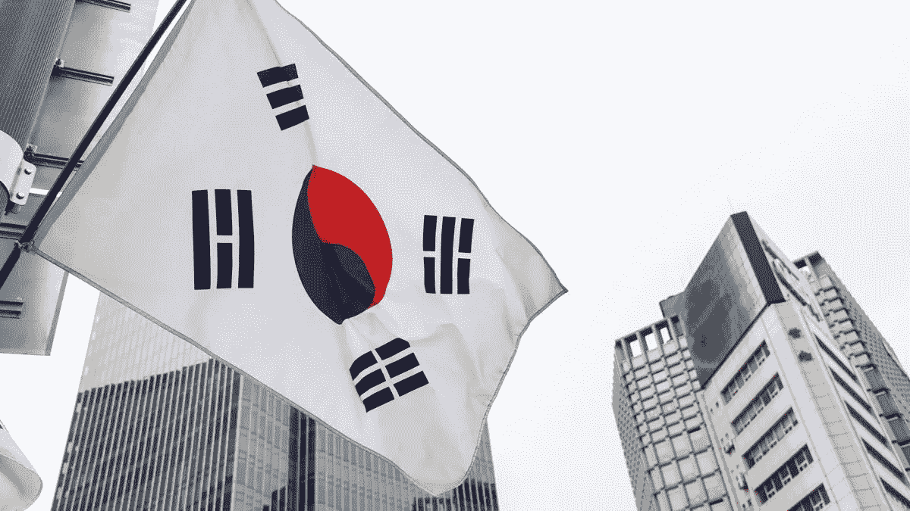

# 韩国:Coinone 将禁止向未经验证的外部钱包提款

> 原文：<https://medium.com/coinmonks/south-korea-coinone-will-ban-withdrawals-to-unverified-external-wallets-43fcfdc0ec4c?source=collection_archive---------13----------------------->

这可能是一个新时代的开始，还是仅仅是一个地方特色？在韩国，关于加密货币的立法似乎确实比其他地方更严格，尤其是在身份验证方面。例如，交易平台 **Coinone** 已经决定暂停向未经验证的外部钱包提款，因为**元掩码**可以。

