# 使用朴素贝叶斯的垃圾邮件检测器

> 原文：<https://medium.com/coinmonks/spam-detector-using-naive-bayes-c22cc740e257?source=collection_archive---------3----------------------->


photo is completely irrelevant to the post!!!

## 感应

在这篇文章中，我将实现 ***朴素贝叶斯*** 算法来检测垃圾短信。如果你对 ***朴素贝叶斯*** 算法不熟悉，我推荐你去访问 [***这个***](/@jindeshubham/naive-bayes-theorem-d8854a41ea08)*我曾经讲解过算法的地方。我们将建立模型，该模型将把 [***数据集***](https://archive.ics.uci.edu/ml/datasets/SMS+Spam+Collection)*SMS 消息分类为垃圾消息或非垃圾消息。对于垃圾短信可能是什么样子有一定程度的直觉是很重要的。通常它们会有“免费”、“赢”、“赢家”、“现金”、“奖品”之类的词，因为这些文字旨在吸引你的眼球，并在某种程度上诱使你打开它们。此外，垃圾邮件往往有全大写的单词，也往往使用许多感叹号**

## ****步骤 1.1:了解我们的数据集****

**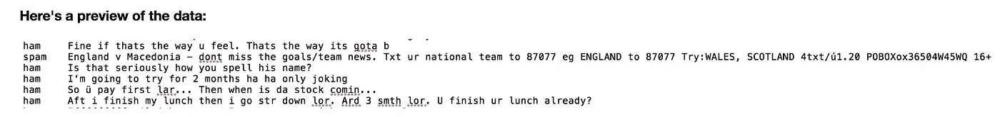**

**数据集中的列目前还没有命名，如您所见，有 2 列。**

**第一列有两个值，“ham”表示该邮件不是垃圾邮件，“spam”表示该邮件是垃圾邮件。**

**第二列是正在分类的 SMS 消息的文本内容。**

## **步骤 1.2:数据预处理**

**现在，我们对数据集有了基本的了解，让我们将标签转换为二进制变量，0 表示“ham”(即不是垃圾邮件)，1 表示“spam”，以便于计算。**

**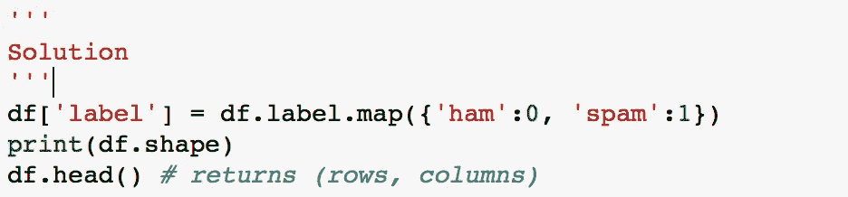****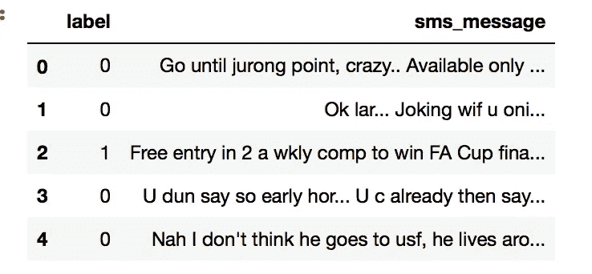**

## **步骤 2.1:单词袋**

**我们的数据集中有大量的文本数据(5，572 行数据)。大多数 ML 算法依赖于数字数据作为输入，而电子邮件/sms 消息通常是大量的文本。**

**在这里，我们要介绍单词包(BoW)概念，这个术语用于指定需要处理的具有“单词包”或文本数据集合的问题。BoW 的基本思想是获取一段文本，并计算该文本中单词的频率。值得注意的是，BoW 概念单独处理每个单词，单词出现的顺序无关紧要。**

**我们的目标是将这组文本转换为频率分布矩阵，如下所示:**

**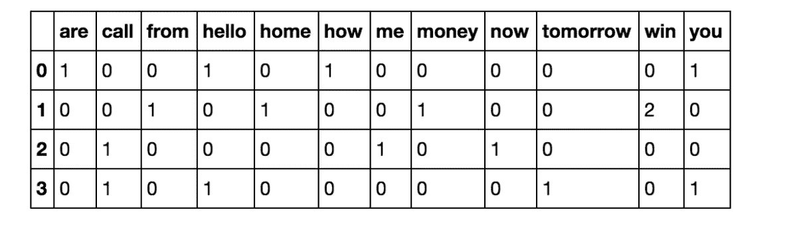**

**这里我们可以看到，文档按行编号，每个单词是一个列名，对应的值是该单词在文档中的出现频率。**

**让我们分解一下，看看我们如何使用一小组文档来完成这种转换。**

**为了解决这个问题，我们将使用 sklearns [计数矢量器](http://scikit-learn.org/stable/modules/generated/sklearn.feature_extraction.text.CountVectorizer.html#sklearn.feature_extraction.text.CountVectorizer)方法，该方法执行以下操作:**

# **步骤 2.3:在 scikit-learn 中实现单词包**

**既然我们已经从零开始实现了 BoW 概念，那么让我们继续使用 scikit——学习以干净简洁的方式完成这个过程。我们将使用与上一步相同的文档集。**

**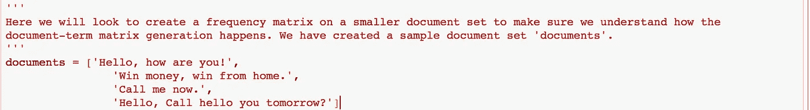****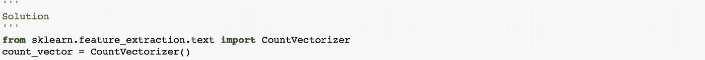**

**CountVectorizer 会将所有文本转换成 ***小写，*** 会删除所有 ***标点符号*** 和所有 ***停用词*** 。**

```
**CountVectorizer(analyzer='word', binary=False, decode_error='strict',
        dtype=<class 'numpy.int64'>, encoding='utf-8', input='content',
        lowercase=True, max_df=1.0, max_features=None, min_df=1,
        ngram_range=(1, 1), preprocessor=None, stop_words=None,
        strip_accents=None, token_pattern='(?u)\\b\\w\\w+\\b',
        tokenizer=None, vocabulary=None)**
```

**在文档上应用计数矢量器。**

**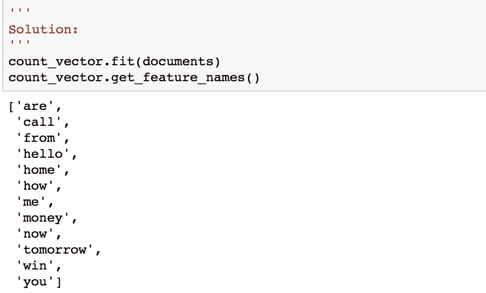**

**现在我们需要将文档表示为单词的频率。**

**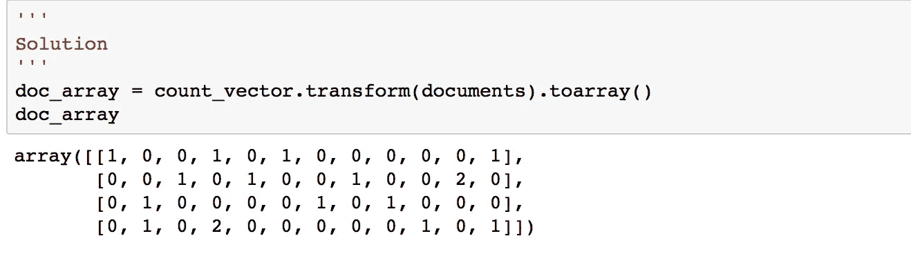**

**现在，我们有了一个清晰的文档表示，即文档中单词的频率分布。为了更容易理解，我们的下一步是将这个数组转换成 dataframe，并适当地命名这些列。**

**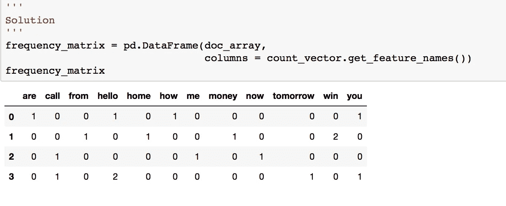**

## **步骤 3.1:训练和测试集**

**现在我们已经了解了如何处理单词袋问题，我们可以回到我们的数据集，继续我们的分析。在这方面，我们的第一步是将数据集分成训练集和测试集，以便稍后测试我们的模型。**

**我们将从***sk learn . cross _ validation***模块中使用***train _ test _ split***。**

**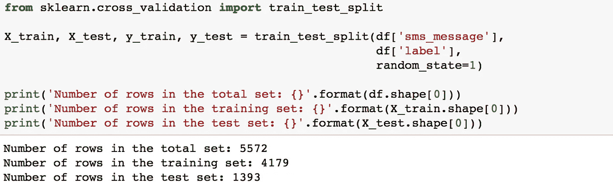**

## **步骤 3.2:将单词包处理应用到我们的数据集。**

**现在我们已经分割了数据，我们的下一个目标是遵循步骤 2:单词包中的步骤，并将我们的数据转换为所需的矩阵格式。为此，我们将像以前一样使用 CountVectorizer()。这里需要考虑两个步骤:**

*   **首先，我们必须将我们的训练数据(`X_train`)放入`CountVectorizer()`并返回矩阵。**
*   **其次，我们必须转换我们的测试数据(`X_test`)来返回矩阵。**

**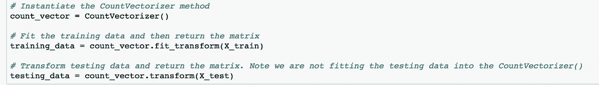**

## **步骤 4:使用 scikit-learn 实现朴素贝叶斯**

**我们将使用 sklearns `sklearn.naive_bayes`方法对我们的数据集进行预测。**

**具体来说，我们将使用多项式朴素贝叶斯实现。这个特定的分类器适合于具有离散特征的分类(例如在我们的例子中，文本分类的字数)。它接受整数字数作为输入。另一方面，高斯朴素贝叶斯更适合连续数据，因为它假设输入数据具有高斯(正态)分布。你可以在这里找到不同的朴素贝叶斯变种[](http://scikit-learn.org/stable/modules/naive_bayes.html)*。***

***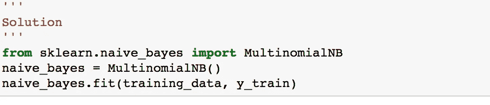******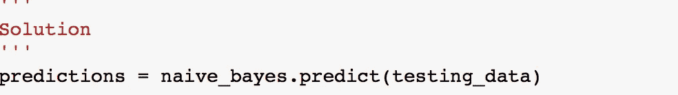***

## ***步骤 5:评估我们的模型***

***既然我们已经对测试集进行了预测，我们的下一个目标是评估我们的模型做得有多好。有各种各样的机制可以做到这一点，但首先让我们快速回顾一下。***

*****准确性**衡量分类器做出正确预测的频率。它是正确预测的数量与预测总数(测试数据点的数量)的比率。***

*****Precision** 告诉我们被我们归类为垃圾邮件的邮件中，实际上有多少是垃圾邮件。它是真阳性(分类为垃圾邮件的单词，实际上是垃圾邮件)与所有阳性(分类为垃圾邮件的所有单词，无论分类是否正确)的比率，换句话说，它是***

***`[True Positives/(True Positives + False Positives)]`***

*****Recall(sensitivity)** 告诉我们实际上是垃圾邮件的邮件中有多少被我们归类为垃圾邮件。它是真阳性(分类为垃圾邮件的单词，实际上是垃圾邮件的单词)与所有实际上是垃圾邮件的单词的比率，换句话说，它是***

***`[True Positives/(True Positives + False Negatives)]`***

***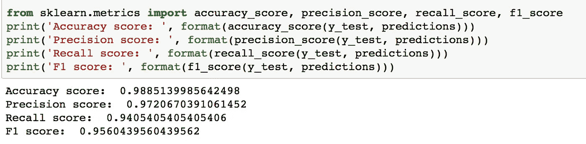***

## *****结论*****

***与其他分类算法相比，朴素贝叶斯的一个主要优势是它能够处理大量的特征。在我们的例子中，每个单词都被视为一个特征，有成千上万个不同的单词。此外，即使存在不相关的特征，它也能很好地执行，并且相对不受它们的影响。它的另一个主要优点是相对简单。“朴素贝叶斯”开箱即用，很少需要调整它的参数，除非通常在数据分布已知的情况下。它很少过拟合数据。另一个重要的优势是，对于它可以处理的数据量来说，它的模型训练和预测时间非常快。总而言之，朴素贝叶斯真的是算法中的瑰宝！***