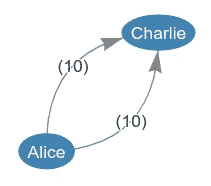
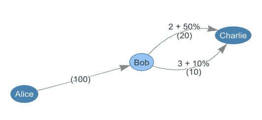
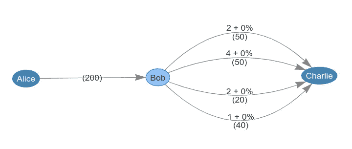
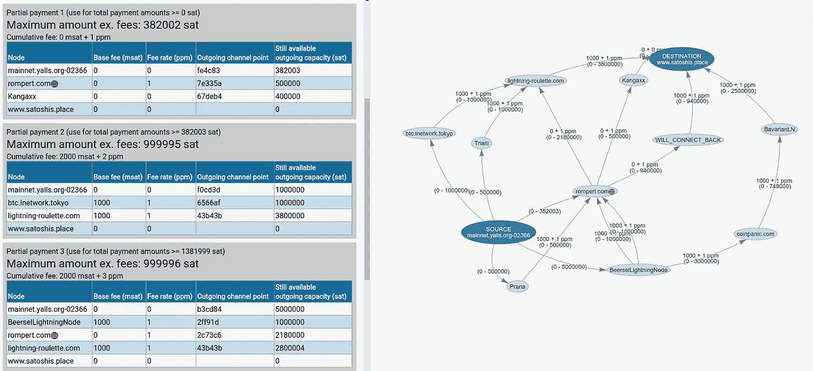
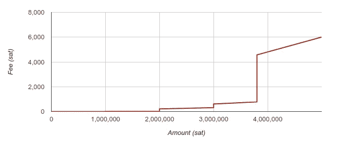
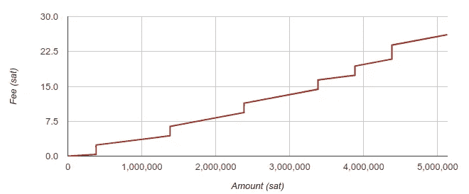

# 闪电网络中多路径支付的特定费用路由

> 原文：<https://medium.com/coinmonks/specific-fee-routing-for-multi-path-payments-in-lightning-networks-b0e662c79819?source=collection_archive---------4----------------------->

## 支付费用最小化的启发式算法

Photo by [Nick Fewings](https://unsplash.com/photos/br9D5K3UTRQ?utm_source=unsplash&utm_medium=referral&utm_content=creditCopyText) on [Unsplash](https://unsplash.com/search/photos/highway?utm_source=unsplash&utm_medium=referral&utm_content=creditCopyText)

本文假设读者熟悉比特币、闪电、[原子多路(AMP)支付](https://lists.linuxfoundation.org/pipermail/lightning-dev/2018-February/000993.html)和[与金额无关的路由](/p/6409201ff5ed)的概念。

简而言之，AMP 就是将一笔付款拆分成多个部分付款，共同构成总金额。只有当所有部分付款都已收到时，收款人才能要求全额付款。这是它的*原子*方面。

本文描述了一个使用 route 属性的多路径支付路由算法，该属性将作为*特定费用*引入。它不是关于原子性的解决方案。

## 目标

给定闪电信道图、目的地节点和支付金额，找出一组路径和部分金额，这些路径和部分金额一起导致最小可能的总费用。

在下图中，爱丽丝和查理之间有两个通道。两个信道在 A 到 c 方向都有 10 sat 的容量，不涉及费用，因为没有中间跳。

在此图中，发送 15 sat 的付款仅可能使用两次部分付款，每次不超过 10 sat，合计 15 sat。

下图变得更有趣了:

这里，Alice 不需要构建多路径支付。她可以通过 Bob 与 Charlie 的昂贵的 2+50%渠道一次性支付 15 个 sat。总费用为 9.5 sat。通过较便宜的渠道进行单次支付是不可能的，因为该渠道的容量只有 10 sat。

然而，如果她使用两种渠道，并且不通过昂贵的渠道发送不必要的费用，她最终将得到:(2+5 的 50)+(3+10 的 10) = 4.5 + 4 = 8.5 sat 的总费用。

这也说明，如果单个路径的支付是不可能的，那么任何只将支付分成多个路径的算法都不可能是最优的。

## 复杂性

考虑下图。从 B 到 C 有多个渠道，都只有基础费，没有比例费成分。要支付 100 sat，有多种方式组成多路径支付。

事实上，有了这样的图，多路径路由问题开始类似于背包问题，[https://en.wikipedia.org/wiki/Knapsack_problem](https://en.wikipedia.org/wiki/Knapsack_problem)。

> 给定一组项目，每个项目都有一个权重和值，确定集合中要包含的每个项目的数量，使总权重小于或等于给定的限制，并且总值尽可能大

物品是渠道，重量是容量，价值是费用。这并不完全一样，因为我们正在寻找总重量(容量)超过限额(付款金额)且总价值(费用)尽可能小的物品。

真实频道图更复杂，并且每个部分付费减少了频道中可用于进一步部分付费的剩余容量。此外，需要在去往目标节点的路由上添加费用，从而减少最大支付金额。直觉上，我认为多路径路由问题至少和背包问题一样难解决，但是没有证据。

这也意味着路由算法需要使用启发式算法来解决问题。

## 与金额无关的路由

在当前的 Lightning 实现中，查找路线的过程是针对特定的支付金额来执行的。它返回特定数量的最佳路径。

对于多路径路由，这样一个特定数量的数据点不是很有用。有许多划分需要考虑，像这样对整个支付金额范围进行抽样是没有效率的。

相反，需要的是一组唯一的路线，每个路线对应一个或多个支付金额范围。该集合可以通过使用[独立于数量的路由算法](/p/6409201ff5ed)获得。

## 多途径支付

从独立于数量的路由，到多路径路由的步骤相对简单。但是让我强调一下，下面的内容并不保证会产生最佳的多路径划分。

基本想法很简单:对于第一次部分付款，选择金额和路线，给出最低的具体费用。具体费用定义为支付给目标节点的每笔*费用。例如，如果 10 sat 费用可以支付 100 sat，或者 12 sat 费用可以支付 150 sat，那么将后者作为第一部分付款(0.08 sat/sat vs 0.10 sat/sat)。这是算法的核心启发式部分。*

没有必要考虑所有的支付金额。对于单一路线，复合费用为*基础费用+费率*金额*。这意味着每次 satoshi 的最低费用总是在这条路线可以运载的最大数量时达到。金额越高，基本费用的相对影响越低。

因此，对于每条路线，每个 satoshi 的费用是根据其范围的上限计算的，结果最低的路线被选择作为第一部分付款。这也意味着在选择低费用、低容量的路线之前，可能会选择高费用、高容量的路线。比如 10+2%到 100 (0.12 sat/sat)用在 10+1%到 50 (0.21 sat/sat)之前。

在第一次部分支付之后，通过减去这些信道为第一次部分支付所携带的金额和费用来更新可用的信道容量。

然后，该过程通过再次运行与金额无关的路由算法、根据相同的特定费用标准选择第二部分支付并更新容量来继续。

重复该循环，直到再也找不到路线或者已经支付了所需的支付金额。

## 示例输出

下面是所描述算法的输出截图。

连接良好的节点通常会出现的情况是，有大量可能的路径通往目的地，随着支付金额的增加，越来越多的节点会参与多路径支付。

## 次优

存在这样的情况，其中该算法返回次优结果。在 Lightning 实施中，将针对特定数量执行多路径路由。这意味着几乎总是最后的部分支付没有使用路由的全部容量。倒数第二个部分不考虑这一点。倒数第二次付款可能具有最低的每周六费用，但另一条路线可能能够携带全部余额并避免第二次基本费用。

可能有更多导致次优结果的情况。需要进一步调查。

(强力)多路径路由测试集对于基准算法也是有用的。

## 结果

对于本文中描述的算法产生的最优单路径支付与多路径支付的费用水平，没有大量的测试结果可用。但是通常收益是巨大的。关于从雅尔斯到 Satoshi 住处的路线示例，请参见下面的图表。作为用户，你不再依赖于稀缺、高容量、高收费的频道。

Single-path fees

Multi-path fees

## 最后的话

原子多路径支付的想法非常有前途。未解决的问题是是否有一种算法可以在合理的计算时间内提供有保证的最佳路线。

实际上，任何合理的多路径路由算法都可以节省大量成本。通过这篇文章，我希望贡献出一种合理的算法。