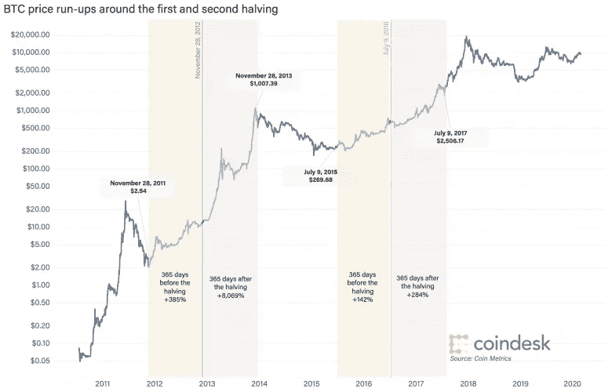
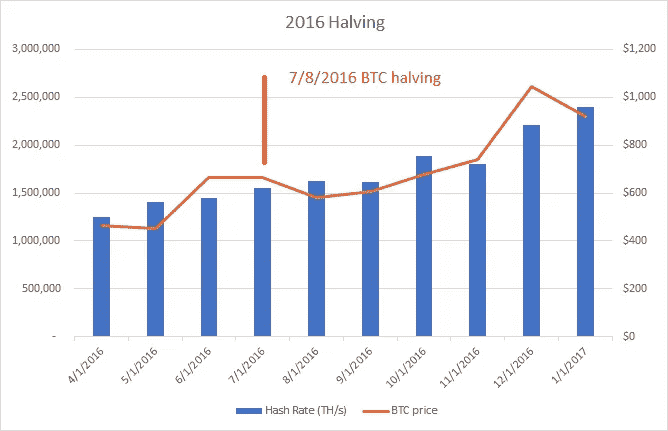
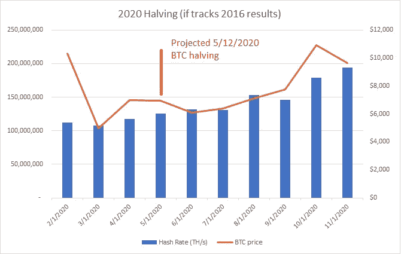

# 猜测比特币即将到来的块奖励减半

> 原文：<https://medium.com/coinmonks/speculating-on-bitcons-upcoming-block-rewards-halving-56ac4a44773?source=collection_archive---------1----------------------->

Image credit: CoinDesk / Coin Metrics

似乎比特币在过去 6 周还没有经历足够的剧烈波动，5 月 12 日将会带来比特币有史以来第三次集体奖励减半。区块减半是比特币供应曲线下降的关键，矿工的区块奖励每 4 年减半——这次从 12.5 BTC/区块降至 6.25。从长期来看，这对比特币价格来说往往是一个利好事件，因为每天引入市场的新创造的 BTC 数量减少了一半。但在短期内，减半对采矿效率和专业采矿部门的影响可能会给市场带来相当大的不确定性和波动性。

对于那些错过了它的人，Blockware Solutions (一家主要的 ASIC 经纪商和 BTC 前 20 大矿池的运营商)的一份出色的[报告详细描述了他们对减半前后比特币散列率、供应量和价格的预期，预计将于 5 月 12 日下降。](https://www.blockwaresolutions.com/research-and-publications/2020-halving-analysis)

我建议阅读整份报告，因为它全面而深思熟虑，但要点是，许多现有的比特币矿工，特别是那些电费较高和 S9 采矿钻机较旧的矿工，在当前价格约 6700 美元的盈亏平衡点以下运营。许多人继续在水下作业，因为固定成本和收回采矿设备投资，或者因为他们有电力合同，要求他们每月使用一定数量的电力，否则就会完全失去合同。这给 BTC 带来了价格下行的压力，迫使矿业运营商卖掉 BTC 的储量以维持运营。

随着减半的临近，区块软件模型的 BTC 价格实际上在减半之前下降到 5000 美元，哈希速率下降到当前水平的 81%(8990 万 TH/s)，因为低效的矿工关闭了。减半后，他们模拟散列率下降到当前水平的大约 45%(50.7 兆次/秒)，此时难度调整将生效。再加上每股 6.25 BTC 的较低报酬率，抛售压力将会减轻，回报将会流向效率更高的矿商(即那些资产负债表足够强健的矿商，它们不需要为了生存而卖掉每一个 BTC)。

# 这和 2016 年比特币减半相比如何？

尽管 Blockware 的分析在理论上是有道理的，但将它们的预测结果与比特币历史上另一个重大减半事件进行比较也是值得的。2016 年减半活动并没有像 Blockware 预计的 2020 年那样进行。在 2016 年，BTC 价格在 2016 年 7 月 8 日减半之前的 3 个月内从 466 美元上涨到 664 美元，在接下来的一个月下降到 580 美元(比减半前下降了 13%)，然后稳步上升，直到 2016 年 12 月达到 1044 美元的峰值。在观察期间，哈希速率从未从 2016 年 7 月 8 日的水平下降，到年底时，哈希速率提高了 54%，达到 240 万次/秒

如果 2020 年减半重复这一表现，它将看起来像这样，减半后小幅下降到 6，081 美元，但随后在 2020 年 10 月稳步上升到 10，942 美元:

Image credit: Original

# 结论

就个人而言，我倾向于支持 Blockware 的结论，即在 2020 年减半后，我们将看到 BTC 散列率和价格的大幅下降。2016 年，采矿业的竞争远没有那么激烈；哈希速率平均约为 140 万次/秒，略高于今天 1.2 亿次/秒的 1%。BTC 市值约为 70 亿至 80 亿美元，而今天为 130 亿美元。如今，正如 Blockware 的模型显示的那样，在奖金减半之前，已经有许多矿工在盈亏平衡以下运营，一旦 block 奖励减半，甚至会有更多矿工在盈亏平衡以下运营。凭借其在市场中的地位，Blockware 可以有效地估计矿商的盈亏平衡点和矿业公司的资产负债表(因此，它们可以通过用 BTC 储量弥补亏损来在水下运营多长时间)。似乎在 2016 年，矿工们的经营误差更大，在集体奖励减半后，很少有人退出采矿。2020 年不太可能出现这种情况。更广泛地说，仅从一个先前的数据点得出过于强烈的结论是危险的(2012 年减半发生在如此原始的 BTC 生态系统中，这不是一个有效的比较)。

如果区块软件的减半结果如预期的那样，散列率下降约 50%，BTC 价格相应下降，这可能为比特币在新的较低区块奖励制度下的新一轮反弹创造非常有利的条件，以及随之而来的矿商 50%的抛售压力。要注意的数字是 5000 美元和 5000 万次/秒；虽然加密没有保证，但这将是在 BTC 建立多头头寸的理想时机。

> [在您的收件箱中直接获得最佳软件交易](https://coincodecap.com/?utm_source=coinmonks)

