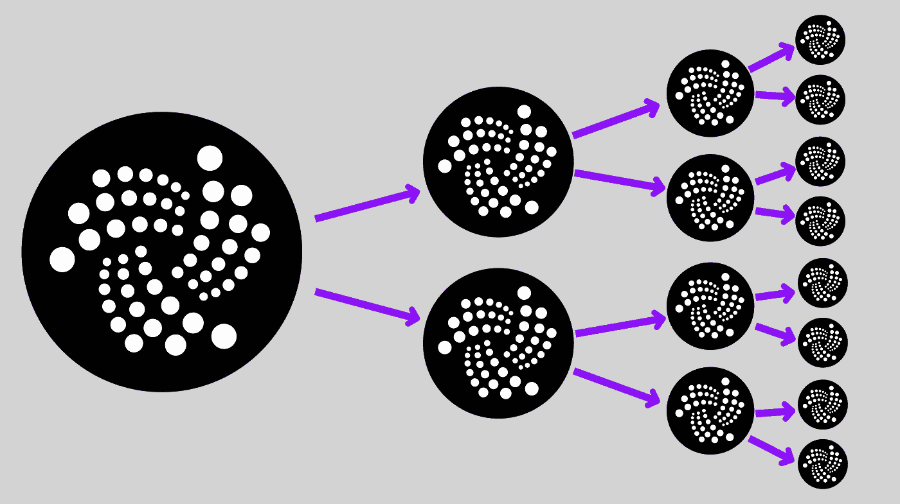
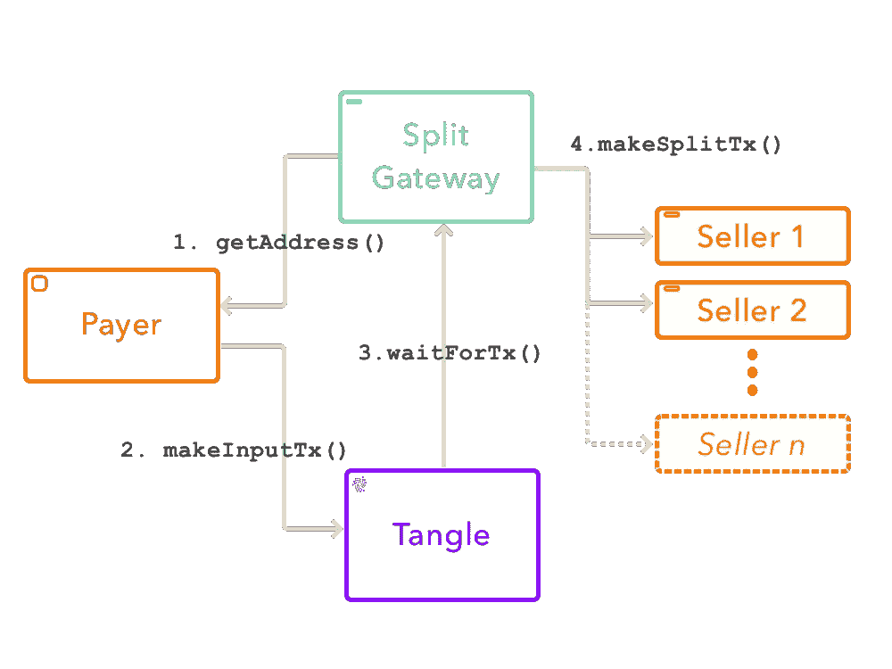

# 在 Tangle 上拆分交易

> 原文：<https://medium.com/coinmonks/splitting-transactions-on-the-tangle-ed02676ccd74?source=collection_archive---------6----------------------->

## 不，我们不会吹毛求疵…

Splitting the IOTA! Not as difficult as splitting the atom.

我最近加入了 Tangle fy(T2)团队，帮助在 Tangle 上构建电子商务的未来。

我们需要预先解决的一个关键挑战是实现一种在 tangle 上分割事务的方法。在 Tanglefy 的案例中，这是因为平台可以收取少量费用来维持运营，但人们可以想象出于其他原因需要分割交易。例如，您可以使用这种方法在产品售出时自动向供应商付款，或者两方或多方可以一起销售产品，每一方获得预定的收入份额。

现在我要注意的是，这是一种分割交易的**集中式**方法，到目前为止，还没有办法像其他分布式分类帐技术那样在 IOTA 上以不可信的方式做到这一点。Tanglefy 上的卖家需要相信我们，我们不会拿超过预定的提成——这在目前并不是一个真正的问题，因为买家和卖家都需要相信我们，因为还有很多其他原因。我们确实希望，随着神秘项目 q 的出现，我们将能够扩展这个想法。

在这篇文章中，我将概述我们计划如何在 Tangle 上实现这种事务拆分的基本架构。

这种方式会完美吗？号码

这种方法会有一些安全缺陷吗？可能吧。

这对我们俩来说都是一个学习的机会吗？是的。

让我们开始吃吧。

# 大致轮廓:

为了将 tangle 上的单个事务变成 2 个或更多，我们需要执行以下步骤。实际上，在此之前，让我们先记下一些名字:

*   让我们将拆分交易的服务称为**拆分网关**
*   我们将从**买方**到分割网关的第一笔交易称为**输入交易**
*   从分割网关到**卖方**的交易被称为**输出交易**

1.  买家查询**分割网关** API 并获得他们应该支付的地址(*注意:这是一次性地址)！*。分割网关创建一个状态为`pending`的新交易记录。
2.  买家通过 tangle 付款，然后通知**分割网关**付款已经完成，并附带一些识别元数据，如交易和捆绑包 id
3.  分割网关等待，直到交易在 tangle 上被确认，然后它根据定义的规则分割输入交易的价值(例如 50-50，或 70-30 分割的更多)。然后，**分离网关**获取**输出交易**(例如 Tanglefy 和卖方)的每个地址，并将这些交易提交给 tangle。
4.  一旦所有的**输出事务**被批准，分离网关将事务状态更新为`processed`。然后，它通知卖家发货，并通知买家交易已成功完成。

有道理吗？我仍然需要一些帮助，所以我画了一张小图:

# 可能的缺点:

使用上述方法，我需要解决几个问题:

## **如何处理故障？如果任何输出事务失败了怎么办？**

IOTA 的好处是我们不会把钱浪费在费用上，但是我们仍然需要一种方法来容忍失败，并且可能回滚。也许在步骤 1 中，用户可以发送一个退款地址，如果任何下游支付失败，拆分网关可以支付到该地址。这种方法的一个问题是，拆分网关可能会超出预算，因为下游支付需要被撤销。

## **该方法依赖于第三方状态。**

是的，我知道。理想情况下，我们可以管理缠结本身的状态。我目前正在开发的原型使用 MongoDB 来跟踪输入和输出事务的状态。也许我们可以想出一个聪明的方法来维护 Tangle 上的状态，但是我们仍然需要一个数据库来管理用户登录、api 密钥等等。

## **DDOS**

我们不必对此过于担心，因为如果输入事务的值为 0，我们可以简单地确保不启动下游事务。也许唯一需要担心的是大量的小额交易，但话说回来，这也是 IOTA 的一个要点。

## **获取下游付款的地址**

这是我有点担心的一个问题。因为地址重用预防措施*(注意我没有说问题*😉 *)* ，最好每次都能获得一个新的下游付款地址，以防卖家已经使用了那个地址。对于输入支付，这不是问题，因为我们可以用分割网关存储种子，但是如果输出交易的收款人之一从该地址消费，我们就有麻烦了。

一种选择是为每个收款人创建一个**持有账户**。然后收款人可以手动清空这个账户，每次给我们提供一个唯一的地址。另一种选择是，每个收款人运行一个小型服务器，该服务器可以根据他们的种子生成一次性地址。分割网关可以向服务器认证，并在每次需要支付时获得一次性地址。

我需要考虑一段时间。

# 后续步骤:

如果我们能做到这一点，这种方法将是提高支付效率的一个很好的方法。虽然有些人可能会对这种想法感到不满，认为这是在本无感觉的 DLT 上增加费用，但它使新的应用程序和服务能够在微支付上存在。总得想办法让灯亮着，对吧？

我甚至可以想象这些*分离网关*在某个阶段支付给其他*分离网关*——让复杂的资金路由变得超级简单，这一切都要感谢 tangle。

正如我上面所说的，我已经在构建一个概念验证，来看看这种方法的可行性。我相信我会继续学习的。如果你有兴趣跟随，查看我们的回购[这里](https://github.com/tanglefy)。事实上，如果你想有所贡献，请随时联系我们！我们目前正在寻找各种各样的开发人员。

我肯定我会修改这个设计很多次，我很喜欢你的建议和投入！欢迎在下面发表评论，或者向我提出一丁点的异议。

> 如果你喜欢这篇文章，给它一个❤️或👏或者随便你们这些疯猫现在怎么称呼它。
> 
> 永远欢迎捐款！ `*BJSLSJNPWSM9QLO9JYJAG9A9LLAUKZAQJGYZLNN9YMBNPCUUS9E9EYE9PIKIKNYHXAPNFAMDGXVIPVKIWGDUVDALPD*`