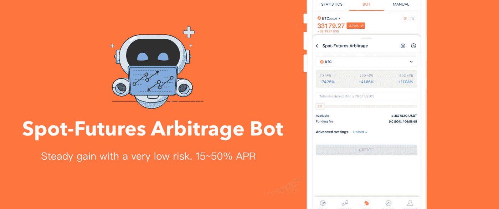
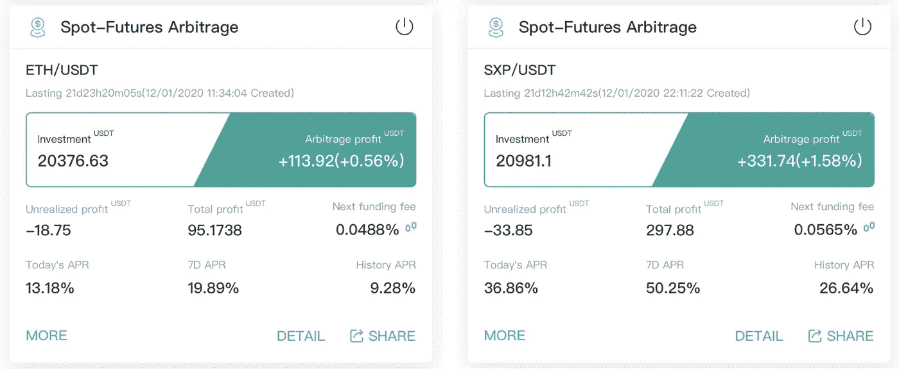
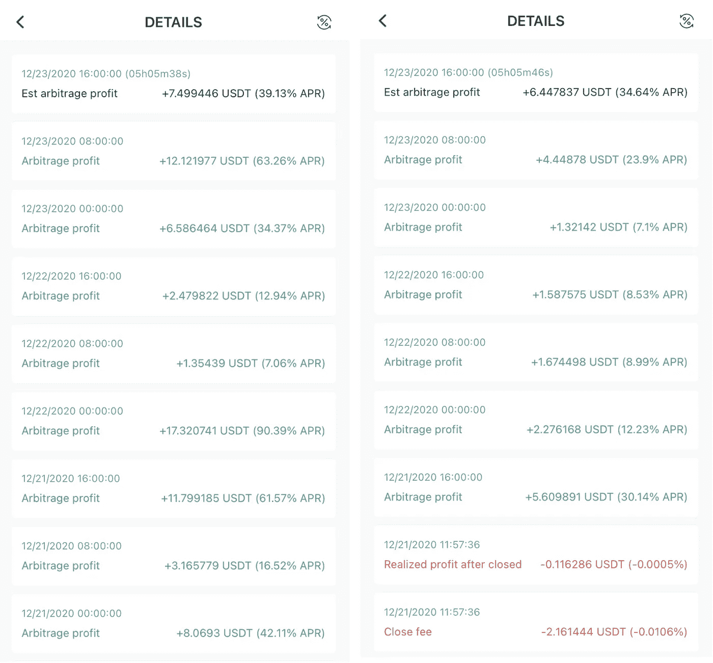
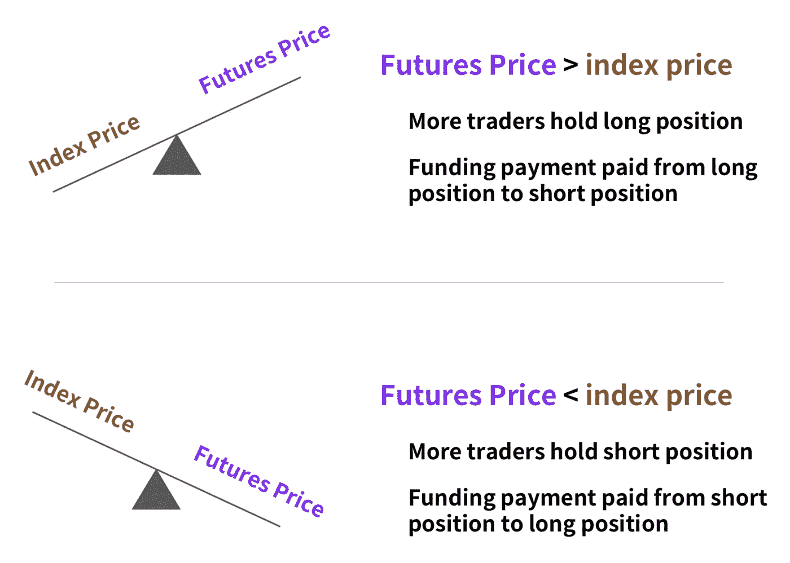
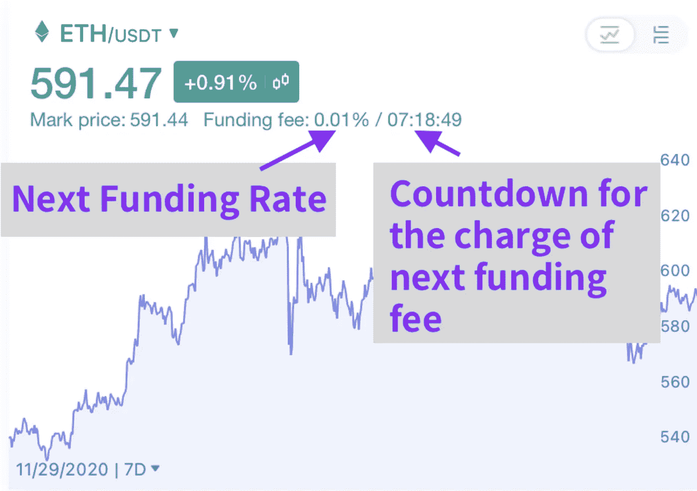
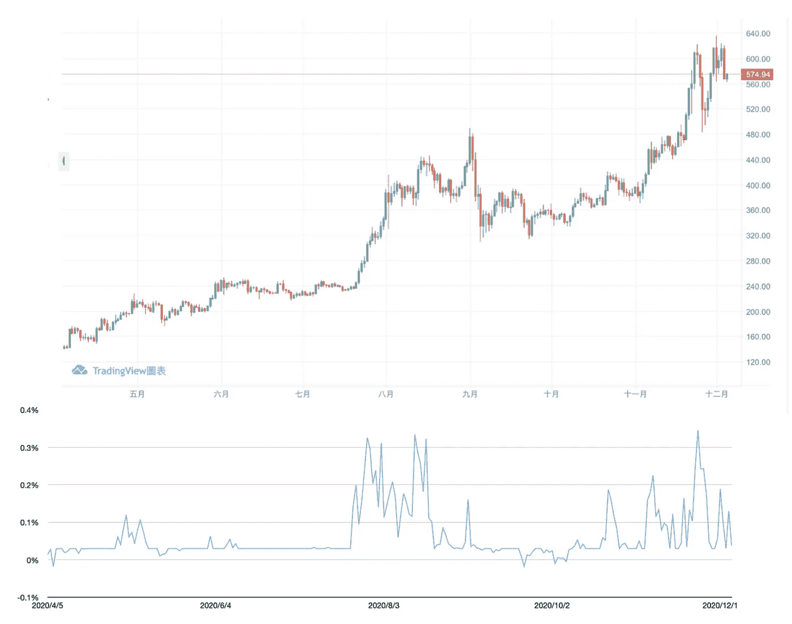
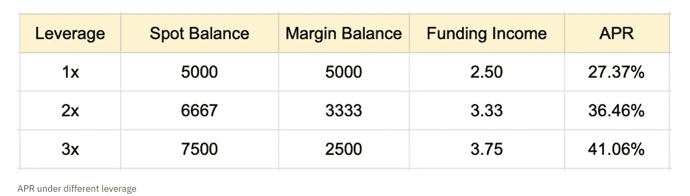
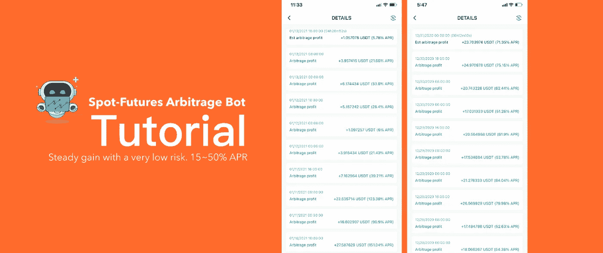
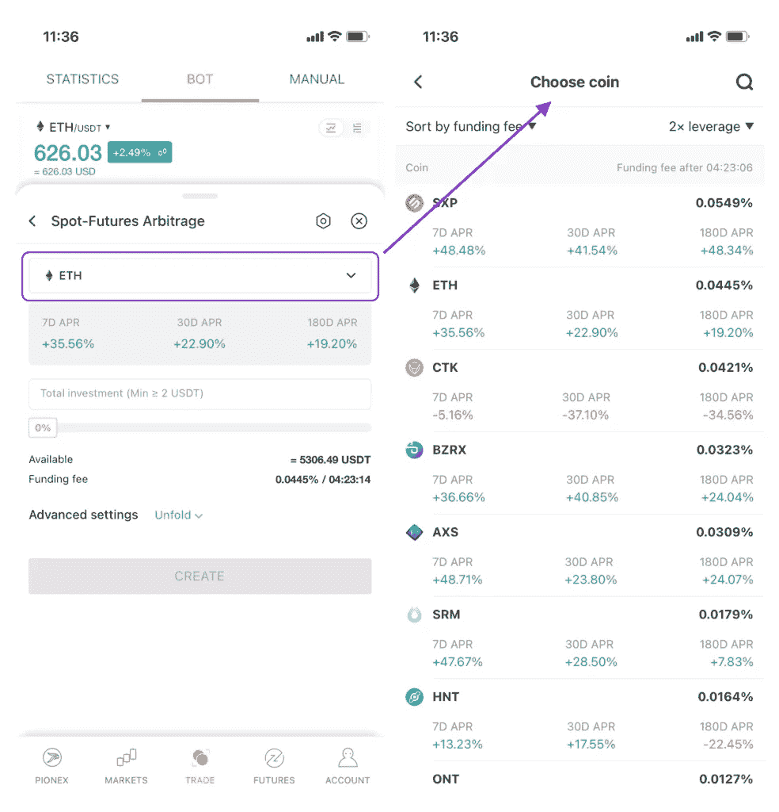

# 现货-期货套利策略

> 原文：<https://medium.com/coinmonks/spot-futures-arbitrage-strategy-earn-15-50-apr-with-extremely-low-risk-3b230949f103?source=collection_archive---------0----------------------->

## 以极低的风险赚取稳定的收入

## 动荡的密码市场中的套利机会

加密货币高度波动的市场给大多数投资者一种高风险高回报的投资印象。看到一个硬币飙升到 20%，然后在第二天走向 20%的修正，这很正常。除了现货市场，许多交易所还提供永久期货合约，允许交易者使用高达 125 倍的杠杆，使加密货币市场更加波动。

另一方面，每个市场之间的低效率给了我们大量的套利机会。利用套利策略很容易达到 15%~50%的 APR，我将向你展示如何从这些低效率中套利。

> *结果看起来很惊人吧？*
> 
> 在谈如何抓住套利机会之前，我先介绍一下永续期货合约的基本面。

## 什么是永久期货合约？

与传统期货不同，永续期货合约没有到期日，因此交易者可以像现货交易一样交易永续期货。这是永久期货合约在密码界如此受欢迎的主要原因之一。

> *通常，传统的期货合约按月或按季度结算。结算时，合约价格与现货价格一致，所有未平仓合约到期。*

由于永续期货合约从未以传统方式结算，**交易所需要一种机制来确保期货价格和指数价格定期趋同。这种机制也被称为*筹资率。*** 融资利率在我们将在下一节讨论的套利机会中扮演着重要角色。

## 资助率是多少

融资利率确保期货价格和指数价格有规律地趋同。因此，当永久期货合约的交易溢价(高于现货市场)时，由于正的融资利率，多头头寸必须支付空头。相反，当期货价格低于指数价格时，空头支付多头。

> 根据主要现货市场及其相对交易量，指数价格由资产的平均价格组成

**交易所不收取融资费。是点对点付费的。**

加密市场的大多数投资者喜欢持有多头头寸而不是空头头寸，这意味着持有多头头寸的交易者需要向持有空头头寸的交易者支付资金利率。

所以套利机会来了。我们可以在永续期货市场持有一个空头头寸，在现货市场买入相同的数量，对冲我们的总投资。**我们的投资不会因市场中性头寸而受到市场波动的影响，但会因我们在永续期货合约中的空头头寸而获得融资利率。**

## [现货期货套利](https://blog.coincodecap.com/pionex-arbitrage-bot)

综上所述，在永续期货市场持有空头头寸的同时，在现货市场持有等量的头寸。以市场中性头寸套利，每 8 小时收取一次资金利率。

融资利率由两部分组成:T2 利率和 T4 溢价。利率固定为每 8 小时 0.01%，溢价根据永久合同和标记价格之间的价格差异而变化。

根据币安联邦理工学院融资利率的历史数据，该利率在过去 6 个月中一直为正。在下面的图表中，当价格飙升时，价格会更高。如果我们每天可以获得 0.2%的资金利率，那么这个套利的表现将是 36.5%的年利率！

## 现货期货套利教程

假设我们有 10000 USDT 用于现货期货套利，而比特币的价格是 10000 USDT。我们要这么做:

1.  将 5000 USDT 转入期货账户，其余 5000 USDT 转入交易账户。
2.  用你的 5000USDT 在现货市场买入 0.5 BTC，在永久期货市场做空 0.5 BTC
3.  如果收费前的当前融资利率是 0.05%，那么你将得到 2.5 USDT。
    *0.5 * 10000 * 0.05% = 2.5 USDT*
4.  如果资金利率保持在 0.05%，我们每天可以收到 3 次，这意味着它是 27.375% APR
    *2.5 * 3 * 365 = 2737.5 USDT
    2737.5/10000 * 100% = 27.375%*

**为了增加年化回报，让我们利用永续期货中的杠杆。**如果我们以 2 倍的杠杆持有空头头寸，那么我们能够在永续期货市场上以 6666 USDT 买入 0.6666 BTC，同时以 3333 做空 0.6666 BTC。

与 1 倍杠杆
*0.666 * 10000 * 0.05% = 3.333 USDT*相比，我们将获得多 33%的融资费(3.333 USDT)

> ***2 倍杠杆下业绩增长至 36.46% APR；41.0625%年利率，3 倍杠杆！***

除了对您的空头头寸使用更高的杠杆，并检查具有更高融资利率的硬币列表，还应该考虑期货价格和指数价格之间的价格差异。

## 期货和指数价格之间的价格差距。

期货价格和指数价格之间的价差并不总是一个固定的数字。当你要停止机器人时，如果差距较低，就会产生一些利润，如果差距较高，就会遭受一些损失。

但没有那么多，你可以用 2~3 倍的资金利率收入来弥补损失。如果你注意到价格差距，你可能会从价格差距中获得一些利润。

*   如果价差为负，不要开始套利。
*   当缺口更低或为负时，完成你的套利策略，平仓。
*   正常情况下，差距大部分时间在-1%到 1%之间浮动。

现货期货套利是一种简单的策略，交易者可以手动操作，但由于波动性，最好使用工具来开仓和平仓。

## 手动进行现货-期货套利的风险

手动执行现货期货套利有一些风险，你需要提前知道。

1.  当你的期货头寸发生自动去杠杆化时，你不能减少你在现货市场的头寸。
2.  价格快速上涨，你的空头头寸被平仓，因为你不能提前平仓。

以上两个例子向我们展示了在特定的市场条件下，我们的市场中立地位是如何被打破的。为了消除上述风险， [**Pionex**](/coinmonks/pionex-review-exchange-with-crypto-trading-bot-1e459d0191ea) 提供了一个现货-期货套利的 bot。以下是机器人如何处理潜在风险:

1.  该机器人将检测您在现货和期货市场的头寸，即使自动去杠杆化(ADL)发生，也能保持市场中立的头寸。
2.  机器人会在清算价格前 5%平仓你的期货头寸。这样你就不会被清算，支付清算费用。

## [Pionex](/coinmonks/pionex-review-exchange-with-crypto-trading-bot-1e459d0191ea) 现货期货套利机器人

**第一步。**下载 [Pionex App](http://www.pionex.com/download) 。向下滚动到 bot 列表的底部，然后单击 arbitrage bot。

**第二步。**选择套利的目标硬币和首选杠杆。单击硬币旁边的下拉按钮，您将看到按当前资助率排序的列表。(在 Pionex app 上的 bot 页面选择现货-期货套利 BOT)

**第三步。**填写投资金额，点击创建 bot。它会自动将你的一些资金转移到你的期货账户，并在现货和期货市场建立一个头寸。

**第四步。**如果你想关闭机器人，只需点击机器人右上方的关机按钮。它会平仓并收回你在 USDT 的所有投资。

# 现货期货套利技巧

1.  不要太频繁地在硬币之间切换。请记住，当您启动和关闭机器人时，您将有一些交易费用成本。
2.  只要资金率保持正值，就能让 bot 保持至少 1~2 周的活跃状态。但你仍然可以随时关闭它。
3.  一次一个硬币的套利机器人。你可以随时追加投资或取出一部分。
4.  不要把所有的鸡蛋放在一个篮子里。同时套利 2~3 个币会更好。
5.  最好在价格差距较高的时候启动 bot 当价格差距更低或为负时，关闭机器人。

> 加入 Coinmonks [电报频道](https://t.me/coincodecap)和 [Youtube 频道](https://www.youtube.com/c/coinmonks/videos)获取每日[加密新闻](http://coincodecap.com/)

## 另外，阅读

*   [复制交易](/coinmonks/top-10-crypto-copy-trading-platforms-for-beginners-d0c37c7d698c) | [加密税务软件](/coinmonks/crypto-tax-software-ed4b4810e338)
*   [网格交易](https://coincodecap.com/grid-trading) | [加密硬件钱包](/coinmonks/the-best-cryptocurrency-hardware-wallets-of-2020-e28b1c124069)
*   [密码电报信号](http://Top 4 Telegram Channels for Crypto Traders) | [密码交易机器人](/coinmonks/crypto-trading-bot-c2ffce8acb2a)
*   [最佳加密交易所](/coinmonks/crypto-exchange-dd2f9d6f3769) | [印度最佳加密交易所](/coinmonks/bitcoin-exchange-in-india-7f1fe79715c9)
*   开发人员的最佳加密 API
*   最佳[密码借贷平台](/coinmonks/top-5-crypto-lending-platforms-in-2020-that-you-need-to-know-a1b675cec3fa)
*   杠杆代币的终极指南
*   [AscendEx Staking](https://coincodecap.com/ascendex-staking)|[Bot Ocean Review](https://coincodecap.com/bot-ocean-review)|[最佳比特币钱包](https://coincodecap.com/bitcoin-wallets-india)
*   [Bitget 评论](https://coincodecap.com/bitget-review)|[Gemini vs BlockFi](https://coincodecap.com/gemini-vs-blockfi)|[OKEx 期货交易](https://coincodecap.com/okex-futures-trading)
*   [美国最佳加密交易机器人](https://coincodecap.com/crypto-trading-bots-in-the-us) | [经常性评论](https://coincodecap.com/changelly-review)
*   [在印度利用加密套利赚取被动收入](https://coincodecap.com/crypto-arbitrage-in-india)
*   [霍比评论](https://coincodecap.com/huobi-review) | [OKEx 保证金交易](https://coincodecap.com/okex-margin-trading) | [期货交易](https://coincodecap.com/futures-trading)
*   [麻雀交换评论](https://coincodecap.com/sparrow-exchange-review) | [纳什交换评论](https://coincodecap.com/nash-exchange-review)