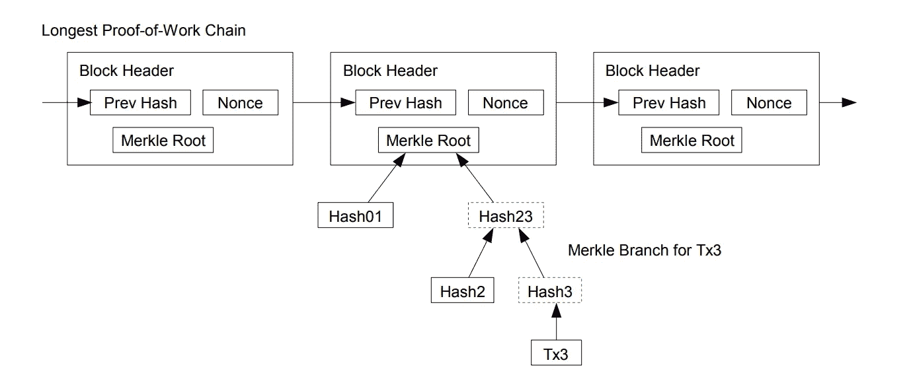

# SPV 证明说明

> 原文：<https://medium.com/coinmonks/spv-proofs-explained-f38f8bb8f580?source=collection_archive---------0----------------------->

## 一个简单的支付验证证明，他们如何工作，为什么他们的重要性的初级读本

Image illustrating SPV, from the Bitcoin whitepaper, the real OG

简单支付验证(通常缩写为 SPV)是最初的比特币白皮书中概述的一个系统，它使轻型客户端(在低端系统上运行的钱包)能够验证交易已经包含在比特币中，因此已经进行了支付。