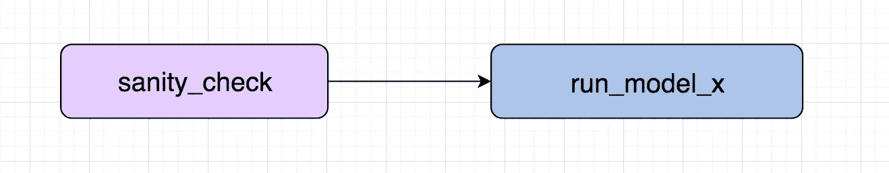

# 在启动机器学习模型之前对气流进行基于 SQL 的健全性检查

> 原文：<https://medium.com/coinmonks/sql-based-sanity-check-in-airflow-before-kicking-off-machine-learning-model-2733868b1cf2?source=collection_archive---------7----------------------->

当我们建立机器学习模型时，我们不想在坏的或损坏的数据上训练模型。所以对它进行健全性检查是很重要的。示例包括特定列列表的“*total _ rows>0”*或“ *null count* ”等。

在这种方法中，我们将寻找一种简单的方法，将其添加到我们的工作流程中。

让我们看一个例子，我们在我们的 HIVE 表中生成数据，我们想检查一列的所有值是否都不为空。

```
-- It is a presto query
SELECT
   count_if(col_x is null) as null_count,
   count(1) as total
FROM
   db.some_table
WHERE
   dt = ‘{ds}’
```

在上面的查询中，如果`null_count`等于`total`，那么它应该会失败。所以最简单的事情，我们现在可以做的是改变我们的查询返回`True`或`False`。

> 真— →测试用例通过(总行数不等于空计数)
> 
> False — →测试用例失败(总行数等于空计数)

让我们修改上面的查询:

```
-- It is a presto query
SELECT
   count_if(segments is null) != count(1)
FROM
   db.some_table
WHERE
   dt = ‘{ds}’
```

这将返回**真/假**

通过扩展这种设计，我们可以编写一个函数来运行这些 sql 测试查询。

# 让我们定义一个用例，看看我们如何解决它。

**目标**:在 ***气流*** 中，在使用工作台`db.some_data`的预定机器学习模型启动之前，运行一些基本的**健全性检查**，如果检查失败，**跳过**模型运行任务。

所以我们的气流 DAG 会像这样。



工作流程步骤:

1.  我们将测试用例定义为字典对象列表。
2.  我们将通过 *sanity_check_func* 函数和*测试 _ 用例字典*传递给[**shortcircuit operator**](https://airflow.apache.org/code.html#airflow.operators.ShortCircuitOperator)。
3.  sanity_check_func 将像 Presto query 一样逐个运行每个测试用例(*我们可以使用任何引擎*)，当任何一个查询返回 False 时，ShortCircutOperator 将跳过下游任务。

# 样本测试案例:

```
# Data Validation Test Cases
test_cases = [
{
  '**name**': 'data exists',
  '**description**': 'Check if the most recent partition has data',
  '**sql**': """ SELECT
                COUNT(1) > 0
             FROM
                 db.some_table
             WHERE
                 dt = '{ds}'
         """
}, 
{
  '**name**': 'Validate Col X',
  '**description**': 'At least 1000 SUM in last 3 days ',
  '**sql**': """ 
          SELECT
              SUM(col_x) >= 1000
          FROM
               db.some_table
          WHERE
              dt BETWEEN to_iso8601(date '{ds}' + interval '-3'
    day) AND '{ds}'
  """
}, 
{
  '**name**': 'All null value test',
  '**description**': 'Test if all the values are not null for given cols in recent partition',
  '**sql**': """
       SELECT
          count_if(col_x is null) != count(1),
          count_if(col_y is null) != count(1),
          count_if(col_z is null) != count(1)
       FROM
          db.some_table
       WHERE
          dt BETWEEN to_iso8601(date '{ds}' + interval '-1'
    day) AND '{ds}'
  """
}
]
```

# 健全性测试函数

# ShortCircuitOperator 运算符示例

其他要点:

1.  我们也可以将它添加到其他 ETL 工作流中，一旦创建了数据，就进行一些基本的健全性检查。
2.  我们还可以将结果保存在 mysql 或其他数据库中，并使用任何 BI 工具绘制它。
3.  我们可以调用任何其他外部系统(如 datadog)来记录事件并创建警报。