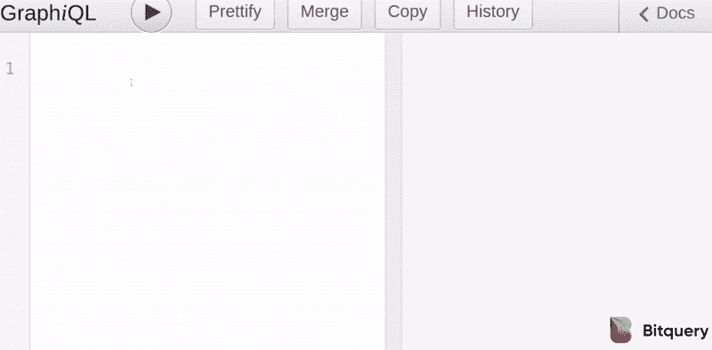
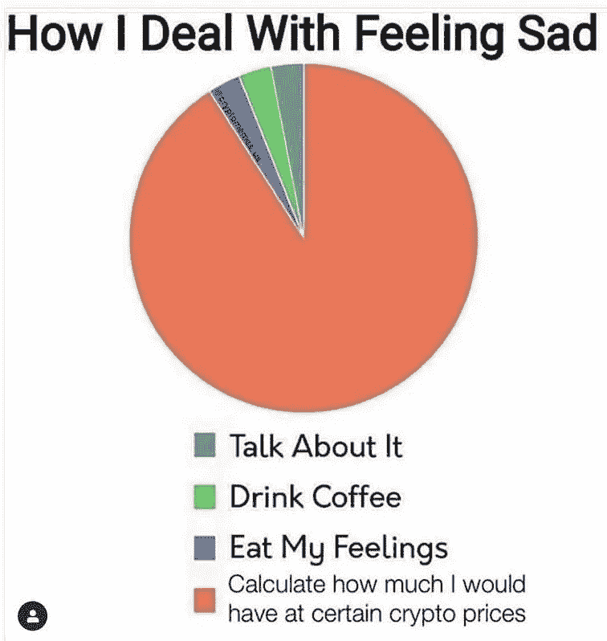
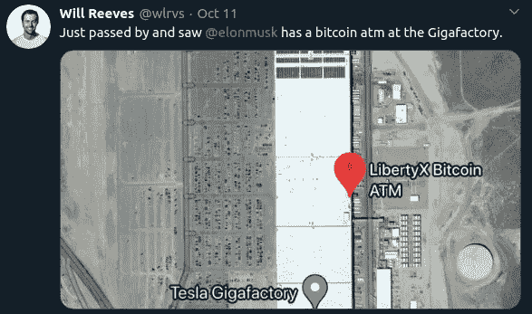
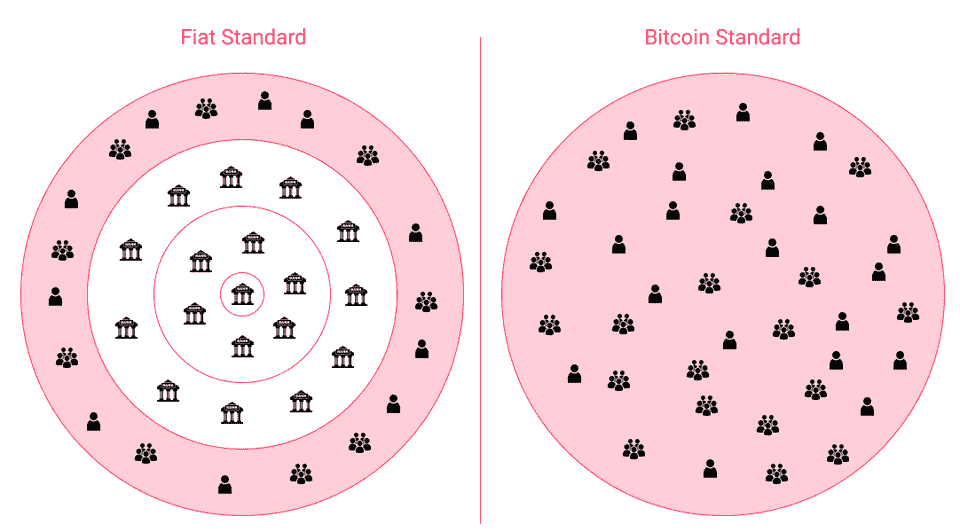

# Square 以 5000 万美元收购比特币/ Bitmex 创始人退居二线

> 原文：<https://medium.com/coinmonks/square-buys-50-million-in-bitcoin-bitmex-founders-stepping-back-c82d804c7ceb?source=collection_archive---------2----------------------->

## 中国政府通过抽奖向 5 万人发放 1000 万元人民币

**What crypto investors think when they watch the news…** [**Source**](https://www.reddit.com/r/CryptoCurrency/comments/j90m0s/what_crypto_investors_think_when_they_watch_the/)

美国司法部发布了一份国际声明，要求公司在其产品中创建破解门以绕过端到端加密。众议院和参议院也有一个“赚到它”的法案，破坏了互联网上的加密和言论自由。[叫你的代表](https://act.eff.org/action/stop-the-earn-it-bill-before-it-breaks-encryption-a7904e20-2083-4d5e-88ae-44ee5fef7a5d)去阻止这个法案。

另一则新闻，Square [购买了](https://www.coindesk.com/square-buys-50m-in-bitcoin)5000 万美元的比特币。这是继 MicroStartergy 之后第二家使用比特币作为储备的公司。

最近在美国提交法律文件后，Bitmex 创始人[从公司退出](https://blog.bitmex.com/leadership-changes-at-100x-group/)。

## 查询区块链变得简单

区块链是只发出事务和事件的黑洞。因此，我们需要工具将这些原始数据转换成可用于构建消费者应用程序的信息。

因此，当我开始与 Btiquery 合作时，我被他们的数据解决方案所震撼。简单的 GraphQL APIs 允许您跨 20 多个区块链提取数据。

此外， [**Bitquery**](https://bitquery.io/?utm_source=coinmonks&utm_medium=newsletter) 还提供**资金追踪 API**来追踪链上的加密资产，并构建区块链合规、调查和监控解决方案。

因此，如果您需要关于您的解决方案的链上数据， [**现在就尝试 Bitquery**](https://bitquery.io/?utm_source=coinmonks&utm_medium=newsletter)。

## 试试 [Quadency](https://blog.coincodecap.com/go/quadency)

寻找易于使用的一体化加密交易解决方案？

试试 [Quadency](https://blog.coincodecap.com/go/quadency) ，这是一个为交易者打造的交易终端，可以让他们的加密交易自动化。阅读我们的[季度回顾](https://blog.coincodecap.com/quadency-review-a-crypto-trading-automation-platform)。

## 最新消息📰

*   Square [购买](https://www.coindesk.com/square-buys-50m-in-bitcoin)5000 万美元的比特币
*   中国深圳市发放 1000 万元央行数字货币
*   Bitmex 创始人亚瑟·海斯和塞缪尔·里德[在美国](https://blog.bitmex.com/leadership-changes-at-100x-group/)[提交法律文件](https://blog.bitmex.com/united-states-cftc-doj-filing/)后退出
*   比特币钱包[漏洞](https://decrypt.co/44725/bitcoin-wallet-exploit-25-million-stolen-electrum)迄今已导致 2500 万美元被盗
*   美国司法部想要破解端到端加密
*   在[破解加密之前阻止](https://act.eff.org/action/stop-the-earn-it-bill-before-it-breaks-encryption-a7904e20-2083-4d5e-88ae-44ee5fef7a5d)赚到它
*   反洗钱对犯罪的影响不到 1%。代价是什么？
*   司法部长威廉·P·巴尔[宣布](https://www.justice.gov/opa/pr/attorney-general-william-p-barr-announces-publication-cryptocurrency-enforcement-framework)公布加密货币执法框架
*   以太坊 2.0 [信标链](https://www.coindesk.com/time-to-launch-ethereum-2-beacon-chain)发布的时间到了
*   Prysm [Eth2 客户端 Web](/prysmatic-labs/prysm-eth2-client-web-interface-now-live-feb278f4aa15) 界面现已上线
*   Aave 筹集了 2500 万美元用于给机构提供 DeFi
*   英国对加密衍生品的禁令会伤害而不是保护投资者
*   以太坊上的令牌化比特币供应量现已超过 11 亿美元:原因如下
*   被黑的交易所 KuCoin [重开](https://decrypt.co/44184/hacked-exchange-kucoin-reopens-bitcoin-deposits-withdrawals)比特币存款、取款

> *购买一个* [***硬件钱包***](/coinmonks/the-best-cryptocurrency-hardware-wallets-of-2020-e28b1c124069) *，保护您的加密货币。*

[Source](https://www.reddit.com/r/CryptoCurrency/comments/j7ebr0/about_tree_fiddy/)

## 好的读物📑

*   [Uniswap 诈骗](https://rekt.ghost.io/uniswap-swindle-scammer-speaks-out/) —骗子说出来
*   以太坊的[黑暗森林](/@trenton.v/ethereums-dark-forest-is-worth-cultivating-3cffa440aa4f)值得培养
*   叫我[以实玛利](https://blog.bitmex.com/call-me-ishmael/)
*   为什么以太坊的价格是 3000 美元
*   [乐观](/starkware/the-optimistic-rollup-dilemma-c8fc470ca10c)进退两难
*   建立最后一个对冲基金——引入数字信号
*   [论税收](https://insights.deribit.com/market-research/on-tax-risk-in-defi/)定义中的风险
*   深入了解 YFI v2 的跳马策略
*   关于 [Uniswap](https://ournetwork.substack.com/p/our-network-issue-42) 、1inch、DODO、dYdX 和 Kyber 的指标。
*   什么是[布莱克-斯科尔斯](/coinmonks/what-is-black-scholes-pricing-b59ea9398874?source=friends_link&sk=89984e206064167bb8d17dcc250e6f1f)定价？
*   [简介](/coinmonks/a-brief-introduction-to-mining-cryptocurrencies-2095053865e7)挖掘加密货币

[Source](https://twitter.com/wlrvs/status/1315033404728111106)

## 开发商

*   用“ [create-eth-app](/coinmonks/build-your-ethereum-app-in-react-js-or-vue-with-create-eth-app-577e41860a47?source=friends_link&sk=ecf2389ff965bd7215014578d54683d3) ”在 React.js 或 Vue 中构建你的以太坊 App
*   在 eth1/eth2 合并期间，操作码[发生变化](https://hackmd.io/XEq28xrRTsWUdLzRvAbCpg?view)
*   创建您的第一个[区块链 GraphQL](https://bitquery.io/blog/blockchain-graphql-query) 查询
*   更节能的 T38 可升级代理，不使用存储
*   [二叉状态树的结构](/@gballet/structure-of-a-binary-state-tree-part-1-48c587836d2f)
*   曲线[漏洞](/@peter_4205/curve-vulnerability-report-a1d7630140ec)报告
*   unicast Go[钓鱼](/zengo/unicats-go-phishing-eaf39ff9da64):合同审批被用来窃取资金
*   将区块链应用于小企业主的[按时付款](/@ckraczkowsky/applying-blockchain-to-on-time-payment-collection-for-small-business-owners-e7eebd2b058e)收款
*   每天处理[20 亿个 eth_calls](https://blog.infura.io/what-does-it-take-to-handle-two-billion-eth_calls-per-day/) 需要什么？
*   [查询](https://bitquery.io/blog/binance-smart-chain-api)币安智能连锁(BSC)
*   [zkRollup](/aztec-protocol/aztec-zkrollup-layer-2-privacy-1978e90ee3b6) 第二层+隐私
*   收入申报[天然气成本降低](/livepeer-blog/earnings-claiming-gas-cost-reductions-lip-36-and-lip-52-recap-f136416fdb1) : LIP-36 和 LIP-52 摘要
*   [曲线+ zkSync L2](/matter-labs/curve-zksync-l2-ethereums-first-user-defined-zk-rollup-smart-contract-5a72c496b350) :以太坊首款用户自定义的 ZK rollup 智能合约！
*   坚固性 [v0.7.3](https://solidity.ethereum.org/2020/10/07/solidity-dynamic-array-cleanup-bug/) —动态数组错误修复
*   [在 Unity 中获取](/coinmonks/part-2-using-nethereum-in-unity-5b09f2d8c718) ETH 智能合约数据
*   用蜜罐契约检测[以太坊](https://sergeypotekhin.com/detect-ethereum-front-runners/)领跑者
*   智能合约升级的状态
*   快速发送原始[交易](/bloxroute/sending-raw-transactions-fast-measuring-how-much-improvement-bloxroute-can-bring-to-node-service-20652b2afcf3)

[Source](https://www.reddit.com/r/cryptocurrencymemes/comments/j7xgso/true_and_sad/)

## 多方面的

*   [验证](https://github.com/ConsenSys/deposit-sc-dafny)daf ny 中的存款智能合约
*   [ETH2](https://eth2bounty.ethereum.org/) 赏金计划
*   Smock——在 JavaScript 中模仿可靠性
*   ENSjs 发布并报名参加 ENS 集成研讨会
*   [脱离以太](https://www.wiley.com/en-us/Out+of+the+Ether%3A+The+Amazing+Story+of+Ethereum+and+the+%2455+Million+Heist+that+Almost+Destroyed+It+All-p-9781119602934):以太坊的惊人故事和几乎摧毁它的 5500 万美元的抢劫案
*   流动性[采矿奖励](https://twitter.com/Rewkang/status/1314731251954151424)目前是浪费且次优的
*   央行数字[货币](https://www.bis.org/publ/othp33.pdf):基本原则和核心特征

## 播客💽

*   [加密创业学校](https://www.youtube.com/watch?v=jVehCoqJgYQ&t=0s)纪录片

## 黑客马拉松和峰会

*   [2020 年流动性](https://liquidity2020.dystopialabs.com/)
*   [Seed 俱乐部](https://gitcoin.co/hackathon/seed-club-hacks/onboard)黑客马拉松
*   [投资](https://events.bizzabo.com/invest-ethereum-economy)以太坊
*   [Hackatom](https://hackatomv.devpost.com/)

## 加密交易和折扣🔖

*   BlockFi 为注册和存款提供了 250 美元的 USDC 奖金(T21)
*   全新 [Trezor 钱夹套](https://shop.trezor.io/?offer_id=10&aff_id=5199)有多种颜色可选
*   *试用*[*Hypertrader*](https://hypertrader.app/?utm_soruce=coinmonks)*并使用优惠券****COINCODECAP****获得****15%****折扣*
*   使用[此链接](https://webapp.coinrule.io/coupon/coinmonks-7-25-3-e2bf6c60e795407381edf98d1a174ac2?fp_ref=coincodecap)在 [Coinrule](https://webapp.coinrule.io/coupon/coinmonks-7-25-3-e2bf6c60e795407381edf98d1a174ac2?fp_ref=coincodecap) 享受 7 天免费试用和前 3 个月 25%的折扣
*   *试用* [*哈森在线*](https://www.haasonline.com/?ref=11087) *并使用优惠券****COINCODECAP****获得****10%****折扣👏*

## 产品评论和其他加密软件📙

*   [3 商业评论](https://blog.coincodecap.com/3commas-review-an-excellent-crypto-trading-bot) |一款优秀的密码交易机器人
*   [SecuX STONE 五金钱包回顾](https://blog.coincodecap.com/secux-stone-hardware-wallet-review)
*   [哈森在线评论](https://blog.coincodecap.com/haasonline-review)—2020 年最佳交易机器人(10%优惠券)
*   Hodl 的最佳方式是从你的比特币中赚取利息
*   [Botsfolio 评论](https://blog.coincodecap.com/botsfolio-review-automate-crypto-investment)——让您的加密投资自动化的简单方法
*   你需要知道的 2020 年 5 大[加密贷款平台](https://blog.coincodecap.com/top-5-crypto-lending-platforms)
*   [神童评论](https://blog.coincodecap.com/wunderbit-review)——社交密码交易赚大钱
*   [2020 年最佳加密交易机器人](/coinmonks/whats-the-best-crypto-trading-bot-in-2020-top-8-bitcoin-trading-bot-c16adeb13317)
*   [2020 年最佳密码交易平台](/coinmonks/the-best-crypto-trading-platforms-in-2020-the-definitive-guide-updated-c72f8b874555)
*   最好的[加密税务软件](/coinmonks/best-crypto-tax-tool-for-my-money-72d4b430816b)
*   [最佳加密交易平台](/coinmonks/the-best-crypto-trading-platforms-in-2020-the-definitive-guide-updated-c72f8b874555)
*   Bitmex 上的[保证金交易的白痴指南](/coinmonks/the-idiots-guide-to-margin-trading-on-bitmex-dbbd7742c6fc?source=friends_link&sk=7bfa99d2a181142510c8442c8ddb0786)
*   [加密摇摆交易的权威指南](/coinmonks/the-definitive-guide-to-crypto-swing-trading-7e4af6496d4d?source=friends_link&sk=70448050bd9323b42f63bfc0bb1e60d1)
*   [Bitmex 高级保证金交易指南](/coinmonks/bitmex-advanced-margin-trading-guide-2270c195ce25?source=friends_link&sk=1d986cca731f5084b9a2db4a4bc4a7ad)
*   [开发人员的最佳加密 API](/coinmonks/best-crypto-apis-for-developers-5efe3a597a9f)

想让我们展示你的产品吗？在 [Twitter @coinmonks](https://twitter.com/coinmonks) 上联系我们

## 照片说明了一切📷

# 乔布斯👷

*   Bitquery 正在招聘 [Ruby 开发者](https://angel.co/company/bitquery/jobs)
*   [泽里昂](https://cryptocurrencyjobs.co/engineering/zerion-senior-frontend-engineer/) —高级前端工程师
*   [MyCrypto](https://cryptocurrencyjobs.co/engineering/mycrypto-senior-front-end-engineer/) —高级前端工程师
*   Celo 正在[招聘](https://jobs.lever.co/celo/bb6fc40f-4d3d-4abb-a6d3-a5b8ba152b6a)数据主管
*   a16z 正在[招聘](https://a16z.com/about/jobs/?gh_jid=4167628003)一名数据科学家
*   Livepeer 正在招聘[区块链社区营销+运营负责人](https://angel.co/company/livepeer/jobs/874811-blockchain-public-network-community-marketing-associate)
*   作为营销总监[与 Chainlink 令人难以置信的生态系统合作](https://chainlinklabs.com/careers#job-492239)
*   小道消息招聘精英[区块链安全工程师](https://jobs.lever.co/trailofbits/4f459855-3299-462f-9e73-299a840d5baf) & [app 安全](https://jobs.lever.co/trailofbits/8b7f7fc1-efb0-4e89-b406-784c3a2d77e4)
*   DeFi devs！Yield 正在招聘可靠的前端人员—联系@yield.is
*   0x 正在招聘开发人员！[全堆栈、后端、前端或可靠性](https://0x.org/about/jobs)
*   Nexus Mutual: [经历了 Solidity dev](https://angel.co/company/nexus-mutual-1/jobs/967538-smart-contract-engineer)；首选欧洲时区

## 在 Coinmonks 上发布

如果你喜欢在 crypto/区块链空间上写教育文章，并且想在 Coinmonks 出版物上发表。只需在***【gaurav@coincodecap.com】****或者 DM 我**[***推特***](https://twitter.com/coinmonks)*

> **“如果你喜欢读***[*你也可以捐我们*](/coinmonks/monks-need-your-help-7440418d67ec) *。****

> ***[*在您的收件箱中直接获得最佳软件交易*](https://coincodecap.com/?utm_source=coinmonks)***

******