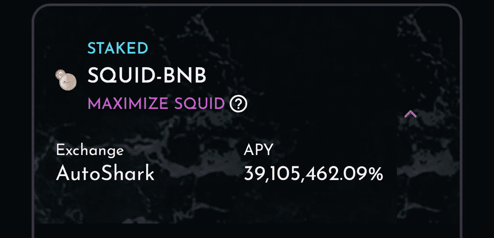

# 鱿鱼 3900 万% APY？

> 原文：<https://medium.com/coinmonks/squid-39-million-apy-901af079378c?source=collection_archive---------2----------------------->

The word “Squid” is trending because of the popularity of the Netflix series Squid Games. It is possible that staking pools may benefit from this new trend.

**编者按:请谨防 shitcoins，我指的是真的 shitcoins。**

**作者注:**本文讨论的 Autoshark 的金库中使用的**乌贼**令牌是**与最近的 rugpull 乌贼令牌不是同一个**。与自动标记相关联的 SQUID 令牌。金融是为**鱿鱼股份**和他们的代币地址和网站*仍然活跃* e。如果你想查看他们的网站，这是: