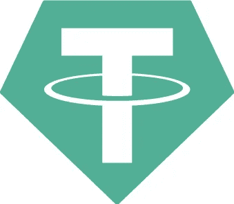
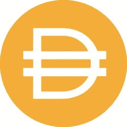

# 稳定币:两全其美？

> 原文：<https://medium.com/coinmonks/stable-coins-the-best-of-both-worlds-1f492442bd38?source=collection_archive---------1----------------------->

在过去，我们目睹了比特币在几分钟内获得数百美元，并以类似的速度暴跌。不仅仅是比特币，还有很多其他的加密货币，价格有涨有跌。波动性是大众将密码融入日常生活的最大障碍之一，它阻碍了大规模采用的梦想。一些公司的目标是通过引入稳定硬币来解决这一问题，他们在一定程度上取得了成功。

在本帖中， [ChangeHero](https://changehero.io/) 将向你介绍稳定硬币的概念，它们的特性以及对大众采用的影响。

## 稳定的硬币

在任何一天，传统的加密货币都会经历 10–20%的增减，这种变化有多种因素。由于价格每秒都在波动，公众使用高波动性的加密货币进行日常交易非常不方便。稳定硬币是相当新的，类似于人们每天用于消费的法定货币。这种形式的数字货币旨在最大限度地降低波动性，并提供一致的价值，而不管影响加密货币市场的因素如何。作为稳定币值的一种手段，稳定的硬币由储备资产支持。此外，稳定的硬币对用户来说是一个存放资产的安全地方，不用担心价格波动。通常，这些货币与美元或商品甚至其他加密货币挂钩

> [发现并回顾最佳加密软件](https://coincodecap.com)

## 法定抵押的

**Tether** 是 2015 年第一款可供用户交易的稳定币。它建立在全链条协议的基础上，以 1:1 的比率与美元挂钩，这意味着理论上 1 USDT 币将永远等于 1 美元。就用例而言，它弥合了加密货币和法定货币之间的差距，并提供了稳定性、透明度和安全性。最常见的情况是，我们看到交易员在交易所将资产出售给 USDT，然后撤出以保护自己的利润。它的市值超过 40 亿美元，是目前市场上最有价值的加密货币之一。它在稳定的硬币市场上完全占据主导地位，并在以太坊、Tron、EOSIO 和 Liquid 等各种链上运营。Tether 已在市场上站稳脚跟，并已整合到所有顶级交易所中。尽管使用广泛，但它的集中性经常受到批评，并且有被攻击的历史。

TrueUSD 是另一种流行的法定抵押稳定硬币。这是第一个完全由美元支持的 ERC-20 代币，在 2018 年筹集了令人印象深刻的 2000 万美元。token 在透明度方面脱颖而出，每天都会披露托管账户的详细信息。市场上还有很多类似的项目，如 Gemini USD、Paxos Standard 和 USDCoin。

## 秘密抵押的

**MakerDAO** 是另一个在稳币市场经常听到的名字。该项目因其稳定货币的另类方法而闻名。与 Tether 不同，DAI 由 ETH 提供加密抵押和支持。它是首批完全去中心化的稳定硬币之一。每个 DAI 令牌将等于 1 美元，平台使用 CDP(抵押债务头寸)智能合约将 DAI 借给用户。2019 年底，MakerDAO 推出了多抵押品 DAI，初步增加了对 BAT 的支持，其他令牌也可能在未来加入该俱乐部。单一抵押品硬币改名为赛，而新的多抵押品资产命名为戴。尽管该项目因其自主和分散的性质而受到称赞，但其稳定费用结构一直存在争议。

## 算法的

这些类型的稳定硬币试图通过算法来保持加密货币的价值稳定。Basecoin 就是这样一种稳定的硬币，它于 2017 年宣布与美元挂钩。价格的稳定计划通过一种共识机制来维持，在这种机制中，代币的供应根据硬币与其挂钩之间的汇率来调整。这种方法类似于中央银行，受到了密码界许多人的批评。虽然该项目获得了大量的初始资金，但后来它被放逐，在 2020 年杳无音信。

## 两全其美？还没有！

稳定性、可扩展性、隐私性和去中心化是整个社区梦寐以求的加密货币的重要特征。稳定硬币确实以稳定性迎合了消费者，但在其余方面存在不足，特别是由于第三方的参与而导致的去中心化。仔细观察，所有这些稳定的硬币都被用作止损工具。交易者简单地把他们的密码换成稳定的硬币，以避免由于波动造成的利润损失。简而言之，stablecoins 远不能提供两全其美的服务，至少目前是这样。

只有当普通人能够每天使用加密货币时，大规模采用才有可能，但在这种情况下，稳定的硬币使用并不常见。这多半是因为在公共场合对稳定币的存在和好处认识不足。我们一直听到关于 JP 摩根和 IBM 发布他们自己的稳定加密货币的消息。此外，在结束稳定的话题时，不能不提到脸书天秤座的艰难时期。尽管这些项目违背了去中心化的真正本质，但它们会激发稳定硬币的意识，并最终导致大规模采用。

在 ChangeHero 上，您可以用所有流行的加密货币以最优惠的价格兑换 USDT、USDC 和 TUSD 的货币。您可以立即交换您的加密资产到稳定的硬币，无需任何注册或登录。一定要试一试！一如既往，在 [Twitter](https://twitter.com/Changehero_io?lang=en) 和 [Medium](/@changehero) 上关注 [ChangeHero](https://changehero.io/) ，获取更多此类信息性文章，并第一个获得激动人心的优惠通知。

> [直接在您的收件箱中获得最佳软件交易](https://coincodecap.com/?utm_source=coinmonks)

