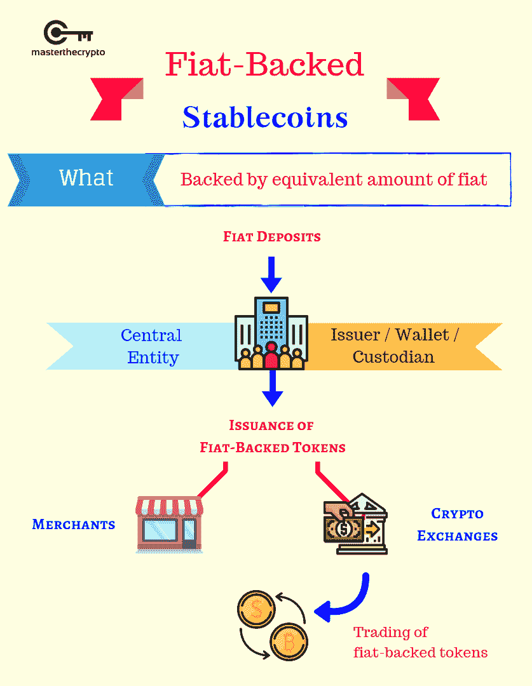

# 稳定币 101:它是什么，如何保护你的钱

> 原文：<https://medium.com/coinmonks/stablecoin-101-what-it-is-and-how-it-can-protect-your-money-66840ea8435b?source=collection_archive---------6----------------------->

无论你是否投资过加密领域，很可能你仍然熟悉区块链和加密货币这两个词。十多年来，加密货币和区块链一直在争夺领先地位。然而，它们的价格一天暴涨一天暴跌会让任何人感到不安。

虽然建议你保持警惕，但如果你正在寻找一种替代品来抵御潜在的损失，stablecoin 就是你的答案。

这是风云人物，稳定币，解码。

# 介绍

顾名思义，稳定币是一种加密货币，价格不变，在任何情况下都保持稳定。

稳定资本努力模仿或将其市场价值与另一种资产或外部参考挂钩。它们的税率与黄金、天然气等实体的税率挂钩。，或政府发行的货币的价值，如美元、欧元、日元等。

# 工作机制

Stablecoins 通过区块链技术运营其战略和业务。它们被用作支付代币部分下的**记账单位、交易媒介和储值手段**。

其中最著名的稳定硬币有、戴和等。

一些法定货币非常容易受到通货膨胀的影响，而其他货币如比特币(BTC)和[以太坊(ETH)被认为是高度不稳定的资产。稳定的硬币——火炬手是专为保持其价值或实现价格稳定而设计的，从而稳定可变的密码市场。](https://blog.wazirx.com/5-things-to-keep-in-mind-while-buying-or-selling-ethereum/)

# 稳定的硬币类型

让我们来看看 stablecoins 的四个类别。

# 法定抵押稳定币

顾名思义，现有的政府发行的货币支持他们像美元或英镑。每发行一枚数字硬币，你都需要提供等量的法定货币作为抵押。

Source: masterthecrypto.com

换句话说，法定抵押的稳定货币与普通货币具有相同的价值，并作为最受欢迎和最广泛使用的加密货币类型高居榜首。

为了帮助你更好地理解，考虑一下这个。

假设你的货币是美元；那么每一美元的稳定硬币加密将具有相同的价值，1 美元。这两个货币比率将始终保持不变，为 1:1。具体来说，在泰瑟(USDT)，1 USDT 总是价值 1 美元。

然而，我们不能完全排除欺诈，因为集中的团体和实体发行这些硬币有自己的规则和协议。因此，投资你信任的发行人。

# 商品抵押债券

尽管与法币非常相似，但商品抵押稳定币在一个方面与法币不同。他们不使用法定货币，而是使用其他种类的可互换资产和商品作为抵押品，包括黄金、白银、钻石等。、贵金属和矿物。不仅如此，他们还利用有价值的商品，如石油和天然气，独家房地产等。

如果你正在寻找这样的例子，看看委内瑞拉石油公司的石油支持的加密货币。

# 加密货币-抵押稳定货币

在这种情况下，稳定的货币由加密货币支持。使用加密货币作为抵押品，整个过程因此以分散的方式在区块链上运行和操作。秘密抵押的稳定债券大多以 1:2 的比例挂钩。

source: pinterest.com

由于加密货币是一种基础资产，它通常不安全，并且可能具有高波动性。为了确保稳定货币的供应不受极端价格波动的影响，由于加密货币的高度波动性，许多加密货币必须作为每一种稳定货币的抵押品。

此外，作为储备持有的高额金额让人们有足够的理由将其称为“过度抵押”。例子:戴(Dai)，在创客平台上有抵押物做后盾。

加密货币的复杂性使得这种货币在竞争中落后于其法定支持的对手。

# 算法稳定积分

也称为非抵押，无论是法定货币还是加密货币都不支持这些稳定的货币。这意味着算法稳定资本不涉及任何储备资产的使用。

相反，它们的稳定性依赖于一种算法。智能合约负责管理供给和需求，从而确保稳定的货币价格。

如果稳定的硬币交易价格极高，算法系统会自动生成新的硬币。作为另一种选择，该系统将在市场上购买硬币，以减少其流通供应量。

Source: okex.com

这方面的一个例子是 Primecoin (XPM)。另一个例子是加密货币基础硬币，它使用共识机制来确定是否应该根据需要增加或减少代币的供应。

这种稳定的货币可能是四种货币中最复杂的一种，但其算法系统类似于央行管理供应的过程。

# 稳定的心脏的重要性

就像他们在加密货币海洋中的成千上万的同行一样， [stablecoins 也努力在全球范围内提供传统货币的高级](https://blog.wazirx.com/important-uses-of-crypto-stablecoins-you-should-know/)功能。

以下是它们的一些最重要的好处。

# 物价稳定

Stablecoins 被设计为在任何时候都具有稳定的值。这让很多密码极客和投资者(包括我们！)将它们视为投资者的避难所。

显而易见，法定货币和重要的加密货币的价值正在经历每天急剧上升和下降，这使得稳定的货币成为迫在眉睫的选择。

如果你也对投资心存警惕，现在有个好消息；你现在可以把你的财富储存在一种资产中，而不会因为通货膨胀而有任何损失的风险。

# 隐私和权力下放

由于 stablecoins 是一种加密货币，它们与成千上万的其他加密货币一样，运行在相同的强大技术和系统上。

问题在于，尽管加密货币是去中心化的，但仍有与法定货币的银行系统建立联系的潜在需求。

因此，如果你还没有准备好完全投入到秘密领域，这将是一个很好的开端。

# 可编程货币

Stablecoins 可编程，可根据用户需求定制。

这主要是通过奖励或忠诚度计划来实现的。

例如，如果一家公司在其稳定币的基础上开展业务，它可以设计一个应用程序，用户可以轻松快速地立即查看他们的稳定币和奖励。

# 一种购买加密货币的方式

在印度，你没有义务使用 Tether 来购买加密货币。然而，在印度的加密货币交易所使用 stablecoins 可以降低您的交易费用。

此外，Tether 是获取加密货币最常用的方法。

# 结论

众所周知，Stablecoins 可以促进更快、更便宜的支付交易。

使用 stablecoins，您只需在手机上轻敲几下，就可以在世界任何角落转账和接受付款。您还可以实时跟踪您的资金和支付活动！

随着[加密货币接管当今的行业，](https://blog.wazirx.com/how-is-the-cryptocurrency-industry-expected-to-be-in-2021/)像 stablecoins 这样的数字资产有望引领我们进入数字世界。

stablecoins 保护我们的资金免受市场不一致的严重后果，并帮助更快、更具适应性和更安全的数字支付，帮助我们实现财政稳定，并赢得对阻止我们的波动性的战争。