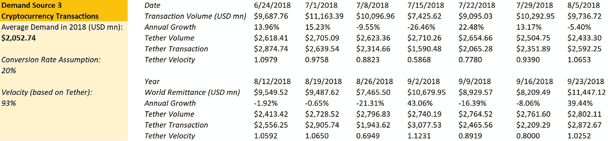

# 稳定投资——“坏”主意，“好”投资

> 原文：<https://medium.com/coinmonks/stablecoin-bad-idea-good-investment-f35b79b21016?source=collection_archive---------0----------------------->

Stablecoin 以 700%+的年增长无疑成为了 2018 年的炒作对象。围绕这个热门话题出现了很多讨论，大多数人认为 stablecoin 存在缺乏透明度和高度集中/单点故障等问题，令人怀疑。

迄今为止，已经发明了三种稳定的硬币机构设计。对大多数人来说，这三种稳定的硬币机制设计没有一种是好的。然而，尽管存在许多缺陷，stablecoin 公司的 Basis Protocol(原 Basecoin)已经吸引了一系列大牌风投公司的 1.33 亿美元投资:光速创投、谷歌创投、贝恩资本创投和安德森霍洛维茨。

在这篇文章中，我不会重复太多关于[稳定币 101](https://hackernoon.com/stablecoins-designing-a-price-stable-cryptocurrency-6bf24e2689e5) 的内容。相反，我将主要使用[基础协议](https://www.basis.io/basis_whitepaper_en.pdf)为例，重点分析非抵押/增长支持型稳定债券。

# 摘要

1.  法定抵押稳定硬币的最好结果是政府/银行/高度监管的实体将发行带有储备的硬币。这些硬币只是现有货币的数字版，限额相同。
2.  **加密抵押稳定币机制将不起作用，因为它可能仍然具有高波动性。**
3.  **在需求停止增长之前，无抵押/增长支持的稳定债券(“铸币税份额”)可能在短期内发挥作用。**然而，从长远来看，这可能行不通，因为需求不会永久增长。
4.  **虽然 Basis Protocol 等支持增长的稳定债券不是好主意，但它们可能是很好的投资机会。**TAM for Basis 可能高达 1089.01 亿美元。
5.  支持增长的稳定货币正在印刷免费的钞票，当增长结束时，这些钞票最终会贬值。如果增长无法持续，这种机制可能会变成庞氏骗局。

# 背景

*如果你有 stablecoins 的基础知识，可以跳过这一节。*

由于高波动性，加密货币自存在以来从未被广泛用作交换媒介。没有一个商人会愿意接受一枚此时价值 100 美元，而下一个小时价值只有 50 美元的硬币。为了解决这一波动性问题，人们发明了 Stablecoins，这是一种价格稳定的加密货币。

为了实现稳定性，引入了三种类型的稳定化合物:

*   
*   ****
*   ****[**无抵押稳定债券**](https://hackernoon.com/stablecoins-designing-a-price-stable-cryptocurrency-6bf24e2689e5)(‘铸币税股’——类型/增长支持稳定债券)****

******1。法定抵押稳定硬币**是由法定(如美元)储备支持的硬币。最突出的例子是[系绳](https://tether.to/)，它现在主导着主要的稳定币市场。对于法定抵押的稳定债券，主要挑战是:****

****(1)高度集中——货币由一家公司支持****

****(2)缺乏透明度——难以核实储量****

****(3)缺乏可扩展性—很难通过 1:1 的储备进行纵向扩展****

******(4)银行关系困难——政府干预的可能性很大，银行受到高度监管******

****长话短说:****

****(1) Tether 还没有经过审计，大量研究([来源 1](/@bitfinexed/the-mystery-of-the-bitfinex-tether-bank-and-why-this-is-suspicious-a8a6407a1241) 、[来源 2](/@bitfinexed/the-tether-truth-machine-the-wheels-of-justice-turn-slowly-but-grind-exceedingly-finely-8e3bd72ad011) )表明它们可能只是一个庞氏骗局；****

****(2)新的经审计的与美元挂钩的加密货币，如 Paxos [正在发行](https://www.ccn.com/bitlicense-regulator-approves-two-usd-pegged-cryptocurrency-tokens/)，它们将由当地政府监管。****

******结论:**这种稳定货币设计的最佳方案是政府和/或银行用他们的储备发行这些稳定货币。它将只是现有货币的数字版本，不会在世界范围内自由使用。****

******2。加密抵押稳定币**是由比特币和以太坊等其他加密货币支持的稳定币。为了提供足够的稳定性，这些稳定剂将准备过多的储备。例如，发行 100 枚面值为 1 美元的 stablecoins，发行者会预留一些价值 200 美元的比特币或以太币。然而，如果作为储备的硬币价格大幅下跌，发行者无法提供更多储备，会发生什么？****

****结论:这是一个糟糕的主意，因为其他硬币的价值波动性很大(而且相关)，高储备率永远不会提供足够的稳定性。****

******3。非抵押稳定债券**(“铸币税股”-类型/增长支持稳定债券)是没有任何实物/数字资产支持的稳定债券。相反，发行者使用算法来控制稳定硬币的供应/需求，以稳定价格(例如，每枚硬币 1 美元)。我将在下一节中详细介绍这种类型的 stablecoins。****

# ****基础协议:支持增长的稳定核心****

********

## ******1。机制******

****Basis 协议有三种不同的令牌——‘T6’Basis’(稳定币)、‘T8’债券令牌和‘T10’股票令牌。该协议的机制很像中央银行的机制:当基差价格超过 1 美元时，公司([无形实验室](https://www.bloomberg.com/profiles/companies/1547464D:US-intangible-labs-inc))发行更多的基差；当基差价格低于 1 美元时，公司以低于 1 基差的价格出售面值为 1 基差的债券代币，以减少流通中的基差供给。****

********

******扩张(增加货币供应量)******

****当基差价格超过 1 美元时，公司将通过债券持有人和股票持有人发行新的基差来增加货币供应量。****

****债券持有人按照先进先出(FIFO)的顺序首先获得偿付。如果有任何未兑现的债券代币，区块链开始根据债券队列中的顺序(最老的债券先开始)一个一个地将债券转换成硬币。****

****股东先于债券持有人获得报酬。如果不再有未偿还的债券代币，系统会将剩余的新硬币作为红利分配给股东。****

******收缩(减少货币供应量)******

****当 Basis 的价格低于 1 美元时，该公司通过公开拍卖系统出售债券代币。****

> ****为了出售债券，区块链进行连续拍卖，竞标者指定新债券的出价和出价规模。换句话说，拍卖参与者指定他们希望为每只债券支付多少基差，以及他们希望以该价格购买多少债券代币。例如，一个人可以指定他想以每份债券 0.9 的价格购买 100 份债券。当区块链决定收缩硬币供应时，它会选择出价最高的订单，并将持有人的硬币转换为债券，直到足够的基础被摧毁。****

## ****2.这个系统将如何运作****

****预计基础协议将如图所示工作:****

****我们假设已经有 100 枚硬币在流通，每枚价值 1 美元。我们还假设有一个二级债券市场，其中面值为 1 硬币的债券代币以略低于其面值的价格出售(例如，0.98 硬币/债券代币)，如果人们认为该债券在未来很快可以支付。****

********

******在第 1 阶段，有一个 20 基点的新需求**(例如，来自对土耳其里拉失去信心的人。新需求的更多来源将在下一节讨论)。因此，基价上升到每枚硬币 1.10 美元。为了让价格回到每基点 1.00 美元，该算法计算出需要多少新供给，然后通过偿还旧债券代币和向股东支付股息来发行新基点。****

******在第二阶段，由于新的供给，基价下降。******

******在第三阶段，需求减少 40** (例如，许多人卖出美元基差，以持有土耳其里拉或购买其他资产。).该算法开始向公开拍卖系统中出价最高的人出售债券。在完成每只债券 0.98 硬币的所有出价后，算法开始以每只债券 0.9 硬币、每只债券 0.8 硬币、每只债券 0.7 硬币出售债券代币……直到它收集并燃烧足够的硬币以减少供应，并且**将基价恢复到每只硬币 1.00 美元**。****

******算法恢复价格的时间越长，债券代币价格就越低，人们承受暂时基差的时间就越长。******

******在阶段 4，新的需求在下降后很快出现。**最古老的债券代币按其面值支付(1 枚硬币/债券代币)，人们对未来的债券代币有了信心。****

******在阶段 5，只要不断有新的需求，人们就会对债券代币有信心，**债券代币会恢复到正常水平，略低于其面值，就像正常的国债一样。****

## ****3.这个系统将如何真正运作****

****然而，**一个不同的故事**可以在相同的机制中讲述:****

********

****在阶段 1、阶段 2 和阶段 3，算法将执行的操作与最后一个场景相同。****

******然而，在第 4 阶段，Basis 协议的需求降低**(例如，人们很好地处理了他们的菲亚特/跨境交易的低增长/发明了更好的交换媒介)。债券代币价格将再次下跌，因为旧的债券代币没有被支付，并且存在新代币永远不会被支付的更高风险。****

******在第 5 阶段，Basis 收到新需求的时间越长，债券代币价格越低，Basis 下次恢复 1 美元/硬币价格的难度越大。******

****一个更糟糕但更有可能的情况是这样的:****

********

****在阶段 1 和阶段 2，算法将做的与最后一个场景相同。****

****在第三阶段，Basis 需要很长时间来恢复价格，因为人们对其未来没有足够的信心，也没有购买债券代币。因此，债券代币价格非常低。****

******在第 4 阶段，Basis 收到的不是增长的需求，而是下降的需求。**然而，由于债券价格已经非常低——人们不想购买，因为许多旧债券没有支付——**该算法在很长一段时间内无法恢复基价。******

******在阶段 5，人们开始卖出基差，因为他们不能预期价格会回升，担心基差会继续下跌。基差硬币的价格和基差债券的价格都迅速下降到零。******

## ****4.有什么问题****

****根据上述分析，该机制存在两个主要问题:****

******(1)需要持续增长的需求来维持债券代币的价格，这将用于维持基础货币的价格。Basis 债券代币的价格关系到人们对 Basis 未来增长的信心，因为债券持有人只有在发行新硬币和支付旧债券时才能获得利润。******

****Basis 团队为债券 token 设定了价格下限和 5 年到期期限，以避免其价格过低。然而，设定价格下限并不能解决问题，因为可能会有二级市场对债券的估值低于下限。5 年到期也无济于事，因为债券到期时仍有可能得不到偿付。****

******(2)基币长期被低估是有可能的。**如最后两个场景的阶段 3 所示，算法可能无法快速恢复基价。在这种情况下，稳定的硬币不再是“稳定的”,因为它的价值在很长一段时间内低于它所声称的价值(1 美元)。****

## ****5.为什么这是个坏主意****

****如上所述，这种中央银行系统的成功需要(1)持续的需求增长(2)快速增加/减少货币供应的能力。****

******Basis 不能期望需求持续增长。**基差最终不会取代法定基差(如基差不能用于纳税)，基差需求也不会受到 GDP 等因素的影响。相反，对基础的需求将受到以下因素的影响:****

******(1)fiats 的表现**(例如，人们会将土耳其骗子或委内瑞拉玻利瓦尔转换为基差，以避免贬值)；****

******(2)跨境汇款量**(我们假设使用基差可以降低跨境交易成本)；****

******(3)加密货币交易量**(我们假设未来人们仍然不会使用 fiat 进行加密货币交易)。****

******Basis 并没有太多的工具来削减货币供给。Basis 只能通过出售债券或用自己的储备购买硬币来减少供应。然而，政府/中央银行可以利用一系列其他工具:(1)提高准备金率；(2)提高利率(虽然 Basis 可以通过降低债券价格来提高“利率”，但这种“利息”是没有保证的，因为债券可以到期而不支付)；(3)降低贴现率；(4)减少政府开支，以及(5)增加税收。******

## ****6.为什么这是一项好的投资****

****从一个投资者的角度来看，不管有缺陷的机制设计，基差仍然可以是一个很好的投资机会。****

****如上所述，基础需求的增长将主要来自三个方面:(fiats 的性能；(2)跨境汇款量；(3)加密货币交易量。****

****我们可以在这里做一些粗略的计算。****

******(1)持有“不良资产”的人的需求******

********

****[The Currency Crisis of 2018](https://geopoliticalfutures.com/currency-crisis-2018/) (Jacob L. Shapiro)****

****根据地缘政治期货，几个国家正在经历货币危机，因为他们的储备不能覆盖他们的外债。在这些国家，当地货币大幅贬值，因此货币持有者有动机将法定货币转换为基础货币。****

****对于这些国家，我们使用以下模型估计需求:坏资产的 M2 *转换率。(M2 数据来源: [CEIC 数据](https://www.ceicdata.com/en/indicator/chile/money-supply-m2))****

********

******(2)跨境汇款需求******

****世界汇款数据可在[世界银行集团网站](http://www.worldbank.org/en/topic/migrationremittancesdiasporaissues/brief/migration-remittances-data)上找到。有了这些数据，我们用以下模型估算需求:世界汇款量*兑换率。****

********

******(3)****加密货币交易需求******

********

****[Cryptocurrency Transaction Volume — exclude Tether](https://bpeople.io/market)****

****有了[费雪交换方程(MV = PT)](https://www.investopedia.com/terms/e/equation_of_exchange.asp) ，我们就可以用下面的模型来估算需求:交易量*转化率/速度。****

********

****在我们的转换率假设下，我们可以估算出该基础协议的 **TAM(目标市场总量)为(100，688.34 + 6，160.00 + 2，052.74) = $108，901.08(百万美元)=**$ 1089.01 亿美元**。******

**与服务/产品的 TAM 不同，此 TAM 不会逐年重复。此外，如果不良资产、汇款或加密货币交易减少，这个 TAM 可能会缩小。**

**然而，不管潜在的缩水，TAM 对任何投资者都极具吸引力，更不用说几乎没有任何成本。**当 Basis 的新需求到来时，该算法将“印刷”货币并发给投资者** —如果投资者认为增长远未结束，他们将通过购买债券代币和/或从股票代币中获得股息来获得所有新硬币。**

****也就是说，在增长结束之前，大约有 1089.01 亿美元的自由资金将发放给投资者**(不贴现现值，也不考虑需求增长)。投资者随后会将硬币以每枚 1 美元的价格卖给三个需求来源的人。所有投资者需要做的唯一一件事就是在增长结束前将他们所有的基础货币库存转换回美元。**

**毫无疑问，这是一个很好的投资机会，考虑到筹集的资金基础(1 . 53 亿美元)及其潜在回报。然而，这最终是一个新的庞氏骗局吗？定时炸弹？我们走着瞧。**

**这个研究项目是由耶鲁大学管理学院的范文和我们中心的乔希·利格特合作完成的。**

***免责声明:本文不是也不应被视为“投资建议”或关于行动方案的“建议”，包括但不限于任何适用法律或法规中使用的术语。***

****