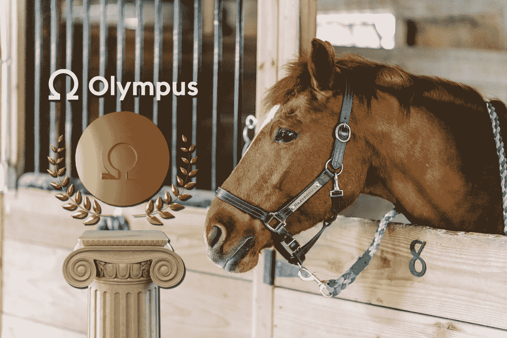

# 希腊众神的稳定中心

> 原文：<https://medium.com/coinmonks/stablecoin-of-the-greek-gods-e59d8657e5bb?source=collection_archive---------6----------------------->

## 奥林巴斯刀是如何改变 DeFi 的

人们喜欢稳定的硬币，因为没有波动性。而且他们还会一天比一天保持购买力。或者他们有吗？

欧姆本身并不是一种稳定的货币，但奥林巴斯的愿景是让它成为一种由分散资产支持的算法储备货币。