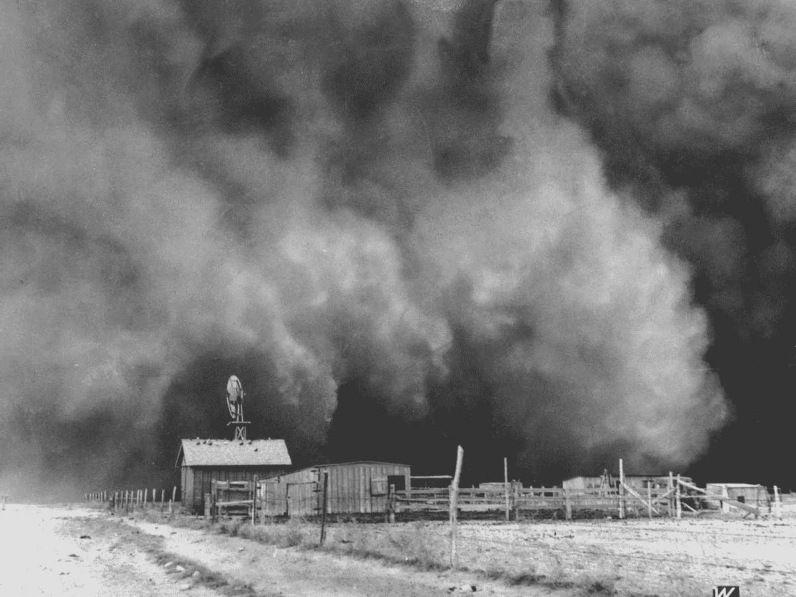
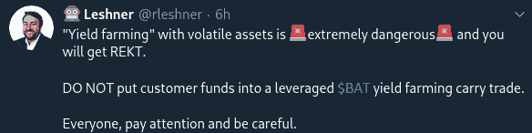
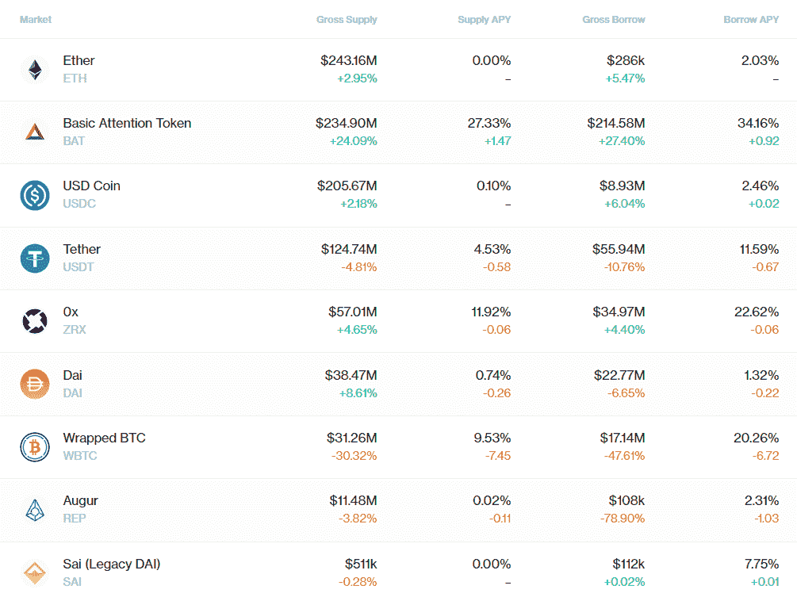
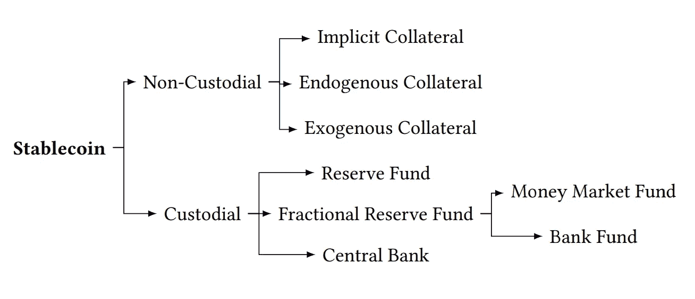
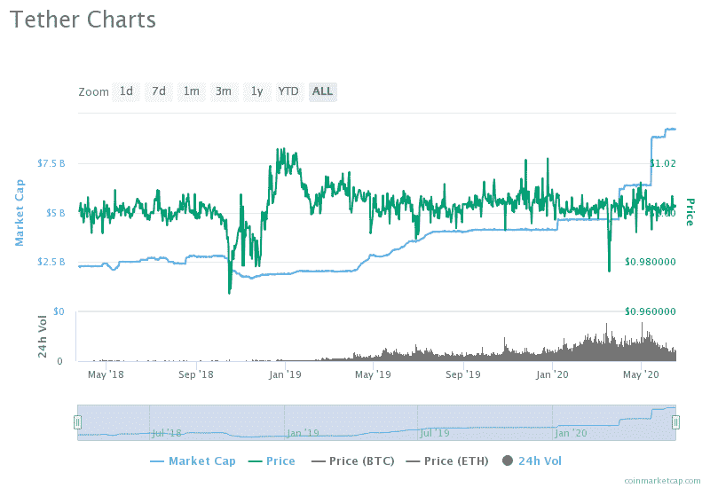
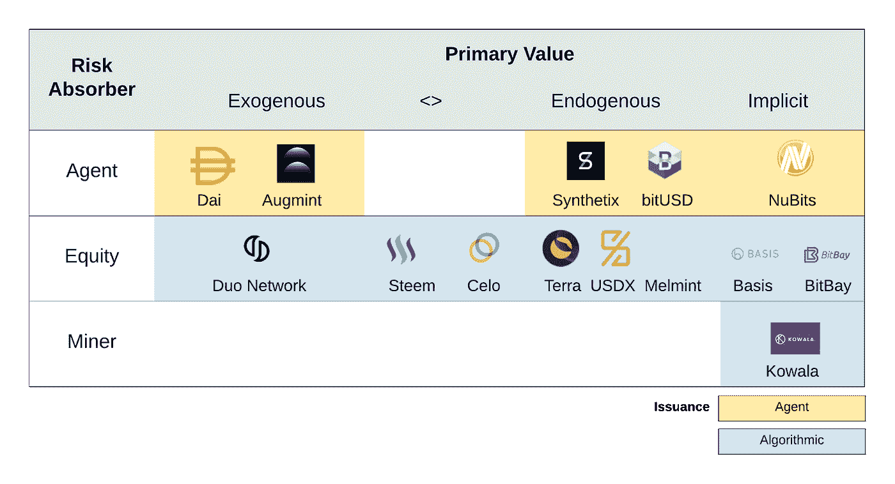
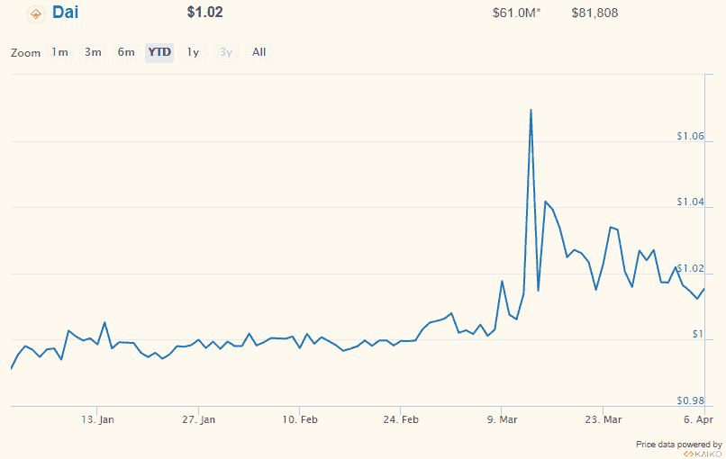
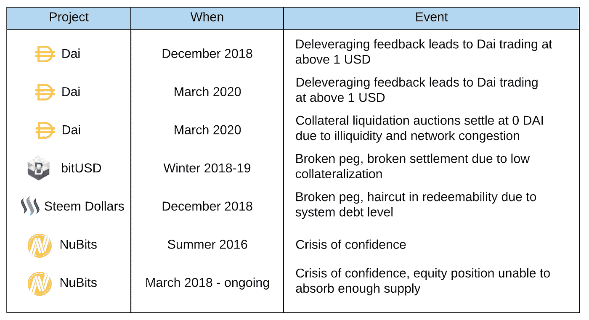
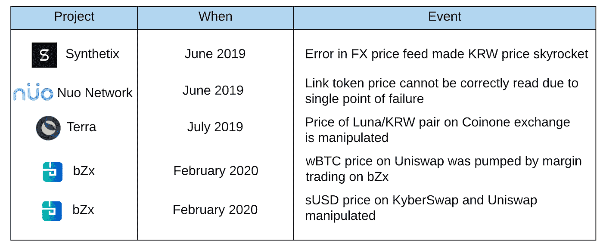
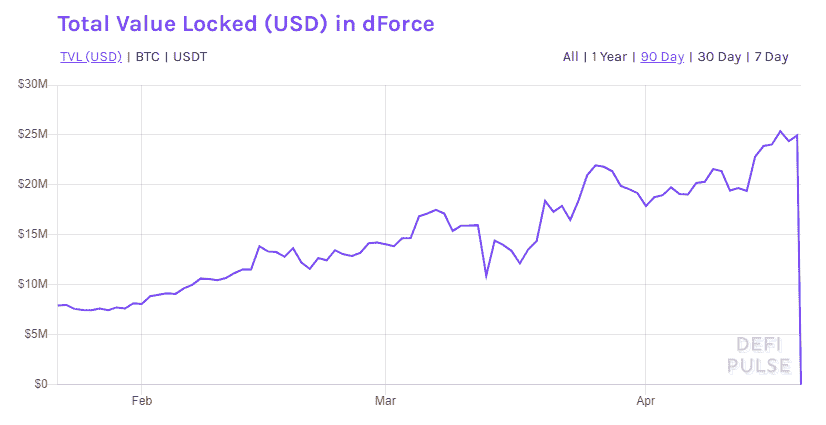

# stable coins 2.0:DeFi 的经济基础

> 原文：<https://medium.com/coinmonks/stablecoins-2-0-economic-foundations-for-defi-b9ab38500b87?source=collection_archive---------1----------------------->

## DeFi 中的激励安全性和经济稳定性:稳定的收入、治理(例如，COMP)、dex、跨链资产等；开放式定义问题和模型的“手册”

[*阿莉雅·克拉格斯-穆特*](https://twitter.com/aklamun) *、* [*张秀坤·哈茨*](https://twitter.com/dominik0_) *、* [*路易斯·古吉*](https://twitter.com/ljfgudgeon) *、* [*刘俊友*](https://twitter.com/orbxball) *、安德里亚·明卡*

Sustainable farming?

*TL；对 DeFi 治理和产量农业的新关注以及最近对黑色星期四的记忆，放大了对 DeFi 中鲜为人知的风险结构的关注。我们为这些风险的描述和建模提供了新的基础；这是在 stablecoins 的背景下开发的，但更广泛地适用于许多加密经济系统，包括跨链协议、抵押贷款和分散交易。我们的框架侧重于激励安全的措施，这意味着在考虑攻击面和经济稳定性后，参与对各方都有利，这提出了激励是否实际上导致稳定结果的问题。我们确定了一个重要的可持续性问题:在一些设计有广泛的治理权力和没有社会追索权的 DeFi 系统中，理性代理人的均衡参与可能为零。这是因为在这些系统中调整激励的成本可能高得令人望而却步(类似于要求银行拥有 1000 的长期市盈率以防止储户资金被盗)。我们的框架提供了一种对这些系统建模的方法，并产生了一系列尚未回答的研究问题，这些问题对 DeFi 的发展至关重要。*

*基于我们新* [*的论文这里*](https://arxiv.org/abs/2006.12388) *。*

本周的新闻是 Compound 的红利令牌分配，这已经变成了一个杠杆风险马戏团，用户跳过疯狂的杠杆圈，试图玩奖励机制。

**Navigating yield farming on Compound right now**

您可以在以太坊上观看直播，同时交易者通过平衡复杂的头寸层来获得公司利润:例如，存款 ETH 和 USDC，借入大量 BAT，将 BAT 重新存入新的复合账户，然后用该 BAT 借入 ZRX 并重新存入初始账户，然后用 ZRX 借入更多 BAT，等等。如果你*没有*这样做，并认为“我希望想到了这一点”，我们觉得有义务强调:这些杠杆层中的风险，特别是在 BAT 和 ZRX 这样的瘦市场中，值得他们自己的帖子(但简单回忆一下黑色星期四的级联清算，以及瘦市场很容易被操纵的事实，打开一个攻击向量来触发并从这种清算中获利)。

如果旨在优化景观，那么薪酬分配无疑是一个巨大的成功。更通俗地说，它通过暂时提高流动性回报，解决了平台使用的鸡/蛋问题。更讽刺的是，它为大规模压力测试搭建了平台。

较少讨论的是[的最初目标](https://compound.finance/governance/comp):培育“一个日益庞大的生态系统[……]将受到激励，以良好的治理集体管理《议定书》进入未来”。本质上，令牌分发试图在平台用户中实现更广泛的治理分发，这些用户可以管理他们自己的安全。在我们的[新论文](https://arxiv.org/abs/2006.12388)中，我们提供了一个基于激励保障框架的新视角。

激励联盟是一个跨越秘密经济系统的更广泛的问题。我们开发了一个框架来量化这个问题在稳定的背景下，虽然它广泛适用于加密经济系统。我们提出一个系统中激励安全性的基本问题:

> **【激励性安全】**在考虑攻击面后，所有需要的参与方之间是否有互利的持续参与？

否则，由于均衡参与度为零，该系统将无法运行。例如，如果激励导致有利可图的攻击，那么理性的代理人将在决定参与水平时考虑这种风险。只有回答了这个问题，我们才能理解经济稳定的问题:

> **【经济稳定】**激励措施真的能带来稳定的结果吗？

# 激励的可持续性，还是不可能？

从我们在论文中构建的模型来看，随着系统规模的扩大，维持激励安全性对抗治理攻击成为一个关键问题。如果攻击的回报超过了攻击的成本，那么治理攻击是有利可图的。回报与系统中锁定的资产价值成比例(AUM):拥有非常广泛权力的治理可能直接窃取抵押品(以及清空与 dex 相关的流动性池)；权力不太大的治理仍然可以通过操纵参数和协调[防止退出来间接做到这一点，即使在治理时间延迟的情况下](/coinmonks/vulnerabilities-in-maker-oracle-governance-attacks-attack-daos-and-de-centralization-d943685adc2f)。这些成本包括治理令牌值，它对“诚实”的管理者(即不攻击的管理者)具有基本价值，基于未来的治理费用累积和任何机构责任(如法律追索权)。

## 稳定资产、合成资产、跨链资产

对于非托管稳定资产(以及来自 BTC 的合成资产和跨链资产，它们使用类似的机制)，安全治理价值需要是锁定资产的倍数。当考虑具有适度未来增长预期的长期均衡时，缩放问题就会显现出来，在这种情况下，贴现的未来费用(即使 AUM 的百分比高得不切实际)也不会合理地达到 AUM 倍数的水平。在这种情况下，分散治理系统的安全性将依赖于持有治理令牌的系统参与者来放大治理的市场价值。这将反馈到这些其他方的参与激励中；不能保证均衡参与的存在。举例来说，稳定币持有者可能需要在风险治理资产中持有大量头寸，以确保他们的稳定头寸，这可能会违背他们持有稳定币的目的。这就引出了一个非正式的不可能猜想(也是未来研究的一个重要方向！):

> **【猜想】**在许多被设计为拥有广泛治理权力且没有社会追索权的 DeFi 系统中，理性主体的均衡参与可能为零。

本质上，参与者在这些系统中调整激励的成本可能高得惊人。一个具体的类比是一家银行:如果激励证券要求银行的股票市值是存款总额的数倍，那么储户根本就不值得参与。换句话说，银行的长期市盈率需要在 1000 左右(并由储户支撑)，以保护银行免遭储户资金被盗。

当前实现的解决方案本质上是集中治理。这个解决方案依赖于一种机构责任的形式，可以在我们的模型中表示出来。这不一定是问题。事实上，许多传统金融体系就是这样运作的。这就是为什么银行不需要存款总额的倍数。然而，我们应该公开承认这条信任线是存在的，而且可能是至关重要的。以完全分散的方式解决这些问题仍然是一个公开的问题。

## 分散交易所

这些激励模型也与一些 dex 相关。例如，当 DEX 运营自己的(治理控制的)链时，管理者有能力在受到攻击时限制流动性参与者的退出，即使是在治理延迟的情况下。在 dex 中，应计费用(“诚实的”治理盈利能力)与一段时间内总交易量的一部分成比例，这可能是交易所瞬时 AUM 价值的许多倍，而激励证券仍然与 AUM 相关。一个关键的建模组件将是相对于存款量的行为因素。对于 Uniswap，年化存款量可达 100 倍左右。相比之下，抵押稳定币对借入资产收取费用，大约是供给存款的 1/4。虽然治理产生的均衡费用在 dex 中可能比 stablecoins 小得多，但这个大约 400 倍的因子使得针对治理攻击的激励安全性的可行区域在 dex 中可能更大。这让我们得出以下非正式的猜想，比较不同类型的 [DeFi](https://blog.coincodecap.com/the-ultimate-guide-to-defi-decentralized-finance/) 应用的可行性:

> **【猜想】**从根本上来说，保护 dex 免受治理攻击比保护 stablecoins 更容易。

这些可能性加强了研究相互激励的重要性，以便为给定的应用选择正确的 DeFi 设计，以及需要解决的问题(DeFi 研究人员注意到)。

## 贷款协议

根据这一讨论，我们回到最初的考虑抵押贷款协议，如复合。这些监狱与非监禁监狱有着相似的结构。然而，它们稍微简单一些，因为借入的资产很大程度上是外生的。作为这种外部性的结果，参与者可能更容易在实现治理攻击之前(即，在治理时间延迟期间)退出系统。例如，假设借入的资产是 USDC；在这种情况下，金库总是可以通过发行人以票面价值创造新的稳定债券，以去杠杆化和退出(特别是，当他们想要退出时，他们不依赖于 Dai 持有者将它们卖回 Dai)。本质上，在这种情况下，治理时间延迟是一种更强大的预防工具——更复杂的价格馈送和/或矿工可提取价值攻击可能是个例外。

也就是说，复合资产中的一些小市值资产可能开始偏离外生案例。BAT 和 ZRX 市场在很大程度上被过度利用，因为它们目前更受高产农业的青睐。例如，BAT 利用率目前为 91 %, BAT 当前存放的名义价值为 2 . 34 亿美元，而 BAT 的总市值为 3 . 77 亿美元(尽管 BAT 的一些金额会因其来自同一初始存放的 BAT 的多层借款和再存放而净流出)。根据这种结构，BAT 头寸的大量平仓可能会看到与 stablecoins 类似的去杠杆化效应，如下文进一步讨论的那样。

Compound stats on 23 June 2020.

剩下的问题是:薪酬分配过程是否有助于提高长期激励一致性？也就是说，它是否有助于降低用户保护系统免受治理攻击的成本？乍一看，这看起来很有希望。用户通过参与获得治理份额，因此不必有意识地抬高治理市场价值来保护系统——他们只需要不出售他们获得的份额。这最后一点说明了这里缺乏保证:一旦用户被赠予股票，它就是他们投资组合的一部分，他们可以选择是否维持这个有风险的位置。虽然 COMP 分布无疑吸引了大量新用户进入 Compound，但是 COMP 分布机制(或者任何其他分布机制)是否有助于我们达到更稳定的治理平衡仍然是一个悬而未决的问题。

# Stablecoins:设计、模型和风险

我们现在从这篇关于所有 stablecoin 设计和模型的通用功能表征的论文中挖掘更多细节，从中我们获得了上述见解。这里，我们从稳定点的典型分解中分离出来，以表征不同功能组件中的风险和权衡的维度。第一个区别很简单:监管稳定型和非监管稳定型，前者依赖于对第三方的某种信任，后者则不依赖于第三方。

**Figure 1:** A summary breakdown of stablecoin designs along some of the most important dimensions of risk.

## 看守马厩

在托管方面，有三种不同类型的稳定货币，它们都通过套利者的工作来维持固定汇率，以至于他们可以为基础货币创造/赎回稳定货币。稳定的货币保持 100%的准备金率，就像区块链上的美元 ETF。例子包括 TUSD，USDC，以及后来的天秤座。

第二种类型[，包括系绳](https://cointelegraph.com/news/fractional-reserve-stablecoin-tether-only-74-backed-by-fiat-currency-say-lawyers)，类似于银行或货币市场基金，持有*部分准备金*。随着 2018 年 10 月[在 Tether](https://cointelegraph.com/news/crypto-exchange-bitfinex-suspends-fiat-deposits-expects-to-resume-within-a-week) 实现，这种稳定的货币面临类似银行挤兑的去挂钩风险。当其合作伙伴交易所 Bitfinex 暂停法定可兑换性时，随之而来的是一场联系汇率危机，货币打破了联系汇率，资本流出联系汇率，流入可感知信用风险较低的资产，而套利者无法重新挂钩。我们注意到，与传统银行相比，这些“银行”受到的监管和审计可能更少，而且可能没有针对银行挤兑的政府保险。

Tether de-pegging event in Oct. 2018.

第三种是由中央银行直接发行的稳定货币。尽管目前央行准备金存款只提供给商业银行，但 CBDC 将致力于在央行提供面向消费者的存款，可能以象征性的形式。

这些托管银行面临着与传统金融系统相似的风险。这些风险主要来自交易对手风险，如托管人不履行其义务以兑现固定价值的风险。一个相关的风险是审查风险，即托管人有选择地选择接受哪些索赔。

## 非监禁稳定

非监禁监狱旨在独立于监禁设计所依赖的社会机构。代替这些社会机构的是参与者之间建立的经济结构——在智能合同中实现。

非托管稳定债券在结构上类似于风险转移工具的动态版本，如债务抵押债券(CDO)。CDO 由一组抵押资产和分割的介绍部分支持。任何损失首先由次级份额吸收；只有在初级份额被消灭的情况下，高级份额才会吸收损失。

在本文中，我们将所有非监禁稳定币设计通用分解为以下功能组件。图 2 描绘了几种 stablecoin 设计如何通过一些组件的形式相互关联。

> **初级值。**经济结构中价值基础的稳定币，主要来源于某种制度中的市场预期。有三种类型
> 
> **a)外源性担保品:**在稳定担保体系之外具有用途的担保品，例如，与制造商的 ETH。
> 
> **b)内源性担保品:**担保品，其目的是作为稳定货币的担保品。
> 
> **c)隐性抵押品:**不使用显性抵押品，而是使用市场机制来动态调整供应以稳定价格。这类似于内生抵押品，但在吸收损失的义务方面存在重要差异。
> 
> **风险吸收器。**在某种程度上，一些投机者吸收金融风险寻求利润。(类似于 CDO 的初级部分)。这可以是个人*代理*决定以抵押品、网络中类似的独立*股权、或网络中的*矿工*(或验证者)作为其角色的条件来参与。*
> 
> **稳定币夹。**构成稳定的货币市场需求方的代理人。(类似于 CDO 的高级份额持有者)。
> 
> **发行。**决定稳定币发行的代理或算法。(类似于 CDO 的杠杆作用)。这可以由系统中的一些代理或算法直接决定。
> 
> **治理。**管理协议参数的代理或算法。(类似于管理 CDO 时的股权头寸)。
> 
> **数据馈送。**将外部资产数据导入区块链的一些功能。
> 
> **矿工。**决定基本区块链层中动作的包含和排序的代理。

Figure 2: How different non-custodial stablecoin designs are inter-related through several components. Note that there is a spectrum (without any particular scale) between exogenous and endogenous collateral.

本文还讨论了不同类型的*复合稳定锥*，它们是由一篮子主稳定锥通过不同的结构组合而成。

这种非托管资产会带来新的风险，因此现有的金融模型不能“开箱即用”。这里我们讨论三种新的风险类型。

## 去杠杆化风险

首先，是去杠杆化螺旋，即维持稳定货币的债务水平下降过快，导致挂钩被打破。我们之前已经探讨过这个问题[这里](/coinmonks/insights-from-modeling-stablecoins-a30e732aef1b)和[这里](https://arxiv.org/abs/1906.02152)(并在 2018 年危机[这里](/coinmonks/the-state-of-stablecoins-update-2018-56fb82efe6de)指出了这种可能性)。

这种风险是实质性的。例如，在 2020 年 3 月 12 日至 13 日之间的 36 小时内([黑色星期四](https://blog.makerdao.com/the-market-collapse-of-march-12-2020-how-it-impacted-makerdao/)’)，冠状病毒相关的市场动荡抹去了加密市场 50%的价值。在 ETH 网络上，这导致网络拥塞和高油价，进而降低交易速度并导致交易失败。

这给制造商戴带来了严重的问题。金库难以去杠杆化，因为它们无法增加抵押品或偿还戴的债务。保管人要么无法足够迅速地获得戴的流动性，要么无法参与所有的债务拍卖。两个守门员机器人甚至开始以 0 DAI 竞标 ETH，免费获得约 800 万美元的 ETH。

**Real-life footage of a deleveraging spiral: Maker on Black Thursday**

Deleveraging effects on Dai price around Black Thursday (source: OnChainFx).

我们在下面的表 1 中总结了值得注意的非托管稳定参与去杠杆化事件。

**Table 1:** Stablecoin deleveraging events (useful case studies for stablecoin design)

## 甲骨文操作

其次，oracle 数据馈送(将外部数据馈送到区块链)也可能变得不准确。这可能是意外发生的，也可能是攻击造成的。同样，这种风险是实质性的，并且已经发生过几次，我们在下面的表 2 中总结了值得注意的事件。

例如，2019 年 6 月，外汇价格反馈中的一个[错误使得 Synthetix 上的韩元价格飙升。悉尼时间凌晨 3 点，一个价格馈送 API 开始间歇性地报告韩元价格比当前价格高出 1000 倍。由于一系列不幸的巧合，尽管防御机制丢弃了异常值，甲骨文最终实际上在计算中使用了这个大大夸大的价格。结果，有几笔交易获得了 1000 倍的利润，在不到一个小时的时间里获得了超过 10 亿美元的利润。](https://blog.synthetix.io/response-to-oracle-incident/)

**Table 2:** Price feed manipulation events (more useful case studies for DeFi design)

## 治理和矿工攻击

我们已经在上面讨论了对协议的治理攻击。此外，矿工可以参与进来，并可以被解释为决定事务包含和排序的第二种类型的治理。

## 智能合同风险

我们还简要提及智能合约风险。由于 stablecoin 系统通过算法执行，没有任何特定机构的监督，其规范或实现中的错误可能会产生严重的后果。从建模的角度来看，智能合约风险类似于交易对手风险(在这种情况下，是实现中的错误风险)。

下图显示了当这些漏洞被利用时会发生什么。由于一个重入错误，借贷协议在几个小时内从 2500 万美元变成了 19 万美元。

# **走向基于风险的经济基础**

在我们的论文中，我们提出了一组模型，可以作为这些风险的基于风险的基础。

我们提出的一系列模型借鉴了**资本结构模型。**从首次公开募股(IPOs)背景下开发的模型中汲取灵感，我们调整这些模型以捕捉治理令牌持有人、稳定币持有人和风险吸收者的激励。(更多)细节见论文。

第二种类型的模型是**分叉模型。**资本结构模型只考虑单一的时间步骤:根据代理人的期望，他们将选择在下一轮执行某些行动。相反，分叉模型是考虑多轮代理决策的扩展。

第三种类型的模型是**价格动态模型**，它模拟了在类似 CDO 的结构中代理人的相互作用，这种结构包含了稳定货币系统中的反馈效应。在这里，我们建立在我们之前的工作([这里](https://arxiv.org/abs/2004.01304)、[这里](https://arxiv.org/abs/1906.02152)和[这里](https://arxiv.org/abs/2002.08099))之上，对去杠杆化效应进行建模。

报纸上还有很多有趣的细节，我们无法在这篇文章中一一赘述。在这里查看。

*特别感谢*[*Andrew Miller*](https://twitter.com/socrates1024)*提供的宝贵反馈。*