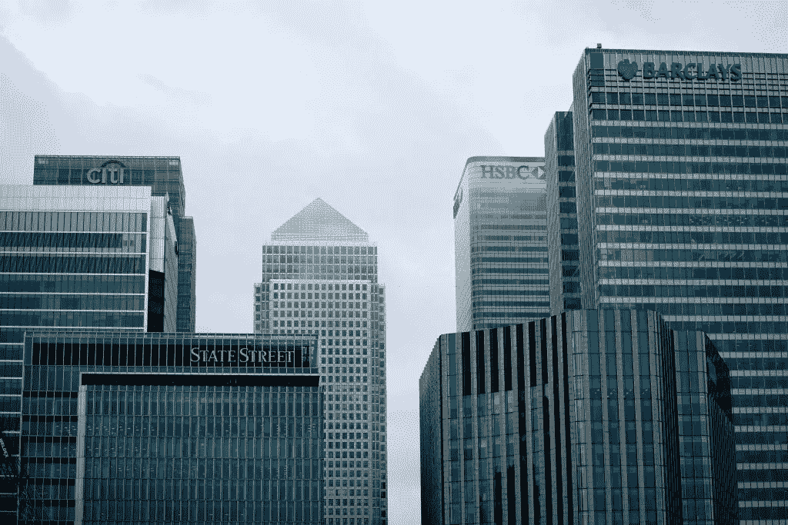
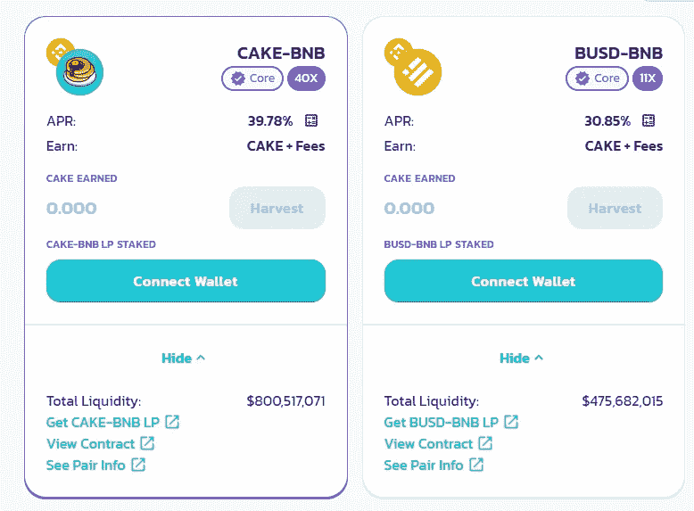

# 稳定存款:一种高风险的储蓄账户，收益率很高

> 原文：<https://medium.com/coinmonks/stablecoins-a-riskier-version-of-a-savings-account-with-massive-yields-f9fa287c252e?source=collection_archive---------1----------------------->

Offices of banking giants

稳定币代表政府支持的货币的代币化版本。它们的交易价格是每枚 1 美元。它们是安全的支付手段，为加密货币交易所提供流动性和稳定性。两种主要的稳定硬币是美元硬币(USDC)和币安美元(BUSD)。

# 巨额收入

几乎所有的加密交易所都提供稳定的利率。例如，BlockFi 为 USDC 的前 5 万美元支付 7.5%的利息。最近，比特币基地发布了一款产品的计划，该产品在 USDC 上支付 4%的 APY。这是令人垂涎的利率，甚至连政府债券都无法提供。

# 更高的收益率

如果你喜欢冒险，你可以让你的稳定的同事为你努力工作，在[、PancakeSwap](https://pancakeswap.finance/farms) 、SushiSwap 或其他项目上下注，赚取更高的回报。在 BUSD 和 BNB 的[赌局中，你可以获得 30.85%的回报。PancakeSwap 让你的密码为你工作。它的市值为 102.45 亿美元，总锁定价值为 90 亿美元。这只是一个项目。在不同的区块链还有其他几个。确保你做了调查。](https://pancakeswap.finance/farms)

High returns on Stablecoin staking

USDC 的流通供应量价值 258 亿美元，比双子星的 2.68 亿美元大得多。USDC 被更多的交易所接受，并受益于更高的流动性，但双子座是独特的，因为它与双子座交易所挂钩。

作为一家美国公司，Gemini 声称它受纽约金融服务部的监管。因此，“在道富银行托管期间，GUSD 储备银行有资格获得每名用户最高 25 万美元的联邦存款保险公司保险。”细则表明，联邦存款保险公司的保险只适用于美元储备，而不是代币本身，因为它们是自我保管的类别，托管在以太坊区块链。

# 主流采用 stablecoins

对于主流机构采用的稳定资本来说，监管机构扮演着重要的角色。在我们称之为其他电子支付的合法替代品之前，他们需要接受 crypto 作为法定货币。对于加密资产和稳定账户，已经有了一些值得注意的步骤和有利的处置——就在几年前，这还是不可想象的。

从许多华盛顿监管者的角度来看，Stablecoins 这个名字可能具有讽刺意味。它们的价值与政府货币挂钩，比如美元，因此保持相当稳定。考虑到加密的高度不稳定性，这个因素非常重要。稳定货币越来越受欢迎，因为这是一种廉价的加密货币交易方式。

# 货币的未来

在短短几年内，Stablecoins 已经从几乎不存在发展成为一个超过 1200 亿美元的市场，其中大部分增长发生在过去的 12 个月里。但是，许多产品更像是稍微有点风险的投资品，而不像它们所宣称的那样是廉价的现金。到目前为止，他们正从监管缝隙中溜走。

监管稳定银行的热潮——以及该行业要么回避监管、要么站在有利可图的一边的游说努力——可能是今年华盛顿金融界最重要的话题。官员们如何处理关于一个相对较新现象的棘手问题，将为一项可能会持续发展的技术开创先例，实际上写下了一本将决定货币未来的规则书的初稿。

关于如何对待稳定货币的争论也不可避免地与另一个热门话题交织在一起:美联储是否应该推出自己的数字货币。根据其特点，美联储的发行可能会与私营部门的稳定债券竞争，而该行业已经在为这种可能性做准备。

以下是对什么是稳定资本的概述，为什么它们可能有风险，可能的监管解决方案，以及政府在监管它们时可能的下一步行动。

# 什么是稳定币？

stable coin——stable value 硬币，如果你觉得合适的话——是一种加密货币，通常与现有的政府支持的货币挂钩。为了向持有人承诺他们投入的每 1 美元将保持价值 1 美元，稳定债券持有大量资产作为储备，通常是短期证券，如现金、政府债券或商业票据。

Stablecoins 非常有用，因为它们让人们能够更无缝地使用比特币等具有投资功能的加密货币进行交易。他们在旧世界的金钱和新世界的密码之间架起了一座桥梁。

但许多稳定的债券都是由短期债务支持的，这些债务容易出现流动性不足的情况，这意味着在困难时期，它们很难或不可能交易。尽管这种支持有些不稳定，但稳定债券本身有望像绝对安全的资产一样发挥作用。

Grow your finances

# 有什么风险吗？

并非所有的人生来平等。最大的稳定货币 Tether 表示，根据其最近在[的披露，它大约一半投资于一种叫做商业票据的短期公司债券。商业票据市场在 2020 年 3 月融化，迫使美联储介入解决问题。如果这些类型的漏洞再次出现，Tether 可能很难迅速将其持有的资产转换为现金，以满足提款需求。](https://tether.to/wp-content/uploads/2021/08/tether_assuranceconsolidated_reserves_report_2021-06-30.pdf)

其他稳定资本要求不同的支持，给他们不同的风险。但是关于稳定的硬币是否真的拥有他们声称的储备还有很大的疑问。

公司圈曾表示，其美元硬币，或美国国债，[由类似现金的控股公司 1:1](https://www.cnbc.com/2021/08/23/crypto-usdc-stablecoin-to-change-reserves-composition.html) 支持——但随后在 7 月份披露，[40%的持股实际上是美国国债、存单、商业票据、公司债券和市政债券。Circle 的一名代表说，从本月起，美国存款保险公司将以现金和短期美国国债的形式持有所有储备。](https://www.centre.io/hubfs/pdfs/attestation/Grant-Thorton_circle_usdc_reserves_07162021.pdf)

纽约州[司法部长调查了](https://ag.ny.gov/sites/default/files/2021.02.17_-_settlement_agreement_-_execution_version.b-t_signed-c2_oag_signed.pdf) Tether 和加密货币交易所 Bitfinex，部分指控 Tether 一度掩盖了 stablecoins 的储备。这些公司与政府达成的和解包括罚款和提高透明度。

Tether 在一份声明中指出，它从未拒绝赎回，并在纽约总检察长调查后修改了披露内容。

共同的思路是，没有标准的披露或报告要求，就很难确切知道稳定的货币背后是什么，因此很难衡量它带来了多大的风险。

也很难追踪稳定的硬币是如何被使用的。

证券交易委员会主席 Gary Gensler 在今年的一封信中告诉参议员伊丽莎白·沃伦【Stablecoins“可能会为那些试图回避与我们传统的银行和金融系统相关的公共政策目标的人提供便利:反洗钱、税收遵从、制裁等等。”。

# 监管机构能做什么？

稳定债券的问题在于它们钻了监管的空子。它们不属于银行存款，因此美联储和美国货币监理署监管它们的能力有限。如果它们被定义为证券，证券交易委员会有一些权力，但这是一个积极辩论的问题。

州级监管机构已经设法实施了一些监管，但包括 Tether 在内的重要产品都位于海外，这一事实可能会使联邦政府更难行使权力。监管机构正在研究他们的选择。

# 政府的下一步是什么？

财政部、美联储和其他金融监管机构有几个选择。还不清楚他们会选择什么，但这个问题显然是最重要的:由财政部主持的总统金融市场工作组预计将很快发布一份关于这个主题的报告。即将在 T2 发布的美联储关于央行数字货币的报告也可能触及稳定货币的风险。

几个主要的监管选项包括:

*   **将它们认定为具有系统风险。**由于稳定货币与其他重要市场交织在一起，金融稳定监督委员会(Financial Stability Oversight Council)可以将它们指定为具有系统风险的支付系统，使它们受到更严格的监管。
*   尽管这个市场目前可能还没有大到足以被视为系统性风险，但《多德-弗兰克法案》(Dodd Frank Act)赋予了监管机构这样的权力:如果某项支付活动在未来有可能对整个系统构成威胁，监管机构就可以将其认定为系统性风险。如果发生这种情况，美联储或其他监管机构将需要拿出一个应对风险的计划。
*   把它们当作有价证券对待。政府也可以给一些稳定的债券贴上标签，这将带来更大的信息披露要求。Gensler 先生在最近的一次听证会上告诉立法者，stablecoins “很可能是证券”，这将给予他的机构更广泛的监督。
*   像监管货币市场共同基金一样监管它们。许多金融专家指出，稳定债券的运作方式很像货币市场共同基金，它们也是短期储蓄工具，在投资于风险较低的资产时提供快速赎回。但是货币基金本身在十年多一点的时间里需要两次政府救助，这表明它们的监管是不完善的。
*   美国进步中心(Center for American Progress)专注于金融市场和监管的格雷格·盖尔兹尼斯(Gregg Gelzinis)表示:“稳定的货币看起来并不新鲜。"我认为它们要么是不受监管的货币市场共同基金，要么是不受监管的银行."
*   像对待银行一样对待他们。鉴于货币基金监管的缺陷，许多金融监管爱好者更希望看到稳定的货币被视为银行存款。盖尔齐尼斯说，如果出现这种情况，代币可能会受到银行监管机构的监管，比如货币监理署。他们也可能从存款保险中受益，如果支持稳定货币的公司破产，存款保险将保护个人。
*   **尝试与央行数字货币竞争。**美联储主席杰罗姆·h·鲍威尔(Jerome H. Powell)已经表示，击败稳定货币可能是央行数字货币的一个吸引力，这种数字美元像纸币一样，直接与美联储挂钩。
*   “如果你有一种数字化的美国货币，你就不需要稳定的货币，不需要加密货币。我认为这是对其有利的最有力的论据之一，”鲍威尔今年在作证时说。
*   但央行数字货币的设计方式对于它能否成功取代稳定货币至关重要。行业专家指出，由于稳定币用户优先考虑隐私和独立于政府，一种新形式的政府支持的货币可能无法取代他们。
*   **国际合作。**如果说对话中每个人都认同一点的话，那就是不同的司法管辖区需要合作，使稳定的货币监管发挥作用。否则，如果硬币在某个国家面临不受欢迎的监管，它们将能够转移到海外。
*   全球监管机构金融稳定委员会(Financial Stability Board)正致力于建立稳定货币相关的标准和合作计划，目标是在 2023 年最终通过。

免责声明:此处的信息是一般性的，不应被视为财务、法律或税务建议。关于你的具体情况，请咨询金融专家、律师或税务专家。

> 加入 Coinmonks [电报频道](https://t.me/coincodecap)和 [Youtube 频道](https://www.youtube.com/channel/UCbyDhTbOiKh2iUMKBi4-4Zg)了解加密交易和投资

## 也阅读

 [## 最佳加密交易所| 2021 年十大加密货币交易所

### ICON _ PLACEHOLDEREstimated 预计阅读时间:28 分钟加密货币交易所的加密交易需要知识…

blog.coincodecap.com](https://blog.coincodecap.com/crypto-exchange)  [## 2021 年 10 大最佳加密贷款平台| CoinCodeCap

### 当谈到加密货币贷款时，大量因素等同于良好的收入状况。此外，借款的一部分…

blog.coincodecap.com](https://blog.coincodecap.com/crypto-lending)  [## 2021 年最佳免费加密交易机器人

### 2021 年币安、比特币基地、库币和其他密码交易所的最佳密码交易机器人。四进制，位间隙…

medium.com](/coinmonks/crypto-trading-bot-c2ffce8acb2a)  [## 最佳 4 个加密交易信号电报通道

### 这是乏味的找到正确的加密交易信号提供商。因此，在本文中，我们将讨论最好的…

medium.com](/coinmonks/best-crypto-signals-telegram-5785cdbc4b2b)  [## BlockFi 评论 2021:利弊和利率| CoinCodeCap

### 今天，我们提出了一个全面的 BlockFi 评论，这是一个成立于 2017 年的加密贷款平台，拥有其…

blog.coincodecap.com](https://blog.coincodecap.com/blockfi-review)  [## 如何在印度购买比特币？2021 年购买比特币的 7 款最佳应用[手机版]

### 如何使用移动应用程序购买比特币印度

medium.com](/coinmonks/buy-bitcoin-in-india-feb50ddfef94)  [## 加密税务软件——五大最佳比特币税务计算器[2021]

### 不管你是刚接触加密还是已经在这个领域呆了一段时间，你都需要交税。

medium.com](/coinmonks/best-crypto-tax-tool-for-my-money-72d4b430816b)  [## 存储比特币的最佳加密硬件钱包[2021] | CoinCodeCap

### 保管您的数字资产很容易，但找到正确的存储方式却是一项繁琐的任务。在线钱包有一个风险…

blog.coincodecap.com](https://blog.coincodecap.com/best-hardware-wallet-bitcoin)