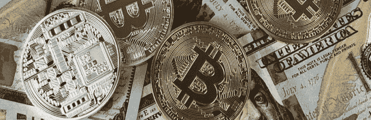
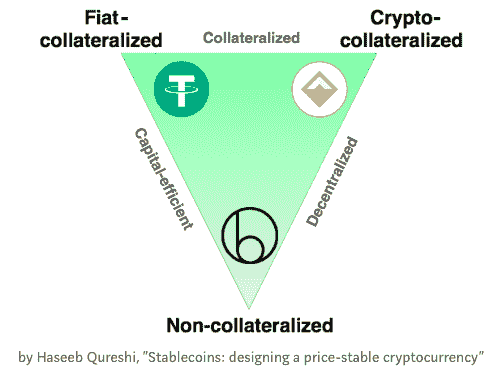
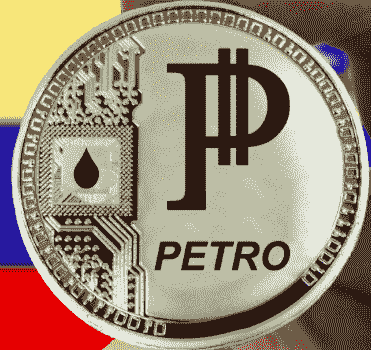

# Stablecoins 是一种加密资产，易失性低，易于监管，有资产支持！

> 原文：<https://medium.com/coinmonks/stablecoins-as-a-crypto-asset-low-volatility-regulator-friendly-asset-backed-6f30a1b65689?source=collection_archive---------11----------------------->

最近，人们对稳定硬币产生了很大兴趣，许多人认为这是机构尝试加密资产的理想方式，因为他们越来越多地将注意力转向这一新的资产类别。然而，它们可能预示着许多影响全球经济的重大变化，因为我们看到政府发行自己的硬币，跨国公司用它们来支付供应商、股东和员工。

根据稳定硬币所链接的内容，稳定硬币可以有不同的名称:

钉住硬币——价值由现金存款担保，如日元、美元、

Indexedcoin —基于已知指数的回报，如标准普尔 500 指数、富时 100 指数或 CPI(消费者价格指数)。

brand coin——由一个全球品牌支持的价值，该品牌承诺用注册办事处所在地的货币偿还持有者。

稳定币被定义为[一种相对于目标价格保持稳定价值的加密资产，例如](http://file///Users/jonathanfry/Library/Containers/com.apple.mail/Data/Library/Mail%20Downloads/E8CC8F6D-6E3B-44B3-91B4-D933ACD55380/).-%20https:/media.consensys.net/the-state-of-stablecoins-2018-79ccb9988e63)美元，或者更简单地说，其价格实质上“挂钩”另一种资产。寻找稳定的硬币其实并不新鲜[维塔利克·布特林早在 2014 年就写过关于这种资产的文章](https://blog.ethereum.org/2014/11/11/search-stable-cryptocurrency/)。

stablecoin 市场的规模目前为 30 亿美元，其中 Tether 占据了市场的主导地位，代表了所有 stablecoin 交易的近 98 %,它在超过 46 个交易所上市和交易，因此人们可以一年 24/7，365 天进行交易。它现在是交易量仅次于比特币的第二大加密资产，市值排名前十。然而，多年来一直有传言说，由于缺乏审计透明度，Tether 到底有多稳定。最近，随着对诺贝尔银行及其偿付能力的指控[的提出，人们对其银行的实力产生了担忧。尽管彭博](http://file///Users/jonathanfry/Library/Containers/com.apple.mail/Data/Library/Mail%20Downloads/E8CC8F6D-6E3B-44B3-91B4-D933ACD55380/now%20https:/cryptovest.com/news/tether-usdt-grappling-with-allegations-of-noble-bank-insolvency)[的一篇文章](https://www.bloomberg.com/news/articles/2018-10-02/puerto-rico-s-cryptocurrency-bank-noble-is-said-to-seek-sale)报道了诺贝尔银行陷入财务困境，因为泰瑟和其他大客户关闭了他们的账户并停止了与诺贝尔的交易。因此，这可能意味着限制不会受到影响，因为[他们已经撤回了](https://cryptovest.com/news/tether-usdt-grappling-with-allegations-of-noble-bank-insolvency/)他们的资金。尽管有各种担忧和谣言，到目前为止，Tether 一直非常成功，并鼓励许多其他组织[创建自己的稳定币，这导致现在有近 60 个稳定币。](https://news.bitcoin.com/a-complete-a-z-of-stablecoins/)

对 stablecoin 的兴趣吸引了风险投资家的注意，他们已经在 stablecoin 项目上投资了超过 3.35 亿美元，最近硅谷一位更知名的风险投资家 Andreessen Horowitz 向一家名为 MakerDAO 的 stable coin 投资了 1500 万美元。这种兴趣的原因之一是，一些人认为稳定的货币潜力将取代全球货币供应[，其目前价值为 90 万亿美元](http://money.visualcapitalist.com/worlds-money-markets-one-visualization-2017/)。但是为了让任何数字货币真正全球化并被广泛接受[，有人认为它必须](https://multicoin.capital/2018/01/17/an-overview-of-stablecoins/)能够证明它是可扩展的、价格稳定的、私有的和去中心化的。

虽然加密资产引起了相当大的关注，主要是由于比特币、以太坊和 Ripple 的价值显著上升，但许多机构和私人投资者一直不愿涉足这一新资产。加密资产可扩展背后的波动性、监管问题和区块链能力的不确定性等因素经常被引用。其他原因是，人们经常会问是什么在支持加密资产，例如，我的投资有多安全。此外，处理加密资产的整个用户体验仍然不是特别用户友好。

如果我们看看这些项目中的每一项，就开始清楚为什么稳定货币变得更受欢迎了，因为就其本质而言，稳定货币通常与法定货币挂钩、联系、支持，与它们所接触的货币一样不稳定。在监管方面，尽管前景还很不明朗，但重要的是，最近推出的与美元挂钩的双子星币(Gemini coin)已被纽约金融服务部(与银行和金融相关的监管机构)正式接受。就可伸缩性而言，人们仍然担心区块链如何处理大量交易，但随着许多技术的进步和升级，这种情况也在不断发生。与此同时，像 Ripple 这样的公司正在全球银行中获得更多的关注，作为与每天交易数万亿美元的 SWIFT 竞争的可能解决方案。由于稳定的货币可以与一种货币挂钩，即与美元挂钩，因此对稳定货币背后原因的担忧有可能得到解答。然而，尽管买卖加密资产并不容易，包括 stablecoins 服务，如 [Vega wallet，它将允许人们通过移动应用程序处理所有交易来花费加密资产。](https://www.ccn.com/vegawallet-to-bring-comprehensive-crypto-platform-to-expand-banking-services/)

# 那么，我们为什么需要稳定的硬币，它们有什么用途呢？

加密资产做得好的一件事是快速便宜地汇款，稳定的账户可以作为传统资产和加密资产之间的良好接口。IBM 最近开始在其日常活动中使用稳定币。IBM 负责全球产业、平台和区块链的高级副总裁布丽奇特·范·克拉林根[说:“这是让区块链支付变得可行的巨大机会。"最棒的是，它们基本上就是数字美元——数字法定货币."这让 IBM 有能力削减外汇成本，更快地转移资金，而不必依赖银行系统。](http://fortune.com/2018/07/17/ibm-stablecoin-cryptocurrency-stellar/)

我们还要多久才能看到跨国公司发行自己的“品牌币”？像谷歌、亚马逊、苹果、宝洁、埃索这样的公司，都在向员工、供应商、股东以及每天与之打交道的无数其他利益相关者支付薪酬，在全球转移着数十亿美元。如果他们向交易对象提供奖励，例如更快的支付或折扣，那么他们交易的组织中有多少%会接受 Applecoin 而不是美元。

一个跨国品牌可以发行自己的 stablecoin，让这种硬币在一家交易所上市，并承诺在需要时偿还，就像美联储或英格兰银行承诺在被要求时偿还一样。

有趣的是，从技术上讲，大部分拥有巨额政府借款的国家都破产了，因为它们需要借钱来支付已经发生的债务的利息，而许多全球品牌坐拥巨额资产、现金、建筑、股票等。

美元、日元和美元是由一个国家的资产/支付能力支持的，但鉴于大规模的量化宽松政策，我们在过去几年中已经看到，神奇地创造出来的数万亿美元将如何偿还？而像谷歌这样发布季度业绩的全球性公司，人们可以定期检查它拥有多少现金/资产。目前谷歌有超过 1020 亿美元的短期投资和现金，为什么不创造一个谷歌币呢？

稳定币也可以用于“智能合约”中需要已知回报的情况。如果你希望能够对冲通货膨胀，或者航空公司希望防范燃油价格上涨，可以创建稳定币来实现这一点，其方式类似于目前使用的衍生品。优点是稳定的硬币可以 24/7 交易，并且潜在地不依赖于一个发行者，即中央控制

稳定硬币的类型

菲亚特抵押债券很容易理解，因为它们是由 1:1 的现金存款支持的。

由密码担保的，稍微复杂一点。它们由存放其他加密资产的人支持，例如，一个人存放 150 美元的 ETH，并收到 100 美元的稳定硬币。如果 ETH 下跌，那么一份智能合约会卖出 ETH 以换取现金，从而维持稳定的币价。由密码担保的稳定硬币具有分散化的优点，即不需要银行或其他机构持有现金。抵押品在智能合约中不受信任地持有，因此用户不依赖任何第三方来赎回它。

无抵押。这是最复杂的，因为它在算法上扩大和收缩供应，就像央行处理法定货币一样。这些稳定币实际上没有任何东西“支持”,除了期望它们将保持某个值。它们是创建不可信的分散稳定币的最“隐秘”的方法。尽管在稳定的货币需求不断扩大的情况下，这一点很容易理解，但如果需求大幅减少，大规模的供应收缩几乎是不可能的，除非采取其他措施来防止这种情况。

现在还不能确定上述哪种稳定币会最成功，我们很可能在将来看到其他类型的稳定币被开发出来。为了被商家接受和广泛采用，所有的加密资产，包括稳定的硬币，都需要是流动的，以便人们能够购买和出售，它们需要在许多交易所上市。全球数字现金必须是快速、廉价和私有的。因此，该平台需要能够扩展，问题是谁将为此买单，因为推出一个稳定的硬币似乎不会那么有利可图，尽管[利润可以从](https://multicoin.capital/2018/01/17/an-overview-of-stablecoins/)驱动的产品和服务(例如智能保险)中产生。如果没有某种隐私保障，分散的稳定币永远不可能成为全球性的数字货币。使用稳定币的企业、政府和金融机构当然需要隐私保障来保护他们的商业利益、关系等等。像比特币那样完全透明的账本不能用于这些目的，因为有可能搜索出谁在比特币区块链上交易。

# 央行何时会介入？

无论对错，许多央行行长并不认为比特币等不稳定的加密资产会对本国货币构成严重的竞争威胁。然而，一种广泛使用且足够大的稳定货币可能会对法定货币构成更大的竞争，因此可能会引发央行采取更大的行动。各国央行一直不愿提供会引发担忧的具体量化水平，例如，使用加密货币支付的比例有多大会被视为对央行实施货币政策的能力构成威胁？政府与货币脱钩可以终结恶性通货膨胀政策、经济控制和其他由政府对国民经济管理不善导致的破坏性政策

再过多久，其他国家就会效仿[委内瑞拉石油](https://venezuelanalysis.com/news/14078)，委内瑞拉政府称“石油币将消除全国各地黑市和金钱黑手党的威胁”。虽然有些人可能会嘲笑石油，但如果拥有巨大石油储备的沙特发行“沙特币”，他们会作何反应。想象一下，如果沙特阿拉伯用沙特货币定价和出售石油，会对美元产生什么影响。我怀疑俄罗斯人和中国人会很高兴不用购买美元来交易石油！尽管全球银行不会满足于看到所有这些日常外汇业务消失。

# 结论

波动性经常被认为是许多机构和个人迄今为止没有更多参与加密资产的一个关键原因。一种得到监管机构认可、以美元为后盾、能够提高资金流动效率(尤其是在国际范围内)的稳定货币，显然很有吸引力。稳定硬币还可能为保险、预测市场、储蓄账户中的去中心化应用开辟各种可能性，使用稳定硬币会更加可行。

然而，考虑到可扩展性的现有限制和哪种稳定货币将会成功的不确定性，它们*可能不会*成为数字货币的最终解决方案。创造加密货币是改善加密货币本身的正确解决方案吗？[我们真的需要一枚稳定的硬币吗？保险公司或利用衍生品提供了现有的解决方案，其中许多都受到高度监管，尽管并非没有风险，就像我们在 2008 年金融危机中看到的那样。](https://media.consensys.net/the-state-of-stablecoins-2018-79ccb9988e63)

"[稳定的货币正在帮助开创一个货币创新的新时代，并鼓励像中央银行这样的老牌机构重新审视我们最古老的机构之一货币的性质和可能性，以及它在金融体系中的作用"。](https://www.blockchain.com/research)

Jonny Fry 首席执行官团队区块链

> [直接在您的收件箱中获得最佳软件交易](https://coincodecap.com/?utm_source=coinmonks)

