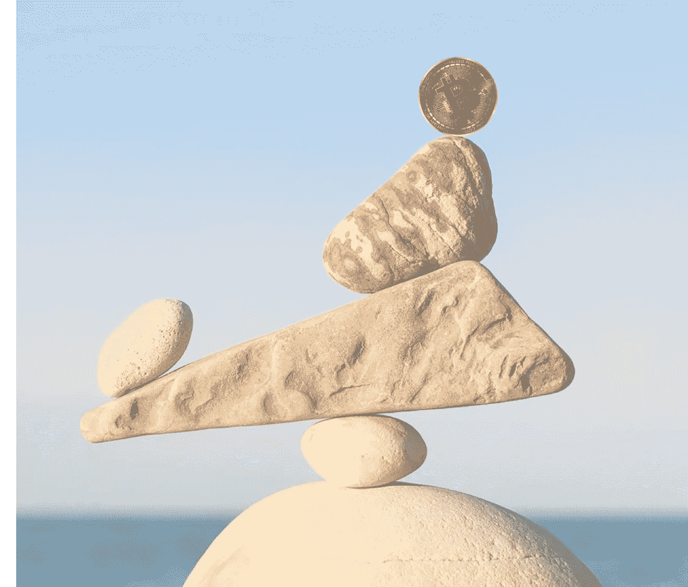
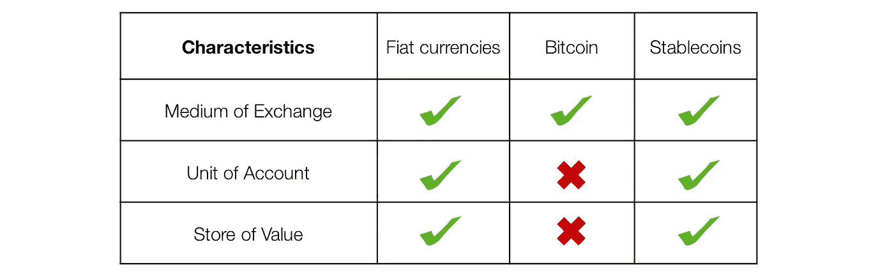
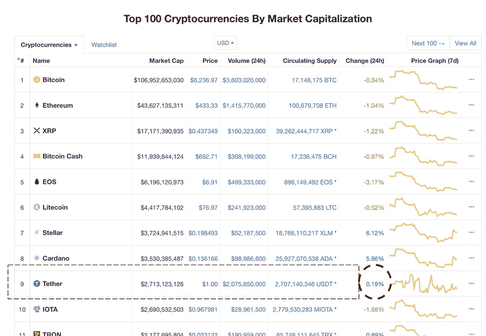
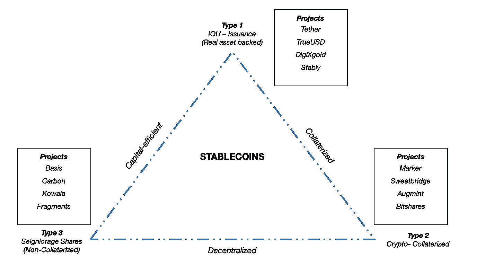
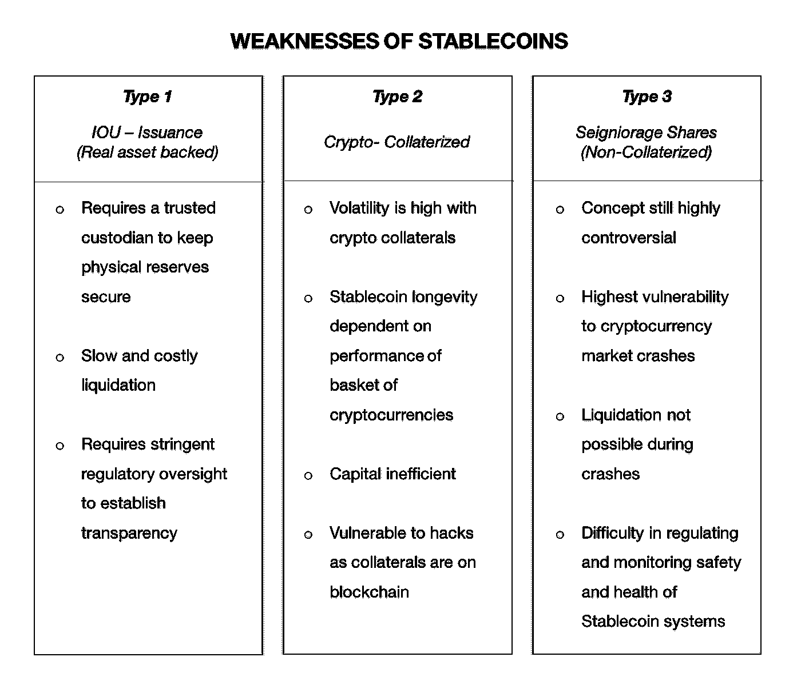

# 稳定:为稳定铺平道路

> 原文：<https://medium.com/coinmonks/stablecoins-paving-the-way-to-stability-b2239e9844f1?source=collection_archive---------4----------------------->

*本文将详细阐述可能触发加密货币经历前所未有的大规模采用周期并帮助其过渡到主流交易媒介的稳定货币。这是迄今为止所有其他现有加密货币都没有实现的梦想。*

*Opinions expressed herein are solely those of the author and do not reflect the views of Bytepapers.com.*

# 稳定的硬币介绍

事实是，比特币有很多设计缺陷，作为货币完全没用。它包含了一个[共识算法](http://bitcoin consensus algorithm)，使得 P2P 交易成为可能，但这种虚拟货币本质上没有任何经济意义。由于硬币的供应永远固定，而需求则大幅波动，这就造成了市场价格的定期波动。比特币不被认为是现金…它只不过是 1923 年法国入侵期间极度膨胀的德国货币的翻版！

Characteristics comparison table for currency variants

要成为像法定美元一样有用的货币，一种货币必须满足成为交易媒介、记账单位和价值储存手段的[标准](http://www.imf.org/external/pubs/ft/fandd/2012/09/basics.htm)。比特币等传统加密货币只是满足了成为交易媒介的条件。它们目前太不稳定，不具备作为有效价值储存手段的资格。这就是稳定硬币概念的由来。

稳定货币是价格稳定的加密货币，其市场价格与稳定资产挂钩，如美元或黄金。它的目的是成为一种全球数字货币，无论市场状况如何，它都具有低波动性的特征，允许日常物品支付等实际用途。

Top 10 stablecoin 24H volatility comparisons as of 14 July 2018 (Source: www.coinmarketcap.com)

Tether 是当今市值排名前 9 的 Stablecoin 的一个典型例子。如果你参考上面的图表，这是来自 [Coinmarketcap](https://coinmarketcap.com) 的快照，截至 2018 年 7 月 14 日，整体加密市场显示出熊市前景。大多数硬币的价值都在下降，但与市场上的传统硬币相比，Tether 表现出较高的稳定性。

# 为什么需要稳定的硬币？

今天大多数人会有一种误解，认为稳定的货币只是一种支付方式。然而，对于区块链群体和世界各地的政府来说，稳定的 coins 对多个利益主体具有更大的影响，如下几节所述:

***【1】贷方&借方***

价格稳定是推动传统金融产品进入区块链的一个重要因素(保险、贷款、储蓄计划甚至共同基金)。以抵押贷款为例，从贷方的角度来看，最大的风险可能是违约风险。如果你的贷款以比特币等波动性很大的货币计价，你最终会向借款人收取非常高的溢价，以对冲任何形式的价格风险。这给最简单的金融合同带来了不必要的麻烦。

***【2】发展中市场***

此外，发展中国家可以用一种稳定的硬币来取代其极度膨胀的货币。[截至 2017 年第三季度](https://tradingeconomics.com/country-list/inflation-rate)发布，埃及年通胀率为 32%，阿根廷为 23%，尼日利亚为 16%。这只是政府相对更稳定的国家的样本——别忘了委内瑞拉，其年通胀率目前为 741%。如果你的存款以每年 741%的速度消失，你会怎么做？这种货币贬值可以简单地通过引入稳定的货币来解决。

***【3】加密货币交易者***

现有的加密货币兑换 eco 系统对当今的加密交易者非常不利。例如，顶级交易所大多是加密对加密的(只允许以加密货币而不是法定货币的形式存款)，这阻止了交易者寻找价格稳定的货币，以便在加密市场熊市的情况下等待。仍然非常需要一种交易者可以依赖的稳定货币。

***【4】整体区块链经济***

区块链社区普遍期待着一个“区块链应用”的生态系统很快出现。这本质上是一种现象，现有的行业和它们各自的服务以分散的方式被重新实现。以“区块链抓取”、“区块链 Expedia”甚至“区块链 Airbnb”为例。

所有这些“区块链应用”都需要一个可互换的系统来在其“通用令牌”和所有其他应用令牌之间进行转换，因此要求“通用令牌”价格稳定，以使整个应用平稳运行。

如果这些应用程序中有稳定的币，想象一下你每天的拼车都在剧烈波动——你今天花 5 美元打车，明天花 500 美元打车。

# 3 种型号的稳定硬币

目前，加密货币有 4 个明显的特征来确立自己作为全球数字货币的地位，即本质上是免费的— [a]价格稳定性，[b]可扩展性，[c]隐私性和[d]去中心化(支持数字货币的抵押品不能由一个或一小组实体/个人持有)

就目前的发展状况来看，大多数 stablecoins 仍在努力实现所有 4 个标准。可伸缩性和私密性仍然是它们都不具备的品质。然而，社区已经成功地创建了分散的加密资产。

Model adopted and modified from MetaStable Cap

***第一类:借据发行(实物资产抵押)***

第一种稳定币是最容易理解的——一种加密货币，具有可兑换实物资产(如法定美元或黄金)的借据功能。

用简单的方式来解释这个模型——系统接收一美元到他们的托管人信托账户，并以 1:1 的比例发行稳定的存款。如果一个稳定的硬币所有者想要清算并换回美元，这个系统会销毁硬币并把它们汇回美元。

由于该方案是完全集中的，它具有最高程度的价格稳健性。所有抵押品都以实物资产储备(法定储备，或黄金储备)的形式持有，在任何加密市场崩溃的情况下，它们都将保持完整。这也意味着它们能够承受极端水平的波动。

然而，集中式方案要求托管人高度可信，而且需要进行成本高昂的审计，以确保有足够的真实资产支持这种数字货币。如果保管人一直在秘密地抽走所有资产，这可能会导致整个货币崩溃。(例如，Tether 没有被定期审计，机构群体认为 [Tether 实际上是部分准备金](https://www.nytimes.com/2017/11/21/technology/bitcoin-bitfinex-tether.html)，没有持有抵御系统性冲击所需的法定准备金)

该方案也是传统支付过程的监管压力和约束的对象。如果一个系绳持有者想把他们的稳定货币兑换回美元，他们将不得不经历一个极其昂贵和繁琐的电汇或邮寄支票的过程。

***类型 2:加密排序器***

第二种稳定币偏离了有实物资产支持的理念——本质上是将整个理念转移到区块链上，并建立去中心化。稳定的货币不再有黄金或法定储备，而是由大量加密货币支持。

所有加密整理的稳定货币都使用另一种加密货币进行过度整理，这样，如果市场价格足够低，它就会被清算。什么是过度排序？例如，我们将价值 500 美元的比特币存入储备，并发行价值 100 美元的稳定币。硬币是 500%整理的。这告诉我们，如果价格下跌 50%，仍有价值 250 美元的比特币支持这些稳定的硬币(100 美元)，允许每枚硬币保持 1 美元的估值。

过度整理的原因可以解释为对发行者的两个好处——他们可以从硬币持有者那里赚取利息，或者通过发行额外的硬币来建立杠杆作用。

最终，加密校对硬币是资本密集型的，因为它必须被过度校对到最大程度。与真正的资产抵押硬币相比，它们极易受到价格大幅波动的影响。如果支持硬币的加密货币崩溃太多，它们也可能在没有警告的情况下被销毁。

***第三类:铸币税股份(无抵押)***

最后一种稳定货币是高度分散的，不需要任何抵押支持。要理解铸币税份额模型，必须对需求和供给有一个基本的了解。

[铸币税份额](https://bravenewcoin.com/assets/Whitepapers/A-Note-on-Cryptocurrency-Stabilisation-Seigniorage-Shares.pdf)是罗伯特·萨姆斯发明的一个方案。这个想法是为了确保一个智能合约可以模仿中央银行的功能，即控制法定货币的货币供应。在这种情况下，模型只有一个目的，那就是控制稳定的货币供应，确保它总是以 1 美元的价格交易。

过去，政府铸造货币来资助他们的运作，其利润被称为“铸币税”。类似地，在铸币税股票模型中，智能合约可以创造新的稳定硬币，并在市场上拍卖它们，以增加供应，如果硬币以更高的价格交易，价格将降至 1 美元。

如果硬币以低于 1 美元的价格交易，系统所要做的就是买入硬币并增加系统内的需求，从而产生向上的压力，再次达到 1 美元的平衡。如果系统没有足够的铸币税来买下所有需要的硬币，他们可以发行铸币税股票，允许人们要求未来的铸币税。这意味着股东有权从未来发行更稳定的债券中获得未来利润。

我将与大家分享一种常用的方法，通过[“债券和股票”](https://basis.io/basis_whitepaper_en.pdf)过程来扩大和收缩稳定的硬币供应——这是由 [basis](https://basis.io) (以前称为 basecoin)推出的。

铸币税份额面临的主要问题是如何以分散和安全的方式操纵货币供应。增加供给很容易(你只需要印钞票，也就是发行稳定的硬币)，但减少供给就不容易了。

对于基差，该系统发行面值为 1 美元的债券(“债券代币”)，这些债券会被贴现，从而激励基差持有者通过购买(可能在未来某个日期支付)来消除稳定债券的流通。如果硬币的市场价格低于其预期范围，这最终会减少稳定硬币的供应量。

如果网络内的需求增加，就必须增加供给来调节价格。Basis software 将根据之前购买债券的顺序支付债券持有人(“债券代币”持有人)，然后再支付给系统内的股票持有人。这意味着债券持有人比股东拥有更高的优先索偿权，这是我们在传统金融界已经习惯的一种传统的尊卑次序。

basis 引入的“波动供给”概念可能会令人困惑，对许多人来说是全新的，但它在经济学领域已经得到了很好的确立——货币数量理论。许多央行也在使用这种方法来确保其法定货币的稳定性(如美联储)。

永远记住，铸币税份额模型是目前创造真正分散和安全的稳定货币的最“隐秘”的方法。它们仍然是创造加密货币世界大规模采用的解决方案的最令人兴奋、前所未有和实验性的方式之一。从背景来看，Basis 已经从著名的支持者那里获得了 1.33 亿美元的资金，如[安德森·霍洛维茨](https://en.wikipedia.org/wiki/Andreessen_Horowitz)、贝恩资本风险投资、光速风险投资、谷歌风险投资等。

# 结论

Weakness Classifications in accordance to stablecoin categorical type

总而言之，Stablecoins 是大规模采用加密货币的必要一步。成功创造一个理想的稳定硬币可以为我们今天生活的世界带来根本性的长期改善。

然而，通往理想的稳定货币的道路仍然是艰难的。现有的稳定币变体各有其优缺点。迄今为止，没有一个比另一个更好。例如，IOU 发行的 stablecoin 是高度集中的，与加密的本地 stable coin 相比，对崩溃更安全。

众所周知，加密社区极具创新性，新的变种可能会在未来几个月内出现。这些变体几乎肯定会基于我们在本文中讨论的现有系统的基本设计来构建它们的系统。

虽然每种变体在确立成为无法定货币、去中心化数字货币的特征方面都有不同的方法，但市场最终将决定哪一种将成为唯一的赢家。

*注:本文首发于*[*【bytepapers.com】*](https://bytepapers.com)