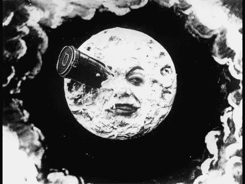

# 稳定连接到月球…

> 原文：<https://medium.com/coinmonks/stablecoins-to-the-moon-adc29b43f735?source=collection_archive---------6----------------------->

与 stablecoins 相关的活动层出不穷，我想我会尝试消化一些信息，并以一种对我有意义的方式展示出来。我希望这样做也能为你提供一些见解。

## 放弃

我不是经济学家，也与任何 *stablecoin* 项目无关——这些观点仅代表我个人，不应被视为财务建议。

## 什么是稳定币？

稳定币是一种数字资产，其价值相对于其“挂钩”的资产既不升值也不贬值。例如，*联系汇率*是一种与美元挂钩的稳定货币。理论上，一个 USDT 应该差不多等于一美元。

## 它们是用来做什么的？

如你所知，比特币和替代币等加密资产非常不稳定，稳定币的主要用途是保护投资者或用户免受此类风险。一些典型的使用案例可能是

*   在交易所储存资金
*   网站上的一种支付方式
*   投资组合中的数字资产

## 稳定曲线的类型

有四种主要类型的稳定货币——由资产支持的和由另一种储备货币支持的。

*   货币/法定货币支持(Tether，TrueUSD)
*   商品支持(Digix)
*   数字资产支持(制造商)
*   算法控制(基础)

## 货币/法定支持

储备支持的硬币只是某处持有的实物储备的数字表示。这些硬币通常由一个实体集中管理。对于这些硬币，您只需以 1:1 的比例发送您的储备货币，即可获得稳定的硬币。没有必要像资产支持稳定币那样提供更多的抵押品，因为假设基础储备本身是稳定的。

***系绳示例*** *—一位投资者刚刚实现了一笔交易的巨额收益，并希望锁定她的利润。她在 BTC 赚了 0.1 美元，并选择购买 USDT 的 0.1 美元 BTC，在她的情况下，大约是 620 美元 USDT。如果 BTC 的价格下跌，她的利润不会受到影响。相反，如果 BTC 的价格上涨，她就会失去价值。*

## 商品担保

商品支持的稳定硬币类似于储备支持的硬币，除了这里的支持资产是商品而不是法定货币。支持资产通常是单一稳定的商品，如黄金或一篮子相互对冲的资产。值得注意的是，这些通常是集中的实体，因为需要维护物理资产。

***Digix* 示例** *—一家投资基金希望投资于黄金的稳定性，但需要比典型黄金市场提供的更多的流动性。他们决定通过 Digix 购买黄金，Digix 向他们发行了等价的 DGX 代币。投资基金持有代币，直到它需要转移到另一项资产，在这一点上，它赎回代币。*

## 数字资产支持

资产支持的稳定硬币通常是分散的，并且需要交换者锁定加密资产以交换等量的稳定硬币。例如，如果你想要 100 个与美元挂钩的稳定币，你需要向发行者发送价值 *$100+* 的所需加密资产，以换取他们铸造稳定币给你。通常你需要*超额抵押*合同——也就是说，你需要在第三方托管中锁定多于新发行的稳定债券数量。在我们上面的例子中，为了获得 100 元的稳定币，我们可能必须送出至少 150 元的所需资产。之所以需要这样做，是因为我们锁定的基础资产的波动性。这可能是一个公平的比较，即你正在用你的抵押品*借入*稳定币，因为你需要以 1:1 的比例偿还你借入的稳定币，以便取回你提供的抵押品。

***制造商*示例** *—一位投资者希望在 2019 年共识会议上购买 Eth，因为他预计价格会飙升。他送 1.5 BTC 到一个制造商合同，并得到 6500 戴作为锁定 BTC 的回报。然后他去有阿呆/ETH 对的交易所买 32.5 ETH。他不去参加会议，因为费用太贵，但会后会和每个人一起聚会。ETH 的价格飙升 50%,触及他的卖单。他拿着他的 11375 个骰子，把其中的 6500 个送到他的制造者契约中，这释放了他的抵押品。他现在剩下 4875 个骰子，可以滚入 BTC，或者扔在虚拟床垫上，虚拟地在里面打滚。*

## 算法的

算法稳定积分是没有任何资产支持的代币。这种代币的价格是通过算法操纵货币供应量来控制的。如果硬币的价格开始超过其目标价格，那么通过铸造新的代币来增加供应量。如果与挂钩相比，价格太低，就有办法减少市场上代币的供应。消除多余硬币的一种方法是出售另一种资产来换取稳定的硬币，然后烧掉收到的代币。政府债券。这类似于政府控制其货币价格的方式——这在密码圈内并不令人意外地不受欢迎。

***基差*举例** *—基差是一种算法稳定的货币，它与美元挂钩。尽管基差的采用率相当低，但投资者或消费者会以类似的方式使用这枚硬币来限制或兑换美元。*

## 咆哮

加密中的常见问题是— *是什么赋予了这些资产价值？*在一种由菲亚特或商品支持的稳定货币的情况下，我们可以把这个问题推给基础资产。*是什么赋予了美元或黄金价值？对于供应有限且被认为有价值的东西来说，真的不应该出现像黄金那样价值大幅下降的情况。这就是为什么黄金被认为是价值的避风港和波动的对冲。在美元的情况下，没有固定的供应，价值被操纵，所以你可能与美元有 1:1 的比例，但在我看来，这是*盲人摸象*。所有这一切中真正令人难过的是，美元实际上是世界上最稳定的货币，也是加密可以用来获取价值的最小公分母。我期待着有一天，作为一个加密集团，我们可以用美元以外的货币来表示我们的价值，就像我们试图减少对外国石油的依赖一样。有些事情发生在某些司法管辖区，我们没有脱离的自由，因为我们依赖他们的资源。我个人喜欢独立于人为市场操纵的资产有一点波动。交易所交易基金、美元稳定债券和其他机构债券本质上与我们加密社区试图创造的经济不一致。*

> [直接在您的收件箱中获得最佳软件交易](https://coincodecap.com/?utm_source=coinmonks)

