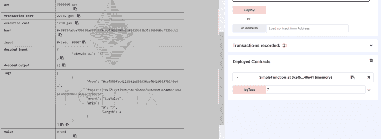
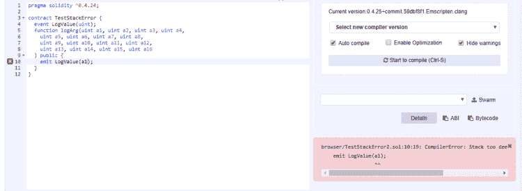
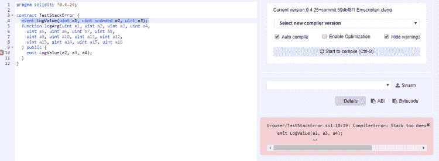

# “堆叠太深”-坚固性错误

> 原文：<https://medium.com/coinmonks/stack-too-deep-error-in-solidity-608d1bd6a1ea?source=collection_archive---------0----------------------->


新年快乐，愿我们在 2019 年都能大有作为！Aventus 欢迎你从寒假回来，我们自己的 Alex Pinto 写了一篇关于坚固性错误的文章。

当一个人开始在 Solidity 中编写智能合同时，迟早他/她会遇到一个非常讨厌的障碍。“堆栈过深”错误。人们很容易陷入这个陷阱，当这种情况发生时，往往很难找到出路。公平地说，根本原因不在于可靠性本身，而在于以太坊虚拟机(EVM)，因此可能会影响编译成 EVM 的其他语言(即 LLL、Serpent、Viper)，但这是编写智能合同的日常工作中的一个微妙区别。

令人惊讶的是，考虑到这可能导致的烦恼程度，很难找到关于如何处理它的好资源，所以我决定写这篇文章，试图揭示它，为我自己的利益，也为其他可能对此感到绝望的人。

一般来说，当代码需要访问堆栈中深度超过第 16 个元素(从上往下数)的槽时，就会产生这个错误。然而，我们可以通过多种方式实现这一目标。这篇文章的目的不是提供这个错误是如何产生的完整理论:根据我的经验，有太多的方法可以做到这一点。但是它将为通用触发器提供一个很好的理论基础，并有望让读者更加了解 EVM 是如何管理其堆栈的。甚至有可能将相同的逻辑扩展到发生错误的其他情况，并寻找避免错误的方法。

在 Solidity 中，大多数类型(即基本类型，例如数字、地址和布尔值，但不是数组、结构或映射)都是通过值传递给函数的:当调用函数时，堆栈的一部分(即堆栈帧)被分配来保存函数返回时程序应该到达的返回位置(“返回地址”)以及函数值类型输入和输出参数的副本。每个参数通常在堆栈中保存一个槽，每个槽是 256 位。

这提供了解决“堆栈过深”错误的最基本方法:总共有 16 个以上的输入和输出参数。但是实际上，如果我们想让这个函数做一些有用的事情，我们必须非常小心，并且可能必须减少参数的数量。

为了测试这一点，我在 [*Remix*](https://remix.ethereum.org/) 中创建了一个小契约，如下所示:

```
pragma solidity ^0.4.24;
contract TestStackError {
  event LogValue(uint);
  function logArg(uint a1) public {
    emit LogValue(a1);
  }
}
```

Remix 非常适合这样的调查，因为我们可以快速编写一个契约并查询它，但根本上是因为 Remix 提供了一个强大的调试器，具有操作码反汇编和堆栈、内存和存储的完整列表。在代码中来回移动也很容易，这是我在任何语言中拥有的最好的调试体验之一。

这个契约非常简单:它没有状态变量，只有一个函数，也非常简单。这个函数只接受一个参数并记录下来。

我将这个合同复制到 Remix 中的一个新文件中，编译并部署它。应该没有错误和警告，所以我转到*运行*选项卡，并点击*部署*。

然后，我扩展 SimpleFunction 契约的列表，并在 *logArg* 前面的框中输入一个值。我按下按钮，检查控制台中的输出:



如您所见，我输入了值 *7* ，它作为日志中唯一的元素被返回。尽管日志值得另发一篇文章，但我还是要在这里提几件事。

这是这个调用的 JSON 格式的 logs 对象:

```
logs [
{
  "from": "0xef55bfac4228981e850936aaf042951f7b146e41",
  "topic": "0xfcf771399d75a67a6d0e730ae98d34c40b6bfe6ebf8053b98ddf4da8c2706250",
  "event": "LogValue",
  "args": {
    "0": "7",
    "length": 1
  }
}
```

*   日志是由 solidity 中的`emit`关键字创建的，它提高了 solidity `event`并对应于`LOGn`操作码。
*   离线运行的客户端应用程序可以过滤日志。过滤器是日志中任何可用主题的条件。
*   日志总是有一个主题 0，它是事件签名的编码。
*   可以通过索引一个参数来创建更多的主题。最多可以有 3 个索引参数。其余的被认为是事件数据

在这个简单的例子中，我们可以很容易地识别出只有一个主题(`"0xfcf771399d75a67a6d0e730ae98d34c40b6bfe6ebf8053b98ddf4da8c2706250"`)，数据显示为 log 对象的`args`成员的一部分。我们还可以验证代码是否按预期运行。

现在让我们测试这个契约的限制，并更改函数以接受最大数量的参数。

```
pragma solidity ^0.4.24;contract TestStackError {
  event LogValue(uint);
  function logArg(uint a1, uint a2, uint a3, uint a4,
	uint a5, uint a6, uint a7, uint a8,
	uint a9, uint a10, uint a11, uint a12,
	uint a13, uint a14, uint a15, uint a16
  ) public {
    emit LogValue(a16);
  }
}
```

我有 16 个输入变量，没有输出变量，因此我只需要使用 16 个堆栈槽。我调用传递值 1 到 16 的函数，并发出最后一个值。我检查日志，发现值为 16。太棒了，这个管用！

然后，我对我的契约做了一个很小的修改:改为记录第一个参数:



等等，什么？！简单地记录一个不同的参数已经把一个完美的契约变成了一个“栈太深”的错误。哇，这是怎么回事？

这不是固性所能阐明的。在这个层面上，这种变化看起来完全无害。我需要深入到 EVM 字节码中去理解发生了什么。但在此之前，我想做另一个测试，收集一些线索。我创建了这个契约的第三个版本，但是改为记录 a2:

```
pragma solidity ^0.4.24;contract TestStackError {
  event LogValue(uint);
  function logArg(uint a1, uint a2, uint a3, uint a4,
	uint a5, uint a6, uint a7, uint a8,
	uint a9, uint a10, uint a11, uint a12,
	uint a13, uint a14, uint a15, uint a16
  ) public {
    emit LogValue(a2);
  }
}
```

这是可行的，并且记录了正确的值。我登录`a3`时也是如此。我假设`a2`和`a16`之间的所有参数都可以被正确记录。
产生的操作码在以下三个文件中:

[*日志【a2】*](http://coders-errand.com/wp-content/uploads/2018/12/opcode_log_a2.txt)

[*【a3】*](http://coders-errand.com/wp-content/uploads/2018/12/opcode_log_a3.txt)

[*【a16】*](http://coders-errand.com/wp-content/uploads/2018/12/opcode_log_a16.txt)

我比较了所有 3 个日志，第一个让我吃惊的是它们的大小都不同(行数)。第二件事是，在第 237 行之前，它们是显著相等的，只有一个例外。这一行之后的代码非常不同，显然是不可预测的。然而，由于这似乎是在函数返回之后发生的，我将简单地忽略它。

然后我把注意力集中在第 237 行和第 198 行之间的一个区别上。我很高兴地证实了一个想法，我曾认为这个想法可以解释堆栈过深错误——在代码的某些地方，我们逻辑上需要调用一些不存在的 DUP 或交换操作码。这里的情况确实如此:在第 237 行之前，所有 3 个版本都是相同的，只有第 198 行有一处不同:

*   `log(a2): DUP16`
*   `log(a3): DUP15`
*   `log(a16): DUP2`

操作码 DUPn 复制堆栈第 n 层的值。这样的操作码只有 16 个，从 DUP1 到 DUP16。DUP1 将当前位于顶部的值的副本推送到堆栈中，DUP16 复制堆栈中第 16 个最高的值。变量在参数列表中的位置和这一行中 DUPn 的值之间有明显的关系，如果我将其推断到案例日志(a1)，这条规则意味着我们将需要一个操作码 DUP17。但是这样的操作码并不存在，它指向堆栈中比我们所能达到的更低的值，这证明了错误消息“Stack Too Deep”是正确的。

满足于此，我自然的好奇心提出了问题:这个 DUP 操作码在这里扮演什么角色？它的目的是什么？

字节码令人生畏。上一次我带着某种程度的理解去看汇编代码是在我十几岁的时候，当时我正在玩 Spectrum 的 Z80 处理器。我没有任何使用 EVM 的经验，所以我不打算在脑子里解析 200 行类似汇编的清单。但是 Remix 在这方面确实提供了相当好的工具。在 debug 选项卡中，我们可以一个操作码一个操作码地重放事务操作码，并且一眼就能看到堆栈、内存和存储等的内容。

在我继续之前，我想把你引向 Alejandro Santander 在 Zeppelin 博客中关于汇编 EVM 代码结构的这一系列文章 。这是一个无价的介绍 EVM 大会，将节省我不得不解释样板。另一个非常有用的链接是这个 EVM 操作码 的 [*列表，这是我最喜欢用来查找每个操作码功能的参考。我强烈推荐。*](https://ethervm.io/)

这个函数没有多少内容，大部分字节码都是重复的。操作码 CALLDATALOAD 出现了 17 次。第一个出现在代码的第一个块中，在函数分派之前。它检查 calldata 是否太短(第 12 行)，在这种情况下，该函数将恢复。之后，它将函数选择器与契约已知的方法进行比较(在本例中，只有一个:`e898288f`)，如果匹配，就将流程导向实现该函数的地址。否则，呼叫恢复。

在这种情况下，代码已经调用了唯一的现有函数，因此流程跳转到地址 70(第 25 行)来处理它。

CALLDATALOAD 的其余 16 个实例正好是我们拥有的参数数量，它们正好以 9 行的间隔出现，并且可能负责处理函数的每个参数。所以，我用 Remix 调试器运行了这几行，观察到它们确实将每个连续的参数加载到了堆栈中(我并不担心这 9 个操作码是如何复制这些数据的)。接下来是 3 个`POP`指令，清除我们不再需要的堆栈部分(用于计算要读取的下一个参数在调用数据中的位置)。此时，栈顶保存第 16 个参数，第二个元素保存第 15 个参数，依此类推。在这个阶段，堆栈的第 16 个元素是第一个参数。随后是函数的返回地址(`0x109`)和函数选择器。

然后，代码将 topic 0 `fcf771399d75a67a6d0e730ae98d34c40b6bfe6ebf8053b98ddf4da8c2706250`的 32 字节标识符推入堆栈，这将第一个输入推出堆栈的前 16 个元素，随后是 DUP 操作码，该操作码将日志事件的参数放在堆栈的顶部(例如`a2`或`a16`)。

接下来的 20 行左右让内存准备好在内存位置`0x80`保存日志事件的参数，并保证堆栈的前两个位置有这个地址和数据的长度(`0x20`)。然后，它调用操作码 LOG1，该操作码使用堆栈中前 3 个位置的数据发出一个带有一个参数和一个主题的日志事件:

*   0: `0x0000000000000000000000000000000000000000000000000000000000000080`
*   1: `0x0000000000000000000000000000000000000000000000000000000000000020`
*   2: `0xfcf771399d75a67a6d0e730ae98d34c40b6bfe6ebf8053b98ddf4da8c2706250`

总共有五个 LOGn 操作码，LOG0 到 LOG4，其中 n 表示日志中主题的数量。Topic0 始终是事件类型的标识符，由其签名的哈希定义，但可以通过使用 LOG0 跳过它，LOG0 指定匿名事件。每个额外的主题都需要堆栈中的另一个槽，将更多的参数推出可达列表。

该分析表明，带有一个参数的事件阻止使用一个变量，因为 topic0 放在堆栈中事件数据之前。这引发了几个问题:

*   如果我们有更多的话题呢？它们也放在数据之前吗？
*   而更多的事件争论有什么影响，是在话题之后推还是之前推？

为了验证这一点，我将再次更改合同。请注意，事件可以有任意数量的参数，其中最多有 3 个可以被索引。索引参数成为主题，而其他参数则集中在数据部分。在这个阶段，我的假设是，每个主题(索引参数)将放在数据之前的堆栈中，因此将阻止对更多早期变量的访问。

在我的测试中，我涵盖了几个场景，但它们都导致相同的结论，所以我将为您节省分钟的细节。我将用另一个有趣的反直觉的例子来说明，然后得出最后的结论。

首先，让我们试试这个版本的契约，其中事件有一个索引值和两个非索引值。

```
pragma solidity ^0.4.24;contract TestStackError {
  event LogValue(uint indexed a1, uint a2, uint a3);
  function logArg(uint a1, uint a2, uint a3, uint a4,
	uint a5, uint a6, uint a7, uint a8,
	uint a9, uint a10, uint a11, uint a12,
	uint a13, uint a14, uint a15, uint a16
  ) public {
    emit LogValue(a2, a3, a4);
  }
}
```

这个函数的字节码(在函数分派之后)直到事件被发出为止是这样的:

```
265 JUMPDEST
266 DUP15
267 PUSH32 a5397a5faa0ec7cfb89428503b91a13bbd737592f7561e6773fa3e1458c8735c
300 DUP16
301 DUP16
302 PUSH1 40
304 MLOAD
305 DUP1
306 DUP4
307 DUP2
308 MSTORE
309 PUSH1 20
311 ADD
312 DUP3
313 DUP2
314 MSTORE
315 PUSH1 20
317 ADD
318 SWAP3
319 POP
320 POP
321 POP
322 PUSH1 40
324 MLOAD
325 DUP1
326 SWAP2
327 SUB
328 SWAP1
329 LOG2
```

发出事件的操作码是`LOG2`。这意味着我们有两个主题，一个是默认主题 0(即事件签名)，另一个是事件签名中唯一的索引参数。其余两个值在内存中分组。
如果我们检查这个操作码的 [*Ethervm*](https://ethervm.io/#A2) ，我们会看到从堆栈中读取的最后一个值，以及第一个被推送到它上面的*，是 topic1，即索引参数— `a2`。最初，它被放置在堆栈的位置 15。操作码`DUP15`将该值的副本放在堆栈的顶部，并因此将所有其他参数压下。比如从现在开始，`a2`在 16 号位，`a1`在 17 号位。*

*下一条指令将一个 32 位的值压入堆栈，这只是对应于主题 0。这个值是硬编码的。这也有再次压制论点的效果。现在，`a2`在 17 号位。*

*以下指令是两个`DUP16`操作码。第一个复制位置 16 的值，这是当前的第三个参数`a3`。但是由于这将一个新元素推到堆栈上，当调用下一个操作码时，`DUP16`将把第四个参数复制到函数`a4`中。在这个阶段，在堆栈的顶部，我们有事件的数据(两个单词)、索引参数和事件唯一标识符。*

*下面几行将前两个值复制到内存中:*

*   *(302–305):将内存`0x40`的内容放在堆栈的顶部，两次。这是事件数据在内存中的位置(在我的执行中是`0x80`)。*
*   *(306–308):将第一个数据字放在内存的第一个空闲位置(即将`a3`放在位置`0x80` )*
*   *(309–311):将内存中的下一个空闲位置放在堆栈的顶部*
*   *(312–314):将第二个数据字放在内存中的下一个空闲位置(即将`a4`放在位置`0xa0` )*
*   *(315–321):在删除不再需要的值后，计算内存中的下一个空闲位置，并将其放在堆栈的顶部。*
*   *(322–327):通过从内存中下一个空闲位置的当前值(保存在堆栈顶部)中减去该位置的初始地址，得出提交给事件的数据的长度。*
*   *(328):对堆栈的前两个元素重新排序，使第一个元素成为事件数据的开头，第二个地址成为该数据的长度。*
*   *(329):最后调用日志操作码。*

*我给出了这个详细的解释，以便你可以理解这个过程是如何工作的，如果你愿意的话。在这种情况下，也许你现在可以解释下一个明显的奇怪现象。仅将事件的签名更改为:*

```
*event LogValue(uint a1, uint indexed a2, uint a3);*
```

**

*是的，另一个堆栈太深的错误。你能看出是什么引起的吗？
…*

*……*

*………*

*字节码变化不大。我们仍然有相同数量的主题，所以最后的操作码仍然是`LOG2`。并且它仍然期望以相同的顺序接收它的参数，即首先是主题，然后是数据。*

*现在，必须首先加载第二个主题，所以`a3`将是第一个用`DUP14`推入堆栈的值。那么 topic0 将被推出。现在，EVM 将把需要存储在内存中的两个参数放在堆栈的顶部，`a2`和`a4`。这些最初是在位置 15 和 13。然而，EVM 已经两次推动，使这些位置 17 和 15。不可能将第一个值放入堆栈(`DUP17`不存在)，因此会出现编译错误。*

*现在我们明白了这一点，我试着再改变一件事，将 log 函数改为:*

```
*emit LogValue(a3, a2, a4);*
```

*这段代码是有效的，因为它非常接近于我改变索引参数顺序之前的最后一个代码块。在这段代码中，用`a2`调用了事件的索引值。在这个版本中，传递到那个位置的仍然是`a2`，其他保持不变。字节码的解释实际上是一样的。*

## *结论*

*这是一个很长的帖子。如果您已经到了这一步，那么值得让您对正在发生的事情有一个有组织的看法，这样您就可以回到您的程序，并思考您的“堆栈过深”错误是否可能是由类似的行为引起的。虽然这篇文章只讨论了发出事件的情况，但是其他函数将使用其他操作码，但是仍然具有相同的逻辑，在需要一些计算时将函数参数(或中间值)复制到堆栈中。*

*因此，以下是一些需要记住的简化笔记:*

*   *当一个函数被调用时，一个堆栈框架被创建。这从下到上包括:*
*   *功能选择器*
*   *寄信人地址*
*   *函数最左边的值类型参数*
*   *…*
*   *函数最右边的值类型参数*
*   *“堆栈过深”错误取决于操作的核心操作码(如算术、散列、调用另一个函数、发出事件等)。)*
*   *如果这些核心操作是在纯函数参数上执行的，那么它们传递给函数的顺序可能决定“堆栈过深”错误的发生。(栈槽也可以用于中间计算和局部变量，但是我打算在以后的文章中研究这些。)*
*   *了解操作码参数的数量和顺序至关重要。这些参数通常从堆栈中读取(唯一的例外是`PUSH`操作码)。*
*   *在执行操作码之前，必须将操作码参数压入堆栈。每个`PUSH`将函数参数下移至少一个槽。堆栈中较深的函数参数是最先处理的参数，即函数签名中最左边的参数。*
*   *如果操作码操作中没有使用某些函数参数，那么它们应该出现在函数签名中的第一位，以减少操作码参数在需要堆栈时超出范围的机会。*
*   *操作码使用堆栈中不同级别的参数。先推更深的层次。如果一个参数在另一个参数之后被压入，它也应该出现在函数签名中的前一个参数之后，否则它会在使用前将另一个参数压入堆栈。示例:*

1.  **考虑一个具有两个索引参数* `*t1*` *和* `*t2*` *的事件，按此顺序调用一个具有多个参数的函数，其中* `*a1*` *在* `*a2*`之前*
2.  **如果事件是用* `*t1 = a1*` *和* `*t2 = a2*` *发出的，那么操作码* `*LOG3*` *就会被调用。**
3.  **在调用这个操作码之前，* `*t2 = a2*` *会先被压入堆栈。**
4.  **这会将* `*a1*` *下推，到时候再推* `*t1 = a1*` *的值就有不可达的风险。**
5.  **如果在函数签名中* `*a1*` *在* `*a2*` *之后，这将被避免，因为它在堆栈中比* `*a2*` *更高。假设* `*a2*` *被推送时是可达的，那么* `*a1*` *之后也是可达的。**

*   *上面的帖子只关注了`LOGn`操作码，特别是在堆栈中需要 3 或 4 个参数的版本。更困难的情况是调用其他契约或库中的函数，因为操作码`CALL`和`DELEGATECALL`各接受 7 或 6 个输入参数，操作码和函数参数之间有更多交互的可能性。*

*我希望这能给你一些关于如何调试和处理“栈太深”错误的线索。还有很多话要说，但那要等其他机会了。*

*下次见。*

**

*Alexandre Pinto — Blockchain developer at Artos (Aventus Ecosystem Party)*

*Alex 是我们生态系统合作伙伴 Artos 的软件工程师，在区块链工程团队工作。他拥有 20 年的技术工作经验，完成了计算机科学博士学位和密码学博士后学位。作为研究的一部分，Alex [发表了关于 Kolmogorov 复杂性、密码学、数据库匿名化和代码混淆的论文](https://www.researchgate.net/profile/Alexandre_Pinto2)。*

*Pinto 还花了七年时间在 Maia 大学学院讲课，包括指导计算机科学和信息系统与软件学士学位课程。*

*这篇文章最初发表在他的博客上。*

*既然你在这里，我们希望你能在[](https://t.me/joinchat/HIDa30p_VOA2Mk-V14EVMA)****[**Reddit**](https://www.reddit.com/r/Aventus/)**[**Twitter**](https://twitter.com/AventusNetwork)**[**【脸书**](https://www.facebook.com/AventusNetwork/)**[**Youtube**](http://www.youtube.com/c/AventusNetwork)**[**insta gram 上与我们联系**](https://www.instagram.com/aventusnetwork/)*************

*****此外，我们已经为票务开发者/其他开发者建立了一个 [**LinkedIn 群组**](https://www.linkedin.com/groups/12118192/)来参与、加入我们并开始对话。*****

> *****加入 Coinmonks [电报频道](https://t.me/coincodecap)和 [Youtube 频道](https://www.youtube.com/c/coinmonks/videos)获取每日[加密新闻](http://coincodecap.com/)*****

## *****另外，阅读*****

*   *****[复制交易](/coinmonks/top-10-crypto-copy-trading-platforms-for-beginners-d0c37c7d698c) | [加密税务软件](/coinmonks/crypto-tax-software-ed4b4810e338)*****
*   *****[网格交易](https://coincodecap.com/grid-trading) | [加密硬件钱包](/coinmonks/the-best-cryptocurrency-hardware-wallets-of-2020-e28b1c124069)*****
*   *****[密码电报信号](/coinmonks/top-3-telegram-channels-for-crypto-traders-in-2021-8385f4411ff4) | [密码交易机器人](/coinmonks/crypto-trading-bot-c2ffce8acb2a)*****
*   *****[最佳加密交易所](/coinmonks/crypto-exchange-dd2f9d6f3769) | [印度最佳加密交易所](/coinmonks/bitcoin-exchange-in-india-7f1fe79715c9)*****
*   *****[BigONE 交易所点评](/coinmonks/bigone-exchange-review-64705d85a1d4) | [电网交易 Bot](https://coincodecap.com/grid-trading)*****
*   *****[氹欞侊贸易评论](https://coincodecap.com/anny-trade-review) | [CoinSpot 评论](https://coincodecap.com/coinspot-review)*****
*   *****[新加坡十大最佳加密交易所](https://coincodecap.com/crypto-exchange-in-singapore) | [购买 AXS](https://coincodecap.com/buy-axs-token)*****
*   *****[投资印度的最佳加密软件](https://coincodecap.com/best-crypto-to-invest-in-india-in-2021) | [WazirX P2P](https://coincodecap.com/wazirx-p2p)*****
*   *****[西班牙 5 大最佳文案交易平台](https://coincodecap.com/copy-trading-spain)*****
*   *****[Pionex 双投](https://coincodecap.com/pionex-dual-investment) | [AdvCash 审核](https://coincodecap.com/advcash-review) | [光宗耀祖审核](https://coincodecap.com/uphold-review)*****
*   *****开发人员的最佳加密 API*****
*   *****最佳[密码借贷平台](/coinmonks/top-5-crypto-lending-platforms-in-2020-that-you-need-to-know-a1b675cec3fa)*****
*   *****[免费加密信号](/coinmonks/free-crypto-signals-48b25e61a8da) | [加密交易机器人](/coinmonks/crypto-trading-bot-c2ffce8acb2a)*****
*   *****[杠杆代币](/coinmonks/leveraged-token-3f5257808b22)终极指南*****