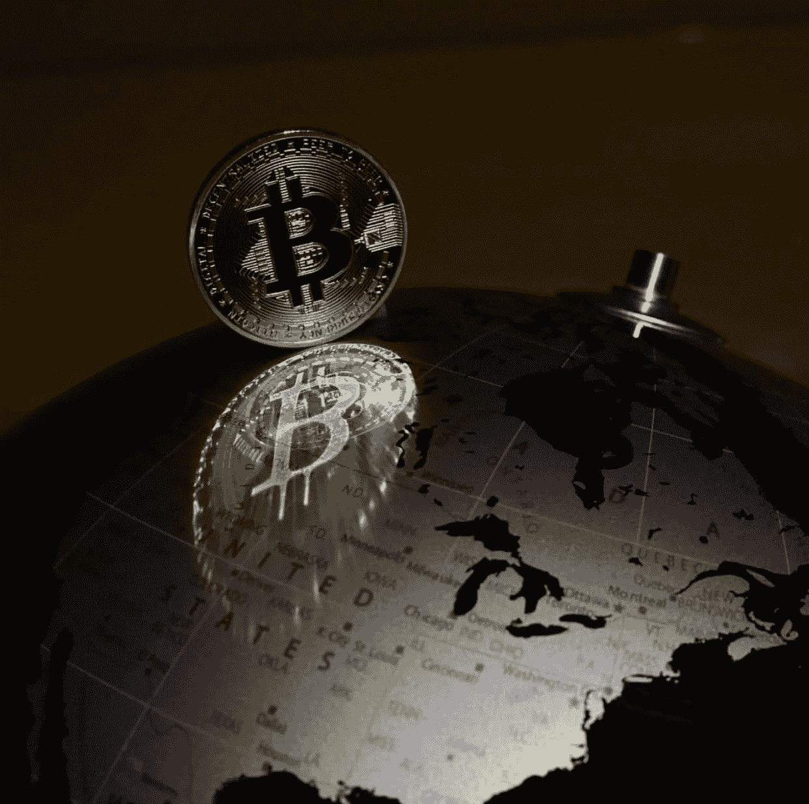
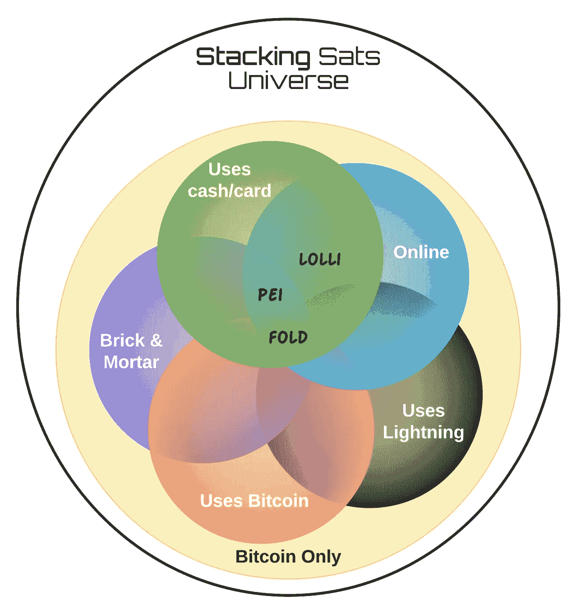

# 堆叠 Sats 宇宙

> 原文：<https://medium.com/coinmonks/stacking-sats-universe-3145d080336e?source=collection_archive---------2----------------------->

> 我们生活在一个非凡的时代。这是一个社会组织、经济福祉、道德和伦理戒律、哲学和宗教观点、人类自我认识，以及我们对浩瀚宇宙的理解发生惊人变化的时代，我们就像宇宙海洋中的一粒沙子……只有一代人有幸经历这一独特的过渡时刻:这一代人是我们的。
> 
> 卡尔·萨甘

欢迎来到 Stacking Sats 宇宙！上面的话是一代人以前表达的，用来描述理解宇宙的历史时刻。今天，我们生活在另一个“非凡的时代”,虽然它可能没有那个时代的辉煌…你现在生活在数字时代。你生活在一个比特币存在的时代，一个你可以堆积 sat 的时代。

The Digital World: Circa 2019

本文将提供一个关于堆码 Sats 的简要概述，以及目前对 Sats 堆垛机可用的三种服务的概述。

**堆积 sat？**

堆叠 sat(即#stackingsats)是随着时间的推移积累比特币的行为。一个 Satoshi 可以缩写为 Sat(s)，是一个比特币的 1/100 百万分之一。术语 Stacking Sats 已发展为描述获取比特币的一种方式，通常是一小部分比特币的大小。

**堆叠 Sats 服务(据说快 3 倍)**

我们将在堆叠 sat 宇宙中涵盖的服务范围具有被动堆叠 sat 的性质。这个想法是，你目前的购物行为应该很少或没有改变，以便你进入这个世界。

让我们从视觉开始。我们将定义每个圆圈(即类别)，然后概述下面的每项服务。

Venn Diagram of the Stacking Sats Universe of Services

*   **实体店:**允许你在实体零售店购物时累积 sat
*   **在线:**允许你在网上购物的时候叠加 sat。
*   **仅比特币:**允许您专门积累比特币(即不支持其他数字资产)
*   **使用现金/卡:**允许您使用卡或其他“传统”支付渠道购买物品
*   **使用比特币:**允许你直接用比特币购买物品
*   **使用闪电:**允许你直接使用闪电网络(一个建立在比特币基础上的二级支付网络)购买物品

最后，对于本文中的三种服务，以下是每种服务与其他两种服务的独特区别:

*   **折:**像花比特币一样赚比特币。
*   **Lolli:** 网上购物赚比特币。
*   裴:用信用卡/借记卡购物，赚取比特币。

**折叠**

> 在现实世界花比特币

折叠为 Sats 堆垛机提供了广泛的好处。Fold 允许你用比特币从一些流行的零售商(在线/实体)购买礼品卡和其他服务。在撰写本文时，Fold 已经拥有 15 家零售商，包括 Amazon.com、西南航空、优步和其他受欢迎的地方。

Fold 在通过闪电网络接受付款方面也是独一无二的，闪电网络允许零售商几乎立即购买和赊账。

此外，对于亚马逊粉丝来说，Fold 允许你一键将你购买的亚马逊余额直接存入你的亚马逊账户。

当您通过 Fold 从零售商处(通常是礼品卡或在线信用卡)购物时，您将获得 Sats 返还(例如，星巴克返还 20%)，并且您可以累积 Sats 以用于未来的购买(也称为回扣)。

与本文中的其他服务(仅在美国可用)不同，Fold 在美国之外的可用性有限。

> 购物时获得比特币

Fold 非常适合当前的比特币玩家，他们:

*   有比特币可花
*   可以购买低成本的比特币，将 sat 套利回来
*   对使用闪电网络感兴趣

**即将推出:**

*   当前文件夹仅在线；然而，Fold 应用程序已经宣布，并将很快向早期用户开放。**更新:Fold app 现已上线。**
*   目前 Fold 不接受信用卡付款；然而，这项服务也将很快提供给早期用户。这应该会给新用户带来优惠，包括那些目前还不是 hodl 的**更新:现在支持信用卡购买。**

**那一件独一无二的事情:**

*   对于闪电爱好者，直接连接到 Fold 的闪电节点，并对 Fold 的成功有既得利益

**愿望清单:**

*   目前，与本文中的其他服务不同，用户无法从 Fold 中提取累积的 sat。

**如果有兴趣，在这里报名:**

 [## 折叠

### 通过闪电网络用比特币在亚马逊、星巴克、优步和其他商店购物

use.foldapp.com](https://use.foldapp.com/r/boYkjMRG) 

**棒棒糖**

> 在网上购物时赚取免费比特币

Lolli 为 Sats Stacker 提供了广泛的在线零售商选项(超过 500 个在线商家)。这是一个令人印象深刻的零售商阵容，人们在购买机票(如 Priceline)和住宿地(如 VRBO、Hotels.com、万豪、希尔顿等)等高价商品时，可以意识到大量的积累

Lolli 有两种模式:要么通过 Lolli 的网站访问零售商，要么安装 Lolli Chrome 扩展。无论是哪种情况，Lolli 都是对购物者常规在线购物体验的补充，因为购物者无需使用复杂的界面/支付流程。一旦注册:网上购物，并开始赚取你的 sat！

Lolli 更有限(还是专注？)优于本文中的其他服务，因为这是目前唯一的在线购物体验。Lolli 有一个明确的使命声明，让比特币更容易获得，更容易赚取，储存和分享比特币。

> Lolli 让每个人都可以安全、简单、有趣地拥有比特币。

Lolli 与 nocoiners 和被动累加器很匹配，它们:

*   渴望简单来设置它并忘记它
*   更喜欢将综合体验融入他们当前的网上购物
*   想要以未来价格购买 s at(请参阅以下注释了解更多详细信息)

Lolli 的一个独特之处在于，累积的 sat 通常不会在零售商购买时收到价格。因此，Sats 值将随市场波动，通常需要 30 到 90 天才能被视为提款的结算余额。这确保了商品在购买后没有被退回，因为这将使 Lolli 拿着一个空袋子。

**即将推出:**

*   根据之前的公告，预计 Lolli 将继续宣布高知名度的合作伙伴关系，并在新闻媒体上露面，讲述堆叠 sat 的故事。
*   目前 Lolli 在线/ Chrome 扩展；然而，Lolli 表示计划在不久的将来开发一个本地移动应用程序。
*   目前 Lolli 仅在美国有售；然而，他们正在征求非美国感兴趣的个人提供他们的位置，以便他们可以在未来 Lolli 扩展到美国以外时与他们联系。

**那个独一无二的东西:**

*   网上购物者像过去一样直接通过零售商的网上购物流程下订单……Lolli 在后台完成剩下的工作来奖励购物者。

**愿望清单:**

*   这款移动应用是那些忙碌的人所需要的，他们希望在远离电脑的地方使用 Lolli 时，能够更好地保证他们在网上购物时能够获得积分。

**如果有兴趣，在这里报名:**

 [## 萝莉:购物赚比特币

### 从我们众多零售商中的一家在线购物，即可获得免费比特币！🍭

lolli.com](https://lolli.com/ref/JtsKyFnXt6) 

**裴**

> 比特币或现金自动返现。

Pei 允许用户在网上和实体商店使用个人信用卡/借记卡购物时自动赚取比特币(或现金)。从某种意义上说，Pei 在符合条件的零售商(超过 120，000 家商户)购物时，将奖励计划添加到一个人的卡中！)

裴与等地提供数量有限的网上比特币返还；但是，大多数堆叠 sat 机会都是在实体空间中提供的。通过地理定位和使用嵌入式地图视图，用户能够找到附近的各种地方，如加油站和餐馆，以及每个地方的 Sats 返现机会。

> 更多储蓄。更多的比特币。更多现金。

Pei 与返现应用程序和奖励卡用户非常匹配，这些用户:

*   对比特币的替代品感兴趣，这种替代品允许他们连接自己的卡并赚取
*   将你的卡与能追踪你活动的应用程序关联起来，你会感到舒服吗
*   在非数字世界购物时，寻找最佳 sat 的 sat 最大化者会回来吗

**即将推出:**

*   大事吗？裴最近一直在发布“改变游戏规则的版本”关注他们未来的发展和公告。
*   目前，Pei 仅支持比特币/返现。Pei 可能很快就不再属于纯比特币类别，因为他们已经表示计划在未来提供更多的加密货币。

**那个独一无二的东西:**

*   最近增加的财务概览为您的信用卡使用情况以及 Sats 返现金额提供了一个很好的可视化表示。

**愿望清单:**

*   扩展到美国以外，以便世界上更多的人可以体验 Sats back！

**如果有兴趣，在这里报名:**

 [## 比特币或现金自动返现。

### 比特币或现金自动返现。

比特币或现金自动返现. getpei.onelink.me](https://getpei.onelink.me/l5ED/InAppReferral) 

堆叠卫星宇宙正在膨胀。如果您有本文中没有提到的任何服务，请告诉我！虽然对于任何堆砌 sat 的记者来说，上面三个是导航我们数字经济宇宙的一个很好的开始。

旅途愉快！

> [直接在您的收件箱中获得最佳软件交易](https://coincodecap.com/?utm_source=coinmonks)

