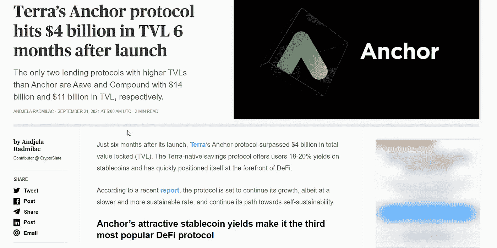

# 在锚协议中锁定贝丝

> 原文：<https://medium.com/coinmonks/staking-beth-in-anchor-protocol-dd7281800a49?source=collection_archive---------0----------------------->

每个主播/露娜粉丝都对最近的一条新闻感到兴奋——“主播协议触及 40 亿美元 TVL”。Anchor 在推出大约六个月后实现了这一里程碑。这一成就使 Anchor 协议成为 Defi 中最有前途和最健壮的协议之一。

Source: [Cryptoslate news](https://cryptoslate.com/terras-anchor-protocol-hits-4-billion-in-tvl-6-months-after-launch/)

除了 anchor 提供的最佳收益和可信度之外，大量资金涌入 Anchor，用户可以将 bETH 押在其中…